# Live Source Manager 直播源管理器

> 本文档由项目 wiki（`.zread/wiki/versions/2026-07-13-182739`）自动汇总生成，涵盖项目概览、三种部署方式、核心引擎架构（app 层）、Web 管理后端、前端集成与测试 DevOps，共 30 个章节。

# 目录

## Get Started

- [第1章 项目概览：直播源管理器的定位与核心价值](#ch1)
- [第2章 快速入门：环境搭建与首次运行](#ch2)

### 部署方式

- [第3章 Docker 一键部署（docker-compose）](#ch3)
- [第4章 Windows 本地安装与自启动配置](#ch4)
- [第5章 Linux 手动部署与 systemd 服务管理](#ch5)

## Deep Dive

### 核心引擎架构（app 层）

- [第6章 四层架构设计：从基础层到协调层的依赖关系](#ch6)
- [第7章 EnhancedLiveSourceManager：分层筛选处理流程与频道智能分类](#ch7)
- [第8章 SourceManager：多源下载、GitHub 源发现与 M3U/TXT 解析](#ch8)
- [第9章 StreamTester：基于 ffprobe 的并发流测试与质量评估体系](#ch9)
- [第10章 ChannelRules：数据库驱动的频道分类规则引擎与三层联合防御](#ch10)
- [第11章 M3UGenerator：多级播放列表生成与多维分组策略](#ch11)
- [第12章 Config 配置管理：纯 SQLite 存储与统一默认值体系](#ch12)
- [第13章 异常体系与全局错误处理：BaseAppException 层次结构与错误统计](#ch13)
- [第14章 URL 安全审查：域名黑名单、XSS/命令注入/路径遍历检测](#ch14)
- [第15章 原子写入与文件安全：atomic_write 机制与备份策略](#ch15)
- [第16章 流测试错误分类引擎：将 ffprobe 错误映射为可读诊断类别](#ch16)

### Web 管理后端（web 层）

- [第17章 FastAPI 应用架构：路由模块化拆分与中间件体系](#ch17)
- [第18章 SQLite ORM 设计与数据库迁移：context manager 模式与 WAL 模式](#ch18)
- [第19章 认证与授权体系：Session/Cookie 管理、RBAC 角色与 CSRF 防护](#ch19)
- [第20章 敏感配置加密：基于 Fernet (AES-128-CBC) 的字段级加密与机器绑定](#ch20)
- [第21章 WebSocket 实时测试：流媒体实时测试与结果推送](#ch21)
- [第22章 RESTful API 全景：源管理、配置中心、规则管理、Dashboard 统计](#ch22)
- [第23章 配置变更审计与操作日志追踪](#ch23)
- [第24章 GitHub Token 集成与 API 速率限制管理](#ch24)

### 前端界面与集成

- [第25章 Jinja2 模板架构：仪表盘、源管理、配置、日志等页面设计](#ch25)
- [第26章 前端 JavaScript 组件：app.js / lsm-components.js / audit-components.js](#ch26)
- [第27章 Nginx 反向代理配置与文件发布服务](#ch27)

### 测试与 DevOps

- [第28章 测试体系架构：pytest 配置、共享 fixture 与数据库隔离策略](#ch28)
- [第29章 Docker 多阶段构建：FFmpeg 静态构建、清华镜像加速与健康检查](#ch29)
- [第30章 代码质量工具链：Ruff linting、Mypy 类型检查与 pre-commit 钩子](#ch30)


---

<a id="ch1"></a>
## 第1章 项目概览：直播源管理器的定位与核心价值

### 一、项目定位：直播源质量的智能管家

**Live Source Manager（直播源管理器）** 是一个开源的直播源聚合、质量筛选与智能分类工具。**其核心使命很简单：从互联网上成千上万个杂乱的直播源链接中，自动找到那些真正能用的、画质好的，然后按央视、卫视、体育、电影等分类整理成可直接使用的播放列表。**

这个项目不是为了播放视频本身（它不做播放器），而是专门解决一个长期困扰 IPTV 爱好者的痛点——**直播源找得到，但真正能用的不多；就算能用，过几天又失效了；就算持续有效，混在一起手动分类实在麻烦。** 这就是 Live Source Manager 存在的原因。

项目名称中的 "Live Source" 强调了它的工作对象是直播流媒体源（如 `http://example.com/live/cctv1.m3u8`），而不是已录制好的视频文件。它专注于 M3U/TXT 格式的播放列表管理，这正是全球 IPTV 社区最通用的交换格式。

从版本号 `2.0.0`（参见 [pyproject.toml](pyproject.toml#L1-L6)）和长达 3700+ 行的测试代码可以看出，这是一个**经历过真实使用、持续迭代、具有工程化质量意识的成熟项目**，绝非毕业设计或一次性脚本。

Sources: [pyproject.toml](pyproject.toml#L1-L6), [app/__init__.py](app/__init__.py#L1-L15)

---

### 二、项目解决的核心问题

要理解这个项目的价值，先要了解直播源领域的典型困境：

| 痛点 | 传统做法 | Live Source Manager 的解法 |
|------|---------|--------------------------|
| **源太多太杂** | 手动逐个打开链接 → 试看 → 判断质量 | 自动多源下载 + 并发 ffprobe 质量检测，批量评判 |
| **源很快失效** | 定期手动检查，或等人通知"某某源挂了" | 支持定时自动扫描（cron），结合自动冻结机制及时剔除失效源 |
| **分类混乱** | M3U 文件里几百个频道混在一起，需手动拖到播放器分组 | 数据库驱动的三层联合分类引擎，按内容类型/地区/媒体类型自动归类 |
| **质量参差不齐** | 肉眼分辨 4K/1080P/流畅版 | 分辨率带宽双重筛选，支持 `min_resolution`/`max_resolution`/`min_bitrate` 等参数定量过滤 |
| **源来源不统一** | 从多个微信群、论坛帖子、GitHub 仓库手动收集 | 支持本地文件目录、URL 列表、GitHub 仓库自动发现三种来源模式 |
| **安全风险** | 直接塞入播放器，碰到恶意链接无从防范 | 内置域名黑名单、XSS/命令注入/路径遍历检测、私有 IP 拦截等五层安全审查 |

Sources: [config/config-defaults.yaml](config/config-defaults.yaml#L5-L13), [app/source_manager.py](app/source_manager.py#L1-L12), [app/security.py](app/security.py#L1-L11)

---

### 三、核心功能体系

#### 3.1 端到端的全流程自动化

项目最核心的能力在于构建了一条完整的「源发现 → 安全审查 → 质量检测 → 智能分类 → 多级输出」自动化流水线：

```mermaid
flowchart LR
    subgraph 输入["📥 源发现层"]
        A1[本地文件目录]
        A2[在线 URL 列表<br/>20+ 预置源]
        A3[GitHub 仓库发现]
    end

    subgraph 处理["⚙️ 核心处理层"]
        B1[URL 安全审查<br/>黑名单/XSS/注入检测]
        B2[M3U/TXT 解析<br/>提取频道信息]
        B3[并发 ffprobe 测试<br/>延迟/分辨率/速度]
        B4[质量评估筛选<br/>min_bitrate/max_latency]
        B5[三层联合分类<br/>内容/地区/媒体类型]
        B6[多级输出生成<br/>base + qualified]
    end

    subgraph 管理["🌐 Web 管理后端"]
        C1[FastAPI 管理界面<br/>端口 23456]
        C2[Nginx 文件服务<br/>端口 12345]
        C3[SQLite 持久化<br/>配置/规则/审计/用户]
        C4[WebSocket 实时测试<br/>Jinja2 仪表盘]
    end

    输入 --> 处理 --> 管理
```

**这不是一个简单的「下载 + 转格式」脚本，而是一个经过精心设计的工程化系统**。从 `app` 包的 11 个 Python 模块到 `web` 包的 11 个 Jinja2 模板 + 7 个路由模块，覆盖了从后端引擎到前端管理界面的完整链路。

Sources: [app/__init__.py](app/__init__.py#L1-L15), [web/webapp.py](web/webapp.py#L1-L20)

#### 3.2 五大核心模块全景

##### 模块 1：多源聚合引擎 — SourceManager

SourceManager 是整个管线的第一环。它从三种来源收集直播源：

- **本地目录**：从 `./config/sources/` 目录中读取 M3U/TXT 文件，支持递归扫描子目录
- **在线 URL**：内置 20+ 个公共 IPTV 源，覆盖 `iptv-org`、`fanmingming/live`、`YueChan/Live` 等主流社区维护的源列表（参见 [config/config-defaults.yaml](config/config-defaults.yaml#L46-L104)）
- **GitHub 自动发现**：只需指定仓库名（如 `wcb1969/iptv/main`），自动遍历仓库目录结构发现源文件

下载过程采用 `aiohttp` 异步框架，支持 SOCKS5 代理和 GitHub 镜像加速，对国内网络环境做了针对性适配。

Sources: [app/source_manager.py](app/source_manager.py#L1-L60), [config/config-defaults.yaml](config/config-defaults.yaml#L46-L104)

##### 模块 2：质量评估体系 — StreamTester

这是项目最有技术深度的模块。它调用系统安装的 `ffprobe`（FFmpeg 套件中的流媒体分析工具），对每一个源进行并发质量检测。**关键亮点在于**：

- **并发限流**：使用 `ThreadPoolExecutor` + `Semaphore`，默认最大 16 路并发 ffprobe 进程，既充分压榨 CPU 性能又不会过载
- **看门狗定时器**：防止单个僵死 ffprobe 进程拖垮整个测试
- **指数退避重试**：对临时网络故障友好
- **错误分类引擎**：将 ffprobe 的原始英文报错映射为 `connection_refused`、`dns_failed`、`auth_blocked`、`not_found` 等 8 种可读类别（参见 [app/stream_tester.py](app/stream_tester.py#L29-L81)）
- **广告检测**：支持 `ad_keywords` 配置，识别测试卡/无信号等无效内容
- **源冻结机制**：连续失败 3 次的源自动冻结 24 小时，避免重复测试无效源

质量评估产出的核心指标包括：**响应时间（延迟）、下载速度（KB/s）、分辨率（如 1920x1080）、编码格式、FPS、比特率**。这些指标通过可配置的阈值（`min_resolution`、`max_latency`、`min_bitrate` 等）进行合格性判定。

Sources: [app/stream_tester.py](app/stream_tester.py#L1-L120), [config/config-defaults.yaml](config/config-defaults.yaml#L106-L128)

##### 模块 3：智能分类引擎 — ChannelRules

**这是项目最亮眼的设计之一。** ChannelRules 不是一个简单的关键字匹配，而是一个**数据库驱动、三层联合防御、带省份排除映射**的智能分类系统：

```
第一层：负向排除（Negative Keywords）
  └─ 排除包含"测试卡""无信号""ad"等关键词的劣质源

第二层：高优先级精确匹配
  └─ "CCTV" → 央视频道（优先级 1，不可覆盖）
  └─ "TVB" → 港澳台（优先级 5）

第三层：普通优先级 + 最长匹配 + 省份排除
  └─ 匹配"北京卫视"（而非"北京"→ 优先更长匹配）
  └─ 陕西 ≠ 山西（通过 province_exclusion_map 防止字形混淆）
```

**省份排除映射（province_exclusion_map）是个非常巧妙的细节**：因为 "陕" 字是 "山" 的字形前缀，导致包含"陕西"关键字的规则会错误匹配到"山西"频道。排除映射表中显式记录了 `('陕西', '山西')`、`('广东', '广西')`、`('湖北', '湖南')` 等 16 组排除关系（参见 [app/data/seed_classification_rules.sql](app/data/seed_classification_rules.sql#L92-L108)），有效解决了中文地名相互包含的经典分类难题。

分类规则通过种子 SQL 脚本预置了 55 个内容分类（从央视频道到各省频道），21 个媒体类型分类，以及完整的世界各国地域映射。这些规则存储在 SQLite 数据库中，支持 Web 界面在线编辑。

Sources: [app/rules.py](app/rules.py#L1-L60), [app/data/seed_classification_rules.sql](app/data/seed_classification_rules.sql#L1-L112)

##### 模块 4：多级输出生成 — M3UGenerator

输出不是简单地把测试通过的源拼在一起，而是**按质量等级分层输出**：

- **base 层**：所有通过有效性测试的源（白名单强制保留）
- **qualified 层**：额外通过质量阈值的源（resolution/bitrate/speed/latency）
- **多维分组**：支持按 `category`、`province`、`media_type` 等维度分组输出，每组内按速度排序
- **User-Agent 注入**：可在 EXTINF 标签或 URL 行中插入自定义 UA，应对防盗链
- **白名单强制保留**：即使未通过质量测试，在白名单中的源也能出现在输出中

每个频道默认最多保留 8 个源（`max_sources_per_channel`），在速度测试中表现最好的优先保留。

Sources: [app/m3u_generator.py](app/m3u_generator.py#L1-L60), [config/config-defaults.yaml](config/config-defaults.yaml#L38-L44)

##### 模块 5：两栖部署架构 — Web 管理后端

Live Source Manager 既可以作为**命令行定时任务**独立运行（通过 `python -m app`），也可以启动**Web 管理后台**（通过 `python -m web`）提供完整的管理界面。两者共享同一套核心引擎。

Web 后端基于 **FastAPI + Jinja2 + SQLite** 构建，包含 7 组 RESTful API 路由：

| 路由模块 | 端口 | 功能 |
|---------|------|------|
| `/` HTML 页面 | 23456 | 仪表盘、源管理、配置、日志、用户管理等 11 个页面 |
| `/auth/*` | 23456 | Session/Cookie 认证、RBAC 权限、CSRF 防护 |
| `/dashboard/*` | 23456 | 运行统计、系统信息、源健康度分布 |
| `/sources/*` | 23456 | 源列表管理、增删改查、手动触发测试 |
| `/config/*` | 23456 | 配置中心，含敏感字段加密存储 |
| `/rules/*` | 23456 | 分类规则、频道映射、排除规则的在线管理 |
| `/system/*` | 23456 | 日志流、审计追踪、WebSocket 实时测试 |
| Nginx 文件服务 | 12345 | M3U 播放列表静态文件发布，含 CORS 跨域头 |

此外，**Nginx 反向代理**（端口 12345）独立于 Web 管理后端运行，专门负责播放列表文件的对外发布。配置文件包含了完善的安全头（X-Frame-Options、CSP、HSTS 等）、Gzip 压缩、请求频率限制等功能（参见 [nginx.conf](nginx.conf#L53-L87)）。这意味着你可以把 M3U 链接分享给家人朋友，直接用播放器打开即可，不需要给他们管理后台的访问权限。

Sources: [web/webapp.py](web/webapp.py#L1-L90), [nginx.conf](nginx.conf#L53-L87), [web/routes](web/routes/)

---

### 四、技术栈全景

#### 4.1 运行时与语言

| 维度 | 详情 |
|------|------|
| **语言** | Python 3.11+（要求 `>=3.11`，采用 `py311` 目标版本） |
| **异步框架** | `aiohttp` / `aiofiles` / `aiohttp_socks`（用于多源并发下载） |
| **Web 框架** | FastAPI + Uvicorn（用于管理后端 API + WebSocket） |
| **前端** | Jinja2 服务端模板 + 原生 JavaScript/HTMX 风格交互 |
| **数据库** | SQLite 3（WAL 模式，写锁保护的线程安全连接） |
| **流媒体检测** | ffprobe（FFmpeg 子进程，并发限流 Semaphore 模式） |
| **静态文件服务** | Nginx（独立进程，CORS 跨域 + Gzip + 安全头） |
| **容器化** | Docker 多阶段构建（Python slim-bookworm 基础镜像）|

Sources: [pyproject.toml](pyproject.toml#L1-L6), [requirements.txt](requirements.txt#L1-L31), [Dockerfile](Dockerfile#L1-L137)

#### 4.2 四层模块架构

项目的架构设计有一个鲜明的分层思想，从 `app/__init__.py` 的开篇注释可以清晰看到（参见 [app/__init__.py](app/__init__.py#L9-L14)）：

```
L0 基础层:  exceptions / logger / utils
  └─ 异常体系（BaseAppException 层次树）、日志（文件轮转+控制台）、原子写入

L1 配置层:  config / security
  └─ 纯 SQLite 配置管理、URL 安全审查（XSS/注入/路径遍历）

L2 业务层:  rules / source_manager / stream_tester
  └─ 频道分类规则引擎、多源下载与解析、并发流测试与质量评估

L3 输出层:  m3u_generator
  └─ 多级播放列表生成、多维分组策略

L4 协调层:  manager (EnhancedLiveSourceManager)
  └─ 编排以上所有组件、控制分层筛选处理流程
```

**这个分层的核心设计原则是：下层不依赖上层。** 例如 `exceptions.py` 不导入任何业务模块，`config.py` 只依赖 `exceptions`。这使得每一层都可以独立测试和复用。

Sources: [app/__init__.py](app/__init__.py#L1-L15), [app/exceptions.py](app/exceptions.py#L1-L11)

---

### 五、部署方式与适用场景

Live Source Manager 支持三种部署模式，覆盖了从个人实验到家庭服务器的全部场景：

#### 三模部署对比

| 部署方式 | 适合场景 | 复杂度 | 关键命令 |
|---------|---------|--------|---------|
| **Docker Compose** | 推荐首选，家庭服务器/NAS | ⭐ | `docker-compose up -d` |
| **Windows 本地** | 个人电脑日常运行 | ⭐⭐ | `powershell setup_windows.ps1` |
| **Linux 手动** | VPS/云服务器/树莓派 | ⭐⭐⭐ | `bash setup_linux.sh` |

**三个平台共用一个核心代码库**，差异仅在于系统服务注册方式（Systemd vs Windows 任务计划）和安装脚本不同，业务功能完全一致。

#### 典型使用流程

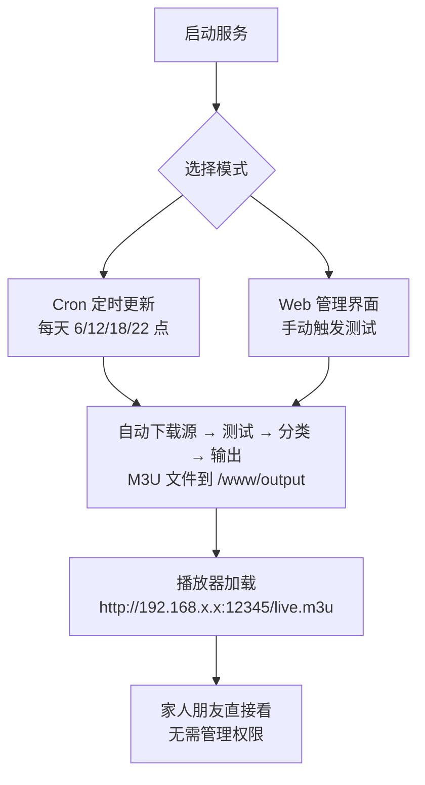

Sources: [docker-compose.yml](docker-compose.yml#L1-L107), [setup_windows.ps1](setup_windows.ps1#L1-L200), [nginx.conf](nginx.conf#L60-L87)

---

### 六、安全设计亮点

作为一个从互联网获取源的网络工具，安全设计不是锦上添花，而是**底线要求**。项目内置了五个层级的防护：

#### 安全防护层次

```
第一层：协议白名单
  └─ 仅允许 http/https/rtmp/rtsp/rtp，拦截 file/data/javascript 等危险协议

第二层：域名黑名单
  └─ 内置不可信域名黑名单（含通配符匹配），支持运行时动态增删

第三层：私有 IP 拦截
  └─ 阻断指向 10.x.x.x / 192.168.x.x / 127.0.0.1 等内网地址的源 URL

第四层：注入攻击检测
  └─ 独立检测 XSS（<script> 等）、命令注入（|;&$` 等）、路径遍历（../ 等）

第五层：敏感配置加密
  └─ 基于 Fernet (AES-128-CBC) 的字段级加密，支持机器绑定
```

安全审查在两条路径上都会执行：一是 `app` 层的 `SourceManager.download()` 下载源之前；二是 `web` 层的 `core.validate_url_input()` 在用户通过界面手动添加源时。形成了**双重过滤**的安全网。

Sources: [app/security.py](app/security.py#L1-L80), [web/crypto_utils.py](web/crypto_utils.py)

---

### 七、适合谁使用

| 角色 | 价值点 |
|------|--------|
| **IPTV 爱好者** | 一键聚合 20+ 公共源，自动分类整理，省去手动维护的精力 |
| **家庭网络管理员** | 部署到 NAS 或旧电脑上，全家电视盒子共享一个 M3U 链接 |
| **开发者** | 研究 Python 异步编程、FFmpeg 子进程管理、SQLite ORM 设计的极佳参考案例 |
| **开源贡献者** | 项目模块化程度高、测试覆盖好（14 个测试文件 + 完整的 conftest），适合参与贡献 |

---

### 八、阅读路线图

这份概览只是了解项目的起点。如果你希望深入理解每个模块的设计细节，推荐按以下顺序阅读：

#### 入门路线

1. **[快速入门：环境搭建与首次运行](#ch2)** — 花 5 分钟让项目跑起来
2. 选择你的部署方式：[Docker 一键部署](#ch3) / [Windows 本地安装](#ch4) / [Linux 手动部署](#ch5)

#### 深入理解

3. **[四层架构设计](#ch6)** — 理解依赖关系和模块分工
4. **[EnhancedLiveSourceManager](#ch7)** — 分层筛选处理全流程
5. **[SourceManager](#ch8)** — 多源下载与解析
6. **[StreamTester](#ch9)** — ffprobe 并发测试与质量评估
7. **[ChannelRules](#ch10)** — 智能分类引擎
8. **[M3UGenerator](#ch11)** — 多级播放列表生成

#### Web 管理与运维

9. **[FastAPI 应用架构](#ch17)** — Web 后端路由与中间件
10. **[RESTful API 全景](#ch22)** — 所有 API 端点速览
11. **[Nginx 反向代理配置](#ch27)** — 文件发布服务

每个页面都提供了精确的源代码引用行号，方便你在阅读文字描述的同时直接跳转到对应代码进行验证。

---

<a id="ch2"></a>
## 第2章 快速入门：环境搭建与首次运行

本指南面向零基础用户，帮助你在 5 分钟内完成 Live Source Manager 的部署和首次运行。无论你使用 Docker、Windows 还是 Linux，项目均遵循**零配置优先**（Zero-Configuration）的设计哲学——无需手动编辑任何配置文件即可启动。系统会在首次运行时自动完成数据库初始化、生成随机管理员密码和加密密钥，让你即刻进入管理界面。

Sources: [web/models.py](web/models#L100-L225), [start_docker.sh](start_docker#L1-L30)

---

### 一、项目概览

在动手之前，先理解你所使用的工具的整体面貌。Live Source Manager 是一个"直播源全生命周期管理平台"，覆盖四个核心环节：

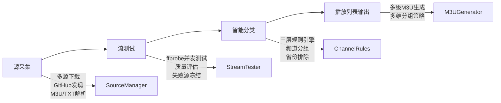

- **源采集**：从在线 M3U/TXT URL、GitHub 仓库、本地文件三个渠道自动下载直播源。
- **流测试**：使用 ffprobe 并发测试源的有效性、分辨率、码率和延迟，支持失败源指数退避冻结。
- **智能分类**：基于数据库驱动的三层规则引擎，自动将频道按内容类型（央视频道、卫视频道、港澳台等）、地域、语言等维度分类。
- **播放列表输出**：生成多级分组 M3U 文件，可通过 Nginx 对外发布。

所有配置通过 **Web 管理界面**（FastAPI + Jinja2）完成，配置数据统一存储在 SQLite 数据库中，无需编辑任何 INI/YAML 文件。

Sources: [app/manager.py](app/manager#L1-L80), [app/__init__.py](app/__init__#L1-L50)

---

### 二、三种部署方式速览

| 部署方式 | 适用场景 | 难度 | 启动时间 | 推荐等级 |
|---------|---------|------|---------|---------|
| Docker Compose | 生产环境 / 有 Docker 基础 | ★☆☆ | ~3 分钟 | ⭐ 强烈推荐 |
| Windows 安装脚本 | Windows 桌面用户 | ★★☆ | ~10 分钟 | ✅ 推荐 |
| Linux 手动部署 | Linux 服务器 (Debian/Ubuntu) | ★★★ | ~10 分钟 | ✅ 推荐 |

无论选择哪种方式，核心流程一致：

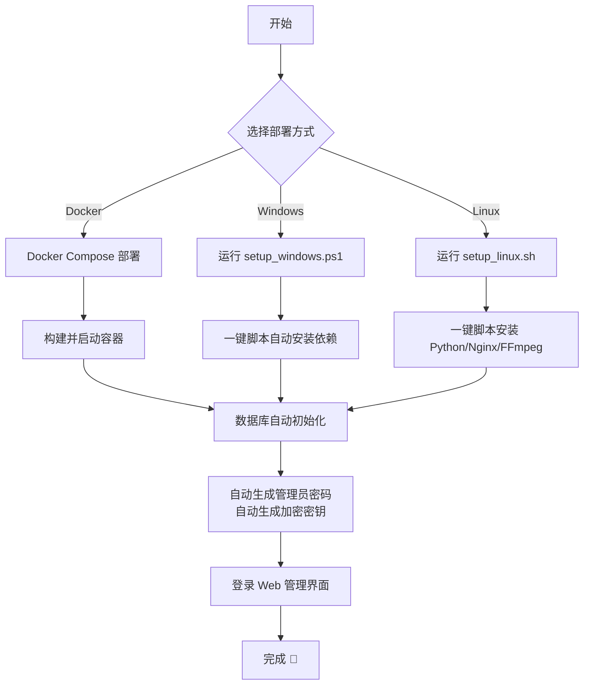

Sources: [docker-compose.yml](docker-compose.yml#L1-L107), [setup_windows.ps1](setup_windows.ps1#L1-L30), [setup_linux.sh](setup_linux.sh#L1-L30)

---

### 三、环境要求

#### 通用要求

- **系统**：Windows 10/11、macOS、Linux（x86_64）
- **Python**：3.11+（推荐 3.13）
- **FFmpeg**：需包含 `ffprobe`（用于流测试）
- **磁盘空间**：≥ 500MB（含 Docker 镜像约 300MB）
- **网络**：能够访问 GitHub、PyPI 等资源（国内用户已预配清华镜像加速）

#### 可选依赖

| 组件 | 用途 | 缺失后果 |
|------|------|---------|
| Nginx | M3U 文件发布服务 | 无法通过 HTTP 访问播放列表 |
| cron | 定时自动更新源 | 不会自动执行周期性更新任务 |

> **注意**：项目的 Docker 镜像已内置 Nginx + cron + FFmpeg，无需额外安装。Windows 和 Linux 安装脚本也会自动检测并安装这些组件。

Sources: [pyproject.toml](pyproject.toml#L1-L10), [Dockerfile](Dockerfile#L40-L90)

---

### 四、部署方式一：Docker Compose（推荐）

Docker 部署是最简洁的方式，所有依赖（Python、Nginx、FFmpeg、cron）均已打包在镜像中。

#### 步骤 1：准备 `.env` 文件

在项目根目录创建 `.env` 文件（可从 `.env.example` 复制）：

```ini
# 端口配置
NGINX_PORT=12345          # 文件共享端口
WEB_PORT=23456            # Web 管理端口

# 测试参数
TEST_TIMEOUT=10
CONCURRENT_THREADS=50
OUTPUT_FILENAME=live.m3u

# 定时任务（每天 6:00、12:00、18:00、22:00 执行）
UPDATE_CRON=0 6,12,18,22 * * *

# 密码（留空则首次启动时自动生成随机密码）
WEB_ADMIN_PASSWORD=
```

> ⚠️ `WEB_ADMIN_PASSWORD` 留空时，系统会自动生成一个 16 位强随机密码（包含大小写字母、数字和特殊字符），首次启动时会打印到容器日志中。这是零配置设计的核心特性。

#### 步骤 2：启动服务

```bash
# 构建并启动（后台运行）
docker-compose up -d --build

# 查看启动日志（重点关注自动生成的密码）
docker-compose logs -f
```

启动日志中查找类似以下内容：

```
live-source-manager  | ADMIN_PASSWORD_INITIALIZED=Ab3#kL9$xY7@pQ2&
live-source-manager  | [INFO] 初始管理员密码（请妥善保存）: Ab3#kL9$xY7@pQ2&
```

> 💡 **生产环境建议**：首次登录后，请立即在「配置中心 → 密码管理」页面修改密码。同时在 `.env` 中设置 `CONFIG_ENCRYPT_KEY` 和 `WEB_ADMIN_PASSWORD` 环境变量，确保容器重启后密码一致。

#### 步骤 3：登录 Web 管理界面

打开浏览器访问 `http://localhost:23456`，使用以下凭据登录：

- **用户名**：`admin`
- **密码**：启动日志中打印的随机密码（见上一步）

登录后你将看到仪表盘（Dashboard），其中展示了源的统计信息、系统资源使用情况和定时任务状态。

Sources: [.env.example](.env.example#L1-L31), [docker-compose.yml](docker-compose.yml#L1-L107), [web/models.py](web/models#L100-L225)

---

### 五、部署方式二：Windows 一键安装

Windows 用户可以通过 PowerShell 脚本完成从环境检测到服务启动的全流程。

#### 步骤 1：以管理员身份运行安装脚本

右键点击项目根目录的 `setup_windows.ps1`，选择 **"使用 PowerShell 运行"**。

脚本会自动执行以下步骤：

1. **检测 Python 3.13** → 未安装则自动从清华镜像下载安装
2. **创建虚拟环境** → 在 `.venv` 目录中隔离项目依赖
3. **安装依赖包** → 从 PyPI（清华镜像加速）安装 `requirements.txt` 中的所有依赖
4. **下载 FFmpeg** → 从 GitHub 或 gyan.dev 自动获取包含 `ffprobe` 的静态构建
5. **初始化数据库** → 调用 `web.models.init_db(None)` 自动建表并生成管理员密码
6. **注册开机自启** → 通过 Windows 任务计划程序创建 `LiveSourceManagerWeb` 任务

#### 步骤 2：启动 Web 服务

安装脚本执行完毕后会询问是否立即启动服务，输入 `Y` 即可。

或者手动启动：

```bash
cd 项目根目录
.venv\Scripts\python.exe -m uvicorn web.webapp:app --host 0.0.0.0 --port 23456
```

#### 步骤 3：登录

打开浏览器访问 `http://localhost:23456`，在安装脚本的输出中找到自动生成的管理员密码：

```
============================================================
⚠️  已自动生成管理员密码，请立即记录并尽快在「配置中心」修改！
    管理员账号: admin
    管理员密码: Ab3#kL9$xY7@pQ2&
============================================================
```

> 💡 **开机自启**：安装脚本会自动注册系统级开机启动任务（以管理员运行时），确保 Windows 重启后服务自动运行。自启脚本路径为 `deploy/windows/start-web.bat`。

Sources: [setup_windows.ps1](setup_windows.ps1#L1-L475), [deploy/windows/install-autostart.ps1](deploy/windows/install-autostart.ps1#L1-L74), [deploy/windows/start-web.bat](deploy/windows/start-web.bat#L1-L28)

---

### 六、部署方式三：Linux 手动部署

Linux 部署脚本同样遵循一键化设计，支持 Debian/Ubuntu 系发行版。

#### 步骤 1：运行安装脚本

```bash
# 建议以 root 权限运行
sudo bash setup_linux.sh
```

脚本会自动完成以下操作：

1. **环境检测与安装**：检测 Python 3.13+、pip、FFmpeg、Nginx，缺失时自动安装
2. **创建虚拟环境**：在 `.venv` 目录中隔离 Python 依赖
3. **安装 Python 依赖**：从 PyPI（清华镜像加速）安装
4. **数据库初始化**：调用 `web.models.init_db(None)` 自动建表并生成管理员密码
5. **Nginx 配置**：复制 `nginx.conf` 到 `/etc/nginx/sites-available/` 并启用
6. **修复运行时目录权限**：将 `web/data`、`config/online`、`config/sources`、`www/output` 归属为 `www-data` 用户
7. **注册 systemd 服务**：创建 `live-source-web.service` 并启用开机自启
8. **启动服务**：立即启动 Web 服务

#### 步骤 2：查看状态

```bash
# 查看服务状态
systemctl status live-source-web

# 查看启动日志（寻找管理员密码）
journalctl -u live-source-web -n 50
```

#### 步骤 3：登录

访问 `http://your-server-ip:23456`，在 `journalctl` 输出中找到自动生成的密码。

> 💡 **生产环境要点**：
> - Nginx 反向代理已自动配置，文件共享端口默认为 `12345`
> - systemd 服务配置了 `Restart=always`，异常退出后 10 秒自动重启
> - 日志通过 journald 统一管理，使用 `journalctl -u live-source-web -f` 实时查看

Sources: [setup_linux.sh](setup_linux.sh#L1-L189), [deploy/live-source-web.service](deploy/live-source-web.service#L1-L57), [nginx.conf](nginx.conf#L1-L140)

---

### 七、首次登录后：必做事项

成功登录 Web 管理界面后，建议按以下顺序完成初始配置：

#### 1️⃣ 修改默认管理员密码

进入 **「配置中心 → 密码管理」**，立即修改自动生成的随机密码。

#### 2️⃣ 配置加密密钥

`CONFIG_ENCRYPT_KEY` 是用于加密敏感配置（如代理密码、GitHub Token）的密钥。首次启动时若未设置，系统会自动生成一个随机密钥（打印在日志中）。

```bash
# Docker 部署：在 .env 中设置
CONFIG_ENCRYPT_KEY=your_32byte_base64_encoded_key

# 生成新密钥的方式
python -c "import base64, os; print(base64.b64encode(os.urandom(32)).decode())"
```

#### 3️⃣ 验证源采集配置

进入 **「源管理」** 页面，查看默认配置的在线源 URL 列表。系统已预置 20+ 个公共直播源地址，覆盖国内主流频道和 iptv-org 国际源。你也可以在此添加自己的源。

#### 4️⃣ 手动触发一次更新

在仪表盘点击 **「立即更新」** 按钮，触发一次完整的源采集 → 流测试 → 分类 → 输出流程。首次执行可能需要 2-5 分钟（取决于源数量和网络状况）。

#### 5️⃣ 查看生成的播放列表

更新完成后，通过以下地址访问生成的 M3U 文件：

```
http://localhost:12345/live.m3u
```

该文件由 Nginx 直接提供，可直接用于 VLC、IPTV Smarters 等播放器。

Sources: [web/core.py](web/core#L200-L300), [web/models.py](web/models#L100-L225), [app/config.py](app/config#L1-L100)

---

### 八、配置体系速览

项目的所有配置项通过 **Web 管理界面 → 配置中心** 统一管理，存储在 SQLite `app_config` 表中。以下是主要配置段：

| 配置段 | 功能 | 关键字段示例 |
|-------|------|------------|
| `Sources` | 直播源来源配置 | `online_urls`、`github_sources`、`local_dirs` |
| `Network` | 网络与代理设置 | `proxy_enabled`、`proxy_type`、`github_mirror` |
| `Testing` | 流测试参数 | `timeout`、`concurrent_threads`、`enable_ad_detect` |
| `Output` | 播放列表输出 | `filename`、`group_by`、`max_sources_per_channel` |
| `Filter` | 质量过滤条件 | `min_resolution`、`min_bitrate`、`max_latency` |
| `GitHub` | GitHub API 集成 | `api_token`、`rate_limit` |
| `HTTPServer` | 文件发布服务 | `fileshare_port`、`manager_port` |

默认值的**单一事实来源**（Single Source of Truth）是 `app/config.py` 中的 `Config._DEFAULT_VALUES` 类变量。`config/config-defaults.yaml` 文件可作为外部化覆盖源，但所有修改优先通过 Web 界面完成。

Sources: [app/config.py](app/config#L1-L120), [config/config-defaults.yaml](config/config-defaults.yaml#L1-L132)

---

### 九、架构总览：从用户请求到播放列表

理解系统各组件如何协同工作，有助于你后续的配置和排错：

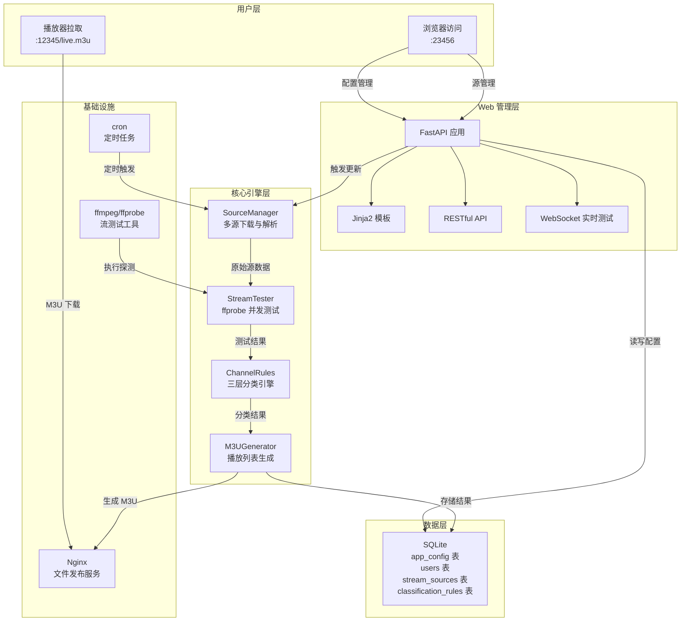

**请求流向示例**：用户点击"立即更新" → FastAPI 调用 `EnhancedLiveSourceManager.run()` → SourceManager 从 20+ 个在线源下载 → StreamTester 并发测试每个流 → ChannelRules 智能分类 → M3UGenerator 输出分组播放列表 → Nginx 对外发布。

Sources: [app/__init__.py](app/__init__.py#L1-L230), [app/manager.py](app/manager#L1-L80)

---

### 十、常见问题排查

#### 服务无法启动

**Q**: Docker 容器启动后立即退出？
**A**: 执行 `docker-compose logs` 查看错误。最常见原因是端口冲突（默认 12345/23456 被占用），修改 `.env` 中的端口值后重启。

**Q**: Windows 安装脚本报错"无法下载 Python"？
**A**: 脚本内置了清华、华为云和官方三个镜像源。如果所有镜像都不可达，请手动从 [python.org](https://www.python.org/downloads/) 下载 Python 3.13 安装后重新运行脚本。

#### 登录问题

**Q**: 忘记自动生成的密码？
**A**: 如果是 Docker 部署，执行 `docker-compose logs | grep ADMIN_PASSWORD_INITIALIZED` 查看初始密码。如果日志已丢失，可删除数据库文件（`data/web.db`）后重启容器，系统会重新生成密码。

**Q**: 登录后页面显示"无权访问"？
**A**: 初始账号 `admin` 拥有最高权限（角色 `admin`）。如果出现权限问题，请检查 `web/models.py` 中 `init_db()` 函数创建的用户角色是否正确。

#### 源更新问题

**Q**: 源更新后没有生成 M3U 文件？
**A**: 检查输出目录权限。Docker 容器中输出目录为 `/www/output`，应属于 `www-data` 用户。手动执行 `docker-compose exec live-source-manager /app/.venv/bin/python -m app` 查看错误输出。

**Q**: ffprobe 测试所有源都超时？
**A**: 检查网络代理设置。如果所在网络需要代理才能访问外部资源，请在「配置中心 → Network → 启用代理」中配置 SOCKS5/HTTP 代理。默认预填的代理地址 `192.168.1.46:1800` 是占位值，请替换为实际代理地址或关闭代理。

Sources: [healthcheck.sh](healthcheck.sh#L1-L35), [start_docker.sh](start_docker.sh#L900-L1053), [web/webapp.py](web/webapp.py#L40-L90)

---

### 下一步

现在你已经成功运行了 Live Source Manager，建议按以下顺序深入探索：

| 学习目标 | 推荐文档 |
|---------|---------|
| 理解四层架构设计 | [四层架构设计：从基础层到协调层的依赖关系](#ch6) |
| 掌握频道智能分类 | [EnhancedLiveSourceManager：分层筛选处理流程与频道智能分类](#ch7) |
| 了解 Web 管理界面 | [FastAPI 应用架构：路由模块化拆分与中间件体系](#ch17) |
| 配置自动化定时更新 | [GitHub Token 集成与 API 速率限制管理](#ch24) |
| 流测试与质量评估 | [StreamTester：基于 ffprobe 的并发流测试与质量评估体系](#ch9) |
| 配置敏感信息加密 | [敏感配置加密：基于 Fernet (AES-128-CBC) 的字段级加密与机器绑定](#ch20) |
| Docker 部署细节 | [Docker 多阶段构建：FFmpeg 静态构建、清华镜像加速与健康检查](#ch29) |

---

<a id="ch3"></a>
## 第3章 Docker 一键部署（docker-compose）

**目标读者**：具备基础 Docker 知识的开发者。本文档将引导你使用 `docker-compose` 在任意安装了 Docker 的宿主机上，用一条命令完成 **Live Source Manager** 的完整部署——包括 Nginx 文件服务、Web 管理界面、定时任务调度、SQLite 数据库初始化以及流媒体测试环境。

---

### 前置条件

在开始之前，请确认你的环境中已安装如下组件。以下以 Windows 环境（PowerShell）和 Linux/macOS 环境（Bash）分别说明：

| 组件 | 最低版本 | 验证命令（任选其一） | 备注 |
|------|---------|-------------------|------|
| Docker Engine | 20.10+ | `docker --version` | 必须已运行 |
| Docker Compose | v2 或 v1.27+ | `docker compose version` 或 `docker-compose --version` | 本文档统一使用 `docker compose`（v2）语法 |

> **提示**：如果你尚未安装 Docker，请访问 [Docker 官方安装指南](https://docs.docker.com/engine/install/) 完成安装。Windows 用户推荐使用 Docker Desktop（WSL2 后端）。

Sources: [docker-compose.yml](docker-compose.yml#L1-L10)

---

### 整体架构概览

容器内部由四个核心子系统构成，它们通过统一的启动脚本 `start_docker.sh` 完成初始化与编排：

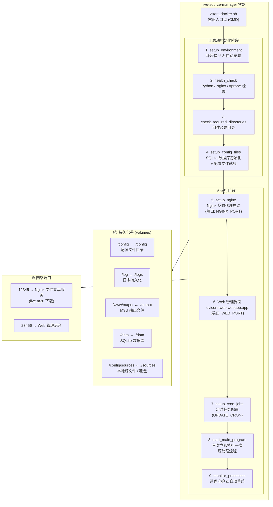

**启动流程**：容器启动后，`start_docker.sh` 依次执行环境检测→目录创建→SQLite 数据库初始化→Nginx 配置注入→Web 服务（Uvicorn）后台启动→定时任务注册→首次源处理运行→进入守护监控模式。整个过程**无需人工干预**，所有参数均通过环境变量或 `.env` 文件注入。

Sources: [Dockerfile](Dockerfile#L136-L136), [start_docker.sh](start_docker.sh#L970-L1047)

---

### 快速部署步骤

#### 第 1 步：克隆仓库并进入目录

```bash
git clone https://github.com/your-repo/live-source-manager.git
cd live-source-manager
```

Sources: N/A（标准 Git 操作）

#### 第 2 步：创建 `.env` 配置文件（强烈推荐）

`.env` 文件是 Docker 部署的核心配置入口。将仓库中的 `.env.example` 复制为 `.env`，然后按需修改：

```bash
# Windows (PowerShell)
Copy-Item .env.example .env

# Linux / macOS
cp .env.example .env
```

以下是最小化推荐配置（**务必修改密码与密钥**）：

```ini
# === 端口配置 ===
NGINX_PORT=12345            # 文件共享端口（暴露给宿主机）
WEB_PORT=23456              # Web 管理端口（暴露给宿主机）

# === 执行参数 ===
TEST_TIMEOUT=10             # 流测试超时（秒）
CONCURRENT_THREADS=50       # 测试并发线程数
OUTPUT_FILENAME=live.m3u    # 输出播放列表文件名

# === 定时任务 ===
UPDATE_CRON=0 6,12,18,22 * * *   # 每天 6:00/12:00/18:00/22:00 执行

# === 🔑 安全配置（请务必修改！）===
WEB_ADMIN_PASSWORD=YourStrongPassword123   # Web 管理员密码
CONFIG_ENCRYPT_KEY=                        # 配置加密密钥，留空则自动生成
```

> **关于 `CONFIG_ENCRYPT_KEY`**：这是用于加密敏感配置（如 GitHub Token、代理密码）的 AES-128-CBC 密钥。如果留空，`start_docker.sh` 会在首次启动时自动生成强随机密钥并打印到日志中。你也可以手动生成：
> ```bash
> python -c "import base64, os; print(base64.b64encode(os.urandom(32)).decode())"
> ```

**`.env` 完整可用参数一览**：

| 参数名 | 默认值 | 说明 |
|--------|--------|------|
| `NGINX_PORT` | `12345` | Nginx 文件共享服务对宿主机暴露的端口 |
| `WEB_PORT` | `23456` | Web 管理后台对宿主机暴露的端口 |
| `TEST_TIMEOUT` | `10` | 单次流媒体测试超时时间（秒） |
| `CONCURRENT_THREADS` | `50` | 流测试最大并发数 |
| `OUTPUT_FILENAME` | `live.m3u` | 生成的播放列表文件名 |
| `UPDATE_CRON` | `"0 6,12,18,22 * * *"` | 定时更新源的 Cron 表达式 |
| `WEB_ADMIN_PASSWORD` | 空（自动生成） | Web 管理员密码。留空则首次启动自动生成强随机密码 |
| `CONFIG_ENCRYPT_KEY` | 空（自动生成） | 配置加密密钥。留空则首次启动自动生成 |
| `CONFIG_DIR` | `./config` | 配置文件目录映射（可修改为本机其他路径） |
| `LOG_DIR` | `./logs` | 日志目录映射 |
| `OUTPUT_DIR` | `./output` | 输出文件目录映射 |
| `DATA_DIR` | `./data` | 数据库目录映射 |
| `SOURCES_DIR` | `./sources` | 本地直播源文件目录映射（可选） |

> **安全提醒**：`WEB_ADMIN_PASSWORD` 和 `CONFIG_ENCRYPT_KEY` 属于敏感信息，**切勿**将 `.env` 文件提交到 Git 仓库。仓库中已将 `.env` 添加到 `.gitignore`。

Sources: [.env.example](.env.example#L1-L31), [docker-compose.yml](docker-compose.yml#L90-L106)

#### 第 3 步：构建镜像并启动容器

这是唯一需要执行的命令：

```bash
# 构建并后台启动（推荐）
docker compose up -d --build

# 国内网络用户（使用腾讯云镜像加速构建，可选）
export DOCKER_MIRROR=https://mirror.ccs.tencentyun.com
docker compose up -d --build
```

该命令执行完毕后，Docker 将自动完成以下工作：

1. **多阶段构建镜像**：第一阶段（`builder`）仅准备构建工具，第二阶段（`runtime`）安装 Nginx、Python 依赖、FFmpeg 静态构建
2. **创建容器**：命名为 `live-source-manager`，主机名 `lsm`
3. **挂载持久化卷**：将宿主机目录映射到容器内对应路径
4. **启动入口脚本**：`/start_docker.sh` 接管启动全流程

**预期输出**：第一次执行时，镜像构建可能需要 5-15 分钟（取决于网络速度）。构建完成后，容器日志将输出如下关键信息：

```
=== 直播源管理工具启动脚本 v3.0 (Nginx版 / SQLite) ===
INFO: Python 已安装: Python 3.13.1
INFO: ✓ 所有 Python 依赖包已安装
INFO: ✓ Nginx配置测试通过
INFO: ✓ Nginx服务验证成功，端口: 12345
INFO: ✓ SQLite 数据库初始化成功
INFO: ✓ Web管理界面已启动 (PID: xxx, 端口: 23456)
INFO: 定时任务设置成功: 0 6,12,18,22 * * *
INFO: 直播源管理工具（Nginx版 / SQLite）启动完成
```

Sources: [docker-compose.yml](docker-compose.yml#L17-L30), [Dockerfile](Dockerfile#L12-L25)

#### 第 4 步：查看并记录初始密码

如果 `.env` 中未设置 `WEB_ADMIN_PASSWORD`，系统会在首次启动时自动生成强随机密码。查看日志获取密码：

```bash
# 查看启动日志，搜索 ADMIN_PASSWORD_INITIALIZED
docker compose logs | findstr "ADMIN_PASSWORD"
```

输出类似于：

```
WARN: ⚠️  首次部署已自动生成管理员密码，请立即记录并尽快修改！
WARN:     管理员账号: admin
WARN:     管理员密码: aB3xK9mP2vR7...
```

> ⚠️ **务必立即记录此密码**。若遗忘，可以通过删除数据库文件（`./data/web.db`）后重启容器来重新生成。

Sources: [start_docker.sh](start_docker.sh#L640-L649)

#### 第 5 步：访问并验证服务

启动完成后，通过浏览器访问以下地址验证：

| 服务 | 地址 | 功能 |
|------|------|------|
| Web 管理后台 | `http://localhost:23456` | 完整的配置管理、源管理、测试面板 |
| 文件共享服务 | `http://localhost:12345` | 直接访问 M3U 播放列表文件下载 |
| 健康检查端点 | `http://localhost:12345/health` | 返回 `healthy` 字符串表示服务正常 |

使用第 4 步获取的账号 `admin` 和密码登录 Web 管理后台后，可进行以下操作：

- **仪表盘**：查看源处理统计、流测试结果、系统状态
- **源管理**：添加/编辑/删除直播源来源（GitHub 仓库、在线 M3U 链接、本地文件）
- **配置中心**：调整滤镜参数、测试参数、网络代理设置
- **规则管理**：编辑频道分类规则（正则表达式匹配）
- **实时测试**：通过 WebSocket 实时测试指定流地址
- **系统日志**：查看应用运行日志

Sources: [nginx.conf](nginx.conf#L54-L68), [start_docker.sh](start_docker.sh#L1032-L1038)

---

### 日常运维命令

容器启动后的日常管理操作：

```bash
# 查看实时日志
docker compose logs -f

# 查看最近 100 行日志
docker compose logs --tail=100

# 重启容器
docker compose restart

# 停止容器（保留数据卷）
docker compose down

# 完全清理（包括网络和匿名卷）
docker compose down --remove-orphans

# 重建镜像并启动（代码更新后）
docker compose up -d --build

# 进入容器内部调试
docker exec -it live-source-manager bash

# 查看自动生成的管理员密码（已启动后）
docker logs live-source-manager 2>&1 | findstr "ADMIN_PASSWORD"
```

> **数据持久化说明**：执行 `docker compose down` 不会删除任何数据。SQLite 数据库位于 `./data/web.db`，配置文件位于 `./config/`，M3U 输出位于 `./output/`。如需完全重置，可先删除这些目录再重启。

Sources: [docker-compose.yml](docker-compose.yml#L33-L44)

---

### 数据持久化机制详解

容器与宿主机之间的目录映射设计遵循 **"容器可销毁，数据不丢失"** 原则：

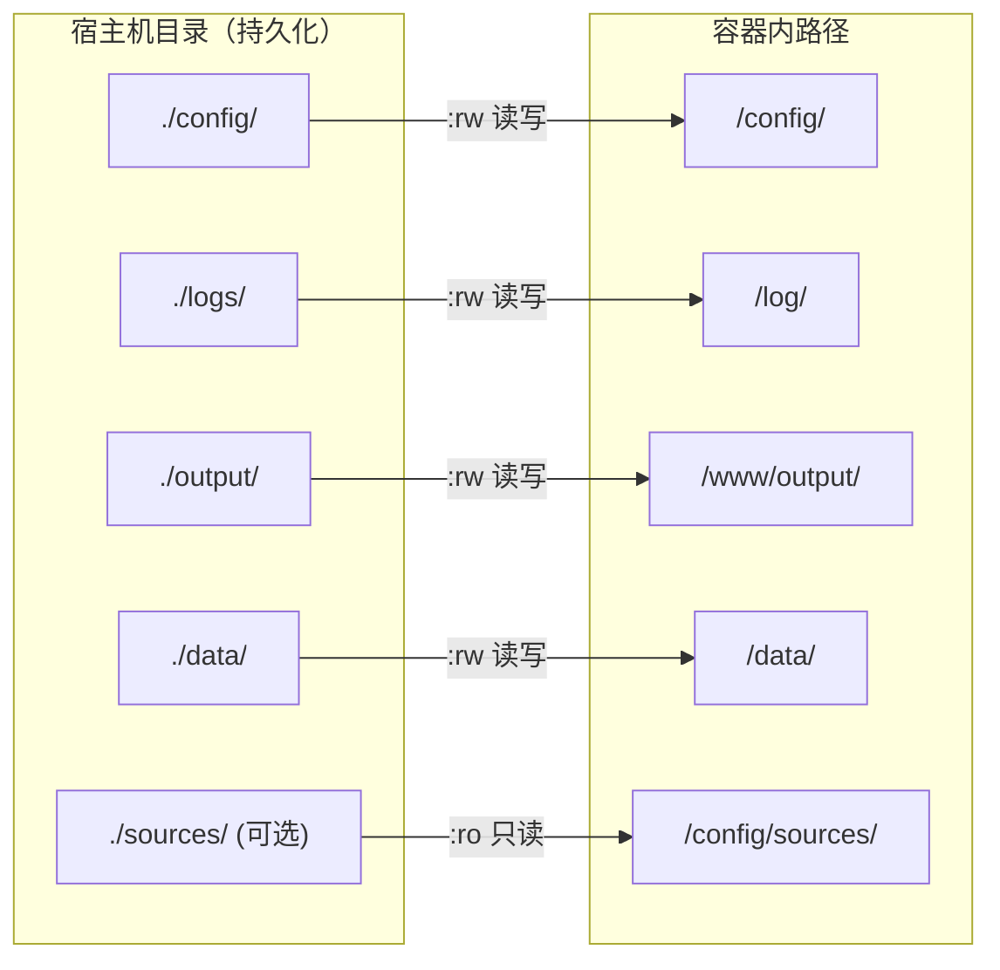

各目录职责对照表：

| 宿主机路径 | 容器内路径 | 存取模式 | 存储内容 |
|-----------|-----------|---------|---------|
| `./config/` | `/config/` | 读写 | `channel_rules.yml` 频道规则文件、`sources/` 目录（在线源缓存） |
| `./logs/` | `/log/` | 读写 | `app.log` 应用日志、`cron.log` 定时任务日志 |
| `./output/` | `/www/output/` | 读写 | M3U 播放列表文件（如 `live.m3u`）、HTML 导航页、健康检查文件 |
| `./data/` | `/data/` | 读写 | `web.db` SQLite 数据库（Web 配置、用户、审计日志） |
| `./sources/` | `/config/sources/` | 只读 | 用户自备的本地 M3U/TXT 源文件 |

> **为什么数据库放在 `/data` 而非 `/app` ？** SQLite 数据库路径硬编码为 `/data/web.db`（`start_docker.sh` 第 471 行），通过卷映射将 `./data` 挂载到 `/data`。这样即使容器重建、镜像更新，所有配置、用户、审计记录都不会丢失。

Sources: [docker-compose.yml](docker-compose.yml#L34-L44), [start_docker.sh](start_docker.sh#L469-L472)

---

### 环境变量注入机制

容器支持三种方式传递配置参数，优先级从高到低为：**容器运行时环境变量 > `.env` 文件 > Dockerfile 默认值**。

**方式一：通过 `.env` 文件（推荐）**
```bash
# 在项目根目录创建 .env 文件，docker compose 自动读取
# 参见第 2 步的 .env 配置说明
```

**方式二：直接在 `docker-compose up` 命令中指定**
```bash
WEB_ADMIN_PASSWORD=MyP@ss123 CONFIG_ENCRYPT_KEY=... docker compose up -d
```

**方式三：在 `docker-compose.yml` 的 `environment:` 部分硬编码**（不推荐，会泄露密钥）

所有环境变量的注入流程如下：

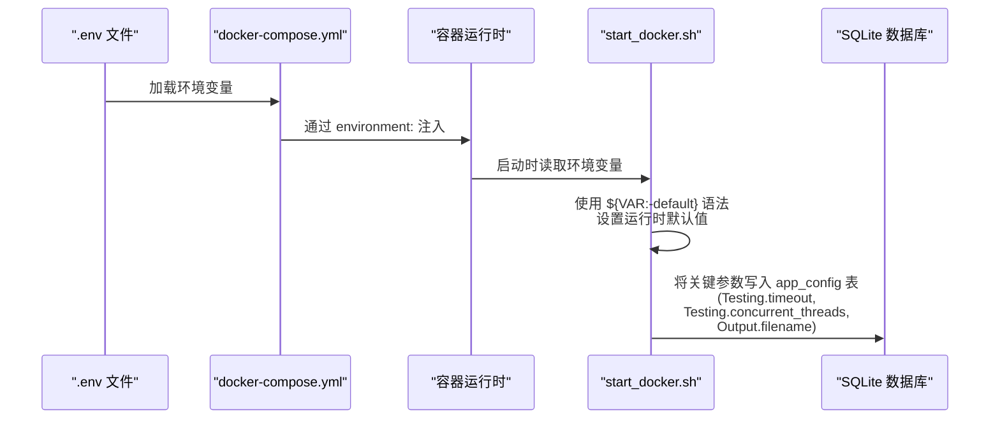

**关键参数注入细节**：

| 环境变量 | Dockerfile 默认值 | `start_docker.sh` 运行时重设值 | 最终效果 |
|---------|------------------|-----------------------------|---------|
| `NGINX_PORT` | `12345` | `${NGINX_PORT:-12345}` | 通过 `envsubst` 注入 nginx.conf |
| `WEB_PORT` | `23456` | `${WEB_PORT:-23456}` | Uvicorn 绑定端口 |
| `TEST_TIMEOUT` | `30` | `${TEST_TIMEOUT:-10}` | 写入 SQLite `Testing.timeout` |
| `CONCURRENT_THREADS` | `10` | `${CONCURRENT_THREADS:-50}` | 写入 SQLite `Testing.concurrent_threads` |
| `UPDATE_CRON` | `"0 6,12,18,22 * * *"` | `${UPDATE_CRON:-0 2 * * *}` | Cron 表达式，执行 `python -m app` |

> **观察点**：注意 `TEST_TIMEOUT` 和 `CONCURRENT_THREADS` 的 Dockerfile 默认值与 `start_docker.sh` 运行时默认值**不一致**。Dockerfile 是为裸 `docker run` 准备的保守值，而 `start_docker.sh` 是为 `docker-compose` 准备的优化值（更高并发）。这就是为什么推荐使用 `docker-compose` 的原因之一。

Sources: [Dockerfile](Dockerfile#L39-L44), [start_docker.sh](start_docker.sh#L461-L467), [docker-compose.yml](docker-compose.yml#L46-L64)

---

### 容器内部组件详解

#### Nginx 文件服务

Nginx 在容器内作为独立进程运行，其配置文件 `nginx.conf` 在启动时通过 `envsubst` 或 `sed` 注入 `${NGINX_PORT}` 环境变量。

**Nginx 服务职责**：

- **文件共享**（核心功能）：提供 M3U 播放列表的 HTTP 下载服务，CORS 头允许跨域访问
- **安全防护**：X-Frame-Options、XSS-Protection、CSP 等安全头注入
- **请求限流**：`limit_req_zone` 限制每 IP 10请求/秒，burst 20
- **目录浏览**：`autoindex on` 实现文件目录可视化浏览
- **健康检查**：`/health` 端点返回 `healthy`

```nginx
# 关键配置摘要（完整版见 nginx.conf）
server {
    listen ${NGINX_PORT} default_server;
    root /www/output;
    
    # M3U 文件的 CORS 与缓存
    location ~* \.(m3u|m3u8|txt)$ {
        add_header Access-Control-Allow-Origin "*";
        expires 5m;
        limit_req zone=api burst=20 nodelay;
    }
    
    # 目录浏览
    location / {
        autoindex on;
    }
}
```

Sources: [nginx.conf](nginx.conf#L54-L103)

#### Web 管理服务

Web 管理服务基于 **FastAPI + Uvicorn**，以子进程形式在后台运行：

```bash
PYTHONPATH=/app /app/.venv/bin/python -m uvicorn web.webapp:app --host 0.0.0.0 --port ${WEB_PORT}
```

该服务提供 RESTful API 接口和 Jinja2 模板渲染的 Web 页面，涵盖源管理、配置、规则、审计、实时测试等完整功能。

Sources: [start_docker.sh](start_docker.sh#L1009-L1011)

#### 定时任务调度

容器内置 Cron 守护进程，定时执行源处理任务。默认配置为每天 6:00、12:00、18:00、22:00 各执行一次：

```
0 6,12,18,22 * * * cd /app && PYTHONPATH=/app /app/.venv/bin/python -m app >> /log/cron.log 2>&1
```

定时任务通过 `setup_cron_jobs` 函数创建，写入 `/etc/cron.d/live-source-cron` 文件，并启动 cron 服务。

Sources: [start_docker.sh](start_docker.sh#L816-L863)

#### FFmpeg 静态构建

流测试功能依赖 `ffprobe`。Dockerfile 使用静态构建方案，从 GitHub Releases 下载预编译的 FFmpeg 二进制文件：

```dockerfile
RUN cd /tmp && \
    curl -sL https://github.com/BtbN/FFmpeg-Builds/releases/download/master/ffmpeg-master-latest-linux64-gpl.tar.xz -o ffmpeg.tar.xz && \
    tar -xf ffmpeg.tar.xz && \
    cp ffmpeg-*/ffmpeg /usr/local/bin/ && \
    cp ffmpeg-*/ffprobe /usr/local/bin/
```

这种方案的优势是**宿主无关**——不需要宿主机安装任何 FFmpeg 依赖，容器内自带完整静态构建。

Sources: [Dockerfile](Dockerfile#L75-L84)

#### 健康检查机制

Docker 容器原生健康检查由 `healthcheck.sh` 脚本实现，每 30 秒执行一次：

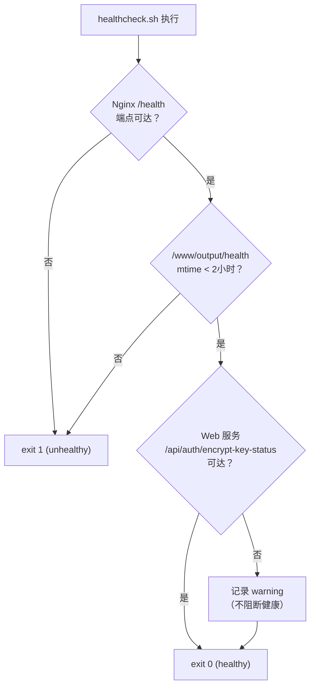

健康检查`不阻断`Web 服务异常，仅记录警告——这是设计上的取舍，确保 Nginx 文件服务优先可用。

Sources: [healthcheck.sh](healthcheck.sh#L1-L35), [Dockerfile](Dockerfile#L130-L131)

---

### 国内网络优化方案

对于中国大陆用户，Docker 镜像构建可能因网络问题失败。仓库提供了**三层加速策略**：

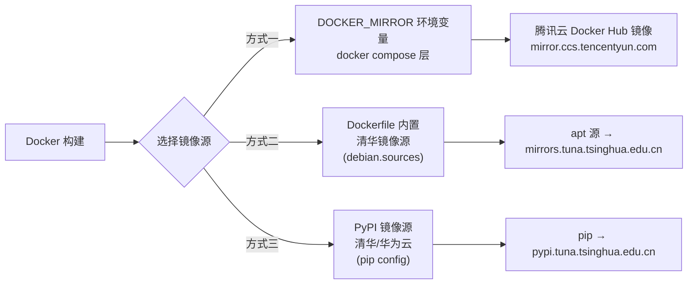

**各层加速的对象**：

| 加速层 | 机制 | 加速对象 | 在何处配置 |
|--------|------|---------|-----------|
| 层①：Docker 镜像拉取 | `DOCKER_MIRROR` 环境变量 | Python 基础镜像层 | 启动命令：`export DOCKER_MIRROR=...` |
| 层②：apt 包管理器 | `sed` 替换 `deb.debian.org` | Nginx、Cron 等系统软件包 | Dockerfile 第 17-18 行（自动执行） |
| 层③：pip Python 包 | `pip config set global.index-url` | FastAPI、Uvicorn 等 Python 依赖 | Dockerfile 第 94-95 行（自动执行） |

**快速开始（国内用户）**：

```bash
# 方式一：docker compose 配合腾讯云镜像（推荐）
set DOCKER_MIRROR=https://mirror.ccs.tencentyun.com
docker compose up -d --build

# 方式二：直接 docker build 指定镜像源
docker build --build-arg BASE_IMAGE=python:3.13-slim-bookworm -t lsm:latest .
```

> 如果你在镜像构建过程中遇到超时或下载失败，通常是因为层②（apt）或层③（pip）的网络问题。Dockerfile 中已内置清华镜像源替换逻辑，但如果你的网络环境需要代理，推荐直接在 Docker Daemon 配置中设置全局镜像加速器。

Sources: [Dockerfile](Dockerfile#L17-L18), [Dockerfile](Dockerfile#L93-L96), [docker-compose.yml](docker-compose.yml#L22-L24)

---

### 多阶段构建的工程思考

Dockerfile 采用**双阶段构建**（multi-stage build），这是经过深思熟虑的设计决策：

```
Stage 1: builder
  基础镜像 → 安装 curl/ca-certificates/xz-utils → 仅准备下载工具

Stage 2: runtime
  基础镜像 → 安装 Nginx + cron + venv → 下载 FFmpeg → 创建 venv + pip install → 复制应用文件
```

**为什么不在 builder 阶段安装 Python 依赖？** Dockerfile 注释（第 90-91 行）揭示了关键原因：venv 内部的 shebang 固定了 Python 解释器路径，如果从 builder 阶段 COPY 过来，路径仍然指向 builder 阶段的 `/usr/local/bin/python`，而 runtime 阶段的 Python 安装路径可能不同，导致 venv 不可用。因此 Python venv 必须在最终的 runtime 阶段创建。

这种设计换来的优势是**镜像体积小**：builder 阶段的构建工具（gcc、make 等）不会进入最终镜像。

Sources: [Dockerfile](Dockerfile#L12-L13), [Dockerfile](Dockerfile#L86-L97)

---

### 进程守护与自动恢复

容器内部运行多个进程，由 `monitor_processes` 函数统一守护：

| 进程 | 启动方式 | 监控策略 | 异常恢复 |
|------|---------|---------|---------|
| Nginx | `nginx -g "daemon off;" &` | 每 30 秒检查 PID 存活 | 最多自动重启 3 次 |
| Web 管理 (Uvicorn) | `uvicorn web.webapp:app &` | 从 PID 文件读取并检查 | 自动重启，次数不限 |
| Cron 守护进程 | `service cron start` | 不监控（Cron 自身有守护逻辑） | 无 |

这种设计确保了**单个服务的崩溃不会导致容器整体退出**，符合 Docker 的"进程级故障隔离"最佳实践。

Sources: [start_docker.sh](start_docker.sh#L920-L961)

---

### 故障排除指南

#### 常见问题与解决方案

| 症状 | 可能原因 | 解决方案 |
|------|---------|---------|
| 容器启动后立即退出 | 健康检查失败 | 执行 `docker compose logs` 查看错误原因；常见于 `setup_nginx` 或 `setup_config_files` 失败 |
| `docker compose up -d --build` 构建失败 | 网络超时 | 使用 `DOCKER_MIRROR` 镜像加速，或检查 Docker Daemon 的 mirror 配置 |
| Web 页面访问显示 502 | Nginx 已启动但 Uvicorn 未就绪 | 等待 10-15 秒后刷新；执行 `docker compose logs` 确认 Web 服务是否正常启动 |
| 登录页面提示"密码错误" | 密码已修改或数据库重置 | 查看日志中的 `ADMIN_PASSWORD_INITIALIZED` 行；或删除 `./data/web.db` 后重启容器 |
| Nginx 文件服务正常但 Web 管理不可达 | 端口映射冲突 | 检查 `WEB_PORT` 是否被宿主机其他程序占用；修改 `.env` 中的端口值 |
| ffprobe 不可用警告 | FFmpeg 静态构建下载失败 | 不影响核心功能，仅流测试不可用；可进入容器手动安装 ffmpeg |
| SQLite 数据库损坏 | 容器异常终止 | `docker compose down` 后删除 `./data/web.db` 再重启（配置会重置为默认值） |

#### 日志排查命令

```bash
# 查看完整容器日志
docker compose logs

# 实时追踪日志
docker compose logs -f

# 过滤特定关键词
docker compose logs | findstr "ERROR"
docker compose logs | findstr "ADMIN_PASSWORD"

# 查看系统日志（Docker Desktop）
docker logs live-source-manager --tail 100
```

#### 完全重置步骤

如果需要从零开始：

```bash
# 1. 停止并删除容器
docker compose down

# 2. （可选）删除所有持久化数据
rm -rf ./data ./logs ./output ./config/sources ./config/online

# 3. 重新构建并启动
docker compose up -d --build
```

Sources: [docker-compose.yml](docker-compose.yml#L6-L15), [start_docker.sh](start_docker.sh#L973-L1038)

---

### 下一步阅读

完成 Docker 部署后，建议按以下路径深入理解系统：

1. **配置管理**：查看 [Config 配置管理：纯 SQLite 存储与统一默认值体系](#ch12) 了解 Web 配置如何从 SQLite 读取
2. **架构全景**：[四层架构设计：从基础层到协调层的依赖关系](#ch6) 揭示 app 层的内部结构
3. **Web API**：[FastAPI 应用架构：路由模块化拆分与中间件体系](#ch17) 了解 Web 服务的路由设计
4. **Docker 构建细节**：[Docker 多阶段构建：FFmpeg 静态构建、清华镜像加速与健康检查](#ch29) 深入 Dockerfile 的每个构建步骤
5. **对比其他部署方式**：[Windows 本地安装与自启动配置](#ch4)、[Linux 手动部署与 systemd 服务管理](#ch5)

---

<a id="ch4"></a>
## 第4章 Windows 本地安装与自启动配置

本文档面向需要在 **Windows 环境** 下本地部署 Live Source Manager Web 管理界面的开发者。与 Docker 容器化部署不同，Windows 本地安装提供了完整的系统级集成能力——包括自动依赖检测、虚拟环境隔离、FFmpeg 自动安装，以及通过 **Windows 任务计划程序** 实现的开机自启动。部署完成后，Web 管理界面将在 `http://localhost:23456` 常驻运行，支持自动重启与崩溃自愈。

### 部署架构总览

整个 Windows 部署体系由三层脚本协同完成：

| 层级 | 脚本文件 | 职责 |
|---|---|---|
| **安装编排层** | `setup_windows.ps1` | OS 检测、Python/pip/virtualenv 自动化、依赖安装、FFmpeg 下载、数据库初始化、自启注册 |
| **启动包装层** | `deploy/windows/start-web.bat` | 定位项目根目录、激活虚拟环境、启动 uvicorn 服务、日志重定向 |
| **自启注册层** | `deploy/windows/install-autostart.ps1` | 创建/管理 Windows Scheduled Task、设置重启策略、区分管理员/非管理员权限级别 |

三者之间的调用关系与数据流如下：

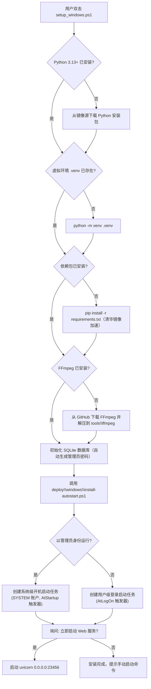

#### 启动流程的路径解析

`start-web.bat` 的设计遵循**静态单一来源**原则：该脚本通过 `%~dp0` 获取自身所在目录（`deploy\windows\`），然后上两级目录自动定位到项目根，无需渲染或配置环境变量。

```batch
set "SCRIPT_DIR=%~dp0"
pushd "%SCRIPT_DIR%..\.."      # 上两级: deploy\windows → 项目根
set "PROJECT_DIR=%CD%"
popd
```

启动日志统一写入 `web\data\windows_start.log`，包含时间戳、启动状态、进程退出码等关键信息：

```log
[2025/01/15 08:00:00] [LiveSource] 启动 Web 服务 (uvicorn 0.0.0.0:23456)
[2025/01/15 08:00:03] [LiveSource] Web 服务进程退出 (exit=0)
```

Sources: [setup_windows.ps1](E:\工作空间\live-source-manager/setup_windows.ps1#L1-L475), [start-web.bat](E:\工作空间\live-source-manager/deploy/windows/start-web.bat#L1-L28), [install-autostart.ps1](E:\工作空间\live-source-manager/deploy/windows/install-autostart.ps1#L1-L74)

### 前提条件与系统要求

在开始安装前，请确认你的 Windows 环境满足以下条件：

| 项目 | 要求 | 说明 |
|---|---|---|
| **操作系统** | Windows 10 1809+ / Windows Server 2019+ | 需要 PowerShell 5.1+ 支持 |
| **PowerShell** | 5.1 或更高版本 | 可通过 `$PSVersionTable.PSVersion` 检查 |
| **执行策略** | 允许脚本执行 | 需以 `Set-ExecutionPolicy RemoteSigned -Scope CurrentUser` 放开策略 |
| **磁盘空间** | ≥ 500 MB | 包含 Python 3.13、虚拟环境、FFmpeg 二进制和 SQLite 数据库 |
| **网络连接** | 外网可达 | 需从镜像源下载 Python 和 pip 依赖；FFmpeg 从 GitHub Releases 下载 |

项目本身要求 **Python ≥ 3.11**（由 `pyproject.toml` 的 `requires-python = ">=3.11"` 约束），但 `setup_windows.ps1` 会自动安装 **Python 3.13.1** 以保持与 CI/CD 环境一致。

Sources: [setup_windows.ps1](E:\工作空间\live-source-manager/setup_windows.ps1#L10-L15), [pyproject.toml](E:\工作空间\live-source-manager/pyproject.toml#L5)

### 一键安装：自动化部署流程

#### 执行方式

右键点击 `setup_windows.ps1`，选择 **"使用 PowerShell 运行"**。脚本会自动按以下顺序执行全流程：

**步骤 1：Python 检测与安装**
脚本会依次尝试 `python`、`python3`、`py` 三个命令，检查是否已安装 3.12+ 版本。若未找到，则从镜像源下载 **Python 3.13.1 amd64** 安装包：

```
尝试顺序：清华镜像 → 华为云镜像 → python.org 官方源
```

安装参数：`/quiet InstallAllUsers=1 PrependPath=1 Include_test=0`（静默安装，加入系统 PATH，不安装测试组件）。

**步骤 2：pip 检测与安装**
优先通过 `python -m ensurepip` 安装 pip，失败则回退到从清华镜像下载 `get-pip.py`。

**步骤 3：虚拟环境创建**
在项目根目录创建 `.venv` 目录，所有 Python 依赖隔离安装于此，不污染系统全局 Python 环境。

**步骤 4：Python 依赖安装**
以 `requirements.txt` 为蓝本，通过以下镜像源顺序加速安装：

| 优先级 | 镜像源 | 配置位置 |
|---|---|---|
| 首选 | 清华 PyPI 镜像 `https://pypi.tuna.tsinghua.edu.cn/simple` | `pip config set global.index-url` |
| 备选 | 华为云 PyPI 镜像 `https://repo.huaweicloud.com/repository/pypi/simple` | 清华失败后自动切换 |

核心依赖包括（完整清单见 `requirements.txt`）：
- **FastAPI + uvicorn** — Web 管理服务框架
- **aiohttp + aiofiles** — 异步 HTTP 下载与文件操作
- **Jinja2** — 模板引擎渲染 Web 页面
- **bcrypt** — 管理员密码哈希（非对称加密存储）
- **cryptography** — Fernet (AES-128-CBC) 字段级加密
- **SQLAlchemy + alembic** — 数据库 ORM 与迁移
- **psutil** — 系统资源监控（Dashboard）

**步骤 5：FFmpeg 下载与安装**
检测 `ffmpeg -version` 是否可用。若未安装，则从 GitHub Releases 下载最新的 Windows 64-bit GPL 版本：

```
尝试顺序：BtbN/FFmpeg-Builds → gyan.dev/ffmpeg-release-essentials
```

下载后解压到 `tools\ffmpeg\` 目录，并将 `<项目根>\tools\ffmpeg\bin` 添加到 **用户 PATH** 环境变量。该目录包含 `ffmpeg.exe` 和 `ffprobe.exe`——后者是流媒体测试引擎的核心依赖。

**步骤 6：数据库初始化**
调用 `web.models.init_db(None)` 执行以下操作：
1. 建表：`users`、`audit_logs`、`app_config`、`sessions`、`classification_dimensions`、`classification_rules`、`province_exclusion_map` 等
2. 首次部署（用户表为空）时自动生成**符合 GB/T 39786-2021 复杂度要求的 16 位强随机密码**
3. 密码输出到控制台（格式 `ADMIN_PASSWORD_INITIALIZED=xxx`），同时写入日志
4. 若 `WEB_ADMIN_PASSWORD` 环境变量已设置，则使用该值覆盖自动生成

```python
# 密码生成策略（web/models.py:204-214）
_pw_pool = string.ascii_letters + string.digits + '!@#$%^&*'
_pw_classes = [string.ascii_lowercase, string.ascii_uppercase, string.digits, '!@#$%^&*']
_pw = [secrets.choice(c) for c in _pw_classes]
_pw += [secrets.choice(_pw_pool) for _ in range(16 - len(_pw_classes))]
# Fisher-Yates 洗牌，避免前 4 位恒为各类代表字符
```

**步骤 7：启动服务与自启注册**
安装完成后，脚本会询问是否立即启动 Web 服务。无论是否启动，最后都会自动调用 `deploy\windows\install-autostart.ps1` 注册开机自启任务。

Sources: [setup_windows.ps1](E:\work\live-source-manager/setup_windows.ps1#L129-L174), [setup_windows.ps1](E:\work\live-source-manager/setup_windows.ps1#L227-L258), [setup_windows.ps1](E:\work\live-source-manager/setup_windows.ps1#L340-L370), [web/models.py](E:\work\live-source-manager/web/models.py#L200-L230), [requirements.txt](E:\work\live-source-manager/requirements.txt#L1-L31)

#### 手动分步安装

若希望手动控制每个步骤（而非一键安装），可参照以下命令序列：

```powershell
# 1. 创建虚拟环境
python -m venv .venv

# 2. 激活虚拟环境
.venv\Scripts\Activate.ps1

# 3. 安装依赖（清华镜像加速）
pip config set global.index-url https://pypi.tuna.tsinghua.edu.cn/simple
pip install -r requirements.txt

# 4. 初始化数据库（自动生成管理员密码）
python -c "from web.models import init_db; init_db(None)"

# 5. 启动 Web 管理服务
python -m uvicorn web.webapp:app --host 0.0.0.0 --port 23456

# 6. 注册开机自启
.\deploy\windows\install-autostart.ps1
```

> 也可以使用快捷入口 `python -m web --install-deps && python -m web`，后者支持 `--port` 和 `--host` 参数自定义监听地址。

Sources: [web/__main__.py](E:\work\live-source-manager/web/__main__.py#L1-L42), [setup_windows.ps1](E:\work\live-source-manager/setup_windows.ps1#L399-L471)

### Windows 任务计划程序自启动机制

#### 权限级别与触发器

`install-autostart.ps1` 根据运行时的权限自动选择自启策略：

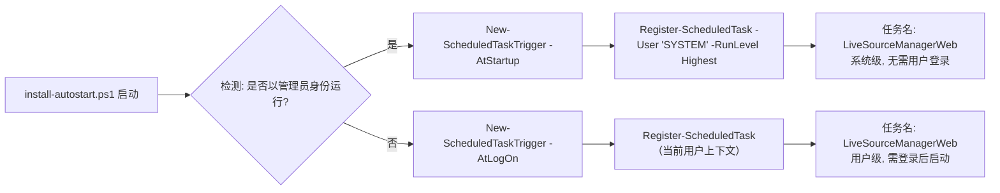

| 运行身份 | 触发器类型 | 运行账户 | 使用场景 |
|---|---|---|---|
| **管理员** (`-RunLevel Highest`) | `AtStartup`（系统启动时） | `SYSTEM` | 服务器环境，无需用户登录即可运行 |
| **非管理员** | `AtLogOn`（用户登录时） | 当前用户 | 个人桌面环境，随用户登录自动启动 |

#### 重启与恢复策略

任务创建时配置了健壮的恢复机制：

```powershell
$settings = New-ScheduledTaskSettingsSet `
    -AllowStartIfOnBatteries `          # 笔记本电池模式下也允许启动
    -DontStopIfGoingOnBatteries `       # 切换到电池时不停止
    -StartWhenAvailable `               # 错过触发时间后尽快启动
    -RestartCount 3 `                   # 失败后最多重试 3 次
    -RestartInterval (New-TimeSpan -Minutes 1) `  # 每次重试间隔 1 分钟
    -ExecutionTimeLimit ([TimeSpan]::Zero)        # 无执行时间限制（7x24 常驻）
```

关键配置解读：
- **RestartCount=3**：若 uvicorn 进程异常退出（如端口冲突、未捕获异常），任务计划程序会在 1 分钟后自动重新启动，最多尝试 3 次
- **ExecutionTimeLimit=0**：任务不会因为运行时间过长而被系统终止，符合 Web 服务 7×24 运行的诉求
- **StartWhenAvailable**：若因关机错过启动时机，下次开机后立即补启动

#### 管理命令

任务注册完成后，可通过以下 PowerShell 命令进行管理：

```powershell
# 立即启动
Start-ScheduledTask -TaskName LiveSourceManagerWeb

# 停止服务
Stop-ScheduledTask -TaskName LiveSourceManagerWeb

# 查看任务状态
Get-ScheduledTask -TaskName LiveSourceManagerWeb | fl

# 删除任务
Unregister-ScheduledTask -TaskName LiveSourceManagerWeb -Confirm:$false

# 查看运行日志（由 start-web.bat 生成）
Get-Content .\web\data\windows_start.log -Tail 50
```

Sources: [install-autostart.ps1](E:\工作空间\live-source-manager/deploy/windows/install-autostart.ps1#L36-L73), [start-web.bat](E:\工作空间\live-source-manager/deploy/windows/start-web.bat#L14-L27)

### 端口分配与冲突处理

服务默认监听以下端口：

| 端口 | 用途 | 配置方式 |
|---|---|---|
| `23456` | Web 管理界面（FastAPI + uvicorn） | 环境变量 `WEB_PORT`，或 `web/webapp.py` 中硬编码 |
| `12345` | 文件发布服务（HTTP 文件共享） | 配置中心 `HTTPServer.fileshare_port` |

启动时 `webapp.py` 中的 `check_port()` 函数会检测端口是否已被占用：

```python
def check_port(host: str = '0.0.0.0', port: int = 23456) -> bool:
    with socket.socket(socket.AF_INET, socket.SOCK_STREAM) as s:
        try:
            s.bind((host, port))
            return True
        except OSError:
            return False
```

若端口被占用，服务会立即退出并记录 `错误: 端口 23456 已被占用，无法启动 Web 服务`。此时可：
1. 通过 `netstat -ano | findstr :23456` 查找占用进程
2. 设置环境变量 `WEB_PORT=8080` 切换端口后重新启动

Sources: [web/webapp.py](E:\工作空间\live-source-manager/web/webapp.py#L56-L86)

### 首次登录与安全配置

#### 获取初始密码

安装脚本执行后，控制台会输出类似以下信息：

```
[INFO] ✓ 数据库初始化成功
============================================================
⚠️  已自动生成管理员密码，请立即记录并尽快在「配置中心」修改！
    管理员账号: admin
    管理员密码: Kp8#mN2$xL5@vR7w
============================================================
```

若错过了控制台输出，可在日志文件中找到：
- **安装日志**：`web\data\windows_start.log` 中包含首次启动的密码记录
- **数据库文件**：`web\data\web.db`（密码以 bcrypt 哈希存储，不可逆）

#### 自定义初始密码

通过设置环境变量 `WEB_ADMIN_PASSWORD` 可跳过随机密码生成：

```powershell
# 在启动前设置
$env:WEB_ADMIN_PASSWORD = "YourStrongP@ssw0rd"
python -m web
# 或
$env:WEB_ADMIN_PASSWORD = "YourStrongP@ssw0rd"
.\deploy\windows\start-web.bat
```

首次部署时若设置了该变量，`init_db(None)` 将使用该值创建 admin 用户；若用户已存在（非首次部署），则保留现有密码不变，实现**幂等初始化**。

Sources: [web/models.py](E:\work\live-source-manager/web/models.py#L136-L228), [web/webapp.py](E:\work\live-source-manager/web/webapp.py#L82-L84)

### 环境变量速查表

| 变量名 | 默认值 | 用途 |
|---|---|---|
| `WEB_HOST` | `0.0.0.0` | Web 服务监听地址 |
| `WEB_PORT` | `23456` | Web 服务监听端口 |
| `WEB_ADMIN_PASSWORD` | （自动生成） | 首次部署的管理员密码 |
| `WEB_DATA_DIR` | `./web/data` | SQLite 数据库文件 `web.db` 所在目录 |
| `WEB_VIEWER_PASSWORD` | （自动生成） | 查看者角色密码（已废弃，仅供向后兼容） |

Sources: [web/webapp.py](E:\work\live-source-manager/web/webapp.py#L75-L76), [web/models.py](E:\work\live-source-manager/web/models.py#L68-L74)

### 横向对比：Windows vs Docker vs Linux

| 维度 | Windows 本地部署 | Docker 容器化部署 | Linux systemd 部署 |
|---|---|---|---|
| **依赖管理** | 自动安装 Python + FFmpeg | 镜像内置，无需额外操作 | 需手动安装或使用 `setup_linux.sh` |
| **自启机制** | Windows Task Scheduler | Docker `restart: always` | systemd service unit |
| **数据库路径** | `web\data\web.db` | 映射到持久卷 `/data` | `web/data/web.db` |
| **服务端口** | 23456 (Web) / 12345 (文件) | 通过 `docker-compose.yml` 映射 | 同默认值 |
| **崩溃自愈** | 任务计划程序 3 次重试（1 分钟间隔） | Docker 自动重启容器 | systemd `Restart=always`，10 秒间隔 |
| **日志** | `web\data\windows_start.log` | `docker logs` 或持久卷 | systemd journal (`journalctl`) |
| **更新方式** | `git pull` + 重启任务 | `docker-compose pull && up` | `git pull` + `systemctl restart` |
| **适用场景** | 个人桌面环境、Windows 服务器 | 生产环境、CI/CD、跨平台 | Linux 服务器生产环境 |

Windows 自启动与 Linux systemd 在重启策略上有一个关键差异：**Linux 的 `Restart=always` 配合 `StartLimitIntervalSec=0` 实现了无限重试（崩溃即重启）**，而 Windows Task Scheduler 限制为 3 次重试。但 Windows 的 `-StartWhenAvailable` 和 `-DontStopIfGoingOnBatteries` 对笔记本用户更加友好。

Sources: [deploy/live-source-web.service](E:\work\live-source-manager/deploy/live-source-web.service#L1-L57), [install-autostart.ps1](E:\work\live-source-manager/deploy/windows/install-autostart.ps1#L42-L48)

### 故障排查指南

#### 安装阶段问题

| 症状 | 可能原因 | 解决方案 |
|---|---|---|
| Python 下载失败 | 镜像源不可达 | 手动从 [python.org](https://www.python.org/downloads/) 下载 Python 3.13+ 并安装 |
| pip 安装依赖报错 | 依赖冲突或网络超时 | `pip install --timeout=120 -r requirements.txt` 或更换镜像源 |
| FFmpeg 下载失败 | GitHub Releases 不可达 | 手动下载 FFmpeg 解压到 `tools\ffmpeg\bin\`，或从 [gyan.dev](https://www.gyan.dev/ffmpeg/builds/) 获取 |
| 数据库初始化失败 | web/data 目录无写权限 | 确保运行脚本的用户对该目录有写入权限 |

#### 运行时问题

| 症状 | 可能原因 | 解决方案 |
|---|---|---|
| 端口 23456 被占用 | 其他进程占用了端口 | `netstat -ano \| findstr :23456` 查 PID，在任务管理器中结束；或设置 `WEB_PORT` 切换端口 |
| 服务启动后无法访问 | 防火墙拦截 | 在 Windows Defender 防火墙中添加入站规则，允许 `23456` 端口 |
| 自启任务未执行 | 任务计划程序条件不满足 | 检查任务计划程序库中 `LiveSourceManagerWeb` 的状态，确认触发器配置正确 |
| 流测试失败（ffprobe） | FFmpeg 未正确安装 | 在命令行执行 `ffprobe -version` 确认；检查 `tools\ffmpeg\bin` 是否在 PATH 中 |

#### 任务计划程序常见问题

```powershell
# 强制手动触发任务（不等待下次触发）
Start-ScheduledTask -TaskName LiveSourceManagerWeb

# 查看任务最后运行结果
$task = Get-ScheduledTask -TaskName LiveSourceManagerWeb
Get-ScheduledTaskInfo -TaskName $task.TaskName

# 查看任务的历史事件（需先在事件查看器中启用任务计划程序日志）
Get-WinEvent -LogName Microsoft-Windows-TaskScheduler/Operational | 
    Where-Object { $_.Message -like "*LiveSourceManagerWeb*" } |
    Select-Object -First 10 TimeCreated, Message
```

Sources: [install-autostart.ps1](E:\工作空间\live-source-manager/deploy/windows/install-autostart.ps1#L36-L48)

### 项目目录结构（Windows 视角）

安装完成后，项目目录结构如下：

```
live-source-manager/
├── .venv/                          # Python 虚拟环境（隔离依赖）
│   └── Scripts/
│       ├── python.exe
│       └── pip.exe
├── app/                            # 核心引擎层（源管理、流测试、规则引擎）
├── web/                            # Web 管理后端（FastAPI 路由、ORM）
│   └── data/
│       ├── web.db                  # SQLite 数据库（核心配置、用户、审计日志）
│       └── windows_start.log       # Windows 启动日志
├── config/                         # 配置目录
│   ├── config-defaults.yaml        # 默认配置覆盖文件
│   ├── channel_rules.yml           # 频道分类规则
│   ├── online/                     # 在线下载的源文件缓存
│   └── sources/                    # 本地源文件目录
├── data/                           # 运行时数据
│   └── status/
├── www/output/                     # 生成的 M3U 播放列表输出目录
├── tools/ffmpeg/bin/               # FFmpeg 工具（含 ffprobe.exe）
│   ├── ffmpeg.exe
│   └── ffprobe.exe
├── deploy/windows/                 # Windows 部署脚本
│   ├── install-autostart.ps1       # 自启注册脚本
│   └── start-web.bat               # 启动包装脚本
├── setup_windows.ps1               # 一键安装脚本（入口）
└── requirements.txt                # Python 依赖定义
```

#### 各目录的读写权限要求

| 目录 | 权限要求 | 说明 |
|---|---|---|
| `.venv\` | 读+写 | 虚拟环境创建时需要写入 |
| `web\data\` | **读+写** | SQLite 数据库和启动日志——服务运行时持续写入 |
| `config\online\` | 读+写 | 下载远程源文件时写入缓存 |
| `config\sources\` | 读+写 | 本地源目录 |
| `www\output\` | 读+写 | 写入生成的 M3U 播放列表 |
| 其他目录 | 只读 | 代码文件仅需读取 |

### 下一步

恭喜！你现在已经完成了 Live Source Manager 在 Windows 上的完整部署。建议按照以下顺序深入探索：

- 了解项目整体设计：[项目概览：直播源管理器的定位与核心价值](#ch1)
- 如果你是 Docker 用户，可对比：[Docker 一键部署（docker-compose）](#ch3)
- Linux 用户参考：[Linux 手动部署与 systemd 服务管理](#ch5)
- 深入核心引擎：从[四层架构设计](#ch6)开始，逐步理解源管理、流测试、规则引擎和 M3U 生成的完整链路
- 通过 Web 管理界面配置频道规则和测试参数：[RESTful API 全景](#ch22)

---

<a id="ch5"></a>
## 第5章 Linux 手动部署与 systemd 服务管理

本文详细说明在 Linux 服务器上手动部署 Live Source Manager Web 管理服务的完整流程，涵盖虚拟环境搭建、依赖安装、systemd 服务单元配置、Nginx 反向代理、运行时目录权限管理以及日志排查技巧。无论是全自动安装（通过 `setup_linux.sh`）还是纯手动分步部署，本文均提供可复现的步骤与原理说明。

Sources: [setup_linux.sh](setup_linux.sh#L1-L3), [live-source-web.service](deploy/live-source-web.service#L1-L5)

---

### 部署架构总览

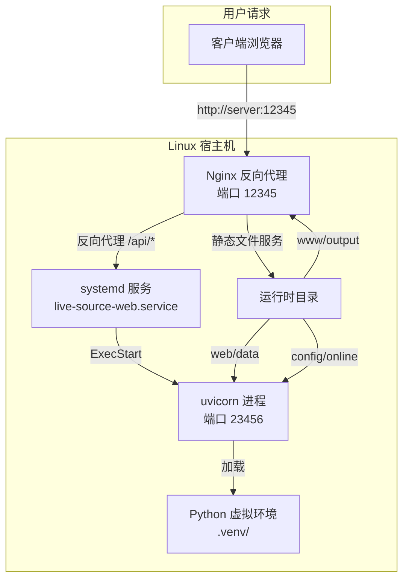

**部署拓扑说明**：Nginx 监听外部端口 `12345`，既做反向代理将 `/api/*` 请求转发至后端 uvicorn 进程（端口 `23456`），也直接提供 `www/output` 目录下的 M3U/TXT 播放列表文件。systemd 守护 uvicorn 进程，崩溃自愈（`Restart=always`），开机自启（`WantedBy=multi-user.target`）。

Sources: [nginx.conf](nginx.conf#L35-L48), [live-source-web.service](deploy/live-source-web.service#L32-L42)

---

### 前置条件

在开始部署前，确保目标主机满足以下条件：

| 组件 | 最低版本 | 作用 | 安装验证命令 |
|------|---------|------|------------|
| Python | 3.13+ | 运行核心引擎与 Web 服务 | `python3.13 --version` |
| pip | 最新 | 安装 Python 依赖 | `pip --version` |
| ffprobe | 任意（推荐 ffmpeg 6+） | 流媒体质量检测与测试 | `ffprobe -version` |
| Nginx | 1.18+（可选但推荐） | 反向代理 + 文件发布 | `nginx -v` |
| Git | 任意 | 克隆项目代码（可选） | `git --version` |

> **关于 ffprobe**：StreamTester 核心依赖 ffprobe 进行流探测。可用包管理器安装：`sudo apt install ffmpeg`（Ubuntu/Debian）或 `sudo yum install ffmpeg`（CentOS/RHEL）。建议安装完整 ffmpeg 而非仅 ffprobe，便于后续扩展。

> **关于 Python 3.13**：项目使用 Python 3.13+ 特性（如 `pathlib.Path.walk`、改进了 `asyncio` 性能）。若系统默认 Python 版本不足，可使用 `deadsnakes` PPA（Ubuntu）或从源码编译安装。

Sources: [setup_linux.sh](setup_linux.sh#L55-L80), [start_docker.sh](start_docker.sh#L50-L75)

---

### 方式一：全自动脚本安装（推荐）

项目提供 `setup_linux.sh` 一站式安装脚本，自动完成环境检测、虚拟环境创建、依赖安装、数据库初始化、Nginx 配置、目录权限修复以及 systemd 服务注册。

```bash
# 克隆项目
git clone https://github.com/yuanshandalishuishou/live-source-manager.git
cd live-source-manager

# 以 root 身份运行安装脚本
sudo bash setup_linux.sh
```

**脚本执行流程**：

```mermaid
sequenceDiagram
    participant U as 用户
    participant S as setup_linux.sh
    participant OS as 操作系统
    participant PY as Python 虚拟环境
    participant DB as SQLite 数据库
    participant NG as Nginx
    participant SD as systemd

    U->>S: sudo bash setup_linux.sh
    S->>OS: 检测 Python / ffmpeg / Nginx
    OS-->>S: 版本信息
    S->>PY: 创建 .venv + pip install -r requirements.txt
    PY-->>S: 依赖就绪
    S->>DB: python -c "from web.models import init_db; init_db(None)"
    DB-->>S: 数据库初始化成功 + 自动生成管理员密码
    Note over S,U: 首次运行自动生成强随机密码，记录在控制台输出
    S->>OS: chown -R www-data web/data config/online config/sources www/output
    S->>NG: 复制 nginx.conf 并启用站点
    S->>SD: sed 渲染 service 模板 → systemctl enable --now
    SD-->>S: 服务已启动
    S-->>U: 安装完成！访问 http://localhost:23456
```

**脚本核心行为说明**：

- **环境检测复用**：`setup_linux.sh` 在内部 `source` 了 `start_docker.sh`，复用了其中的 `setup_environment()` 函数，该函数自动安装 Python 3.13（如需）、pip 依赖、ffmpeg 和 Nginx
- **零配置首启**：数据库初始化时若 `WEB_ADMIN_PASSWORD` 环境变量未设置，`init_db(None)` 会自动生成 16 字节强随机密码并打印到控制台——**首次务必记录此密码**
- **权限修正**：脚本创建并 `chown` 四个关键运行时目录为 `www-data:www-data`，避免 systemd 以 `www-data` 用户运行时因无权写入而崩溃
- **Nginx 站点启用**：从项目根 `nginx.conf` 复制到 `/etc/nginx/sites-available/` 并创建符号链接，覆盖默认站点

Sources: [setup_linux.sh](setup_linux.sh#L81-L189), [start_docker.sh](start_docker.sh#L55-L80)

---

### 方式二：手动分步部署

若需精细控制每一步或定制配置，可按以下步骤手动部署。此方式也便于理解整个系统的文件布局与依赖关系。

#### 步骤 1：准备项目文件和 Python 虚拟环境

```bash
# 假设部署到 /opt/live-source-manager
PROJECT_DIR=/opt/live-source-manager
sudo mkdir -p "$PROJECT_DIR"

# 克隆或复制项目代码
sudo git clone https://github.com/yuanshandalishuishou/live-source-manager.git "$PROJECT_DIR"

# 创建 Python 虚拟环境（必须与项目同目录下，名称为 .venv）
sudo python3.13 -m venv "$PROJECT_DIR/.venv"

# 安装依赖
sudo "$PROJECT_DIR/.venv/bin/pip" install -r "$PROJECT_DIR/requirements.txt"

# 创建运行时目录
sudo mkdir -p "$PROJECT_DIR/web/data" "$PROJECT_DIR/config/online" \
             "$PROJECT_DIR/config/sources" "$PROJECT_DIR/www/output"
```

**虚拟环境位置约束**：systemd 服务单元中 `ExecStart` 和 `PATH` 均硬编码为 `__PROJECT_DIR__/.venv/bin/python`，因此虚拟环境必须创建在项目根目录下的 `.venv` 文件夹中。若需更改虚拟环境路径，必须同步修改 service 文件的 `ExecStart` 和 `Environment=PATH`。

Sources: [live-source-web.service](deploy/live-source-web.service#L33-L35), [setup_linux.sh](setup_linux.sh#L130-L135)

#### 步骤 2：初始化 SQLite 数据库

```bash
cd "$PROJECT_DIR"

# 首次初始化（自动生成管理员密码）
sudo -u www-data "$PROJECT_DIR/.venv/bin/python" -c "
from web.models import init_db
init_db(None)
"
```

若需预先指定管理员密码，可设置环境变量 `WEB_ADMIN_PASSWORD`：

```bash
WEB_ADMIN_PASSWORD="your_secure_password" \
  sudo -u www-data "$PROJECT_DIR/.venv/bin/python" -c "
from web.models import init_db
init_db(None)
"
```

> **数据库位置**：SQLite 数据库文件 `web/data/livesource.db`（路径由 `web/models.py` 中 `DB_PATH` 常量定义，位于项目 `web/data/` 子目录下）。初始化时还会创建 `app_config` 配置表，用于存储纯 SQLite 驱动的配置系统。

Sources: [setup_linux.sh](setup_linux.sh#L81-L95), [web/core.py](web/core.py#L36-L40)

#### 步骤 3：配置运行时目录权限

```bash
# 将运行时目录归属为 www-data 用户
sudo chown -R www-data:www-data \
  "$PROJECT_DIR/web/data" \
  "$PROJECT_DIR/config/online" \
  "$PROJECT_DIR/config/sources" \
  "$PROJECT_DIR/www/output"
```

| 目录 | 用途 | 写入时机 | 写入内容示例 |
|------|------|---------|------------|
| `web/data/` | SQLite 数据库、Session 持久化 | 每次操作 | `livesource.db`、`sessions.db` |
| `config/online/` | 在线源下载缓存 | 每次源更新 | 从 URL 下载的 `.m3u` / `.txt` 文件 |
| `config/sources/` | 本地源文件读取 | 源管理器扫描 | 用户放置的自定义源文件 |
| `www/output/` | 生成的播放列表输出 | 每次 M3U 生成 | `live.m3u`、分组输出文件 |

> **为什么所有权必须正确？** systemd 服务以 `User=www-data` 运行。若上述目录不可写，Web 服务首次请求时写入数据库会抛出 `PermissionError`，systemd 检测到进程退出后触发 `Restart=always` 导致反复重启——但重启后依然 PermissionError，形成"重启风暴"。建议通过 `journalctl -u live-source-web -n 50` 检查日志确认。

Sources: [setup_linux.sh](setup_linux.sh#L130-L135), [live-source-web.service](deploy/live-source-web.service#L17-L21)

#### 步骤 4：创建并启用 systemd 服务

```bash
# 从模板渲染 service 文件，替换项目路径占位符
sudo sed 's|__PROJECT_DIR__|/opt/live-source-manager|g' \
  deploy/live-source-web.service > /etc/systemd/system/live-source-web.service

# 重新加载 systemd 配置
sudo systemctl daemon-reload

# 启用开机自启并立即启动
sudo systemctl enable --now live-source-web.service

# 验证状态
sudo systemctl status live-source-web
```

**systemd 服务单元关键参数详解**：

| 参数 | 设定值 | 设计意图 |
|------|--------|---------|
| `Type` | `simple` | uvicorn 进程常驻前台，systemd 视其为主进程 |
| `User`/`Group` | `www-data` | 最小权限原则，仅赋予服务运行所需的最低系统权限 |
| `WorkingDirectory` | `__PROJECT_DIR__` | 确保所有相对路径（如 `./web/data`）正确解析 |
| `Environment=PATH` | `.venv/bin` 置首 | 隔离虚拟环境，避免系统 Python 包冲突 |
| `PYTHONUNBUFFERED=1` | 启用 | 日志实时刷入 journal，`journalctl -f` 可尾随查看 |
| `Restart=always` | 始终重启 | 进程异常退出后自动拉起，实现 7×24 高可用 |
| `RestartSec=10` | 10 秒 | 崩溃重试间隔，避免快速重试加剧故障 |
| `StartLimitIntervalSec=0` | 无限制 | 禁用 systemd 默认启动频率限制，确保持续自愈 |
| `KillMode=control-group` | 进程组模式 | 清理 uvicorn 及其派生的 ffprobe 子进程，防止孤儿进程 |
| `StandardOutput`/`StandardError` | `journal` | 所有日志统一由 journald 管理，便于集中查询 |

Sources: [live-source-web.service](deploy/live-source-web.service#L23-L51)

#### 步骤 5：配置 Nginx 反向代理（推荐）

Nginx 提供反向代理（转发 API 请求至 uvicorn）和静态文件服务（直接提供 `www/output` 目录下的播放列表文件）。项目提供预配置的 `nginx.conf`。

```bash
# 复制 Nginx 配置文件
sudo cp nginx.conf /etc/nginx/sites-available/live-source-manager

# 启用站点
sudo ln -sf /etc/nginx/sites-available/live-source-manager /etc/nginx/sites-enabled/
sudo rm -f /etc/nginx/sites-enabled/default

# 修改 nginx.conf 中的端口和根目录
sudo sed -i "s/\${NGINX_PORT}/12345/g" /etc/nginx/sites-available/live-source-manager
sudo sed -i "s|/www/output|$PROJECT_DIR/www/output|g" /etc/nginx/sites-available/live-source-manager

# 测试配置
sudo nginx -t

# 重启 Nginx
sudo systemctl reload nginx
```

**Nginx 配置核心要点**：

- **统一端口**：`listen ${NGINX_PORT}` 设计为从环境变量读取，在 Docker 场景下灵活配置；手动部署时可替换为固定值，如 `12345`
- **安全头**：配置了 `X-Frame-Options`、`X-Content-Type-Options`、`Content-Security-Policy`（限制脚本仅允许 `'self'` 来源）等多层安全头
- **M3U 文件服务**：`application/vnd.apple.mpegurl` MIME 类型映射 + CORS 跨域头（`Access-Control-Allow-Origin: *`）+ 5 分钟缓存过期策略
- **目录列表**：`autoindex on` 开启目录浏览，便于在浏览器中查看和管理生成的播放列表文件
- **健康检查**：`location /health` 端点返回 `"healthy\n"`，供监控系统探测 Nginx 存活状态

Sources: [nginx.conf](nginx.conf#L1-L140), [healthcheck.sh](healthcheck.sh#L6-L9)

---

### post-deployment 验证清单

部署完成后，逐项验证以确保系统正常运行：

```bash
# 1. 检查 systemd 服务是否活跃
sudo systemctl is-active live-source-web.service
# 预期输出: active

# 2. 检查 systemd 服务是否开机自启
sudo systemctl is-enabled live-source-web.service
# 预期输出: enabled

# 3. 检查端口监听
ss -tlnp | grep -E '23456|12345'
# 预期: LISTEN 状态，进程为 uvicorn（23456）和 nginx（12345）

# 4. 检查 Nginx 反向代理是否正常
curl -sI http://localhost:12345/ | head -1
# 预期: HTTP/1.1 200 OK

# 5. 检查 Web 服务 API 是否响应
curl -s http://localhost:23456/api/auth/encrypt-key-status
# 预期: 返回 JSON（含加密密钥状态信息）

# 6. 检查日志无报错
sudo journalctl -u live-source-web -n 20 --no-pager | grep -i error || echo "无错误日志"
```

Sources: [web/webapp.py](web/webapp.py#L60-L73), [healthcheck.sh](healthcheck.sh#L24-L28)

---

### systemd 服务管理命令速查

```bash
# ── 服务生命周期管理 ──
sudo systemctl start   live-source-web   # 启动服务
sudo systemctl stop    live-source-web   # 停止服务
sudo systemctl restart live-source-web   # 重启服务（重新加载配置）
sudo systemctl reload  live-source-web   # 重载（此服务不支持，用 restart）
sudo systemctl status  live-source-web   # 查看运行状态

# ── 开机自启管理 ──
sudo systemctl enable  live-source-web   # 启用开机自启
sudo systemctl disable live-source-web   # 禁用开机自启

# ── 日志查看 ──
sudo journalctl -u live-source-web -f    # 实时跟踪日志
sudo journalctl -u live-source-web -n 100 # 查看最近 100 行
sudo journalctl -u live-source-web --since "5 min ago"  # 查看最近 5 分钟
sudo journalctl -u live-source-web -p err                  # 仅查看错误级别日志
sudo journalctl -u live-source-web -o json-pretty          # JSON 格式输出
```

> **日志持久化**：默认 journald 日志在 `/var/log/journal/` 目录（如已启用持久化）或 `/run/log/journal/`（内存中，重启丢失）。如需永久保留日志，执行 `sudo mkdir -p /var/log/journal && sudo systemctl restart systemd-journald`。

Sources: [live-source-web.service](deploy/live-source-web.service#L46-L51)

---

### 配置自定义：端口与监听地址

Web 服务默认监听 `0.0.0.0:23456`。可通过环境变量覆盖：

```bash
# 方式一：修改 service 文件（推荐，保留在 systemd 配置中）
sudo mkdir -p /etc/systemd/system/live-source-web.service.d/
sudo tee /etc/systemd/system/live-source-web.service.d/port.conf << 'EOF'
[Service]
Environment=WEB_PORT=18080
Environment=WEB_HOST=127.0.0.1
EOF
sudo systemctl daemon-reload
sudo systemctl restart live-source-web

# 方式二：直接修改 service 模板（升级时会被覆盖，不推荐）
# 在 [Service] 段添加：
# Environment=WEB_PORT=18080
# Environment=WEB_HOST=127.0.0.1

# 验证修改
systemctl show live-source-web --property=Environment
# 预期输出: Environment=WEB_PORT=18080 WEB_HOST=127.0.0.1 PYTHONUNBUFFERED=1 PATH=...
```

**配置覆写机制**：`live-source-web.service.d/` 目录下的 `.conf` 文件以"片段"（drop-in）形式覆写主单元配置，systemd 会按字典序合并所有片段 + 主单元。此方式最大的优势是**升级安全**——当通过 Git 拉取新版代码后重新执行 `setup_linux.sh` 时，主 service 文件被覆盖，但 `service.d/` 目录中的自定义片段保持不变。

Sources: [live-source-web.service](deploy/live-source-web.service#L35-L40), [web/webapp.py](web/webapp.py#L62-L68)

---

### 故障排查指南

#### 问题 1：服务启动失败，"Address already in use"

```
journalctl -u live-source-web -n 20 --no-pager
# 输出: OSError: [Errno 98] Address already in use
```

**原因**：端口 23456 已被占用（可能是之前启动的 uvicorn 进程未正常退出，或其他进程占用）。

**解决**：
```bash
# 查找占用 23456 端口的进程
sudo ss -tlnp | grep 23456

# 强制终止
sudo kill -9 <PID>

# 或使用 fuser
sudo fuser -k 23456/tcp

# 重启服务
sudo systemctl restart live-source-web
```

#### 问题 2：服务持续重启（重启风暴）

```bash
sudo systemctl status live-source-web
# 输出: active (running) ... 然后马上变为 failed 再变回 activating
```

**原因**：最常见的是 `www-data` 用户对 `web/data/` 目录无写权限，进程启动后尝试写入 SQLite 数据库时 `PermissionError` 崩溃 -> systemd 自动重启 -> 再次崩溃的循环。其次可能是虚拟环境路径不匹配，Python 无法找到依赖。

**定位步骤**：
```bash
# 1. 查看最后 50 行日志，关注 PermissionError
sudo journalctl -u live-source-web -n 50 --no-pager

# 2. 验证目录所有权
ls -ld /opt/live-source-manager/web/data
# 预期: drwxr-xr-x www-data www-data

# 3. 如果权限错误，修复并重启
sudo chown -R www-data:www-data /opt/live-source-manager/web/data
sudo systemctl restart live-source-web
```

#### 问题 3：Nginx 反向代理 502 Bad Gateway

```
curl http://localhost:12345/api/auth/encrypt-key-status
# 返回: 502 Bad Gateway
```

**排查**：
```bash
# 1. 确认 uvicorn 进程存活
sudo systemctl status live-source-web

# 2. 确认监听端口
ss -tlnp | grep 23456

# 3. 检查 Nginx 错误日志
sudo tail -50 /var/log/nginx/error.log
# 常见原因: upstream 地址写错（如端口号不一致）或 Nginx 无法连接到 127.0.0.1:23456
```

#### 问题 4：M3U 文件下载返回 404

**原因**：`www/output/` 目录为空或 `root` 指令指向了错误的路径。

**解决**：
```bash
# 确认输出目录存在且有内容
ls -la /opt/live-source-manager/www/output/

# 检查 nginx.conf 中 root 指令路径是否与实际一致
grep root /etc/nginx/sites-available/live-source-manager

# 手动触发一次 M3U 生成（如适用）
sudo -u www-data /opt/live-source-manager/.venv/bin/python -m app
```

Sources: [live-source-web.service](deploy/live-source-web.service#L17-L21), [web/webapp.py](web/webapp.py#L60-L73), [nginx.conf](nginx.conf#L39-L42)

---

### 项目文件结构

手动部署完成后，典型目录结构如下：

```
/opt/live-source-manager/
├── .venv/                        # Python 虚拟环境
│   └── bin/
│       ├── python                # 隔离的 Python 解释器
│       ├── uvicorn               # ASGI 服务器
│       └── ...
├── app/                          # 核心引擎（源管理、流测试、M3U生成）
│   ├── source_manager.py         # 多源下载器
│   ├── stream_tester.py          # ffprobe 并发测试引擎
│   ├── manager.py                # 协调层总控
│   └── ...
├── web/                          # Web 管理后端
│   ├── webapp.py                 # FastAPI 入口
│   ├── core.py                   # 共享基础设施
│   ├── data/
│   │   └── livesource.db         # SQLite 数据库 ← 写权限关键
│   ├── routes/                   # 7 个路由模块
│   └── templates/                # Jinja2 页面模板
├── config/
│   ├── config-defaults.yaml      # 配置默认值（可覆盖代码内硬编码）
│   ├── online/                   # 在线源缓存 ← 写权限关键
│   └── sources/                  # 本地源文件目录 ← 写权限关键
├── www/
│   └── output/                   # M3U/TXT 输出目录 ← 写权限关键 + Nginx root
├── deploy/
│   └── live-source-web.service   # systemd 服务模板
├── nginx.conf                    # Nginx 配置模板
├── requirements.txt              # Python 依赖清单
├── setup_linux.sh                # 自动安装脚本
└── healthcheck.sh                # 健康检测脚本
```

**四个关键运行时目录**（标有 ← 标记）必须对 `www-data` 用户可写，否则服务在首次操作时将因权限不足崩溃。

Sources: [setup_linux.sh](setup_linux.sh#L130-L135), [live-source-web.service](deploy/live-source-web.service#L17-L21)

---

### 安全加固建议

1. **管理员密码**：首次启动后立即登录 Web 界面，在「配置中心」修改默认管理员密码。自动生成的随机密码会打印在 `setup_linux.sh` 的控制台输出中，安装完成后请及时记录
2. **加密密钥**：在 Web 界面「配置中心」生成或导入 `CONFIG_ENCRYPT_KEY`（32字节 base64 编码），用于敏感配置字段（如 GitHub Token）的 Fernet (AES-128-CBC) 加密存储
3. **Nginx 访问控制**：`location /status` 限制仅 `127.0.0.1` 和 Docker 内网段（172.16.0.0/12、10.0.0.0/8）可访问，如需开放公网，建议配合防火墙白名单
4. **隐藏文件拦截**：Nginx 已配置 `location ~ /\.` 拒绝以点号开头的隐藏文件访问，保护 `.env`、`.git` 等敏感路径
5. **HTTPS 配置**：生产环境应在 Nginx 层配置 SSL 证书，开启 `Strict-Transport-Security` 头（已在 `nginx.conf` 中预置，`max-age=63072000`），确保全站 HTTPS 传输

Sources: [nginx.conf](nginx.conf#L52-L56), [.env.example](.env.example#L18-L24)

---

### 下一步阅读

完成部署后，建议按以下顺序深入了解系统架构：

- 理解 Web 管理后端的整体路由与中间件设计：[FastAPI 应用架构：路由模块化拆分与中间件体系](#ch17)
- 深入了解 SQLite ORM 设计与 WAL 模式：[SQLite ORM 设计与数据库迁移：context manager 模式与 WAL 模式](#ch18)
- 配置认证与用户管理：[认证与授权体系：Session/Cookie 管理、RBAC 角色与 CSRF 防护](#ch19)
- 了解 Nginx 反向代理的详细配置：[Nginx 反向代理配置与文件发布服务](#ch27)

Sources: [web/webapp.py](web/webapp.py#L1-L90), [web/core.py](web/core.py#L1-L200)

---

---

<a id="ch6"></a>
## 第6章 四层架构设计：从基础层到协调层的依赖关系

### 核心概念：单向依赖的层次化架构

本项目的核心引擎（`app` 包）采用严格的**四层单向依赖架构**，每一层仅可依赖其下方的层，禁止同层横向依赖或反向依赖。这种设计借鉴了经典的分层架构模式（Layered Architecture），将直播源管理从"原始数据获取"到"最终播放列表生成"的完整链路拆解为四个职责清晰的层次。每个层次完成特定类型的任务，并通过明确的接口向上层提供服务。

```
┌─────────────────────────────────────────────────────────────┐
│                  L4 协调层 (Orchestration)                    │
│                 EnhancedLiveSourceManager                    │
│               manager.py                                    │
│  职责: 编排完整处理流程、组件初始化、分层筛选、频道分类        │
└──────────────────────────┬──────────────────────────────────┘
                           │ 依赖 L0/L1/L2/L3
┌──────────────────────────▼──────────────────────────────────┐
│                  L3 输出层 (Output)                           │
│                    M3UGenerator                              │
│                 m3u_generator.py                             │
│  职责: 生成 M3U/TXT 播放列表文件、多维分组策略、质量筛选       │
└──────────────────────────┬──────────────────────────────────┘
                           │ 依赖 L0/L1/L2
┌──────────────────────────▼──────────────────────────────────┐
│                  L2 业务层 (Business)                         │
│  ┌──────────┐  ┌──────────────┐  ┌──────────────┐           │
│  │ChannelRls│  │ SourceManager│  │StreamTester  │           │
│  │ rules.py │  │source_man..py│  │stream_tester │           │
│  └──────────┘  └──────────────┘  └──────────────┘           │
│  职责: 频道分类规则、多源下载解析、流媒体连通性测试            │
└──────────────────────────┬──────────────────────────────────┘
                           │ 依赖 L0/L1
┌──────────────────────────▼──────────────────────────────────┐
│                  L1 配置层 (Configuration)                    │
│  ┌────────────────┐  ┌──────────────────┐                   │
│  │   Config       │  │   Security       │                   │
│  │  config.py     │  │  security.py     │                   │
│  └────────────────┘  └──────────────────┘                   │
│  职责: 配置管理(SQLite)、URL安全审查(域名黑名单/XSS/注入)     │
└──────────────────────────┬──────────────────────────────────┘
                           │ 依赖 L0
┌──────────────────────────▼──────────────────────────────────┐
│                  L0 基础层 (Foundation)                       │
│  ┌──────────┐  ┌──────────┐  ┌──────────┐                  │
│  │Exceptions│  │  Logger  │  │  Utils   │                  │
│  │exceptions│  │logger.py │  │ utils.py │                  │
│  └──────────┘  └──────────┘  └──────────┘                  │
│  职责: 异常层次体系、日志系统、原子写入/文件工具              │
└─────────────────────────────────────────────────────────────┘

    ┌─────────────────────────────────────────────┐
    │  跨层依赖: web.models (SQLite ORM)           │
    │  Config.get() ──→ web.models.get_app_config │
    │  ChannelRules ──→ web.models.分类规则/排除表  │
    │  这是唯一"对角线依赖"，由 L1/L2 指向 web 层    │
    └─────────────────────────────────────────────┘
```

Sources: [app/__init__.py](app/__init__.py#L1-L39), [app/manager.py](app/manager.py#L1-L1200), [app/config.py](app/config.py#L1-L200), [app/rules.py](app/rules.py#L1-L200)

---

### L0 — 基础层：零依赖的基石

基础层是整座架构的地基，三个模块之间**彼此零依赖**，也不依赖任何 app 内部模块。它们提供全局通用的基础设施服务。

#### exceptions — 异常层次体系

定义从 `BaseAppException` 出发的完整异常树，每个异常携带 `error_code`、`message`、`suggestion`（修复建议）和 `details`（上下文详情）四个字段。这种设计使得异常在上层传播时，调用方可以精确地定位问题类型并给出用户可操作的建议。

```
BaseAppException (error_code + message + suggestion + details)
    └── LsmError (error_code=0)
         ├── ConfigError (1001)     → 配置相关
         ├── SourceError (3001)     → 源处理基类
         │    ├── SourceDownloadError (3002) → 下载失败
         │    └── SourceParseError (3003)    → 解析失败
         ├── StreamTestError (4001) → 流测试失败
         ├── OutputError (5001)     → 输出失败
         └── FileException (5002)   → 文件操作异常
```

此外，`ErrorStats` 类以线程安全的方式收集全局错误统计，`catch_exception` 装饰器统一捕获并记录异常，`setup_global_exception_hook` 为未捕获异常注册兜底处理器。

#### logger — 日志系统

提供统一格式的日志记录器（`[%(asctime)s] [%(levelname)s] [%(name)s] %(message)s`），支持文件轮转（`RotatingFileHandler`）和控制台输出。`Logger` 类接收 `config` 字典完成初始化，与 `Config` 模块解耦。

#### utils — 文件工具

提供四个核心函数：
- **`atomic_write`**：通过"写入临时文件 → `os.fsync` → `os.replace`"三步实现原子写入，避免写入过程中进程崩溃导致文件损坏。支持重试、备份、写入后校验。
- **`safe_read_file`**：多编码回退读取（utf-8 → gbk → latin1 → utf-8-sig），容错性强。
- **`force_remove`**：绕过 Windows 回收站拦截直接调用 `kernel32.DeleteFileW`，解决沙箱环境的安全删除拦截问题。
- **`_backup_file`**：写入前自动创建带时间戳的备份。

Sources: [app/exceptions.py](app/exceptions.py#L1-L378), [app/logger.py](app/logger.py#L1-L113), [app/utils.py](app/utils.py#L1-L184)

---

### L1 — 配置层：系统配置与安全边界

配置层建立在一层（L0）基础之上，为上层提供配置管理和安全审查两大服务。这一层的两个模块互相独立，各自只依赖 L0。

#### Config — 纯 SQLite 配置管理

`Config` 类采用**纯 SQLite 存储**，所有配置读写直接走 `web.models` 模块的 `app_config` 表，无 INI/YAML 文件依赖。这一设计有重要的架构意义：

- **统一存储**：Web 管理后端和核心引擎共享同一配置数据库，消除配置同步问题。
- **运行时动态修改**：配置变更即时生效，无需重启服务。
- **懒加载依赖**：`Config` 通过 `_get_models()` 方法延迟加载 `web.models`，避免模块级循环导入。

配置访问通过 `get(section, key, default)` 泛型方法加类型特化方法（`getint`/`getboolean`/`getfloat`）实现。约 70 个配置项覆盖 Sources、Network、Testing、Filter、Output、Logging 七大配置段，默认值集中在 `_DEFAULT_VALUES` 类变量中。

#### Security — URL 安全审查

`security.py` 是纯函数式安全模块，提供多层次的 URL 验证：

| 安全维度 | 检测内容 | 实现方式 |
|---------|---------|---------|
| 域名黑名单 | 本地回环地址、私有 IP、已知境外流媒体域名 | `DEFAULT_DOMAIN_BLACKLIST` + `KNOWN_OVERSEAS_STREAMING_DOMAINS` + 动态黑名单 |
| XSS 检测 | `<script>`、`onerror=`、`javascript:` 等模式 | 正则匹配 `XSS_PATTERNS` |
| 命令注入检测 | 管道符、反引号、`$()` 等 shell 元字符 | 正则匹配 `CMD_INJECTION_PATTERNS` |
| 路径遍历检测 | `../`、`~`、空字节注入 | 正则匹配 `PATH_TRAVERSAL_PATTERNS` |
| 协议白名单 | 仅允许 http/https/rtmp/rtsp/rtp | `ALLOWED_SCHEMES` 白名单校验 |
| 私有 IP 检测 | 10.x、192.168.x、127.x 等 | 前缀匹配 `PRIVATE_IP_PREFIXES` |

`is_safe_url()` 作为总入口依次执行上述检查，`validate_url()` 返回通过/拒绝的明确结果，`sanitize_url()` 在安全检查后做格式归一化。

Sources: [app/config.py](app/config.py#L3-L200), [app/security.py](app/security.py#L1-L200)

---

### L2 — 业务层：核心领域逻辑

业务层是系统的运算核心，三个模块各自处理直播源管理的一个关键领域。它们都依赖 L1 的 Config 获取配置参数，依赖 L0 的基础设施。

#### ChannelRules — 频道分类规则引擎

这是系统中**最复杂的规则引擎**，负责将频道名称自动分类到"央视频道""卫视频道""体育频道""北京频道"等约 60 个类别中。核心策略是多维分类 + 三层联合防御：

**三层匹配策略：**
1. **负向排除**：频道名匹配 `_DEFAULT_NEGATIVE_KEYWORDS`（如"测试""未知"）时跳过分类。
2. **高优先级精确匹配**：规则库中 `priority` 较高的规则优先匹配。
3. **普通优先级 + 最长匹配 + 排除映射**：同优先级规则按关键词长度降序匹配，同时检查省份排除映射（如"北京"排除"上海"关键词）。

**分类维度：** 规则支持六个独立维度的分类——`content`（内容类型）、`region`（地区）、`language`（语言）、`quality`（画质）、`media_type`（媒体类型）、`genre`（流派），分类结果存入 `stream_source_categories` 表。

ChannelRules 同样通过延迟加载函数（`_get_rule_models()`）访问 `web.models`，与 Config 共享同一数据库。保留 YAML 文件回退机制作为 DB 加载失败时的兜底方案。

#### SourceManager — 多源下载与解析

SourceManager 承担"原料采集"职责，从三种渠道获取直播源：

| 源类型 | 配置位置 | 典型数量 | 核心能力 |
|-------|---------|---------|---------|
| 在线 URL | `online_urls` | ~20 个 | 异步下载、代理支持(SOCKS5/HTTP)、GitHub 镜像加速 |
| GitHub 仓库 | `github_sources` | ~9 个 | 自动发现仓库中的 .m3u/.txt 文件、API Token 注入提升速率限制 |
| 本地文件 | `local_dirs` | 用户自定义 | 本地目录扫描、编码自动检测 |

解析引擎同时支持 M3U（`#EXTINF` 格式）和 TXT（`频道名,URL` 格式）两种主流格式。解析过程中自动注入文件级和频道级 User-Agent（来源 `source_file_ua_settings` 和 `channel_ua_overrides` 配置）。

网络层通过共享的 `aiohttp.ClientSession` 复用连接池（`get_session()` 方法），配合 `_session_lock` 保证线程安全，避免每个请求创建销毁 session 的开销。

#### StreamTester — 并发流测试与质量评估

StreamTester 是系统的"质检部门"，通过 `ffprobe` 子进程对每个直播源做连通性测试和质量评估。关键设计点：

- **并发控制**：使用 `ThreadPoolExecutor` + `Semaphore` 限流，默认最大并发 ffprobe 进程数为 16。
- **看门狗定时器**：当批量测试整体挂起超过 `timeout × 2` 秒时触发超时恢复，取消所有活跃 future。
- **指数退避冻结**：连续失败 `freeze_fail_threshold`（默认 3）次的源进入冻结状态，冻结时长按 `2^n × base_seconds` 指数递增，上限 24 小时。
- **测试结果缓存**：线程安全的 LRU 缓存，默认 TTL 120 分钟，定期清理过期条目。
- **错误分类引擎**：`_classify_stream_error()` 将 ffprobe 的原始 stderr 映射为可读的诊断类别（`connection_refused` / `connection_failed` / `dns_failed` / `auth_blocked` / `not_found` / `ffprobe_error`），便于后续分析和 Web 界面展示。

Sources: [app/rules.py](app/rules.py#L1-L200), [app/source_manager.py](app/source_manager.py#L1-L200), [app/stream_tester.py](app/stream_tester.py#L1-L200)

---

### L3 — 输出层：播放列表生成

输出层仅包含一个模块 `M3UGenerator`，负责将经过 L2 业务层处理后的源数据转化为最终的播放列表文件。这一层通过轻量封装（`generate_m3u` / `generate_txt` 别名方法）保持对外接口一致。

#### 核心功能

- **多级生成**：支持"基础层级"（含分辨率筛选后的所有源）和"高级层级"（经过质量条件过滤后的合格源）两种输出，分别写入 `live.m3u` 和 `qualified_live.m3u`。
- **多维分组**：按 `content` 维度分组，支持逗号分隔的多分类展开（一个频道可出现在多个分组中）。
- **分类覆盖机制**：生成时优先从 `stream_source_categories` 表读取数据库中的手动修正分类，覆盖自动匹配结果。
- **UA 注入**：支持在 `#EXTINF` 行或 URL 行注入 User-Agent，位置由 `ua_position` 配置控制。
- **白名单强制保留**：`whitelist_force_keep` 开启时，白名单中的源即使未通过质量过滤也强制保留到输出。

M3UGenerator 通过调用 `get_source_categories_for_app()` 函数间接依赖 L2 的 `ChannelRules` 层，这是该模块唯一的 L2 依赖。

Sources: [app/m3u_generator.py](app/m3u_generator.py#L1-L200)

---

### L4 — 协调层：完整流程编排

`EnhancedLiveSourceManager` 是系统的总指挥，位于架构最顶层。它初始化所有组件，编排六步处理流程，管理运行状态和周期性调度。

#### 初始化顺序（`initialize()` 方法）

管理器严格按照依赖顺序初始化各组件，每一步失败都会中断流程并返回明确错误信息：

```
Config → Logger → ChannelRules → SourceManager → StreamTester
  ①         ②           ③              ④              ⑤
```

初始化过程中的关键设计：
- **全局异常钩子**（纪枢 P1-1）：初始化成功后注册 `setup_global_exception_hook`，确保未捕获异常也能被记录。
- **Nginx 目录验证**：检查输出目录的读写权限，通过创建测试文件的方式验证 Nginx 用户可访问。
- **频道规则自检**：通过 `_test_channel_rules()` 对规则引擎进行测试，要求分类准确率 ≥ 80%。

#### 核心处理流程（`enhanced_process_sources()` 方法）

```
┌─────────────────────────────────────────────────────┐
│  Step 1: 下载源文件                                   │
│  SourceManager.download_all_sources()                │
│  (在线URL异步下载 + GitHub仓库发现 + 本地文件扫描)     │
├─────────────────────────────────────────────────────┤
│  Step 2: 解析源文件                                   │
│  SourceManager.parse_all_files()                     │
│  (M3U/TXT双重格式解析 + UA注入 + URL安全审查)         │
├─────────────────────────────────────────────────────┤
│  Step 3: 流媒体测试                                   │
│  StreamTester.test_all_sources()                     │
│  (并发ffprobe + 质量评估 + 错误分类 + 结果缓存)        │
├─────────────────────────────────────────────────────┤
│  Step 4: 分层筛选                                     │
│  hierarchical_filtering()                            │
│  ┌─ 有效源测试 ─→ 智能分类 ─→ 分辨率筛选 ─→ 条件筛选 ─┐│
├─────────────────────────────────────────────────────┤
│  Step 5: 播放列表生成                                 │
│  M3UGenerator (基础层 + 高级层)                      │
│  (原子写入 + 文件权限设置 + 后备份)                    │
├─────────────────────────────────────────────────────┤
│  Step 6: 统计报告                                     │
│  enhanced_output_statistics()                        │
│  (质量分布 + 分辨率统计 + 分类统计 + 耗时报告)         │
└─────────────────────────────────────────────────────┘
```

#### 分层筛选机制（`hierarchical_filtering()`）

这是管理器的核心算法，将测试后的源数据通过三层筛选逐级缩减：

| 筛层 | 输入 | 筛选逻辑 | 输出 |
|-----|------|---------|------|
| 第一层：有效性 | 所有测试后的源 | 保留 `status='success'` 的源 | 有效源列表 |
| 第二层：分辨率 | 有效源 + 智能分类 | 按 `频道名_分辨率` 分组，每组保留质量最好的 5 个（速度降序/延迟升序/比特率降序） | 基础源列表 |
| 第三层：条件 | 基础源 | 延迟 ≤ max_latency + 分辨率在[min, max]区间 + 比特率 ≥ min_bitrate + 特殊要求(must_hd/must_4k) + 速度 ≥ min_speed | 合格源列表 |

#### 智能分类覆盖策略

`enhance_channel_classification()` 方法采用三层覆盖优先级：
1. **频道名映射表**（`channel_name_mapping`）：用户手动修正的权威数据，优先级最高。
2. **规则引擎分类**：`ChannelRules.determine_category()` 的结果，仅当新分类比旧分类"更具体"时才覆盖。
3. **特殊规则**：频道名含"卫视"但分类不是"卫视频道"时强制覆盖；含"CCTV"但分类不是"央视频道"时强制覆盖。

覆盖决策由 `_should_override_category()` 方法基于 `CATEGORY_PRIORITY` 常量表判断——数值越小优先级越高，避免正确的分类被低优先级规则错误覆盖。

#### 周期性调度

支持 `--periodic` 命令行参数启动定时模式，通过 `run_periodic()` 方法以可配置间隔（默认 1 小时）循环执行完整流程，替代外部 cron 调度。

Sources: [app/manager.py](app/manager.py#L1-L1200)

---

### 跨层依赖模式：对角线依赖分析

在四层架构中存在一个值得关注的特殊依赖模式——**对角线依赖**（Diagonal Dependency）：

```
app 层 (L1 Config / L2 ChannelRules)
  │
  ├── 直接依赖: L0 (exceptions)
  │
  └── 对角线依赖: web.models (SQLite ORM)
          ↑
        web 层 (数据访问层)
```

`Config` 和 `ChannelRules` 都通过延迟加载函数（`_get_models()` / `_get_rule_models()`）在**调用时**（而非 import 时）访问 `web.models`，这是一种显式的架构折中：

**为什么允许对角线依赖？**
- 配置统一存储在 SQLite `app_config` 表中，避免 INI/YAML 文件与数据库的双重维护。
- 频道分类规则同样存储在数据库中，使得 Web 管理后端可以实时修改规则，app 层立即生效。
- 延迟加载（`try: from web import models as _m` 放在函数内部）避免了模块级循环导入。

**架构约束：**
- 仅限 L1 的 Config 和 L2 的 ChannelRules 两条路径可以跨层访问 `web.models`。
- 所有其他 app 模块（SourceManager、StreamTester、M3UGenerator、Manager）严格遵循单向依赖。
- web 层绝对不能 import app 层的任何模块——web 层通过`__main__.py`间接启动 app 流程，但不产生模块级依赖。

Sources: [app/config.py](app/config.py#L48-L55), [app/rules.py](app/rules.py#L31-L38)

---

### 依赖关系全景表

| 层 | 模块 | 依赖的 app 模块 | 依赖的 web 模块 | 被哪些模块依赖 |
|----|------|---------------|---------------|-------------|
| L0 | exceptions | 无 | 无 | 所有模块 |
| L0 | logger | 无 | 无 | Manager |
| L0 | utils | exceptions | 无 | （无 app 模块直接依赖） |
| L1 | config | exceptions (对角线: web.models) | web.models | SourceManager, StreamTester, M3UGenerator, Manager |
| L1 | security | 无 | 无 | SourceManager |
| L2 | rules | exceptions (对角线: web.models) | web.models | Manager (direct), M3UGenerator (via get_source_categories_for_app) |
| L2 | source_manager | config, security, rules, exceptions | 无 | Manager |
| L2 | stream_tester | config, exceptions | 无 | Manager |
| L3 | m3u_generator | config, rules (via functions) | 无 | Manager |
| L4 | manager | config, rules, source_manager, stream_tester, m3u_generator, exceptions, logger | 无 | app/__main__ (入口) |

Sources: [app/__init__.py](app/__init__.py#L4-L39)

---

### 架构设计原则总结

1. **单向依赖**：依赖方向严格为 L4 → L3 → L2 → L1 → L0，反向依赖被禁止。
2. **延迟加载**：所有跨层模块引用（尤其对角线依赖）使用函数内部延迟加载，避免循环导入。
3. **错误传播**：异常自底向上传播，每一层按需捕获、封装、重新抛出，最终在 L4 由 Manager 统一处理。
4. **配置集中**：所有配置通过 Config 类从 SQLite 读取，消除文件配置的分散问题。
5. **安全的默认值**：每一层的配置都有合理的默认值，确保最小配置即可运行。

---

### 下一步阅读

通过理解四层架构，你已经掌握了本项目的骨架。建议按以下路径深入学习各层的具体实现：

- 了解 L4 协调层的完整处理流程 → [EnhancedLiveSourceManager：分层筛选处理流程与频道智能分类](#ch7)
- 深入 L2 业务层的源管理 → [SourceManager：多源下载、GitHub 源发现与 M3U/TXT 解析](#ch8)
- 探索 L2 的流测试引擎 → [StreamTester：基于 ffprobe 的并发流测试与质量评估体系](#ch9)
- 理解 L2 的分类规则引擎 → [ChannelRules：数据库驱动的频道分类规则引擎与三层联合防御](#ch10)
- 学习 L3 输出层的生成策略 → [M3UGenerator：多级播放列表生成与多维分组策略](#ch11)
- 查看 L1 配置层的完整设计 → [Config 配置管理：纯 SQLite 存储与统一默认值体系](#ch12)
- 了解 L0 基础层的异常体系 → [异常体系与全局错误处理：BaseAppException 层次结构与错误统计](#ch13)

---

<a id="ch7"></a>
## 第7章 EnhancedLiveSourceManager：分层筛选处理流程与频道智能分类

### 概述

`EnhancedLiveSourceManager` 是整个直播源管理工具集的核心协调引擎，位于四层架构的顶层（L4 协调层）。它不直接处理网络请求或流测试等底层操作，而是将 `SourceManager`（源下载与解析）、`StreamTester`（流质量测试）、`ChannelRules`（分类规则引擎）、`M3UGenerator`（播放列表生成）等子模块编排为一条完整、可复用的处理流水线。

该模块的核心创新在于引入**三层分层筛选**机制和**多维频道智能分类**体系，将传统直播源管理工具中混沌的"全量测试→全量输出"流程，拆解为具备清晰决策边界和质量门禁的阶梯式处理链路。

Sources: [manager.py](app/manager.py#L1-L40), [__init__.py](app/__init__.py#L1-L30)

---

### 处理流水线总览

`EnhancedLiveSourceManager` 定义了从原始源文件到最终播放列表的完整六步处理流程，通过 `enhanced_process_sources()` 异步方法串联执行：

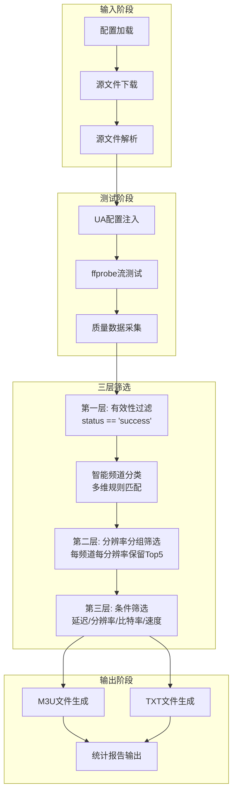

**流水线的六个核心步骤为**：

| 步骤 | 方法 | 职责 | 关键产出 |
|------|------|------|----------|
| 步骤1 | `source_manager.download_all_sources()` | 多源并发下载，支持直连/代理/GitHub | 原始源文件集合 |
| 步骤2 | `source_manager.parse_all_files()` | M3U/TXT 格式解析，URL 安全审查 | 结构化源数据列表 |
| 步骤3 | `stream_tester.test_all_sources(sources)` | ffprobe 并发测试，提取分辨率/编码/比特率等 | 带质量标注的源数据 |
| 步骤4 | `hierarchical_filtering(results)` | 三层阶梯筛选 + 智能分类 | 三组不同粒度的源集合 |
| 步骤5 | `M3UGenerator` 多级生成 | 基础/高级两类播放列表 | .m3u + .txt 文件对 |
| 步骤6 | `enhanced_output_statistics()` | 分层统计、媒体类型分析、分类汇总 | 控制台统计报告 |

Sources: [manager.py](app/manager.py#L614-L797), [manager.py](app/manager.py#L996-L1050)

---

### 三层分层筛选机制

分层筛选是 `EnhancedLiveSourceManager` 最核心的设计模式。它不追求"一次过滤到最优"，而是通过三个递进层级的门禁，让数据在不同粒度上逐步收敛：

#### 第一层：有效性测试过滤

筛选标准：`source.get('status') == 'success'`

这是最基础的连通性过滤。经过 `StreamTester.test_all_sources()` 测试后，每个源都会被赋予 `status` 字段（success/failed），本层仅保留连通成功的源。这是唯一的**必选层**——无有效源时整个流程终止。

```python
valid_sources = [s for s in sources if s.get('status') == 'success']
```

Sources: [manager.py](app/manager.py#L618-L633)

#### 第二层：分辨率分组筛选（`resolution_based_filtering`）

这是**智能分组+质量排序**的关键层，不同媒体类型使用不同分组策略：

**音频内容（radio/audio）**：按频道名称分组（不区分分辨率），同一电台名称的所有源归为一组。

**视频内容（video）**：按「频道名称_分辨率」作为复合键分组，例如 `CCTV1_1920x1080` 与 `CCTV1_1280x720` 分属不同组。

每组内按多维质量指标降序排列，**保留前 5 个**最佳源：

```python
sorted_sources = sorted(
    group_sources,
    key=lambda x: (
        -(x.get('download_speed', 0) or 0),    # 速度降序
        x.get('response_time', 9999) or 9999,   # 延迟升序
        -(x.get('bitrate', 0) or 0),            # 比特率降序
        x.get('name', '') or '',                # 名称升序（稳定排序）
    ),
)
keep_count = min(5, len(sorted_sources))
```

排序优先级：**下载速度（越大约好）→ 响应延迟（越小越好）→ 比特率（越大约好）→ 名称字典序**。所有排序键都做了 `None` 值防护，避免类型错误。

Sources: [manager.py](app/manager.py#L658-L711)

#### 第三层：条件筛选（`condition_based_filtering`）

本层应用用户配置的质量门禁参数，对每个源逐一检查是否合格。配置参数及默认值如下：

| 参数 | 默认值 | 说明 |
|------|--------|------|
| `max_latency` | 4000 ms | 最大允许延迟，超则淘汰 |
| `min_resolution` | 360p | 最低分辨率要求 |
| `max_resolution` | 4k | 最高分辨率上限 |
| `resolution_filter_mode` | range | 筛选模式：range/min_only/max_only |
| `min_bitrate` | 80 kbps | 最低比特率 |
| `min_speed` | 50 KB/s | 最低下载速度 |
| `must_hd` | False | 是否强制高清 |
| `must_4k` | False | 是否强制 4K |

分辨率检查支持三种模式：
- **range**（默认）：同时满足最低和最高分辨率
- **min_only**：仅检查是否不低于最低分辨率
- **max_only**：仅检查是否不超过最高分辨率

分辨率解析兼容 `1920x1080`（宽x高）和 `1080p`（仅高度，按 16:9 推算宽度）两种格式。

音频内容仅检查延迟，跳过分辨率/比特率/速度检查。

Sources: [config.py](app/config.py#L120-L130), [manager.py](app/manager.py#L713-L795)

---

### 智能频道分类系统

频道分类并非简单的关键词匹配，而是一个**多维度的联合分类体系**，由 `ChannelRules` 规则引擎驱动，`EnhancedLiveSourceManager` 在其上层构建了分类覆盖策略。

#### 六维分类体系

`ChannelRules` 定义了六个独立的分类维度，每个维度有独立的规则集：

| 维度 | 键名 | 示例值 | 说明 |
|------|------|--------|------|
| 内容类型 | `content` | 央视频道、卫视频道、体育频道 | 主分类，用于播放列表分组 |
| 地区 | `region` | 境内、港澳台、国际 | 地理区域归属 |
| 语言 | `language` | 汉语、英语、粤语 | 播出语言 |
| 清晰度 | `quality` | 4K、高清、标清 | 视频质量等级 |
| 媒体类型 | `media_type` | TV、Radio、Online | 内容形态 |
| 流派 | `genre` | 综合、新闻、娱乐 | 内容风格 |

Sources: [rules.py](app/rules.py#L100-L125)

#### 三层联合防御匹配

`content` 维度应用了最严格的三层防御匹配策略，防止省际频道名混淆导致的错误分类：

**第一层 — 高优先级保护**（priority ≤ 5）：
央视频道、港澳台等核心分类被分配最高优先级（数值最小），这些规则匹配的结果**不允许被任何排除映射覆盖**。

**第二层 — 负向排除**：
频道名若仅匹配到负向排除关键词（如"测试"、"未知"、"demo"等），则直接归为"其他频道"。负向排除词库从类级常量和 DB 规则中自动提取。

**第三层 — 普通优先级 + 最长匹配 + 排除映射**：
这是最复杂的匹配层。核心逻辑为：当多个关键词同时匹配同一频道名时（如"湖南"和"湖南卫视"分别匹配湖南频道和卫视频道），系统自动检测**关键词包含关系**——"湖南"是"湖南卫视"的子串，则更长的"湖南卫视"胜出。此外，排除映射（如广东省→广州市、北京市→河北省）防止省际嵌套导致的误分类。

```python
# 长短词覆盖检查示例
# "湖南" → 湖南频道（keyword_len=2）
# "湖南卫视" → 卫视频道（keyword_len=4）
# longer_kw_override["湖南频道"] = "卫视频道"
```

Sources: [rules.py](app/rules.py#L585-L720), [rules.py](app/rules.py#L160-L200)

#### 分类优先级覆盖策略

`enhance_channel_classification()` 方法在 `ChannelRules` 基础上增加了**分类覆盖仲裁**逻辑，使用 `CATEGORY_PRIORITY` 常量和处理规则决定是否用规则引擎的结果覆盖现有分类：

1. **频道全名映射优先**：如果 `channel_name_mapping`（用户手动修正的权威数据）存在且非"其他频道"，则以映射值为准
2. **兜底覆盖**：如果现有分类是"其他频道"，**总是**被覆盖
3. **优先级比较**：基于 `CATEGORY_PRIORITY` 常量的数值比较（数值越小越具体），只有当新分类比旧分类更具体（数值更小）时覆盖
4. **特殊规则**：
   - 频道名含"卫视"且新分类为"卫视频道" → 强制覆盖
   - 频道名含"CCTV"且新分类为"央视频道" → 强制覆盖

```python
CATEGORY_PRIORITY = {
    # Tier 0 — 核心频道
    '央视频道': 1,
    # Tier 1 — 广播/音频
    '收音机': 2, '在线音频': 3,
    # Tier 2 — 特殊区域
    '港澳台': 5,
    # Tier 3 — 卫视频道
    '卫视频道': 10,
    # Tier 4 — 内容频道（同组优先级相同）
    '影视频道': 15, '体育频道': 15, '新闻频道': 15, ...
    # Tier 5 — 地区频道（各省级平级）
    '北京频道': 20, '上海频道': 20, ...
    # Tier 6 — 国际
    '国际频道': 25,
    # Tier 7 — 兜底
    '其他频道': 100,
}
```

Sources: [manager.py](app/manager.py#L46-L95), [manager.py](app/manager.py#L400-L530)

#### 媒体类型智能分类

`classify_media_type()` 方法实现了视频/音频的自动区分，采用**渐进确认**策略：

1. 首先检查 `has_video_stream` 字段——如果明确无视频流，直接判定为音频
2. 其次检查分辨率——如果分辨率极低（宽<100 或 高<100），可能是被误判为视频的音频流
3. 音频流进一步细化为 `radio`（传统广播电台）和 `audio`（网络音频），基于频道名称关键词匹配

```python
radio_keywords = ['radio', '广播', '电台', 'fm', 'am', '交通广播', ...]
audio_keywords = ['music', '音乐', '歌曲', '播客', '有声', '听书', ...]
```

Sources: [manager.py](app/manager.py#L343-L400)

---

### 初始化和组件生命周期

`initialize()` 方法定义了严格的组件初始化序列，任何一步失败都会导致整体初始化中止：

```
初始化序列:
  Config (配置管理器)
    → Logger (日志系统，依赖配置)
      → 全局异常钩子注册
        → Nginx输出目录权限验证
          → ChannelRules (频道规则引擎，依赖数据库)
            → ChannelRules 自测（准确率≥80%通过）
              → SourceManager (源管理器，依赖配置/日志/规则)
                → StreamTester (流测试器，依赖配置/日志)
                  → _initialized = True
```

其中 `SourceManager` 的初始化涉及更复杂的内部子系统构建：共享 aiohttp session 的懒加载、GitHub API Token 注入（环境变量/配置）、在线目录路径解析（从 local_dirs 推导同级 online 目录）、GitHub 条目映射文件的持久化加载。

Sources: [manager.py](app/manager.py#L106-L250)

---

### 定时运行模式

`run_periodic()` 支持以固定间隔循环执行整条处理流水线，替代外部 cron 调度。默认间隔为 3600 秒（1 小时），可通过 `--interval` 参数自定义。每次循环记录 `last_run_time` 和 `last_run_success` 状态，支持外部监控探针查询运行状态。

启动方式：
```bash
# 单次运行
python -m app

# 定时循环（每30分钟）
python -m app --periodic --interval 1800
```

Sources: [manager.py](app/manager.py#L1050-L1090)

---

### 设计要点与边界情况

#### 原子写入保障

播放列表文件写入采用 `先写临时文件 → os.replace()` 两步策略，避免写入中途崩溃导致输出文件损坏。文件权限设置为 0644 确保 Nginx 可读取。

Sources: [manager.py](app/manager.py#L850-L920)

#### 错误传播与回退

- **组件初始化失败**：任何子模块初始化异常都被捕获并记录，返回 `False` 而非抛出异常，便于上层决定是否继续
- **M3U/TXT 生成异常**：当 `M3UGenerator` 生成内容失败时，自动回退到简易备份格式，确保输出目录始终有可用文件
- **规则引擎加载失败**：`ChannelRules` 在数据库加载失败时自动回退到 YAML 文件，YAML 也不存在时使用空规则结构

Sources: [manager.py](app/manager.py#L920-L970), [rules.py](app/manager.py#L330-L380)

#### 统计与可观测性

`enhanced_output_statistics()` 方法在每个处理周期结束时输出详细的统计报告，包含：
- 三个筛选层级的源数量与淘汰率
- 按媒体类型（video/radio/audio）的分布
- 视频分辨率 Top10 排名
- 频道分类分布直方图

所有统计均使用百分比计算，分母为 0 时有安全防护。

Sources: [manager.py](app/manager.py#L970-L996)

---

### 相关页面导航

- [四层架构设计：从基础层到协调层的依赖关系](#ch6) — 理解本模块在整体架构中的位置
- [SourceManager：多源下载、GitHub 源发现与 M3U/TXT 解析](#ch8) — 流水线的步骤1-2，输入阶段核心
- [StreamTester：基于 ffprobe 的并发流测试与质量评估体系](#ch9) — 流水线的步骤3，质量数据来源
- [ChannelRules：数据库驱动的频道分类规则引擎与三层联合防御](#ch10) — 分类系统的底层规则引擎详解
- [M3UGenerator：多级播放列表生成与多维分组策略](#ch11) — 流水线的步骤5，输出阶段核心
- [流测试错误分类引擎：将 ffprobe 错误映射为可读诊断类别](#ch16) — 第一层筛选的错误分类基础

---

<a id="ch8"></a>
## 第8章 SourceManager：多源下载、GitHub 源发现与 M3U/TXT 解析

`SourceManager` 是整个直播源管理引擎的**数据采集层**，负责三件核心事务：从多种渠道获取源文件（直链 URL、本地目录、GitHub 仓库发现）、解析 M3U/TXT 格式提取频道信息、以及为每个源注入合适的 User-Agent。它定义了从原始内容到结构化频道数据的第一次转换契约。

Sources: [source_manager.py](app/source_manager.py#L1-L12)

### 第一性原理：数据采集层的职责边界

理解 `SourceManager` 的前提是理解它在完整流水线中的位置：

```mermaid
flowchart LR
    subgraph Raw["原始数据源"]
        U[直链 URL]
        G[GitHub 仓库]
        L[本地文件]
    end

    subgraph SM["SourceManager 数据采集层"]
        DL[多源下载<br/>download_all_sources]
        GH[GitHub 发现<br/>_discover_github_source_urls]
        PS[文件解析<br/>parse_all_files / parse_file]
        UA[UA 注入<br/>apply_ua_settings]
    end

    subgraph OUT["输出产物"]
        FD[已下载文件<br/>→ online_dir]
        SC[结构化频道数据<br/>→ list[dict]]
    end

    U --> DL
    G --> GH --> DL
    L --> PS
    DL --> FD --> PS
    PS --> UA --> SC
```

`SourceManager` 的输出（结构化的 `list[dict]`）是后续 `StreamTester`（流测试）和 `M3UGenerator`（播放列表生成）的唯一输入。它不关心源是否可达（那是测试层的职责），也不关心输出格式（那是生成层的职责）——它的关注点仅仅在于**能否从原始数据中提取出结构化的频道信息**。

Sources: [source_manager.py](app/source_manager.py#L54-L78)

### 构造注入与配置派生

`SourceManager` 在构造时接收三个依赖（config、logger、channel_rules），并通过 `config` 对象的便捷方法派生出运行时所需的全部配置：

```python
self.network_config = config.get_network_config()      # 代理/IPv6/GitHub镜像
self.github_config   = config.get_github_config()       # API URL/Token/限速
self.user_agents     = config.get_user_agents()         # 文件级UA映射
```

Sources: [source_manager.py](app/source_manager.py#L66-L71)

**`online_dir` 的派生逻辑**值得特别注意。它从 `Sources.local_dirs` 配置项的第一个值出发，取其父目录，挂上 `online` 子目录名。若 `local_dirs` 为空或为空字符串，则回退到项目根下的 `config/online/`。这个设计兼容了 Docker 部署（路径挂载）与本地开发的路径差异，同时保证了与 Web 层 `sources.py` 路由中 `_get_online_file_path()` 的一致性。

Sources: [source_manager.py](app/source_manager.py#L80-L89)

此外，构造阶段还会从 `GitHub.api_token` 配置或 `GITHUB_TOKEN` 环境变量中加载 API Token，并确保 `online_dir` 目录存在。

Sources: [source_manager.py](app/source_manager.py#L94-L102)

### 共享 Session 生命周期管理

`SourceManager` 内部维护一个共享的 `aiohttp.ClientSession` 实例（`self._session`），避免为每个 HTTP 请求重复创建和销毁 session。这是性能优化的关键——TCP 连接复用（keep-alive）在大规模下载场景下能显著降低延迟。

设计细节：

- **线程安全的懒初始化**：通过 `self._session_lock`（`threading.Lock`）实现双重检查锁定模式（Double-Checked Locking），确保异步上下文中的并发安全。
  Sources: [source_manager.py](app/source_manager.py#L149-L199)

- **代理支持**：根据 `network_config` 配置，可选择创建 `aiohttp_socks.ProxyConnector`（SOCKS5 代理）或标准的 `aiohttp.TCPConnector`（HTTP 直连/HTTP 代理）。所有连接器关闭 SSL 验证（`verify_ssl=False`）并设置连接池上限（`limit=100`）。
  Sources: [source_manager.py](app/source_manager.py#L168-L195)

- **超时策略**：全局超时配置为 `total=60s, connect=30s, sock_read=30s`，GitHub 源的下载会进一步放宽到 `total=120s, connect=60s`。
  Sources: [source_manager.py](app/source_manager.py#L161-L166, L518-L526)

- **显式关闭**：`close()` 方法负责关闭共享 session，通常在 `EnhancedLiveSourceManager` 的析构流程中调用。
  Sources: [source_manager.py](app/source_manager.py#L1067-L1076)

### 多策略下载与重试机制

#### 「窄门禁」—— 下载前的第一道安全屏障

在发起任何 HTTP 请求之前，`download_with_retry` 会先调用 `security.is_static_safe(url)` 进行解析阶段的 **窄门禁** 安全审查。这个「窄门」的设计哲学非常克制——只做三件事：

1. **协议白名单**：仅放行 `http/https/rtmp/rtsp/rtp`
2. **主机格式合法性**：拒绝无效的主机名
3. **SSRF 防护**：拒绝 `localhost`、私有 IP、回环地址和链路本地地址

它故意**不做** DNS 解析验证、XSS/命令注入检测、域名黑白名单和境外流媒体拦截——因为这些检查要么应在运行时由 `StreamTester` 判定（可达性），要么属于内容策略不应在采集阶段静默丢弃。

Sources: [source_manager.py](app/source_manager.py#L455-L459), [security.py](app/security.py#L416-L468)

#### 下载策略链

根据 `method` 参数（`raw/api/proxy/mirror`），`download_with_retry` 构建一个策略链，按顺序尝试直到成功：

| method | 策略链（顺序尝试） | 适用场景 |
|--------|--------------------|----------|
| `raw`（默认） | direct → proxy | 直连优先，失败回退代理 |
| `proxy` | proxy → direct | 代理优先，失败回退直连 |
| `api` | api_direct → api_proxy | GitHub API 直连，失败走代理 |
| `mirror` | mirror（仅直连） | 镜像站本身可直连 |

Sources: [source_manager.py](app/source_manager.py#L461-L499)

#### 文件命名与持久化

下载的内容通过 `aiofiles` 异步写入到 `online_dir`，文件名由 `get_filename_from_url()` 从 URL 中提取：取 URL 路径的最后一段（不带查询参数），过滤掉不安全字符。若文件名不含扩展名，则使用 URL 的 MD5 前 8 位作为回退方案。

Sources: [source_manager.py](app/source_manager.py#L568-L592)

### GitHub 仓库源发现引擎

#### 条目格式规范

用户通过 `Sources.github_sources` 配置 GitHub 条目，支持四种粒度格式：

| 格式 | 示例 | 行为 |
|------|------|------|
| `owner/repo` | `wcb1969/iptv` | API 获取默认分支，递归扫描文件树 |
| `owner/repo/branch` | `wcb1969/iptv/main` | 指定分支，API 扫描文件树 |
| `owner/repo/branch/path` | `wcb1969/iptv/main/live.m3u` | 直接构建 URL，不打 API |

Sources: [source_manager.py](app/source_manager.py#L282-L338)

#### 文件树扫描逻辑

对于需要 API 探测的条目，`_find_source_files_in_repo()` 执行以下步骤：

1. **获取默认分支**（如果未指定 branch）：调用 `GET /repos/{owner}/{repo}` 获取 `default_branch`
   Sources: [source_manager.py](app/source_manager.py#L396-L403)

2. **获取递归文件树**：调用 `GET /repos/{owner}/{repo}/git/trees/{branch}?recursive=1` 获取全部文件列表
   Sources: [source_manager.py](app/source_manager.py#L406-L411)

3. **按扩展名筛选**：只保留 `.m3u`、`.m3u8`、`.txt` 文件
   Sources: [source_manager.py](app/source_manager.py#L422-L432)

4. **排除非源文件**：名字为 `README`、`LICENSE`、`CHANGELOG` 等非源文件名的文件被排除
   Sources: [source_manager.py](app/source_manager.py#L415-L421)

5. **构建下载 URL**：根据 method 参数，调用 `_build_github_download_url()` 生成最终的下载链接
   Sources: [source_manager.py](app/source_manager.py#L340-L366)

#### 下载方式映射

每个 GitHub 条目可关联一个下载方式，通过 `github_download_methods` 参数传入（`{entry: method}`）。四种方式对应不同的 URL 构造规则：

| 方式 | URL 模式 |
|------|----------|
| `raw` | `https://raw.githubusercontent.com/{owner}/{repo}/{branch}/{path}` |
| `api` | `https://api.github.com/repos/{owner}/{repo}/contents/{path}?ref={branch}`（加 `Accept: application/vnd.github.v3.raw` 头） |
| `proxy` | 同上 raw URL（策略链优先走代理） |
| `mirror` | `{mirror_url}/https://raw.githubusercontent.com/{owner}/{repo}/{branch}/{path}` |

Sources: [source_manager.py](app/source_manager.py#L340-L366)

#### GitHub API Token 集成

若配置了 `GitHub.api_token` 或环境变量 `GITHUB_TOKEN`，则所有 GitHub API 请求和文件下载请求都会注入 `Authorization` 头。API 请求使用 `token {token}` 格式（OAuth2 兼容），raw 文件下载使用 `Bearer {token}` 格式。这能显著提高 GitHub API 的速率限制（从匿名 60 req/h 提升到 5000 req/h）。

Sources: [source_manager.py](app/source_manager.py#L94-L99, L532-L535)

### 批量下载调度

`download_all_sources()` 是下载流程的入口方法，它：

1. 从配置读取 `online_urls`（直链列表）和 `github_sources`（GitHub 条目）
2. 调用 `_discover_github_source_urls()` 将 GitHub 条目展开为具体 URL
3. 将直链和 GitHub URL **混合**成统一的下载任务列表
4. **分批并行执行**：每批 3 个任务，通过 `asyncio.gather()` 并发下载
5. 批次间休眠 1 秒以避免请求过于密集
6. 下载成功后记录 GitHub 条目→文件名的映射关系（持久化到 `.github_entry_map.json`，供后续文件级 UA 精确匹配）

Sources: [source_manager.py](app/source_manager.py#L201-L280)

### M3U/TXT 解析引擎

#### 编码嗅探

`_read_file_with_encoding()` 按顺序尝试 `utf-8`、`gbk`、`gb2312`、`latin1`、`iso-8859-1` 五种编码读取文件，全部失败后以 `utf-8` 加 `errors='ignore'` 兜底读取。这种策略确保了即使源文件编码不规范，解析也不中断。

Sources: [source_manager.py](app/source_manager.py#L958-L983)

#### EXTINF 格式解析

`parse_file()` 是解析的核心方法，逐行扫描文件内容，按状态机方式处理。它处理三种行类型：

**1. `#EXTINF:` 行**（带元数据的频道）：
解析 `tvg-logo=`、`group-title=`、`http-user-agent=`、`http-referrer=` 等属性，提取频道名称（逗号后的内容），然后跳过中间的所有 `#EXTVLCOPT:` 指令行（提取其中的 `http-user-agent` 和 `http-referrer`），直到遇到下一行非注释 URL。

Sources: [source_manager.py](app/source_manager.py#L822-L907)

**2. 简单 URL 行**（无元数据的频道）：
直接使用 `Channel from {文件名}` 作为默认频道名，不设置图标和分组信息。

Sources: [source_manager.py](app/source_manager.py#L909-L952)

**3. `#EXTM3U` 文件头** 和 **其他注释**：
直接跳过。

#### 数据增强与频道分类

在构建每个源的 `source_data` 字典时，`parse_file()` 会调用 `channel_rules.extract_channel_info()` 和 `channel_rules.determine_category()` 对频道名称进行分类和地区/语言推导。这些信息在后续的 `StreamTester` 测试结果合并和 `M3UGenerator` 分组输出中会被使用。

Sources: [source_manager.py](app/source_manager.py#L884-L900)

#### 解析阶段的「窄门禁」

解析过程中，每个被提取的 URL 都会经过 `is_static_safe()` 的窄门禁审查。被排除的 URL 会被记录到 `exclusions` 列表中（通过引用累积），最终汇总到 `self.last_parse_exclusion_summary` 中。这个设计确保了被静默丢弃的源**完全可见**——Web UI 可以读取该字段展示给用户。

Sources: [source_manager.py](app/source_manager.py#L867-L878, L623-L627)

#### 入口与可见性

`parse_all_files()` 是解析的入口，它先调用 `parse_local_files()` 遍历 `local_dirs` 中的所有 `.m3u/.m3u8/.txt` 文件，再解析 `online_dir` 中的所有已下载文件。最后汇总排除记录，生成 `self.last_parse_exclusion_summary` 供消费。

`parse_local_files()` 同时支持目录和单个文件路径输入——这意味着 `local_dirs` 配置中允许混入具体的源文件路径（如 `./www/output/live.m3u`），框架会自动判断输入是目录还是文件。

Sources: [source_manager.py](app/source_manager.py#L594-L628, L715-L760)

### UA 注入机制

`apply_ua_settings()` 在 `parse_all_files()` 之后调用，从 SQLite 读取文件级 UA 设置和频道级 UA 覆盖，并将其注入到已解析的源数据中。优先级从高到低为：

```
URL内联 UA  >  #EXTVLCOPT UA  >  EXTINF属性 UA  >  频道级覆盖  >  文件级设置
```

文件级 UA 的键名格式为：
- 直链 URL：`online:{完整URL}`
- 本地文件：`local:{文件路径}`
- GitHub 源：`github:{仓库条目}`

其中 GitHub 源的映射需要 `_github_entry_map.json` 的支持——因为 GitHub 条目在下载时展开为多个文件，需要通过持久化的映射表将文件级 UA 设置正确应用到下载后的文件名上。

Sources: [source_manager.py](app/source_manager.py#L650-L713)

### 异常联动

`SourceManager` 使用的异常都继承自 `LsmError` 体系：

| 异常类 | 错误码 | 触发场景 |
|--------|--------|----------|
| `SourceDownloadError` | 3002 | HTTP 非 200/连接超时/网络错误 |
| `SourceParseError` | 3003 | 文件不可读/编码解码失败 |

Sources: [source_manager.py](app/source_manager.py#L555-L563), [exceptions.py](app/exceptions.py#L114-L139)

当所有下载策略均失败时，`download_with_retry` 静默返回 `None`，由调用方 `download_all_sources` 通过 `asyncio.gather(return_exceptions=True)` 统一收集失败信息并记录日志。

Sources: [source_manager.py](app/source_manager.py#L255-L266, L496-L499)

### 关键设计决策对照

| 维度 | 选择 | 替代方案 | 理由 |
|------|------|----------|------|
| HTTP 库 | aiohttp（异步） | requests（同步） | 与下层的 asyncio 事件循环兼容，高并发场景性能更好 |
| 代理协议 | SOCKS5（优先） + HTTP | 仅 HTTP | SOCKS5 对 UDP/TCP 流媒体更友好 |
| 安全审查策略 | 窄门禁（仅 SSRF + 协议/格式） | 全量安全检查 | 避免在解析阶段误杀合法源；DNS/黑白名单应在运行时判定 |
| 文件名生成 | URL 路径末段 | UUID 随机名 | URL 末段通常是语义化的文件名（如 `livetv.m3u`），便于溯源 |
| 编码解码 | 多编码依次尝试 | 仅 utf-8 | 国内源文件常见 GBK/GB2312 编码，单一编码会大量失败 |
| Session 管理 | 共享 session + 线程安全单例 | 每次请求新建 | 复用 TCP 连接，减少握手开销，提高下载吞吐量 |
| GitHub 发现粒度 | 条目级（扫描文件树） | 手动逐个 URL | 用户只需配置仓库名，自动发现所有源文件，降低配置负担 |

### 下一站定位

理解 `SourceManager` 是理解完整数据流水线的第一步。接下来建议按顺序阅读：

- **[EnhancedLiveSourceManager：分层筛选处理流程与频道智能分类](#ch7)** — 了解 `SourceManager` 的输出如何在协调层被消费，以及如何与 `StreamTester`、`M3UGenerator` 组合成完整流水线。
- **[StreamTester：基于 ffprobe 的并发流测试与质量评估体系](#ch9)** — 解析后的源数据将在这里被逐一测试可达性和质量。
- **[URL 安全审查：域名黑名单、XSS/命令注入/路径遍历检测](#ch14)** — 深入了解窄门禁背后的完整安全体系，以及为什么下载和解析阶段只取安全审查的子集。
- **[M3UGenerator：多级播放列表生成与多维分组策略](#ch11)** — 看看经过测试和筛选的频道数据最终如何被组织成可播放的 M3U 文件。

---

<a id="ch9"></a>
## 第9章 StreamTester：基于 ffprobe 的并发流测试与质量评估体系

`StreamTester` 是 `app/stream_tester.py` 中定义的流媒体源测试引擎，是整个系统的**质量把关节点**。它接收来自 `SourceManager` 解析后的原始源列表，通过 ffprobe 子进程对每个流进行连通性验证、元数据提取、速度测试和质量评级，最终输出带 `is_qualified` 标记的结构化结果，供 `M3UGenerator` 筛选输出。

该模块对标 Guovin/iptv-api 的 P0/P1/P2 级性能优化，实现了五个层次的工程化增强：**并发控制**（Semaphore 限流 + 看门狗超时保护）、**智能缓存**（URL 缓存 + 同 Host 测速复用）、**容错机制**（指数退避重试 + 失败源冻结冷却）、**质量防御**（广告检测 + 全局黑白名单）、**实时监控**（Web 层中断控制 + WebSocket 推送）。

Sources: [stream_tester.py](app/stream_tester.py#L1-L12)

---

### 一、整体架构与分层职责

```
┌──────────────────────────────────────────────────────────────────┐
│                        StreamTester 架构图                         │
├──────────────────────────────────────────────────────────────────┤
│                                                                   │
│  ┌──────────────┐    ┌──────────────────┐   ┌──────────────────┐ │
│  │  Config      │───>│  StreamTester    │──>│  测试结果列表     │ │
│  │  (SQLite)    │    │  (核心引擎)       │   │  (dict with      │ │
│  │              │    │                  │   │   is_qualified)  │ │
│  └──────────────┘    └────────┬─────────┘   └──────────────────┘ │
│                               │                                   │
│                               ▼                                   │
│  ┌─────────────────────────────────────────────────────────────┐ │
│  │                    内部子系统                                │ │
│  │                                                             │ │
│  │  ┌──────────────┐  ┌──────────────┐  ┌──────────────────┐  │ │
│  │  │ ffprobe 发现  │  │ 并发控制      │  │ 细化超时层级      │  │ │
│  │  │ 与验证        │  │ ThreadPool   │  │ connect/read/   │  │ │
│  │  │ (5层搜索)    │  │ + Semaphore  │  │ probe timeout   │  │ │
│  │  └──────────────┘  └──────────────┘  └──────────────────┘  │ │
│  │                                                             │ │
│  │  ┌──────────────┐  ┌──────────────┐  ┌──────────────────┐  │ │
│  │  │ P0 性能优化   │  │ P1/P2 质量    │  │ 缓存系统          │  │ │
│  │  │ 同Host复用   │  │ 广告检测      │  │ URL缓存          │  │ │
│  │  │ 失败冻结冷却  │  │ 黑白名单      │  │ Host缓存         │  │ │
│  │  └──────────────┘  └──────────────┘  └──────────────────┘  │ │
│  └─────────────────────────────────────────────────────────────┘ │
└──────────────────────────────────────────────────────────────────┘
```

`StreamTester` 的初始化流程依次完成：配置加载 → ffprobe 验证 → 超时参数计算 → 并发控制初始化 → 缓存与冻结状态恢复。全部状态初始化在 `__init__` 中完成，ffprobe 可用性通过类级缓存避免重复验证。

Sources: [stream_tester.py](app/stream_tester.py#L172-L253)

---

### 二、ffprobe 发现与验证（五层搜索策略）

`_find_executable` 静态方法实现了五层递进的 ffprobe/ffmpeg 搜索策略。这是系统启动时的重要前提：没有 ffprobe 或 ffmpeg，后续所有流测试将返回 `no_probe_tool_available` 的降级结果。

| 搜索优先级 | 搜索位置 | 适用场景 |
|---|---|---|
| 1 | `tools/ffmpeg/` 项目本地目录 | Docker 构建时静态编译 ffmpeg 放入 |
| 2 | 系统 PATH 环境变量 | 系统级安装的 ffmpeg |
| 3 | 常见安装目录（Windows） | 手动安装到 Program Files |
| 4 | `imageio-ffmpeg` pip 包 | Python 生态的 ffmpeg 分发（仅 ffmpeg） |
| 5 | `static_ffmpeg` pip 包 | 纯 Python 静态绑定（ffmpeg + ffprobe） |

`_verify_ffprobe` 方法在验证 ffprobe 可用性的同时，还会额外执行 `ffprobe -h full` 探测 `-rw_timeout` 参数支持情况。这是一项关键兼容性适配：较新版本的 ffprobe 支持独立的读取超时设置，老版本则只支持 `-timeout` 控制连接超时。`_ffprobe_supports_rw_timeout` 标志位决定 `test_stream_url` 中是否插入 `-rw_timeout` 参数。

若 ffprobe 完全不可用但 ffmpeg 存在，系统自动降级使用 ffmpeg `-i` 模式测试连通性——代价是**无法提取元数据**（分辨率、编码等），仅返回 `probe_mode: ffmpeg_fallback` 标志。

Sources: [stream_tester.py](app/stream_tester.py#L114-L381)

---

### 三、并发控制体系

#### 3.1 三层并发限制

系统实现了三层递进式的并发控制，防止 ffprobe 子进程耗尽系统资源：

```
ThreadPoolExecutor (max_workers, 默认 40)
        │
        │  提交的任务由线程池调度
        ▼
Semaphore (max_concurrent_ffprobe, 默认 4)
        │
        │  实际控制 ffprobe 子进程并发数
        ▼
subprocess.Popen → 系统进程调度
        │
        │ 看门狗定时器 (watchdog_timeout = timeout × 2)
        ▼
主动取消（future.cancel + Semaphore.release）
```

**第一层：ThreadPoolExecutor** — 任务分发层。`test_all_sources` 通过 `concurrent.futures.ThreadPoolExecutor` 提交所有源的测试任务，默认最大工作线程为 40。但系统会在启动时自动计算最优并发数：

```python
optimal = min(config_workers, cpu_cores * 4, 50)
```

此外还有一个**动态调整机制**：如果计算出的 max_workers 超过 `ffprobe_semaphore` 上限的两倍，自动压缩至 `ffprobe_max × 1.5`，避免大量线程阻塞在 Semaphore.acquire() 上造成资源浪费。

Sources: [stream_tester.py](app/stream_tester.py#L413-L420)

**第二层：Semaphore** — 实际限流层。默认只允许 4 个 ffprobe 子进程同时运行。Semaphore 作用于 `_ffprobe_semaphore` 上下文管理器内，确保只有拿到信号量的线程才执行 `subprocess.Popen`。这是最关键的限制层，因为每个 ffprobe 进程可能消耗数百 MB 内存。

Sources: [stream_tester.py](app/stream_tester.py#L218-L220)

**第三层：看门狗定时器** — 全局安全阀。`_start_watchdog` 在批量测试开始前启动一个 `threading.Timer`，超时时间 = `timeout × 2`。如果批量测试整体耗时超过看门狗阈值，`_watchdog_timeout_handler` 会遍历所有活跃的 Future 调用 `cancel()`，并释放对应的 Semaphore 许可证，防止死锁。这是一个**关键修复**（原文标注 P1-2）：早期版本中看门狗只记录日志而不取消 Future，导致 Semaphore 永远无法释放。

Sources: [stream_tester.py](app/stream_tester.py#L930-L970)

#### 3.2 实时测试中断机制

Web 层的「暂停/取消」操作通过两个组件协同实现：

- `_abort`：`threading.Event()` 标志位。`test_stream_url` 在执行 ffprobe 的关键路径上多处检查 `_abort.is_set()`，命中时立即返回 `interrupted` 状态。
- `_active_procs`：列表记录所有当前活跃的 `subprocess.Popen` 实例。`terminate_active_procs()` 通过 psutil 库递归杀掉进程树（父 + 子进程），确保管道立即关闭，避免 `proc.communicate()` 阻塞。

`_kill_proc_tree` 的**进程树级终止**是解决「暂停不立即生效」根因的关键：ffprobe 可能派生子进程继承 stdout/stderr 管道，仅 terminate 父进程时子进程仍持有管道，导致调用方阻塞在 `communicate()` 直到超时。

Sources: [stream_tester.py](app/stream_tester.py#L258-L302)

---

### 四、细化超时层级

传统单超时无法区分「连接阻塞」和「数据读取阻塞」，导致诊断模糊。StreamTester 将此拆分为三个独立的超时控制参数：

| 超时层级 | 配置键 | 默认值 | ffprobe 映射 |
|---|---|---|---|
| 连接超时 | `connect_timeout` | 8s | `-timeout`（微秒） |
| 读取超时 | `read_timeout` | 10s | `-rw_timeout`（微秒，需版本支持） |
| 探测超时 | `ffprobe_timeout` | 同 `timeout` | `proc.communicate(timeout=...)` |

三层超时在 `test_stream_url` 中落地为：

```python
connect_us = int(connect_timeout * 1_000_000)  # 秒→微秒
cmd = [ffprobe_cmd, ..., '-timeout', str(connect_us), url]
if self._ffprobe_supports_rw_timeout:
    cmd.insert(-1, '-rw_timeout', str(read_us))
```

`-timeout` 在 ffprobe 中控制**套接字连接和单次 I/O** 的最长等待时间（微秒），而 `proc.communicate(timeout=probe_timeout+2)` 控制整个 ffprobe 进程的运行时长上限，两者构成一个**保护层级**。

Sources: [stream_tester.py](app/stream_tester.py#L208-L211, L762-L788)

---

### 五、P0 性能优化（对标 Guovin/iptv-api）

#### 5.1 同 Host 测速复用

典型直播源场景中，同一 CDN/Host 下可能有数十个频道（如 `live.abc.com/cctv1`、`live.abc.com/cctv2`）。逐个 ffprobe 是巨大的浪费。`enable_host_speed_share` 启用后：

1. 测试前通过 `_extract_host(url)` 提取 URL 的 netloc 作为分组键
2. 测试成功时调用 `_cache_host_result(host, result)` 缓存结果
3. 后续同 Host 源的 `test_single_stream` 直接复用缓存的元数据与响应时间
4. 仅成功态才缓存，避免**死 Host 复用扩散**

这一优化可将 ffprobe 子进程调用量降低一个数量级。

Sources: [stream_tester.py](app/stream_tester.py#L227-L231, L641-L646, L1578-L1621)

#### 5.2 失败源指数退避冻结

连续失败的源按 `2^n × base_seconds` 的指数退避策略自动冻结冷却，避免每次全量重测死源浪费资源。

**冻结流程**：

```
test_single_stream 失败
        │
        ▼
_record_failure(url_norm)
    fail_count += 1
        │
        ▼
fail_count >= freeze_fail_threshold (默认 3)?
        │
    ┌───┴───┐
   YES      NO
    │       仅更新计数
    ▼
frozen_until = now + min(2^fail_count × base, max_hours)
    ▲ 冷却中跳过的源返回 status='frozen'
    ▲ 冻结局不解冻、不计入死源失败
```

**解冻机制**：
- 源测试成功 → `_record_success` → 完全解除冻结并清零失败计数
- 冻结时间到期 → `_check_frozen` 在超时时自动删除条目并返回 None
- 广告源被降级为 failed 但**不计入**冻结失败计数，避免误伤

**跨进程持久化**：冻结状态以 JSON 格式保存在 `web/data/status/frozen_sources.json`，进程重启后可通过 `_load_frozen_map` 恢复。`_save_frozen_map` 仅在 `test_all_sources` 结束时调用一次，避免频繁磁盘 IO。

Sources: [stream_tester.py](app/stream_tester.py#L233-L241, L608-L620, L1681-L1703)

---

### 六、P1/P2 质量检测与防御

#### 6.1 广告/循环占位源检测

`_detect_ad_playlist` 对标 Guovin/iptv-api 的 `is_ad_playlist`，仅对 HLS（`.m3u8`）源生效。检测策略分两步：

1. **关键字匹配**：拉取 playlist 头部 64KB 内容，检查是否包含 `ad_keywords` 列表中的条目（默认值：`no_signal, /ad/, advertisement, 测试卡, 无信号, test_pattern, colorbar, broadcast_test, signal_lost`）
2. **循环占位判定**：若 playlist 包含 `#EXT-X-ENDLIST`（VOD/点播标志）且所有分片累计时长 ≤ `ad_max_duration`（默认 90秒），判定为循环占位源

被判定为广告的源不会解除冻结、不计入死源失败计数，状态标记为 `is_ad: true` 和 `error_reason: ad_playlist`。

Sources: [stream_tester.py](app/stream_tester.py#L243-L246, L688-L698, L1734-L1783)

#### 6.2 全局黑白名单

黑白名单在 `test_single_stream` 的最优先位置检查（早于缓存检查）。匹配规则支持两种模式：

- **host 精确匹配**：提取 URL 的 netloc 与名单条目比较
- **子串包含匹配**：URL 原文（大小写不敏感）是否包含名单条目

白名单优先级高于黑名单：命中白名单的源即使也在黑名单中，也会正常测试。

Sources: [stream_tester.py](app/stream_tester.py#L593-L605, L1720-L1732)

---

### 七、测试执行流程详解

#### test_single_stream 的完整执行链路

```
test_single_stream(source)
    │
    ├─ 1. 全局黑白名单检查
    │   └─ 黑名单命中 → return {status: 'blacklisted'}
    │
    ├─ 2. 失败源冻结检查
    │   └─ 冻结中 → return {status: 'frozen'}
    │
    ├─ 3. URL 缓存检查
    │   └─ 命中未过期 → return cached result
    │
    ├─ 4. 网络兼容性检查（IPv6 检测）
    │   └─ 不兼容 → return {status: 'failed', reason: 'network_incompatible'}
    │
    ├─ 5. 同 Host 缓存检查
    │   └─ 命中未过期 → return host_cached result
    │
    └─ 6. 指数退避重试循环（max_retries + 1 次）
        │
        ├─ test_stream_url(url)
        │   ├─ 优先 ffprobe → JSON metadata
        │   ├─ 降级 ffmpeg → basic connectivity
        │   └─ 失败 → _classify_stream_error()
        │
        ├─ 成功 → 速度测试（可选）
        │       → 广告检测（m3u8 源）
        │       → 写入 URL 缓存
        │       → 写入 Host 缓存
        │       → 解除冻结（_record_success）
        │       → return {status: 'success', metadata}
        │
        └─ 全失败 → 记录失败（_record_failure）
                 → return {status: 'failed', error_reason}
```

#### 指数退避重试逻辑

```python
for attempt in range(max_retries + 1):
    if attempt > 0:
        backoff = (2 ** attempt) * 0.5  # 1s, 2s, 4s...
        time.sleep(backoff)
    test_status, metadata = test_stream_url(...)
    if test_status == 'success':
        # 处理成功
        break
    # 继续重试
```

`max_retries` 由配置 `max_test_attempts` 决定：值 `1` = 不重试，值 `2` = 最多重试 1 次。钳制范围 `[1, 2]`。

Sources: [stream_tester.py](app/stream_tester.py#L200-L206, L588-L732)

---

### 八、元数据提取体系

`extract_metadata` 方法将 ffprobe 的 JSON 输出解析为结构化元数据字典，覆盖视频和音频两个维度：

```python
{
    # 基础信息
    'bitrate': int,       # kbps
    'duration': float,    # 秒
    'format_name': str,   # 如 mpegts, hls
    # 视频流
    'resolution': str,     # 如 "1920x1080"
    'is_hd': bool,         # height >= 720
    'is_4k': bool,         # height >= 2160
    'video_codec': str,    # 如 h264, hevc
    'video_profile': str,  # 如 High, Main
    'video_level': int,    # 编码级别
    'frame_rate': float,   # 帧率
    'pixel_format': str,   # 如 yuv420p
    'has_video_stream': bool,
    # 音频流
    'audio_codec': str,        # 如 aac, mp3
    'audio_sample_rate': int,  # Hz
    'audio_channels': int,     # 如 2（立体声）
    'audio_bitrate': int,      # kbps
    'has_audio_stream': bool,
    # 统计
    'stream_count': int,
    'video_stream_count': int,
    'audio_stream_count': int,
    # 媒体类型（后续计算）
    'media_type': str,    # video / audio / radio
}
```

`_determine_media_type` 根据元数据判断最终类型：
- 无视频流 → `audio`
- 分辨率宽 < 100 或高 < 100 → `audio`（误判防护）
- 正常 → `video`

Sources: [stream_tester.py](app/stream_tester.py#L972-L1191)

---

### 九、质量合格性评估

`check_if_qualified` 实现四层质量检查，最终返回 `is_qualified` 布尔值。不合格的源在后续 M3U 生成阶段会被排除：

| 检查层级 | 检查项 | 配置参数 | 默认值 |
|---|---|---|---|
| 1. 状态检查 | status != 'success' 直接淘汰 | — | — |
| 2. 延迟检查 | response_time ≤ max_latency | `Filter.max_latency` | 4000ms |
| 3. 分辨率检查 | 区间/仅最低/仅最高模式 | `Filter.min_resolution`, `max_resolution` | 360p ~ 4k |
| 4. 比特率检查 | bitrate ≥ min_bitrate | `Filter.min_bitrate` | 80 kbps |
| 5. 特殊要求 | 必须 HD / 必须 4K | `Filter.must_hd`, `must_4k` | False |
| 6. 速度检查 | download_speed ≥ min_speed | `Filter.min_speed` | 50 KB/s |

分辨率比较的 `parse_resolution` 同时支持 `"1920x1080"` 和 `"1080p"` 两种格式，后者按 16:9 推算宽度。

音频/radio 源仅执行延迟检查，跳过视频专有指标。

Sources: [stream_tester.py](app/stream_tester.py#L1243-L1314)

---

### 十、错误分类引擎

`_classify_stream_error` 是一个纯函数，将 ffprobe 的 stderr 错误文本映射为可读的诊断类别。这是 [流测试错误分类引擎](#ch16) 的文档页面核心内容，此处仅作引用但不展开。

| 错误类别 | 典型错误文本 | 诊断含义 |
|---|---|---|
| `connection_refused` | `Connection refused`, `error number -111` | 端口关闭或服务未运行 |
| `connection_failed` | `Connection timed out`, `Network unreachable`, `No route to host` | 运营商内网/CDN 不可达 |
| `dns_failed` | `Name or service not known`, `Could not resolve` | DNS 解析失败 |
| `auth_blocked` | `403`, `401`, `Forbidden`, `txSecret` | 防盗链/鉴权过期 |
| `not_found` | `404`, `Not Found`, `No such` | 资源不存在 |
| `ffprobe_error` | 其他未分类错误 | 通用 ffprobe 失败 |

该分类结果被组装到 `error_reason` 字段中返回，并在 Web 前端的实时测试页面中以不同颜色的标签展示。

Sources: [stream_tester.py](app/stream_tester.py#L29-L81)

---

### 十一、缓存系统

系统中存在两个独立的线程安全缓存：

| 缓存类型 | 存储结构 | 生命周期 | 用途 |
|---|---|---|---|
| URL 缓存 | `_url_cache: dict[str, CacheEntry]` | 实例生命周期，TTL 控制 | 同 URL 在单次测试中不被重复测试 |
| Host 缓存 | `_host_speed_cache: dict[str, CacheEntry]` | 实例生命周期，TTL 控制 | 同 Host 仅 ffprobe 一次，其余复用 |

两者均使用 `threading.Lock` 保护并发访问，并实现了定期清理过期条目的机制（`cleanup_cache`）。缓存 TTL 由 `Testing.cache_ttl` 控制，默认 120 分钟。

Sources: [stream_tester.py](app/stream_tester.py#L184-L188, L1506-L1571, L1592-L1621)

---

### 十二、WebSocket 实时测试集成

实时测试页面（`/livetest`）通过 WebSocket 协议与后端通信，实现进度实时推送：

1. 用户点击「开始测试」→ 前端通过 `WebSocket` 连接 `/ws/test`
2. 后端在 `web/routes/sources.py` 中启动异步测试任务
3. 每个源测试完成后，结果通过 WebSocket 推送到前端
4. 前端 JavaScript 更新进度条、统计卡片和结果列表

前端 `CATEGORY_LABELS` 映射表将英文错误类别转为中文标签（如 `connection_failed` → 「连接失败」），并支持按错误类别筛选——点击「失败原因分布」面板中的标签，仅显示该类别的结果行。

Web UI 提供完整的测试控制按钮：
- **▶ 立即测试**：启动全量或按文件测试
- **⏸ 暂停测试**：调用 `abort()` 终止所有活跃子进程，保留已测试结果
- **▶ 继续测试**：调用 `clear_abort()` 清除中断标志，继续未完成测试
- **⏹ 取消测试**：彻底终止

Sources: [livetest.html](web/templates/livetest.html#L1-L200)

---

### 配置参数全景

以下表格汇总 StreamTester 涉及的全部配置参数，默认值取自 `Config._DEFAULT_VALUES`：

| 段落 | 键 | 类型 | 默认值 | 说明 |
|---|---|---|---|---|
| `Testing` | `timeout` | int | 10 | 探测超时（秒） |
| `Testing` | `concurrent_threads` | int | 40 | 线程池最大工作线程 |
| `Testing` | `max_concurrent_ffprobe` | int | 16 | ffprobe 子进程 Semaphore 上限 |
| `Testing` | `cache_ttl` | int | 120 | 缓存有效期（分钟） |
| `Testing` | `enable_speed_test` | bool | True | 是否启用下载速度测试 |
| `Testing` | `speed_test_duration` | int | 6 | 速度测试采样时长（秒） |
| `Testing` | `max_test_attempts` | int | 1 | 总测试次数（1=不重试, 2=重试1次） |
| `Testing` | `enable_host_speed_share` | bool | True | 同 Host 测速复用 |
| `Testing` | `enable_source_freeze` | bool | True | 失败源指数退避冻结 |
| `Testing` | `freeze_fail_threshold` | int | 3 | 连续失败几次后冻结 |
| `Testing` | `freeze_base_seconds` | int | 60 | 退避基数（秒） |
| `Testing` | `freeze_max_hours` | int | 24 | 冻结最大时长（小时） |
| `Testing` | `enable_ad_detect` | bool | True | 广告/循环占位源检测 |
| `Testing` | `ad_keywords` | str | `no_signal,...` | 广告检测关键字列表 |
| `Testing` | `ad_max_duration` | int | 90 | 循环占位最大时长（秒） |
| `Testing` | `global_blacklist` | str | 空 | 全局黑名单（逗号/换行分隔） |
| `Testing` | `global_whitelist` | str | 空 | 全局白名单 |
| `Filter` | `max_latency` | int | 4000 | 最大延迟（ms） |
| `Filter` | `min_bitrate` | int | 80 | 最小比特率（kbps） |
| `Filter` | `min_speed` | int | 50 | 最小下载速度（KB/s） |
| `Filter` | `min_resolution` | str | `360p` | 最低分辨率 |
| `Filter` | `max_resolution` | str | `4k` | 最高分辨率 |
| `Filter` | `resolution_filter_mode` | str | `range` | 分辨率过滤模式 |
| `Filter` | `must_hd` | bool | False | 必须 HD |
| `Filter` | `must_4k` | bool | False | 必须 4K |

Sources: [config.py](app/config.py#L89-L133, L258-L343)

---

### 总结：架构设计原则

`StreamTester` 的设计贯穿了四条核心原则：

1. **防御性编程**：所有子进程操作都有 `finally` 资源清理、`try/except` 兜底、降级路径（ffprobe → ffmpeg → 无工具可用）
2. **分层治理**：并发控制分三层（线程池 + 信号量 + 看门狗），超时控制分三层（连接 + 读取 + 探测），缓存分两层（URL + Host）
3. **渐进式质量评估**：连通性 → 元数据 → 速度 → 合格性，逐层递进，任一环节失败即中止
4. **对标业界方案**：三个 P0/P1/P2 优化直接对标 Guovin/iptv-api 的生产级质量检测策略

在目录结构中，StreamTester 处于**承上启下**的关键位置：上游是 [SourceManager：多源下载、GitHub 源发现与 M3U/TXT 解析](#ch8)，下游是 [M3UGenerator：多级播放列表生成与多维分组策略](11-m3ugenerator-duo-ji-bo-fang-lie-biao-sheng-cheng-yu-duo-wei-fen-zu-ce-lve) 和 [EnhancedLiveSourceManager：分层筛选处理流程与频道智能分类](#ch7)。

感兴趣的读者可以进一步阅读：
- [流测试错误分类引擎](#ch16) — `_classify_stream_error` 的详细分类逻辑
- [WebSocket 实时测试](#ch21) — 实时测试的前后端通信机制
- [RESTful API 全景](#ch22) — 测试启停的 API 接口

---

<a id="ch10"></a>
## 第10章 ChannelRules：数据库驱动的频道分类规则引擎与三层联合防御

### 概述：从 YAML 配置文件到数据库规则引擎的架构演进

ChannelRules 是整个直播源管理器的**分类决策中心**，承担着将原始频道名映射为标准化分类标签的核心职责。它经历了一次重大的架构演进——从早期基于 YAML 文件的规则加载，升级为**数据库驱动的主加载路径**，YAML 文件仅作为回退方案保留。这一演进的核心动机在于：通过 Web 管理后端的规则管理 API 实现规则的动态增删改查，无需重启服务即可热更新分类逻辑。

该模块位于 `app/rules.py`，通过 `from app.rules import ChannelRules` 被 `app/manager.py` 中的 `EnhancedLiveSourceManager` 引用，在初始化阶段注册为唯一的规则引擎实例。

Sources: [app/rules.py](app/rules.py#L1-L50), [app/manager.py](app/manager.py#L130-L145)

---

### 架构总览：多维分类体系

ChannelRules 支持**六维分类体系**，由 `DIMENSIONS` 类变量定义：

```python
DIMENSIONS = ['content', 'region', 'language', 'quality', 'media_type', 'genre']
```

每个维度各自独立维护一组规则，规则存储在 SQLite 数据库的 `classification_rules` 表中，通过 `rule_type` 列区分所属维度。

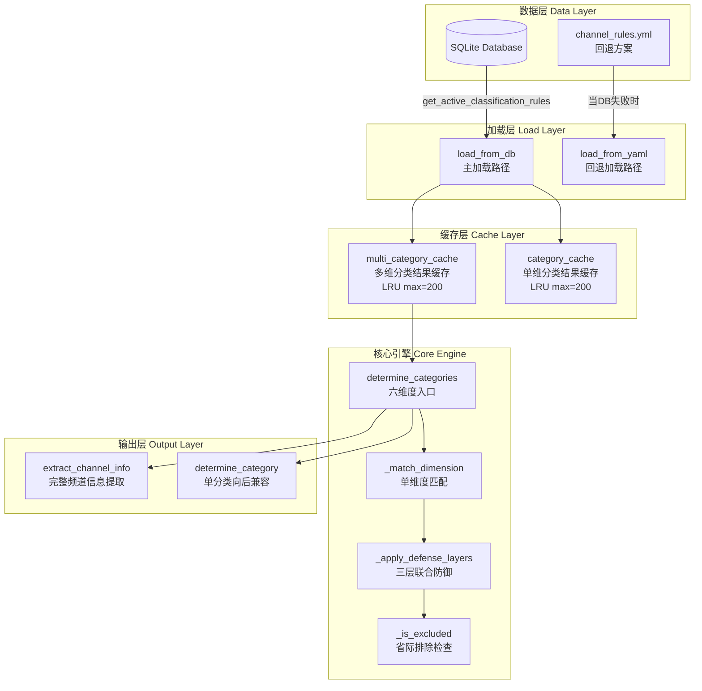

Sources: [app/rules.py](app/rules.py#L70-L120)

---

### 数据库驱动的规则加载体系

#### 表结构与种子数据

规则存储在两张专用表中：

**`classification_rules` 表** — 定义各维度的分类规则：

| 列名 | 类型 | 说明 |
|------|------|------|
| `id` | INTEGER PK | 自增主键 |
| `rule_type` | TEXT | 维度标识：`content`/`region`/`language`/`quality`/`media_type`/`genre` |
| `name` | TEXT | 分类名称，如「央视频道」「体育频道」 |
| `keywords` | TEXT | JSON 数组字符串，如 `["CCTV","央视","中央"]` |
| `priority` | INTEGER | 优先级（数值越小优先级越高，1 最高） |
| `sort_order` | INTEGER | 同优先级下的排序权重 |
| `is_active` | INTEGER | 是否启用（0/1） |

**`province_exclusion_map` 表** — 省际名称排除映射，防止因地名包含关系导致的误分类：

| 列名 | 类型 | 说明 |
|------|------|------|
| `province_keyword` | TEXT | 触发排除的关键词（如「北京」） |
| `excluded_keyword` | TEXT | 被排除的关键词（如「河北」） |
| `note` | TEXT | 注释说明 |

种子数据通过 `app/data/seed_classification_rules.sql` 初始化，仅在表为空时执行。内容覆盖了：

- **content 维度**：55+ 条规则，从央视频道（priority=1）到其他频道（priority=100）
- **media_type 维度**：21 条规则，涵盖视频/音频/电影/体育等
- **region 维度**：层级化地理结构（大洲→国家→省份）
- **province_exclusion_map**：14 条排除映射，处理如「陕西↔山西」「广东↔广西」等字形包含误匹配

Sources: [app/rules.py](app/rules.py#L75-L130), [app/data/seed_classification_rules.sql](app/data/seed_classification_rules.sql#L1-L112)

#### 加载流程与 YAML 回退

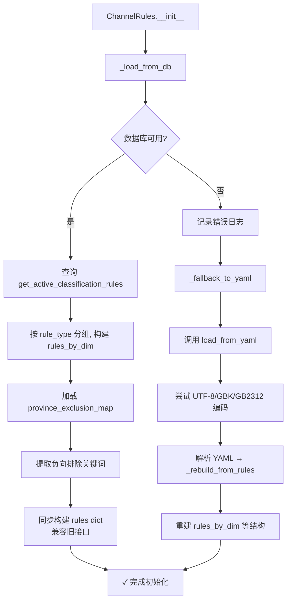

**规则类型兼容映射**：从旧格式到新格式的自动转换：

```python
_RULE_TYPE_MAP = {
    'category': 'content',
    'channel_type': 'media_type',
}
```

Sources: [app/rules.py](app/rules.py#L130-L260)

---

### 三层联合防御：从关键词匹配到智能分类

这是 ChannelRules 最核心的算法设计——针对 content 维度（频道内容分类）的三层递进式防御体系，由 `_apply_defense_layers` 方法实现。该设计的目的是解决中文频道名分类中常见的**多关键词同时匹配**问题。

#### 第一层：高优先级锁定（Priority ≤ 5）

当频道名同时匹配多个分类规则时，优先级 ≤ 5 的规则具有绝对优先权。这确保了：

- **央视频道**（priority=1）：任何包含 CCTV/央视的频道名，不会被其他匹配覆盖
- **收音机**（priority=2）：FM/AM/广播 不会被误归为地区频道
- **在线音频**（priority=3）：有声/听书 类内容优先于地区分类
- **港澳台**（priority=5）：香港/澳门/台湾 的频道不会因包含「湖南」「广东」等词而被归入内地省份

```python
# 第一层：高优先级匹配不允许被排除
high_prio = [m for m in matches if m['priority'] <= 5]
if high_prio:
    return high_prio[0]['name']
```

#### 第二层：负向排除（Negative Filtering）

从类级常量和 rules 中自动提取**宽泛但无信息量的关键词**（如频道名中的「频道」「台」等单字/常见词），构建负向排除集合。当一个频道名**仅**匹配到这些宽泛关键词时，归入「其他频道」。

初始的 `_DEFAULT_NEGATIVE_KEYWORDS` 包含 12 个通用排除词，加载规则时还会从「其他频道」规则的关键词中自动补充长度 ≥ 3 且非通用词的条目。

#### 第三层：省际排除映射 + 最长匹配优先

这是最为精妙的设计——当频道名同时匹配多个省份/地区分类时，使用 **province_exclusion_map** 解决「字形包含导致的地理归属误判」。

**经典场景**：「河北北京西电视台」
- 同时匹配关键词「北京」(北京频道) 和「河北」(河北频道)
- 排除映射中记录：「北京→河北」（北京不应排挤河北）
- 因此最终归入「河北频道」

**长短词覆盖检测**：当一条候选的关键词是另一条的**子串**时（如「湖南」⊂「湖南卫视」），自动赋予更长关键词更高权重。

```python
# 长短词覆盖：短关键词的分类被长关键词的分类覆盖
if len(kw_i) < len(kw_j) and kw_i in kw_j and names[i] != names[j]:
    longer_kw_override[names[i]] = names[j]
```

Sources: [app/rules.py](app/rules.py#L605-L730)

---

### 多维频道信息提取管道

`extract_channel_info` 是分类结果的**最终消费者**，将六维度分类结果整合为完整的频道信息字典，并支持持久化到数据库：

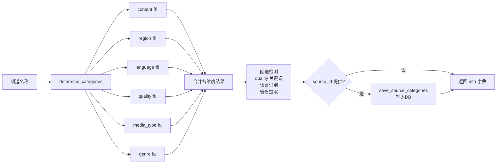

返回的 `info` 字典结构：

```python
{
    'name': 'CCTV-1 综合',        # 原始频道名
    'category': '央视频道',         # 主分类（向后兼容）
    'content': '央视频道',          # content 维度
    'region': '境内',              # region 维度
    'language': 'zh',             # language 维度
    'quality': '高清',             # quality 维度
    'media_type': 'TV',           # media_type 维度
    'genre': '综合',              # genre 维度
    'province': None,             # 省份（从频道名提取）
    'country': 'CN',              # 国家代码
    'continent': 'Asia',          # 大洲
}
```

Sources: [app/rules.py](app/rules.py#L730-L900)

---

### 并发安全设计：LRU 缓存与读写锁

ChannelRules 实例在 Web 请求线程与后台解析线程之间**共享**，因此缓存访问使用了 `threading.RLock`（可重入锁，防止同一线程内递归调用导致死锁）：

#### 缓存策略

| 缓存 | 类型 | 最大容量 | 淘汰策略 | 用途 |
|------|------|---------|---------|------|
| `_category_cache` | `OrderedDict` | 200 | LRU (popitem last=False) | 单分类结果缓存 |
| `_multi_category_cache` | `OrderedDict` | 200 | LRU (popitem last=False) | 多维分类结果缓存 |

#### 懒加载的全名映射

`_get_channel_name_mapping` 方法使用**懒加载模式**——首次调用时才导入并绑定 `get_channel_name_mapping_for_app` 函数，避免模块级循环引用。该映射表的优先级**高于规则引擎**，允许人工通过 `channel_name_mapping` 数据库表直接指定某个频道名的分类结果。

Sources: [app/rules.py](app/rules.py#L95-L115, L470-L490, L105-L130)

---

### 向后兼容与接口演进

ChannelRules 在设计上充分考虑了向后的兼容性：

| 旧接口 | 新接口 | 说明 |
|--------|--------|------|
| `determine_category(name)` → str | `determine_categories(name)` → dict | 新方法返回六维分类，旧方法仅返回 content 维度 |
| `get_category_rules()` → list | `rules_by_dim['content']` | 直接访问按维度组织的规则 |
| `get_channel_type_rules()` → dict | `rules_by_dim['media_type']` | channel_type 映射为 media_type |
| `rules` 字典（YAML 结构） | `rules_by_dim` 字典 | 新结构按维度分组，更清晰 |

`_rebuild_from_rules` 方法通过 `_dim` 字段标记每个规则的原始维度，在分组时读取但不破坏原始 dict，确保 YAML 回退路径也能生成规整的 `rules_by_dim` 结构。

Sources: [app/rules.py](app/rules.py#L270-L410)

---

### 与上下游模块的协作关系

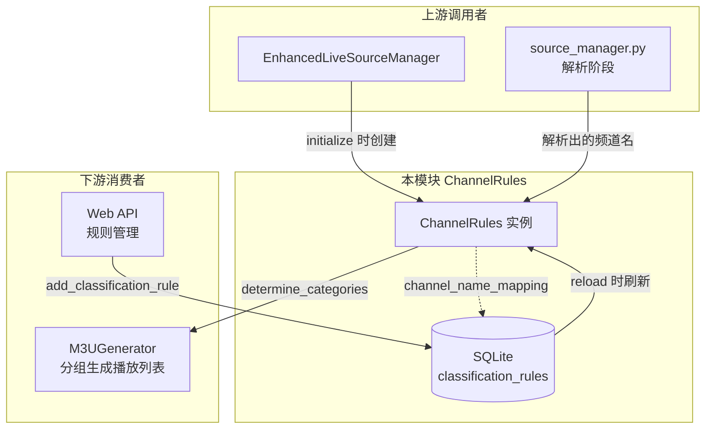

**关键交互点**：
1. `EnhancedLiveSourceManager.initialize()` 中创建 `ChannelRules` 实例，若规则测试失败仅记录警告，不阻断后续流程
2. `SourceManager` 解析源文件过程中，对每条频道记录调用 `extract_channel_info` 完成分类
3. `M3UGenerator` 依据 `content` 维度的分类结果进行多级播放列表分组
4. Web 后端的规则管理 API 通过 `reload()` 方法触发规则热更新

Sources: [app/manager.py](app/manager.py#L140-L160)

---

### 调试与验证：内置测试工具

ChannelRules 提供了 `test_classification` 方法用于调试和验证分类准确性。它接收一组 `(频道名, 期望分类)` 的测试用例，输出分类结果并统计准确率：

```python
test_cases = [
    ('CCTV-1 综合', '央视频道'),
    ('湖南卫视', '卫视频道'),
    ('北京新闻', '北京频道'),
    ('FM103.9 交通广播', '收音机'),
    ('经典电影频道', '影视频道'),
    ('NBA 直播', '体育频道'),
    ('香港TVB', '港澳台'),
    ('未知频道', '其他频道'),
]
```

该方法在 `EnhancedLiveSourceManager.initialize` 中自动执行一次，用于验证规则加载是否成功，失败仅记录警告日志，不阻塞初始化流程。

Sources: [app/rules.py](app/rules.py#L920-L1004), [app/manager.py](app/manager.py#L148-L150)

---

### 最佳实践与注意事项

1. **规则优先级设计原则**：核心国家频道（央视）优先级最高，其次是广播/特殊区域，再次是内容分类频道（体育/电影/新闻等），地区频道优先级居中，兜底「其他频道」优先级最低（100）。这确保了精确匹配优先于宽泛匹配。

2. **省际排除映射的维护**：新增省份/地区分类时，务必同步检查 `province_exclusion_map` 表，防止因地名包含关系（如「江」在「江苏」和「江西」中共存）导致的误分类。

3. **缓存失效时机**：通过 Web API 修改规则后，必须调用 `reload()` 方法刷新规则数据和清空缓存。Web 后端的规则管理路由 `POST /api/rules` 和 `PUT/DELETE /api/rules/*` 都会自动触发 `reload()`。

4. **全名映射优先级**：`channel_name_mapping` 表的优先级高于规则引擎——当一个频道名在该表中存在精确映射时，规则引擎的所有匹配逻辑都会被跳过。这为人工修正提供了权威渠道。

Sources: [app/rules.py](app/rules.py#L470-L490), [web/routes/rules.py](web/routes/rules.py#L1-L100)

---

### 进一步阅读

- [EnhancedLiveSourceManager：分层筛选处理流程与频道智能分类](#ch7) — 了解 ChannelRules 如何被编排到完整处理流水线中
- [M3UGenerator：多级播放列表生成与多维分组策略](#ch11) — 了解分类结果如何驱动播放列表分组
- [RESTful API 全景：源管理、配置中心、规则管理、Dashboard 统计](#ch22) — 了解规则管理的 REST API 设计

---

<a id="ch11"></a>
## 第11章 M3UGenerator：多级播放列表生成与多维分组策略

`M3UGenerator` 是直播源管理工具的播放列表输出引擎，负责将经过分层筛选和智能分类后的源数据，转换为标准 M3U 和 TXT 格式的播放列表文件。它实现了 **双层级输出策略**（基础层/高级层）、**多分类展开机制**、**可配置多维分组与排序**，以及 **数据库驱动的分类覆盖**，是整个处理管线的最后一环。

Sources: [app/m3u_generator.py](app/m3u_generator.py#L1-L5)

### 架构定位：输出管线的策略层

M3UGenerator 在整体架构中处于 `EnhancedLiveSourceManager` 的调度之下，接收经过三层筛选（有效性测试 → 分辨率分组筛选 → 条件筛选）后的源数据，完成从「结构化数据」到「可分发文件」的最终转换。**它不直接接触源获取、流测试或分类规则引擎**，而是专注于输出格式的组织策略。

```
┌────────────────────────────────────────────────────────┐
│              EnhancedLiveSourceManager                  │
│  ┌──────────┐  ┌───────────┐  ┌──────────┐  ┌─────────┐│
│  │SourceMgr │→ │StreamTester│→ │Classifier│→ │M3UGen   ││
│  │(下载解析) │  │(流测试)    │  │(分类规则) │  │(输出生成)││
│  └──────────┘  └───────────┘  └──────────┘  └─────────┘│
│                        ↓                                │
│                  ┌──────────────┐                       │
│                  │  输出文件写入  │                       │
│                  │ (原子写入+权限)│                       │
│                  └──────────────┘                       │
└────────────────────────────────────────────────────────┘
```

Sources: [app/manager.py](app/manager.py#L36-L40), [app/manager.py](app/manager.py#L809-L885)

### 双层级输出策略：base vs qualified

M3UGenerator 最核心的设计决策是 **双层级输出策略**，对应两个独立的播放列表文件，满足不同使用场景：

| 层级 | 标识 | 筛选策略 | 适用场景 | 文件名示例 |
|------|------|----------|----------|-----------|
| **基础层** | `base` | 直接使用传入的源 | 快速预览、覆盖测试 | `live_base.m3u` |
| **高级层** | `qualified` | 应用完整质量过滤 | 日常观看、稳定输出 | `live.m3u` |

基础层接收的源已经过 `resolution_based_filtering`（每个频道+分辨率分组保留前5个最佳源），因此即使未经高级过滤，也已经具备基本的质量控制。高级层则在基础层之上，通过 `enhanced_filter_sources` 方法应用配置的完整过滤参数：延迟上限、分辨率范围、比特率下限、HD/4K 要求、下载速度门槛。

Sources: [app/m3u_generator.py](app/m3u_generator.py#L63-L139), [app/manager.py](app/manager.py#L526-L601)

### 多分类展开：一个频道的多重归属

M3UGenerator 实现了一个巧妙的设计：**当某个源的 `content` 字段包含逗号分隔的多个分类时，自动将其复制到多个分组中**。这意味着一个频道可以同时出现在「新闻频道」和「生活频道」两个分组下，提升播放器的频道发现效率。

```python
# 多分类展开逻辑（核心代码）
content_val = s.get('content', '') or ''
if ',' in content_val:
    for single_content in [c.strip() for c in content_val.split(',') if c.strip()]:
        s_copy = dict(s)
        s_copy['content'] = single_content
        s_copy['category'] = single_content
        expanded_sources.append(s_copy)
else:
    expanded_sources.append(s)
```

例如：一个 `content="新闻,生活"` 的源会被展开为两个条目，分别以「新闻」和「生活」作为分组键。系统会记录展开前后的数量变化：`多分类展开: 100 → 130 个源`。

Sources: [app/m3u_generator.py](app/m3u_generator.py#L86-L99)

### 多维分组引擎：五种分组维度的统一调度

`enhanced_group_and_sort_sources` 方法实现了两级分组结构：先按媒体类型（video/audio/radio）预分组，然后对视频内容按配置维度进行详细分组。

#### 媒体类型预分组

```
[所有源]
    ├── video ──→ 按配置的分组维度（country/region/category/media_type/source）
    ├── audio ──→ 归入「在线音频」分组
    └── radio ──→ 归入「收音机」分组
```

#### 分组维度配置

`group_by` 参数支持五种分组维度，通过 `get_group_key` 方法统一调度：

| group_by 值 | 分组键来源 | 默认值 | 典型输出分组 |
|-------------|-----------|--------|------------|
| `country` | `source['country']` | `Unknown` | 中国、美国、日本... |
| `region` | `source['region']` | `Unknown` | 境内、港澳台、海外... |
| `category` | `source['category']` | `Unknown` | 央视频道、卫视频道、体育频道... |
| `media_type` | `source['media_type']` | `video` | video、audio、radio |
| `source` | `source['source_type']` | `Unknown` | GitHub、在线URL、本地文件... |

Sources: [app/m3u_generator.py](app/m3u_generator.py#L276-L370)

### 三级排序策略：速度优先的默认选择

每个分组内的源按配置的 `output_sort_by` 参数排序，提供三种排序模式：

| 排序模式 | 排序键 | 降/升序 | 适用场景 |
|----------|--------|---------|----------|
| `speed`（默认） | continent → country → province → 下载速度(降) → 响应时间(升) → 名称(升) | 混合 | 希望优质源优先展示 |
| `name` | 频道名称 | 升序 | 按字母顺序浏览 |
| `resolution` | 分辨率高度(降) → 名称(升) | 混合 | 希望高清源优先 |

**速度排序**是默认策略，按「大洲 → 国家 → 省份 → 下载速度（快者优先）→ 响应时间（低者优先）」的复合键进行排序。音频内容（收音机/在线音频）不受排序策略影响，始终按名称排序。

代码中特别处理了 `None` 值问题：所有排序键都使用 `x.get('key', default) or default` 模式，确保 `None` 值不会导致排序异常。

Sources: [app/m3u_generator.py](app/m3u_generator.py#L317-L347), [tests/test_output_optimizer.py](tests/test_output_optimizer.py#L54-L96)

### 增强版 EXTINF 构建：丰富元数据的输出

`build_enhanced_extinf` 方法为每个源构建包含丰富元数据的 `#EXTINF:` 行，这是 M3U 格式的核心扩展标记。其输出格式如下：

```
#EXTINF:-1 tvg-id="cctv_1" tvg-name="CCTV-1" tvg-logo="http://..." 
  group-title="央视频道" media-type="video" tvg-country="中国" 
  tvg-region="境内" tvg-province="北京" 
  response-time="120ms" download-speed="5120.0KB/s" 
  resolution="1920x1080" bitrate="4096kbps",CCTV-1
```

构建流程包含以下关键层次：

1. **身份信息**：`tvg-id`（由频道名正则归一化）、`tvg-name`（原始频道名）
2. **分组标题**：通过 `_build_group_title` 支持可配置的格式化模板 `m3u_group_title_format`，可用占位符包括 `{content}`、`{region}`、`{language}`、`{quality}`、`{media_type}`、`{genre}`。格式化结果会自动清理多余分隔符（如 `//` → `/`）。
3. **地理标记**：country、region、province 逐级嵌入
4. **User-Agent 注入**：根据 `ua_position` 配置，UA 可注入到 EXTINF 行（`user-agent="..."`）或 URL 后（`|User-Agent=...`）
5. **质量详情**（仅高级层）：响应时间、下载速度
6. **技术参数**：分辨率、比特率

Sources: [app/m3u_generator.py](app/m3u_generator.py#L372-L484)

### 数据库驱动的分类覆盖：stream_source_categories 的运行时应用

在每个源的 EXTINF 行生成前，M3UGenerator 会查询 `stream_source_categories` 表（通过 `get_source_categories_for_app`），获取用户在 Web 界面手动修正的分类维度值。**如果 DB 中存在人工修正记录（`is_manual=1`），则用这些值覆盖自动分类结果**，实现「自动分类 + 人工微调」的混合模式。

```python
# 在生成每个源的 EXTINF 前执行
source_id = source.get('id')
if source_id:
    cat_from_db = get_source_categories_for_app(source_id)  # 查询 DB
    if cat_from_db:
        for dim_key, dim_value in cat_from_db.items():
            if dim_value and dim_value != '未知':
                source[dim_key] = dim_value  # 覆盖自动分类
                if dim_key == 'content':
                    source['category'] = dim_value  # 同步兼容字段
```

这个机制确保了「一次修正，处处生效」——用户只需在 Web 界面上修改一次分类，后续所有播放列表生成都会自动应用该修正。

Sources: [app/m3u_generator.py](app/m3u_generator.py#L110-L126), [web/models.py](web/models.py#L1539-L1555)

### 质量过滤引擎：高级层的准入条件

`enhanced_filter_sources` 方法实现了高级层的完整过滤逻辑，包含以下检查序列：

```
[源进入]
    ├── ║ 白名单强制保留 ║ → 若命中白名单且 whitelist_force_keep=True，直接通过
    ├── ║ 状态检查 ║ → status != 'success' → 丢弃
    ├── ║ 媒体类型分流 ║
    │     ├── audio/radio → 仅检查延迟
    │     └── video → 进入完整检查
    ├── ║ 延迟检查 ║ → response_time > max_latency → 丢弃
    ├── ║ 分辨率检查 ║
    │     ├── range模式：min <= res <= max
    │     ├── min_only模式：res >= min
    │     └── max_only模式：res <= max
    ├── ║ 比特率检查 ║ → bitrate > 0 且 < min_bitrate → 丢弃
    ├── ║ 特殊要求 ║ → must_hd / must_4k → 按标记筛选
    └── ║ 速度检查 ║ → speed > 0 且 < min_speed → 丢弃
              ↓
          [合格源]
```

特别需要注意的是 **速度检查的 0 值豁免**：`speed > 0 and speed < min_speed` 意味着未测速（speed=0）的源不会被丢弃，仅丢弃确定速度过慢的源。这是修复后的行为，避免了早期版本中所有未测速源被误丢弃的问题。

Sources: [app/m3u_generator.py](app/m3u_generator.py#L200-L274)

### 白名单强制保留机制

作为对标 Guovin/iptv-api 的功能增强，M3UGenerator 实现了 **白名单强制保留** 机制（P2-⑥）：当 `whitelist_force_keep=True` 时，命中全局白名单的源跳过全部质量过滤，直接进入输出。白名单匹配采用 **URL 子串或 Host 精确匹配**（大小写不敏感），支持逗号、换行、分号分隔的多个条目。

```python
# 白名单检查逻辑
def _matches_whitelist(self, source: dict) -> bool:
    url = (source.get('url') or '').lower()
    host = urlparse(url).netloc.lower()
    for entry in white_list_entries:
        if entry_lower == host or entry_lower in url:
            return True
    return False
```

此机制适用于以下场景：
- 已知可靠但性能测试得分较低的源（如境外源延迟较高）
- 测试环境中的固定测试地址
- 用户明确指定「无论如何都要保留」的特定频道

Sources: [app/m3u_generator.py](app/m3u_generator.py#L30-L34), [app/m3u_generator.py](app/m3u_generator.py#L585-L602), [tests/test_output_optimizer.py](tests/test_output_optimizer.py#L99-L126)

### TXT 格式生成：另一种分发渠道

除了 M3U 格式，M3UGenerator 也支持生成兼容性更广的 TXT 格式（`generate_enhanced_txt`）。TXT 格式采用 `名称,URL` 的行结构，每组以 `# 组名` 注释分隔。

TXT 格式的 UA 注入策略与 M3U 格式统一，但使用不同的语法标记：
- `ua_position='url'`：`名称,URL|User-Agent=...`
- `ua_position='extinf'`：`名称,URL#User-Agent=...`

Sources: [app/m3u_generator.py](app/m3u_generator.py#L153-L198)

### 原子写入与文件安全

M3UGenerator 的输出由 `EnhancedLiveSourceManager._generate_enhanced_playlist` 方法以 **原子写入** 方式写入磁盘：先写入 `.tmp` 临时文件，再用 `os.replace()` 原子替换目标文件。这避免了在生成过程中因进程中断导致的不完整文件被 Nginx 服务到客户端。

```python
# 原子写入模式
with open(m3u_temp_path, 'w', encoding='utf-8') as f:
    f.write(m3u_content)
os.replace(m3u_temp_path, m3u_final_path)  # 原子替换
```

如果 M3UGenerator 在内容生成阶段抛出异常（罕见但理论上可能），系统会回退到 `_create_backup_m3u_content` 生成简化的备份内容，确保输出目录永远不会为空。

Sources: [app/manager.py](app/manager.py#L809-L884)

### 配置参数全景

M3UGenerator 的行为完全由以下配置参数控制：

| 配置段 | 键 | 默认值 | 作用 |
|--------|---|--------|------|
| `Output.filename` | 文件名 | `live.m3u` | 基础输出文件名 |
| `Output.group_by` | 分组维度 | `category` | 视频源的分组依据 |
| `Output.include_failed` | 包含失败源 | `False` | 是否包含测试失败的源 |
| `Output.max_sources_per_channel` | 每频道最大源数 | `8` | 控制冗余度 |
| `Output.enable_filter` | 启用过滤 | `False` | 是否应用质量过滤 |
| `Output.whitelist_force_keep` | 白名单强制保留 | `False` | 白名单豁免过滤 |
| `Filter.max_latency` | 最大延迟 | `4000` | 响应时间上限(ms) |
| `Filter.min_resolution` | 最低分辨率 | `360p` | 分辨率下界 |
| `Filter.max_resolution` | 最高分辨率 | `4k` | 分辨率上界 |
| `Filter.resolution_filter_mode` | 分辨率过滤模式 | `range` | range/min_only/max_only |
| `Filter.min_bitrate` | 最低比特率 | `80` | 比特率下界(kbps) |
| `Filter.min_speed` | 最低下载速度 | `50` | 速度下界(KB/s) |
| `Filter.must_hd` | 强制高清 | `False` | 仅输出高清源 |
| `Filter.must_4k` | 强制4K | `False` | 仅输出4K源 |
| `Testing.output_sort_by` | 输出排序方式 | `speed` | speed/name/resolution |
| `Testing.global_whitelist` | 全局白名单 | `''` | URL/host 白名单列表 |
| `UserAgents.ua_enabled` | 启用UA注入 | `False` | 是否在输出中注入UA |
| `UserAgents.ua_position` | UA注入位置 | `extinf` | extinf/url |

Sources: [app/config.py](app/config.py#L329-L369), [config/config-defaults.yaml](config/config-defaults.yaml#L38-L44)

### 测试覆盖

M3UGenerator 的测试集中在 `tests/test_output_optimizer.py` 中，覆盖排序和白名单两个核心维度：

| 测试场景 | 验证内容 |
|----------|---------|
| 速度排序 | 快源（500KB/s）在慢源（50KB/s）之前 |
| 名称排序 | a/b/c 字母序 |
| 分辨率排序 | 1080p（1920x1080）在720p（720x404）之前 |
| 白名单强制保留（启用） | 白名单源即使速度低于门槛也通过过滤 |
| 白名单强制保留（禁用） | 白名单源速度低于门槛时被正常过滤 |

Sources: [tests/test_output_optimizer.py](tests/test_output_optimizer.py#L1-L126)

### 与其他模块的协作关系

M3UGenerator 在整个系统中的作用可以通过以下对照理解：

| 模块 | 与 M3UGenerator 的关系 |
|------|----------------------|
| `EnhancedLiveSourceManager` | **调用者**：在 `_generate_enhanced_playlist` 中实例化并使用 M3UGenerator |
| `Config` | **配置来源**：提供 output_params、filter_params、ua 参数 |
| `ChannelRules` | **分类提供者**：通过 `save_source_categories` 写入分类结果 |
| `web.models` | **运行时覆盖**：`get_source_categories_for_app` 读取人工修正的分类 |
| `StreamTester` | **数据上游**：流测试结果为过滤提供质量数据（延迟、速度等） |
| `SourceManager` | **数据上游**：源下载和解析结果为输出提供原始数据 |

Sources: [app/manager.py](app/manager.py#L809-L885), [app/rules.py](app/rules.py#L73-L75)

---

**下一步阅读建议**：理解 M3UGenerator 的输出参数配置后，可深入 [Config 配置管理：纯 SQLite 存储与统一默认值体系](#ch12) 了解输出参数在配置体系中的完整生命周期，或查看 [EnhancedLiveSourceManager：分层筛选处理流程与频道智能分类](#ch7) 了解 M3UGenerator 在整体处理管线中的调用上下文。

---

<a id="ch12"></a>
## 第12章 Config 配置管理：纯 SQLite 存储与统一默认值体系

### 模块定位与架构概览

Config 配置管理模块位于 app 层（L1 配置层），是整个直播源管理器所有运行时参数的**单一事实来源（Single Source of Truth）**。它抛弃了传统的 INI/conf 文件方案，将所有配置读写统一托管在 SQLite `app_config` 表中，通过一套级联默认值体系和自动化种子机制，确保配置在任何环境下都能正确初始化。

配置体系由四个层次协作完成：

```mermaid
graph TB
    subgraph "默认值事实来源"
        A[Config._DEFAULT_VALUES<br/>app/config.py]
        B[config/config-defaults.yaml<br/>外部化覆盖]
    end

    subgraph "持久化层"
        C[(SQLite app_config 表<br/>web/data/web.db)]
    end

    subgraph "Web 管理层"
        D[SECTION_SCHEMA<br/>web/core.py]
        E[write_config / read_config<br/>web/core.py]
        F[config_api 路由<br/>web/routes/config_api.py]
        G[config.html 模板<br/>前端 UI]
    end

    subgraph "业务消费层"
        H[Config 实例 get/getint/getboolean<br/>app/config.py]
        I[模块便捷方法<br/>get_network_config / get_testing_params]
    end

    A -->|seed_app_config_defaults| C
    B -->|外部覆盖| D
    D -->|UI 渲染| G
    F -->|API 调用| E
    E -->|写入| C
    C -->|读取| H
    H -->|聚合| I
    C -->|读取| E
```

Sources: [app/config.py](app/config.py#L1-L45), [web/models.py](web/models.py#L175-L179), [web/core.py](web/core.py#L68-L70)

---

### 核心设计原则

#### 1. 纯 SQLite，零文件依赖

Config 类在初始化时完全不依赖 config.ini 或任何文件路径。所有配置读写直接走 SQLite `app_config` 表：

```python
class Config:
    def __init__(self):
        self._models = None
        self._loaded = False

    def get(self, section, key, default=None):
        val = self._get_models().get_app_config(f'{section}.{key}')
        if val is not None:
            return val
        return default
```

传统 INI 模式的 `save()` 和 `check_reload()` 方法被保留为**空操作兼容桩**，仅用于避免外部代码调用报错，实际功能已被 SQLite 完全替代。

Sources: [app/config.py](app/config.py#L139-L168, L203-L209)

#### 2. ClassVar 统一默认值体系

`_DEFAULT_VALUES` 是系统中唯一的配置默认值事实来源。它是一个 `ClassVar[dict[str, str]]`，以 `{section}.{key}` 为键、字符串为值，覆盖 10 个配置段、50+ 个配置项：

| 配置段 | 包含的配置项 | 典型默认值 |
|--------|-------------|-----------|
| Sources | local_dirs, online_urls, github_sources 等 6 项 | 内置 20 个在线源 URL |
| Network | proxy_enabled, proxy_type 等 7 项 | socks5 代理到 192.168.1.46:1800 |
| HTTPServer | enabled, host, port 等 5 项 | 0.0.0.0:12345/23456 |
| GitHub | api_url, api_token, rate_limit | api.github.com, 空 token, 5000 次/时 |
| Testing | timeout, concurrent_threads, cache_ttl 等 17 项 | timeout=10s, 并发 40 线程 |
| Output | filename, group_by, include_failed 等 6 项 | live.m3u, category 分组 |
| Logging | level, file, max_size, backup_count | INFO, ./log/app.log |
| Filter | max_latency, min_bitrate 等 8 项 | 4000ms 延迟上限, 80kbps 码率下限 |
| UserAgents | ua_position, ua_enabled | extinf, 未启用 |
| Testing | enable_host_speed_share, enable_source_freeze 等性能选项 | True（默认开启性能优化）|

Sources: [app/config.py](app/config.py#L30-L137)

#### 3. 三级默认值覆盖链

系统在运行时遵循以下优先级（高 → 低）：

1. **SQLite app_config 表**（用户已保存的值）— `get()` 优先读取
2. **YAML 外部覆盖文件** — `config/config-defaults.yaml` 在 Web 层 `SECTION_SCHEMA` 加载时覆盖代码默认值
3. **代码硬编码默认值** — `Config._DEFAULT_VALUES`（最低优先级，兜底）

YAML 覆盖机制在 `web/core.py` 中实现：

```python
_yaml_defaults = _load_defaults_from_yaml()
if _yaml_defaults:
    for section, fields in _yaml_defaults.items():
        if section in SECTION_SCHEMA:
            for key, value in fields.items():
                # 只替换默认值（保持类型、标签等信息不变）
                existing = list(SECTION_SCHEMA[section][key])
                existing[1] = str(value)
                SECTION_SCHEMA[section][key] = tuple(existing)
```

这种设计使得运维人员可以通过修改 `config-defaults.yaml` 来定制默认配置，而无需修改 Python 代码。

Sources: [web/core.py](web/core.py#L78-L89, L306-L318), [config/config-defaults.yaml](config/config-defaults.yaml#L1-L132)

---

### 数据库设计与持久化

#### app_config 表结构

```sql
CREATE TABLE IF NOT EXISTS app_config (
    key         TEXT PRIMARY KEY,
    value       TEXT NOT NULL,
    updated_at  TIMESTAMP DEFAULT CURRENT_TIMESTAMP
);
```

**键命名规范**：`{section}.{field}`，例如 `Sources.online_urls`、`Network.proxy_enabled`。这种平面键模式避免了嵌套结构，简化了查询和缓存。

Sources: [web/models.py](web/models.py#L175-L179)

#### 带 TTL 的读取缓存

`get_all_config()` 实现了 5 秒 TTL 的读取缓存，避免同一请求内的多次 SQLite 查询：

```python
_all_config_cache: dict | None = None
_all_config_cache_time: float = 0
_ALL_CONFIG_CACHE_TTL: float = 5.0

def get_all_config() -> dict[str, dict[str, str]]:
    # 双重检查锁定模式（double-checked locking）
    now = time.time()
    if cached is not None and now - cached_time < _ALL_CONFIG_CACHE_TTL:
        return cached
    with _all_config_cache_lock:
        # 二次检查
        if _all_config_cache is not None and now - _all_config_cache_time < _ALL_CONFIG_CACHE_TTL:
            return _all_config_cache
        result = _get_all_config_raw()
        _all_config_cache = result
        _all_config_cache_time = now
        return result
```

写操作（`set_app_config()`）会自动调用 `invalidate_config_cache()` 清除缓存，确保读写一致性。

Sources: [web/models.py](web/models.py#L9-L22, L625-L640, L561-L589)

#### 敏感字段自动加解密

写入配置时，系统自动判断字段类型并执行相应的加密策略：

| 加密策略 | 适用字段 | 加密方式 |
|---------|---------|---------|
| 机器绑定加密 | `Network.proxy_*`, `GitHub.api_token` 等 | 基于机器 ID 派生密钥 |
| 普通敏感加密 | 其他敏感字段 | Fernet (AES-128-CBC) |
| 不加密 | 非敏感字段 | 明文存储 |

读取时自动解密，对 `Config.get()` 的调用方完全透明。

Sources: [web/models.py](web/models.py#L507-L528, L561-L589, L592-L622)

---

### 启动初始化流程

应用启动时（`lifespan` 函数），配置模块按以下顺序执行初始化：

```mermaid
flowchart TD
    A[应用启动] --> B[init_db: 建表]
    B --> C[ensure_key_initialized: 加密体系就绪]
    C --> D{app_config 表<br/>是否有数据?}
    D -->|空表| E[seed_app_config_defaults<br/>从 Config._DEFAULT_VALUES 写入]
    D -->|有数据| F[跳过 seed]
    E --> G[fill_missing_app_config_defaults<br/>补全 schema 新增键]
    F --> G
    G --> H[YAML 覆盖 SECTION_SCHEMA<br/>默认值]
    H --> I[启动完成]
```

**关键幂等设计**：

- `seed_app_config_defaults()` — 仅在 `app_config` 表为空时执行；表非空时直接跳过，绝不覆盖用户已修改的值
- `fill_missing_app_config_defaults()` — 每次启动都执行，仅在默认值中存在但 DB 中缺失的键上写入，补全 schema 演进造成的新增配置项

这种设计的核心价值在于：当代码版本升级引入新的配置项时，已有部署的配置不会丢失，新配置项会自动补全。

Sources: [web/core.py](web/core.py#L771-L838), [web/models.py](web/models.py#L661-L720)

---

### Config 类的便捷方法体系

Config 类提供了 10 个便捷方法，每个方法负责聚合一个配置段的全部参数，返回结构化的字典供业务模块直接消费：

| 方法 | 返回的配置段 | 消费者 |
|------|------------|--------|
| `get_logging_config()` | Logging | 日志初始化 |
| `get_network_config()` | Network | 网络请求代理设置 |
| `get_github_config()` | GitHub | GitHub API 调用 |
| `get_testing_params()` | Testing | StreamTester 流测试 |
| `get_filter_params()` | Filter | 输出质量过滤 |
| `get_output_params()` | Output | M3UGenerator 输出 |
| `get_http_server_config()` | HTTPServer | 文件发布服务 |
| `get_ua_position()` / `is_ua_enabled()` | UserAgents | User-Agent 注入 |
| `get_sources()` | Sources (聚合) | SourceManager 源加载 |
| `get_user_agents()` | UserAgents (扩展) | UA 配置 |

以 `get_output_params()` 为例，它演示了路径的自动绝对化处理：

```python
def get_output_params(self) -> dict:
    output_dir = self.get('Output', 'output_dir', './www/output')
    if output_dir and not os.path.isabs(output_dir):
        output_dir = os.path.abspath(output_dir)
    return {
        'filename': self.get('Output', 'filename', ...),
        'group_by': self.get('Output', 'group_by', ...),
        'output_dir': output_dir,
        # ...
    }
```

每个方法内部对每个字段都提供了三重保护：SQLite 读取 → 默认值回退 → 类型安全转换。

Sources: [app/config.py](app/config.py#L226-L393, L434-L457)

---

### Web 管理层的配置管理

#### SECTION_SCHEMA — UI 驱动的元数据定义

`web/core.py` 中的 `SECTION_SCHEMA` 是配置管理前端的数据驱动源，为每个字段定义了 4 元组：

```python
SECTION_SCHEMA = {
    'Testing': {
        'timeout': ('int', '10', '测试超时(秒)', ''),
        'enable_speed_test': ('bool', 'True', '启用速率测试', ''),
        'online_urls': ('textarea', '...', '在线源URL列表', '每行一个URL'),
    }
}
```

四元组结构：`(字段类型, 默认值, 标签, 帮助文字)`

- **字段类型** (`str`/`textarea`/`int`/`bool`) 驱动前端表单控件类型
- **默认值** 在启动时被 `config-defaults.yaml` 覆盖
- **标签** 和 **帮助文字** 用于 UI 渲染

#### RESTful API 端点

| 端点 | 方法 | 功能 | 权限 |
|------|------|------|------|
| `/api/config` | GET | 读取全量配置 | 任意登录用户 |
| `/api/config/{section}` | GET | 读取单个配置段 | 任意登录用户 |
| `/api/config` | PUT | 全量保存配置 | 管理员 |
| `/api/config/{section}` | PUT | 保存单个配置段 | 管理员 |
| `/api/config/fields` | GET | 返回字段 schema 元数据 | 任意登录用户 |
| `/api/config/validate` | POST | 单字段校验 | 任意登录用户 |
| `/api/config/history` | GET | 配置变更历史（分页） | 管理员 |

写入操作会自动记录审计日志，敏感字段（如 `proxy_password`、`api_token`）在日志中脱敏为 `***`。

Sources: [web/core.py](web/core.py#L92-L304, L340-L440), [web/routes/config_api.py](web/routes/config_api.py#L26-L200)

#### 前端 UI 交互

`config.html` 模板实现了完整的配置管理界面：

- **Tab 式布局**：测试、输出、网络、GitHub、筛选、分类字典
- **按段独立保存**：每个配置段有独立的「保存」按钮，支持分段提交
- **全量保存**：「保存全部」按钮一次性提交所有段
- **实时校验**：输入变更时立即触发客户端和服务端校验
- **脏检测**：与原始快照对比，标记已修改的段
- **重置为默认**：一键重置为 `SECTION_SCHEMA` 中定义的默认值

Sources: [web/templates/config.html](web/templates/config.html#L1-L66, L424-L561)

---

### 配置变更审计追踪

每次配置写入都会在 `audit_logs` 表中记录详细的操作信息：

```json
{
    "user_id": 1,
    "username": "admin",
    "action": "config_section_update",
    "target": "[Network]",
    "detail": "{\"Network\": {\"proxy_enabled\": \"True\", \"proxy_host\": \"***\", \"proxy_password\": \"***\"}}",
    "ip_address": "192.168.1.100"
}
```

审计日志通过 `/api/config/history` 端点分页查询，支持 `config_update`、`config_section_update`、`config_change`、`config_reload` 四种操作的过滤。

Sources: [web/routes/config_api.py](web/routes/config_api.py#L37-L75, L87-L148), [web/models.py](web/models.py#L160-L173)

---

### 错误处理与异常安全

配置读取失败时采用**静默降级策略**：

```python
def get(self, section, key, default=None):
    try:
        val = self._get_models().get_app_config(f'{section}.{key}')
        if val is not None:
            return val
    except Exception as e:
        logging.warning(f'Config.get SQLite 读取失败 ({section}.{key}): {e}')
    return default
```

- 数据库查询异常不会向上传播，仅记录 warning 日志
- 始终返回调用方提供的 `default` 值，确保业务层不因配置问题崩溃
- 配置写入失败也采用同样的安全模式，仅日志记录不抛出异常

配置相关的异常通过 `ConfigError`（错误码 1001）类体系管理，继承自 `BaseAppException`。

Sources: [app/config.py](app/config.py#L160-L201), [app/exceptions.py](app/exceptions.py#L86-L98)

---

### 配置段字段速查表

#### Testing — 流测试参数（17 项）

| 字段名 | 类型 | 默认值 | 说明 |
|--------|------|--------|------|
| timeout | int | 10 | 测试超时(秒) |
| concurrent_threads | int | 40 | 并发线程数 |
| max_concurrent_ffprobe | int | 16 | ffprobe 并发数 |
| cache_ttl | int | 120 | 缓存有效期(分) |
| enable_speed_test | bool | True | 启用速率测试 |
| enable_host_speed_share | bool | True | 同 Host 测速复用 |
| enable_source_freeze | bool | True | 失败源冻结策略 |
| freeze_fail_threshold | int | 3 | 冻结阈值（连续失败次数） |
| freeze_base_seconds | int | 60 | 退避基数(秒) |
| freeze_max_hours | int | 24 | 冻结上限(小时) |
| enable_ad_detect | bool | True | 广告/循环源检测 |
| ad_keywords | str | no_signal,... | 广告关键字 |
| ad_max_duration | int | 90 | 循环占位阈值(秒) |
| global_blacklist | str | '' | 全局黑名单 |
| global_whitelist | str | '' | 全局白名单 |
| output_sort_by | str | speed | 输出排序方式 |
| max_test_attempts | int | 1 | 实时测试次数 |

#### Filter — 质量过滤（8 项）

| 字段名 | 类型 | 默认值 | 说明 |
|--------|------|--------|------|
| max_latency | int | 4000 | 最大延迟(ms) |
| min_bitrate | int | 80 | 最小比特率(kbps) |
| must_hd | bool | False | 必须高清 |
| must_4k | bool | False | 必须 4K |
| min_speed | int | 50 | 最小下载速度(KB/s) |
| min_resolution | str | 360p | 最低分辨率 |
| max_resolution | str | 4k | 最高分辨率 |
| resolution_filter_mode | str | range | 分辨率筛选模式 |

#### Network — 网络配置（8 项）

| 字段名 | 类型 | 默认值 | 说明 |
|--------|------|--------|------|
| proxy_enabled | bool | False | 启用代理 |
| proxy_type | str | socks5 | 代理类型 |
| proxy_host | str | 192.168.1.46 | 代理主机 |
| proxy_port | int | 1800 | 代理端口 |
| proxy_username | str | '' | 代理用户名 |
| proxy_password | str | '' | 代理密码 |
| github_mirror | str | https://ghproxy.com/ | GitHub 镜像站 |
| ipv6_enabled | bool | True | 启用 IPv6 |

Sources: [app/config.py](app/config.py#L30-L137), [web/core.py](web/core.py#L92-L304)

---

### 总结与下一步

Config 配置管理模块通过「代码默认值 → YAML 外部覆盖 → SQLite 持久化」的三层数据链，实现了配置的声明式管理和自动化演进。`_DEFAULT_VALUES` 作为单一事实来源，配合 `seed_app_config_defaults` + `fill_missing_app_config_defaults` 的幂等初始化策略，保证了配置在跨版本升级时的完整性和零丢失。

推荐下一步阅读：

- [四层架构设计：从基础层到协调层的依赖关系](#ch6) — 理解 Config 在整体架构中的位置
- [异常体系与全局错误处理：BaseAppException 层次结构与错误统计](#ch13) — ConfigError 的异常层级
- [敏感配置加密：基于 Fernet (AES-128-CBC) 的字段级加密与机器绑定](#ch20) — 配置加密的底层实现
- [RESTful API 全景：源管理、配置中心、规则管理、Dashboard 统计](#ch22) — 配置 API 的完整接口说明
- [SQLite ORM 设计与数据库迁移：context manager 模式与 WAL 模式](#ch18) — 底层数据库架构

---

<a id="ch13"></a>
## 第13章 异常体系与全局错误处理：BaseAppException 层次结构与错误统计

直播源管理器构建了一套**分层的自定义异常体系**，配合全局捕获装饰器、错误统计收集器和未捕获异常钩子，实现从底层库函数到 Web API 的全链路错误管理。这套体系的核心设计目标有三个：**让错误携带修复建议**（而非裸错误码）、**让错误可分类统计**（而非被日志淹没）、**让未处理异常有兜底**（而非直接崩溃）。

> 阅读前建议先了解[四层架构设计](#ch6)，异常体系贯穿整个 app 层与 web 层。

### 异常层次结构：从基类到具体错误

所有自定义异常都继承自 `BaseAppException(Exception)`，形成了一个三层的继承树：

```mermaid
classDiagram
    class BaseAppException {
        +int error_code
        +str message
        +str suggestion
        +dict details
        +Exception original
        +to_dict() dict
        +traceback_str str
    }
    class LsmError {
        +error_code=0
    }
    class ConfigError {
        +error_code=1001
    }
    class SourceError {
        +error_code=3001
    }
    class SourceDownloadError {
        +error_code=3002
    }
    class SourceParseError {
        +error_code=3003
    }
    class StreamTestError {
        +error_code=4001
    }
    class FileException {
        +error_code=5002
    }
    class OutputError {
        +error_code=5001
    }

    BaseAppException <|-- LsmError
    LsmError <|-- ConfigError
    LsmError <|-- SourceError
    LsmError <|-- StreamTestError
    LsmError <|-- FileException
    LsmError <|-- OutputError
    SourceError <|-- SourceDownloadError
    SourceError <|-- SourceParseError
```

Sources: [app/exceptions.py](app/exceptions.py#L28-L191)

#### BaseAppException 基类的五个字段

基类是所有异常的信息容器，定义了五个核心字段：

| 字段 | 类型 | 默认值 | 说明 |
|------|------|--------|------|
| `error_code` | `int` | (必填) | 数值错误码，用于快速分类和检索 |
| `message` | `str` | (必填) | 人类可读的错误描述 |
| `suggestion` | `str` | `''` | 面向用户的修复建议 |
| `details` | `dict[str, Any]` | `{}` | 额外上下文信息（如出错行号、参数值） |
| `original` | `Exception` | `None` | 原始异常引用，用于异常链追溯 |

其中 `to_dict()` 方法将前四个字段序列化为字典，供 API 响应格式化使用；`traceback_str` 属性则生成完整的调用栈字符串，其中优先追溯 `original`（包装异常时）的栈信息。`__str__` 方法输出 `[error_code] message | 建议: suggestion` 格式，确保日志中一眼可读。

Sources: [app/exceptions.py](app/exceptions.py#L28-L64)

#### LsmError 与应用层子类

`LsmError` 作为 app 层异常的中间基类，固定 `error_code=0`。其子类各自定义专属错误码，每个错误码在整个系统中唯一：

- **ConfigError（1001）**：配置加载或校验失败，默认建议"检查配置文件格式和内容是否正确"。在 `EnhancedLiveSourceManager.initialize()` 中，配置解析失败时直接抛出此异常，上游捕获后终止初始化流程。
- **SourceError（3001）**：源处理通用错误，其下细分两个子类：`SourceDownloadError（3002）` 表示网络下载失败（建议检查网络连接），`SourceParseError（3003）` 表示 M3U/TXT 解析失败（建议检查文件格式）。
- **StreamTestError（4001）**：流媒体测试过程中的异常，建议检查 ffprobe 工具可用性或测试配置参数。
- **FileException（5002）**：文件操作异常，建议检查文件路径和读写权限。
- **OutputError（5001）**：输出/文件写入错误，建议检查输出目录权限和磁盘空间。

Sources: [app/exceptions.py](app/exceptions.py#L67-L191)

#### 错误码速查字典

模块末尾定义了 `ERROR_CODE_SUGGESTIONS` 字典，将错误码映射为面向运维的简短建议。该字典可作为快速查询表，也用于在 UI 或日志中统一展示错误含义。

Sources: [app/exceptions.py](app/exceptions.py#L184-L192)

### 全局错误处理三件套

异常类只是信息的载体，真正将这套体系"织入"应用的是三个互补的全局组件：`catch_exception` 装饰器、`ErrorStats` 统计收集器和 `setup_global_exception_hook` 钩子。

#### catch_exception 装饰器：统一捕获 + 统计 + 降级

这是一个同时支持同步和异步函数的装饰器，其核心行为可以用一个流程图概括：

```mermaid
flowchart TD
    A[调用装饰函数] --> B{函数执行}
    B -->|正常返回| C[返回原值]
    B -->|抛出 BaseAppException| D[记录日志]
    B -->|抛出 普通 Exception| E[包装为 BaseAppException<br/>error_code=0]
    D --> F{raise_original?}
    E --> F
    F -->|是| G[重新抛出原异常]
    F -->|否| H[返回 fallback_return]
    D --> I{capture_stats?}
    E --> I
    I -->|是| J[记录到 global_error_stats]
    I -->|否| K[跳过统计]
```

Sources: [app/exceptions.py](app/exceptions.py#L265-L329)

装饰器接受五个参数，全部可选：

| 参数 | 类型 | 默认值 | 说明 |
|------|------|--------|------|
| `logger` | `logging.Logger` | `None` | 日志记录器，默认使用 `func.__module__` 的 logger |
| `module_name` | `str` | `''` | 模块名称（用于统计分组），默认取 `func.__module__` |
| `raise_original` | `bool` | `False` | 是否重新抛出异常 |
| `fallback_return` | `Any` | `None` | 异常时的默认返回值（降级策略） |
| `capture_stats` | `bool` | `True` | 是否记录到全局错误统计 |

当被装饰函数抛出普通 `Exception`（非 `BaseAppException` 及其子类）时，装饰器会自动调用 `_wrap_exception` 将其包装为 `BaseAppException(error_code=0, original=...)`，确保所有错误都统一以 `BaseAppException` 的形态进入日志和统计管道。

内部日志函数 `_log_exception` 会根据异常类型做差异化输出：对 `BaseAppException` 输出 `[error_code] message | 建议: suggestion` 格式，若存在 `original` 则在 DEBUG 级别输出完整栈；对普通异常则直接输出 `str(error)` 加完整栈。

Sources: [app/exceptions.py](app/exceptions.py#L332-L347)

#### ErrorStats 错误统计收集器：时间窗口 + 多维聚合

`ErrorStats` 是一个基于时间窗口的轻量级错误统计容器，以 `(error_code, module)` 为键，记录每次错误的发生时间、消息和上下文信息。

```mermaid
flowchart LR
    subgraph record[record() 流程]
        A[接收 Exception + module + context] --> B[提取 error_code]
        B --> C[按 (error_code, module) 分组存储]
        C --> D[递增 total_count]
        D --> E[触发 _prune 清理过期记录]
    end
    subgraph query[查询方法]
        E --> F[get_summary: 按分组输出 count/last_occurred]
        E --> G[get_count_by_type: 按 error_code 聚合]
        E --> H[get_count_by_module: 按 module 聚合]
    end
    subgraph lifecycle[生命周期]
        I[reset: 清空所有计数和记录]
        J[_prune: 裁剪超出 window_minutes 的记录]
    end
```

Sources: [app/exceptions.py](app/exceptions.py#L200-L261)

核心设计要点：

- **时间窗口**：构造函数接受 `window_minutes`（默认 60 分钟），每次 `record()` 调用后自动执行 `_prune()`，移除超出时间窗口的旧记录。这意味着统计永远反映最近 N 分钟内的错误分布。
- **双键分组**：`(error_code, module)` 复合键同时从"错误类型"和"来源模块"两个维度组织数据。`get_count_by_type` 按 `error_code` 聚合，`get_count_by_module` 按 `module` 聚合，而 `get_summary` 输出每个复合分组的独立计数和最后发生时间。
- **上下文记录**：`context` 参数（推荐传入 `{'func': func_name}`）允许在统计中附加额外信息，便于追查错误发生的具体函数。
- **`_total_count` 陷阱**：`get_summary` 返回的 `total_count` 是**累计值**（自创建或上次 `reset()` 以来的所有记录数），而非仅窗口内的记录数。窗口裁剪只会移除 `_errors` 字典中的明细记录，但不会递减 `_total_count`。这是有意设计的——它反映了"发生了多少次错误"的历史总量，但明细查询（`by_type_and_module`）只反映窗口内的活跃错误。

模块级单例 `global_error_stats = ErrorStats()` 作为全局统计入口，被 `catch_exception` 装饰器自动引用。

Sources: [app/exceptions.py](app/exceptions.py#L262)

#### setup_global_exception_hook：最后一层防线

`setup_global_exception_hook` 覆写 `sys.excepthook`，为所有未被任何 try/except 捕获的异常提供兜底日志。它接受可选的 `logger` 参数，对 `BaseAppException` 子类以 `logger.critical` 级别输出错误码+建议；对普通异常则输出类型名称+完整栈。

在 `EnhancedLiveSourceManager.initialize()` 中，初始化完成配置和日志系统后立即注册此钩子：

```python
try:
    setup_global_exception_hook(self.logger)
    self.logger_info('全局异常钩子已注册')
except Exception:
    pass
```

Sources: [app/exceptions.py](app/exceptions.py#L357-L377), [app/manager.py](app/manager.py#L77-L81)

### Web 层的异常处理整合

在 Web 管理后端，异常体系通过两条路径融入 FastAPI 应用：

**路径一：`format_error_response` 统一响应格式**

该函数接受 `BaseAppException` 实例，返回 `{'success': False, 'error': exc.to_dict()}` 结构的 JSON 字典。如果启用 `include_traceback`，还会附加 `traceback` 字段。此函数供路由模块在捕获到业务异常后格式化 API 响应。

Sources: [app/exceptions.py](app/exceptions.py#L350-L354)

**路径二：FastAPI 全局 HTTPException 处理器**

在 `web/core.py` 中注册了 `@app.exception_handler(HTTPException)`，针对 401 未认证状态做差异化处理：浏览器请求（`Accept: text/html`）重定向到 `/login` 页面，API 请求返回 JSON 格式的 401 错误。这是整个 Web 层的"认证守卫"。

Sources: [web/core.py](web/core.py#L890-L900)（需要确认行号）

### 在 manager.py 中的实战模式

`EnhancedLiveSourceManager` 是整个 app 层最忠实的异常使用者。其初始化方法 `initialize()` 和主处理流程 `enhanced_process_sources()` 都采用了**分级捕获策略**：

```python
# 初始化时的三级捕获
try:
    # ... 初始化各组件 ...
except ConfigError as e:    # 第一级：配置异常
    ...
except SourceError as e:    # 第二级：源异常
    ...
except Exception as e:      # 第三级：兜底
    ...

# 处理流程中的四级捕获
try:
    # ... 下载、解析、测试、筛选、生成 ...
except (SourceDownloadError, SourceParseError) as e:
    ...
except StreamTestError as e:
    ...
except OutputError as e:
    ...
except Exception as e:
    ...
```

这种模式确保每个异常类型都在恰当的抽象层级被捕获：配置问题直接告知用户检查配置，网络问题提示检查连接，输出问题提示检查磁盘权限。每一级都附带完整的 `traceback.format_exc()` 日志输出，不丢失调试信息。

Sources: [app/manager.py](app/manager.py#L62-L101), [app/manager.py](app/manager.py#L259-L289)

### 测试覆盖与验证

测试模块 `tests/test_exceptions.py` 覆盖了以下维度：

- **继承关系验证**：确认所有异常类均继承自 `LsmError`，且 `LsmError` 继承自 `BaseAppException`，`SourceDownloadError`/`SourceParseError` 继承自 `SourceError`
- **属性完整性**：验证 `error_code`、`message`、`suggestion`、`details`、`original` 的初始化、默认值和 `to_dict()` 序列化
- **错误码唯一性**：断言 8 个异常类中至少有 6 个不同的 `error_code`
- **ErrorStats 功能**：验证 `record`/`get_summary`/`get_count_by_type`/`get_count_by_module`/`reset` 的全流程正确性，包括 `context` 上下文存储
- **catch_exception 装饰器**：覆盖同步/异步函数正常返回、`BaseAppException` 捕获、普通 `Exception` 捕获（自动包装）、`raise_original=True` 重抛、`fallback_return` 降级、`capture_stats` 统计记录
- **format_error_response**：验证响应结构、`include_traceback` 开关行为

Sources: [tests/test_exceptions.py](tests/test_exceptions.py#L1-L285)

### 设计要点总结

这套异常体系体现了三个关键的设计决策：

第一，**错误信息和修复建议的"焊死"**。每个异常子类在构造函数中绑定默认的 `suggestion` 参数，这意味着无论在哪里抛出异常，都天然携带一条面向用户的修复建议。调用方无需记忆错误码含义，直接展示 `suggestion` 即可获得有意义的错误提示。

第二，**统一包装层的双向作用**。`catch_exception` 装饰器同时处理了"接收 `BaseAppException` 并统计"和"接收普通异常并包装"两个场景。这使得即使第三方库抛出 `ValueError`、`KeyError` 等普通异常，也能以统一的形态进入统计和日志系统，不丢失原始异常信息（通过 `original` 字段）。

第三，**统计的有损窗口设计**。`ErrorStats` 的有损时间窗口 + 累计计数策略，在"展示近期活跃错误"和"保留历史总量"之间取得平衡。运维人员可通过 `get_summary` 快速定位当前高频错误，而 `total_count` 提供了一个长期趋势的参考基线。

> 下一步建议了解该异常体系在 URL 安全审查中的应用：[URL 安全审查](#ch14)；或查看流测试错误分类引擎如何扩展异常体系：[流测试错误分类引擎](#ch16)。

---

<a id="ch14"></a>
## 第14章 URL 安全审查：域名黑名单、XSS/命令注入/路径遍历检测

### 定位：分层防护体系中的第一道防线

URL 安全审查模块 (`app/security.py`) 是直播源管理器**纵深防御体系**的起点。它处于[四层架构](6-si-ceng-jia-gou-she-ji-从-ji-chu-ceng-dao-xie-diao-ceng-de-yi-lai-guan-xi)的**基础层**，在源文件下载和解析阶段即介入拦截恶意 URL，防止不安全地址进入后续的测试、分类和播放列表生成流程。

整个模块围绕一个核心原则设计：**在不同阶段使用不同强度的审查策略**，避免过度审查导致合法源被误杀。

Sources: [app/security.py](app/security.py#L1-L15), [app/__init__.py](app/__init__.py#L95-L115)

---

### 一级架构：三条防护路径的分布式设计

```mermaid
flowchart LR
    subgraph 公共基础
        A[URL 校验基础函数]
        B[正则模式集<br/>XSS / 命令注入 / 路径遍历]
        C[域名黑/白名单管理]
        D[境外流媒体域名库]
    end

    subgraph 两条 API 路径
        E[validate_url<br/>完整安全审查]
        F[is_safe_url<br/>快捷布尔封装]
        G[is_static_safe<br/>解析阶段窄门禁]
    end

    subgraph 调用场景
        H[SourceManager._download_url<br/>下载阶段]
        I[SourceManager._parse_m3u_content<br/>解析阶段]
    end

    A --> E
    A --> F
    A --> G
    B --> E
    C --> E
    D --> E
    
    E --> F
    G --> H
    G --> I
```

模块对外暴露三条 API 路径，分别对应不同的安全审查强度：

| 函数 | 审查范围 | 调用方 | 设计理念 |
|------|---------|--------|---------|
| `validate_url(url)` | 协议 + 主机格式 + 黑/白名单 + 私有IP + DNS解析 + 境外流媒体 + XSS/命令注入/路径遍历 + 内容特征码 | 未来扩展、手动触发验证 | **全量审查**——生产环境最终防线 |
| `is_safe_url(url)` → `(bool, str)` | 同上，返回简化布尔值 | 快捷判断场景 | **布尔封装**——validate_url 的语法糖 |
| `is_static_safe(url)` → `(bool, str, str)` | **仅**协议白名单 + 主机格式 + SSRF（私有/回环IP） | `SourceManager` 下载/解析阶段 | **窄门禁**——只拒绝确定有害的 |

> 三条路径共享同一套正则模式集和辅助函数，但逐级放宽检查范围，形成**强度递减**的三级审查漏斗。

Sources: [app/security.py](app/security.py#L259-L282), [app/security.py](app/security.py#L409-L414), [app/security.py](app/security.py#L424-L485)

---

### 二级架构：validate_url 的完整审查流水线

`validate_url` 是模块的**旗舰函数**，内部串联了 12 道安全关卡。下面按检查顺序逐层拆解其审查流水线：

```mermaid
flowchart TB
    Start["validate_url(url)"] --> A{"URL 非空?"}
    A -->|否| A1["返回: 无效 - URL 为空"]
    A -->|是| B["剥离 # 片段和 | 后缀"]
    B --> C["urlparse 解析"]
    C --> D{"scheme 存在?"}
    D -->|否| D1["返回: 无效 - 缺少协议"]
    D -->|是| E{"scheme 在黑名单?"}
    E -->|是| E1["返回: 无效 - 不安全的协议 file/javascript 等"]
    E -->|否| F{"scheme 在允许列表?"}
    F -->|否| F1["返回: 无效 - 不支持的协议<br/>(仅 http/https/rtmp/rtsp/rtp)"]
    F -->|是| G{"主机格式合法?"}
    G -->|否| G1["返回: 无效 - 主机格式非法"]
    G -->|是| H{"域名在黑名单?"}
    H -->|是| H1["返回: 无效 - 黑名单拦截"]
    H -->|否| I{"白名单启用? → 域名在白名单?"}
    I -->|否| I1["返回: 无效 - 白名单默认拒绝"]
    I -->|是| J{"境外流媒体域名?"}
    J -->|是| J1["返回: 无效 - 境外流媒体拦截"]
    J -->|否| K{"私有 IP?"}
    K -->|是| K1["返回: 无效 - 私有 IP"]
    K -->|否| L{"IP 在 CDN 黑名单段?"}
    L -->|是| L1["返回: 无效 - IP 黑名单"]
    L -->|否| M{"DNS 解析安全?"}
    M -->|是| N{"内容特征码匹配?"}
    N -->|是| N1["返回: 无效 - 违规内容"]
    N -->|否| O{"XSS 注入?"}
    O -->|是| O1["返回: 无效 - XSS payload"]
    O -->|否| P{"命令注入?"}
    P -->|是| P1["返回: 无效 - 命令注入"]
    P -->|否| Q{"路径遍历?"}
    Q -->|是| Q1["返回: 无效 - 路径遍历"]
    Q -->|否| R["sanitize_url 规范化"]
    R --> S["返回: 有效且安全"]
```

验证结果统一以字典返回，包含四个字段：

| 字段 | 类型 | 含义 |
|------|------|------|
| `valid` | `bool` | URL 格式是否合法 |
| `safe` | `bool` | 是否通过所有安全检查 |
| `reason` | `str` | 违规原因描述（安全时为 `''`） |
| `normalized_url` | `str` | 规范化后的 URL |

> `valid=False` 意味着 URL 自身格式有问题（无协议、无主机）；`valid=True, safe=False` 意味着格式合法但触发了安全规则。

Sources: [app/security.py](app/security.py#L259-L340), [app/security.py](app/security.py#L372-L384)

---

### 六大安全检测引擎详解

#### 1. 域名黑名单 / 白名单系统

**黑名单**（`_global_domain_blacklist`）：

- 内置默认黑名单：`localhost`、`127.0.0.1`、`0.0.0.0`、`255.255.255.255`、`internal.example.com`
- 支持运行时动态增删：`add_domain_blacklist()`、`clear_domain_blacklist()`
- 可通过 `load_cnnic_blacklist()` 加载 CNNIC/公安部通报的恶意域名库（JSON Lines 格式）

**白名单**（`_global_domain_whitelist`）：

- 默认**空集合**——白名单模式默认关闭
- 一旦白名单非空，自动启用**默认拒绝模式**（仅白名单内的域名可放行）
- 支持子域名通配匹配：`*.example.com` 可匹配 `sub.example.com`
- 提供完整的增删改查 API：`add/remove/clear/set_domain_whitelist()`

> 黑名单优先于白名单检查——域名即使被列入白名单，如果同时在黑名单中，仍然会被拒绝。

Sources: [app/security.py](app/security.py#L487-L506), [app/security.py](app/security.py#L538-L578), [app/security.py](app/security.py#L637-L680)

#### 2. 境外流媒体域名拦截

这是针对《网络安全法》第 38 条要求的合规性实现。内置了覆盖以下平台的已知域名库：

| 类别 | 覆盖域名 |
|------|---------|
| YouTube 系列 | `youtube.com`, `youtu.be`, `googlevideo.com`, `ytimg.com`, `youtube.googleapis.com` |
| Netflix | `netflix.com`, `nflxvideo.net`, `nflximg.net`, `nflxext.com`, `nflxso.net` |
| HBO / Max | `hbomax.com`, `hbogo.com`, `max.com` |
| Disney+ | `disneyplus.com`, `dssott.com`, `disney-plus.net` |
| Amazon Prime | `primevideo.com`, `amazonaws.com`, `amazonvideo.com` |
| Apple TV+ | `tv.apple.com`, `apple.com` |
| Hulu / Paramount+ / Peacock | `hulu.com`, `paramountplus.com`, `cbs.com`, `peacocktv.com` |
| 音频平台 | `spotify.com`, `tidal.com`, `pandora.com`, `deezer.com` |
| Twitch / Vimeo / Dailymotion | `twitch.tv`, `vimeo.com`, `dailymotion.com` 及其 CDN 子域 |

同时支持 **IP 段级别拦截**，内置了 Google/YouTube、Netflix(AWS)、Cloudflare、Akamai 等 CDN 的 CIDR 段。域名级匹配采用**全匹配 + 子域后缀匹配**双重策略。

Sources: [app/security.py](app/security.py#L56-L216), [app/security.py](app/security.py#L580-L598)

#### 3. XSS 检测引擎

**设计哲学**：精确匹配，宁可漏过不可误杀。

直播源 URL 天然包含大量含 `on` 子串的查询参数名（如 `contentid=`, `sessionid=`, `action=`, `region=`），如果使用宽泛的 `on\w+=` 正则，会在解析阶段静默丢弃约 15% 的合法地址。因此引擎采取**枚举式精确匹配**，仅拦截以下明确的事件处理器：

```
onabort | onblur | onchange | onclick | oncontextmenu | ondblclick | ondrag |
ondragend | ondragenter | ondragleave | ondragover | ondrop | onerror | onfocus |
oninput | onkeydown | onkeypress | onkeyup | onload | onmousedown | onmouseenter |
onmouseleave | onmousemove | onmouseout | onmouseover | onmouseup | onreset |
onresize | onscroll | onselect | onsubmit | onunload | onwheel
```

此外覆盖的 XSS 向量包括：`<script>` 标签、`javascript:` 伪协议、`<iframe>/<embed>/<object>` 注入、`alert()`/`eval()` 执行、`document.cookie`/`window.location` 访问、`expression()` CSS 表达式、`vbscript:`/`data:` 伪协议。

Sources: [app/security.py](app/security.py#L228-L253), [app/security.py](app/security.py#L700-L703)

#### 4. 命令注入检测引擎

**设计哲学**：只拦截明确的可执行模式，放过合法的 shell 元字符。

关键决策：`&`、`;`、`|`、`` ` ``、`$` 等单一 shell 元字符**不被拦截**。原因有二：

1. **URL query 分隔符**：`&` 是 URL query 的标准分隔符（如 `?a=1&b=2`），拦截会导致大多数含多参数的 URL 被误杀
2. **调用方式安全**：`ffprobe`/`ffmpeg` 始终以参数列表方式调用（`subprocess.Popen([...])`），绝不使用 `shell=True`，因此单一 shell 元字符不构成执行威胁

实际拦截的**命令替换/执行模式**：

| 模式 | 正则 | 示例 |
|------|------|------|
| Shell 变量展开 | `\$\{.*?\}` | `${HOME}`、`${PATH}` |
| 反引号命令替换 | `` `[^`]*` `` | `` `whoami` `` |
| 命令替换 | `\$\(.*?\)` | `$(cat /etc/passwd)` |
| 管道接命令 | `\|\s*[a-z]+` | `\| sh`、`\| bash` |
| 分号接命令 | `;\s*[a-z]+` | `; rm -rf /` |

Sources: [app/security.py](app/security.py#L255-L268), [app/security.py](app/security.py#L706-L710)

#### 5. 路径遍历检测引擎

覆盖常见的路径穿越编码形式：

| 编码形式 | 正则 | 说明 |
|----------|------|------|
| 明文双点 | `\.\./\.\.` | `../../../etc/passwd` |
| Windows 反斜杠 | `\.\.\\\.\.` | `..\\..\\windows\\` |
| URL 编码 (完整) | `%2e%2e%2f` | `%2e%2e%2f%2e%2e%2f` |
| URL 编码 (前缀) | `%2e%2e/` | `%2e%2e/` 混合编码 |

Sources: [app/security.py](app/security.py#L270-L278), [app/security.py](app/security.py#L713-L716)

#### 6. SSRF 防护与私有 IP 检测

SSRF（服务端请求伪造）防护是 `is_static_safe` 窄门禁保留的唯一内容策略检查项，同时也是 `validate_url` 全量审查的重要环节。

**双重检测机制**：

1. **字符串前缀匹配**（快速路径）：按 `10.`、`172.16.`—`172.31.`、`192.168.`、`127.`、`169.254.` 等私有 IP 前缀做预检
2. **CIDR 精确匹配**（标准路径）：通过 `ipaddress.ip_address()` + `ipaddress.ip_network()` 做精确判断，覆盖所有私有/回环/链路本地地址

**DNS 解析验证**：使用独立线程池（`_DNS_RESOLVER`，最大 4 线程）异步解析域名，5 秒超时。若解析结果指向内网地址则拒绝，解析失败/超时返回警告而非直接拒绝——这体现了**容错设计**：用户网络环境复杂，不应因单次 DNS 故障导致合法源被丢弃。

Sources: [app/security.py](app/security.py#L156-L173), [app/security.py](app/security.py#L687-L698), [app/security.py](app/security.py#L600-L635)

---

### 关键设计决策：为何存在两条安全审查路径？

#### 问题背景

在 `SourceManager` 的源文件解析阶段（`_parse_m3u_content` / `_parse_txt_content`），每个 URL 都要经过安全审查。如果使用 `validate_url` 的全量审查，会引发三个问题：

1. **DNS 解析误杀**：服务端无法解析的域名，客户端可能可以访问（不同网络环境）
2. **URL 级注入过度拦截**：`&`、`;` 在 URL 中大量合法出现，拦截会静默丢弃源
3. **内容策略实体误伤**：境外流媒体拦截不应该在解析阶段静默丢弃源，而应在输出阶段做合规标记

#### 解决方案：窄门禁模式

`is_static_safe(url)` 应运而生——只做三件事：

| 检查项 | 检查内容 | 错误分类 |
|--------|---------|---------|
| 协议白名单 | 仅允许 `http`/`https`（不包含 `rtmp`/`rtsp`/`rtp`，这些在 `validate_url` 中放行但下载阶段不需要） | `scheme` |
| 主机格式 | 主机地址格式合法（域名或 IP） | `host` |
| SSRF 防护 | 拒绝私有/回环/链路本地 IP、`localhost`/`.local`/`.internal` 自引用主机 | `ssrf` |

**移除的检查项**（与 `validate_url` 对比）：

| 移除项 | 移除原因 |
|--------|---------|
| DNS 解析验证 | 服务端网络 ≠ 用户网络，可达性应由 StreamTester 在测试阶段判定 |
| XSS / 命令注入 / 路径遍历 | 以参数列表调用的 ffprobe 不构成威胁；Jinja2 模板自动转义保障 UI 渲染安全 |
| 境外流媒体拦截 | 内容策略不应在解析阶段静默丢弃，应在输出阶段做合规标记 |
| 域名黑白名单 | 同上，属于策略层而非安全层判断 |

这种设计在 `SourceManager` 的三处调用点得到体现：下载 URL 时、解析 M3U EXTINF 行时、解析纯文本 URL 行时，均使用 `is_static_safe` 窄门禁。

Sources: [app/security.py](app/security.py#L424-L485), [app/source_manager.py](app/source_manager.py#L456-L459), [app/source_manager.py](app/source_manager.py#L867-L873), [app/source_manager.py](app/source_manager.py#L913-L919)

---

### 配置集成：CNNIC 黑名单加载与安全配置

安全模块支持从外部文件加载恶意 URL 库，文件格式为 JSON Lines：

```json
{"type": "domain", "value": "malware.example.com", "source": "cnnic", "category": "malware"}
{"type": "ip", "value": "1.2.3.4", "source": "cnnic", "category": "malware"}
{"type": "url_hash", "value": "ab12cd34...", "source": "cnnic", "category": "phishing"}
```

`load_cnnic_blacklist()` 函数负责解析此类文件：

- `type: "domain"` → 添加到 `_global_domain_blacklist`
- `type: "url_hash"` → 追加到 `CONTENT_FINGERPRINTS` 列表
- `type: "ip"` → 需由 IP 黑名单 CIDR 段机制处理（目前 CDN 段已硬编码）

内容特征码匹配采用 **SHA256 前缀匹配**——计算 URL 的 SHA256 哈希，取前 16 位与特征码库比对，兼顾匹配精度和性能。

Sources: [app/security.py](app/security.py#L637-L680), [app/security.py](app/security.py#L218-L220), [app/security.py](app/security.py#L718-L723)

---

### 测试覆盖与边界验证

测试文件 `tests/test_security.py`（239 行）覆盖了模块的四个核心功能域，呈现高度结构化的测试组织：

| 测试类 | 覆盖范围 | 典型用例数 |
|--------|---------|-----------|
| `TestValidateUrl` | 合法 URL、空/空白 URL、缺失协议、禁止协议、不支持协议、缺失主机、私有 IP 多场景、XSS 多向量、命令注入多模式、路径遍历明码/编码、端口、query 参数、`&` 分隔符合法、`#` 片段剥离、`|` 分割处理 | 18 个 |
| `TestSanitizeUrl` | 大小写规范化、路径保留、query 保留、无效 URL 回退 | 4 个 |
| `TestIsSafeUrl` | 安全 URL、私有 IP 检测、`file://` 协议拦截 | 3 个 |
| `TestDomainBlacklist` | 添加并验证、清除黑名单、获取列表 | 3 个 |
| `TestSourceData` | 全字段创建、部分字段创建 | 2 个 |

**边界测试要点**：

- **`&` 分隔符合法测试**：明确验证 `?key=value&token=abc` 不被命令注入误杀
- **`|` 和 `#` 后缀剥离**：URL 中的 `|extra` 和 `#fragment` 被正确处理
- **`$()` 注入在 query 中检测**：`?cmd=$(whoami)` 命中命令注入，而纯 query 参数 `?key=value` 放行
- **`${}` 变量展开拒绝**：`?x=${HOME}` 检测为命令注入

Sources: [tests/test_security.py](tests/test_security.py#L1-L239)

---

### 架构演进路线与可能的扩展点

基于当前实现，以下几个方向值得关注：

1. **IP 黑名单配置化**：`KNOWN_OVERSEAS_CDN_CIDR` 目前硬编码在模块顶层，可通过配置系统使其可扩展，与 CNNIC 加载机制统一
2. **DNS 验证容错策略**：当前 DNS 解析失败仅返回警告而非直接拒绝，可考虑引入降级策略——内网解析失败放行、公网解析失败拒绝
3. **窄门禁与全量审查的统一**：`is_static_safe` 的三元组返回值 `(bool, str, str)` 与 `validate_url` 的字典返回值 API 风格不一致，未来可考虑统一为 TypedDict
4. **URL 规范化增强**：`sanitize_url` 当前移除 `cmd`/`exec`/`eval` 等不安全查询参数，可扩展为可配置的查询参数黑名单

---

### 下一步阅读

- [SourceManager：多源下载、GitHub 源发现与 M3U/TXT 解析](#ch8) — 了解 `is_static_safe` 在源解析阶段的实际调用场景
- [StreamTester：基于 ffprobe 的并发流测试与质量评估体系](#ch9) — 了解可达性测试如何在安全审查之后接管源质量判定
- [原子写入与文件安全：atomic_write 机制与备份策略](#ch15) — 安全体系的另一维度：文件写入的持久化安全

---

<a id="ch15"></a>
## 第15章 原子写入与文件安全：atomic_write 机制与备份策略

在直播源管理工具中，文件写入的安全性是整个数据管道的关键保障。无论是生成的 M3U/TXT 播放列表，还是从在线源下载的内容，任何一次不完整的写入都可能导致 Nginx 对外提供破损文件、或下一轮处理读取到错误数据。本页深入剖析 `app.utils` 模块实现的**原子写入**机制、**自动备份**策略和**安全读取**方案，揭示一个写入操作如何经历"临时文件 → fsync → 原子替换 → 内容校验 → 自动备份"五重保障。

Sources: [app/utils.py](app/utils.py#L1-L184)

### 写操作的三重防线

项目的核心写入函数 `atomic_write` 并非简单的 `open-write-close`，而是围绕"**完整性与一致性**"设计的三层防御体系。

#### 第一层：临时文件 + 原子替换

直接写入目标文件的危险在于：如果写入过程中程序崩溃或系统断电，目标文件会留下半截内容。`atomic_write` 采用经典的**写时复制（copy-on-write）**模式：先将内容写入一个临时文件，再用 `os.replace` 一步替换目标文件。`os.replace` 在 POSIX 系统和 Windows 上均为原子操作——要么替换完成，目标文件指向新内容；要么替换失败，目标文件保持不变。这一模式确保目标文件在任何时刻要么是完整的新内容，要么是完整的旧内容，绝不存在"半成品"状态。

实现细节上，`_do_atomic_write` 在目标文件所在目录创建临时文件（而非系统临时目录），这是关键考量：**同一文件系统内的 `os.replace` 是原子的，跨文件系统则不是**。`tempfile.mkstemp` 生成 `suffix='.tmp', prefix='.atomic_'` 的临时文件名，写入完成后调用 `os.fsync` 强制将内核缓冲刷新到磁盘，最后执行替换。若写入过程中抛出异常，临时文件会被自动清理，不留下垃圾。

Sources: [app/utils.py](app/utils.py#L26-L56)

#### 第二层：写入后验证

`atomic_write` 默认启用 `verify=True` 参数。写入完成后，`_verify_write` 会重新打开目标文件，读取全部内容，对比写入长度与读取长度是否一致。校验不通过不会回滚（回滚本身也可能失败），但会记录 WARNING 级别日志，提供排查线索。这一层验证解决了"写入了但磁盘未正确刷新"的罕见场景——例如某些网络文件系统（NFS/SMB）在写入成功返回后数据尚未实际落盘。

Sources: [app/utils.py](app/utils.py#L58-L72)

#### 第三层：重试机制

面对瞬时性的文件系统错误（如短暂的磁盘高负载、权限抖动），`atomic_write` 提供可配置的重试策略：`retries=3`（默认最多尝试 3 次），`retry_delay=0.5` 秒（每次重试间隔）。三次失败后会抛出 `FileException`（错误码 5002），携带最后一次错误的详细信息，由上层调用者决定如何处理（例如跳过本轮输出、等待下一轮重试）。

Sources: [app/utils.py](app/utils.py#L17-L44)

#### 四层架构中的定位

从依赖关系看，`app/utils.py` 处于**基础层（Layer 1）**，不依赖任何应用模块（仅依赖标准库和 `app/exceptions.py`）。它被上层调用链如下：

```mermaid
flowchart TD
    A[EnhancedLiveSourceManager<br/>app/manager.py] -->|调用| B[M3UGenerator<br/>app/m3u_generator.py]
    A -->|文件输出| C[atomic_write 模式<br/>app/manager.py:_generate_enhanced_playlist]
    D[Web 控制台<br/>web/routes/sources.py] -->|删除源文件| E[force_remove<br/>app/utils.py]
    F[配置读取<br/>任意模块] -->|多编码回退| G[safe_read_file<br/>app/utils.py]
    
    C -->|临时文件+替换| H[os.replace<br/>原子操作]
    C -->|内容验证| I[_verify_write]
    C -->|自动备份| J[_backup_file]
    
    style A fill:#e1f5fe
    style D fill:#e1f5fe
    style C fill:#fff3e0
```

与项目的[异常体系](#ch13)集成：所有写入失败均转换为 `FileException`，错误码 5002，携带 `filepath`、`attempts`、`last_error` 等结构化详情，可供 Web 管理界面的审计日志记录。

Sources: [app/manager.py](app/manager.py#L830-L856), [app/exceptions.py](app/exceptions.py#L140-L150)

### 备份策略：时间戳命名的历史存档

#### 备份触发条件

`atomic_write` 的 `backup=True` 参数（默认启用）控制在覆盖已有文件时先创建备份。具体流程：

1. 检查目标文件是否存在
2. 若存在，调用 `_backup_file` 创建时间戳命名的副本
3. 执行原子写入

注意：**第一次写入新文件**时（目标文件不存在），即使 `backup=True` 也不会创建备份——因为没有任何旧内容需要保留。这一点在测试用例 `test_backup_on_overwrite` 中得到验证：第一次写入 `backup=False`，第二次写入 `backup=True`，结果只有 `.backup` 目录中出现了第一次写入的副本。

Sources: [tests/test_utils.py](tests/test_utils.py#L52-L63)

#### 备份存储结构

备份文件的存储路径遵循以下规则：

| 参数 | 行为 | 示例路径 |
|------|------|---------|
| `backup_dir=None`（默认） | 在目标文件所在目录下创建 `.backup/` 子目录 | `/output/.backup/live.backup.20250101_143022.m3u` |
| `backup_dir="/custom/path"` | 写入指定目录 | `/custom/path/live.backup.20250101_143022.m3u` |

备份文件命名格式为 `{原文件名}.backup.{时间戳}`，时间戳采用 `%Y%m%d_%H%M%S` 格式（精确到秒），确保同一秒内的多次写入不会冲突（实际场景中同一文件在 1 秒内被多次覆盖的概率极低，且即使文件名重复，`shutil.copy2` 也会覆盖先前备份）。

Sources: [app/utils.py](app/utils.py#L74-L86)

#### 备份的局限性

当前的备份策略是**单向存档**——只有"创建备份"的能力，没有"从备份恢复"的显式 API。备份文件需要由运维人员手动管理（例如通过 cron 清理 7 天前的备份）。这种设计权衡了实现的简洁性：在项目的典型使用场景中（Docker 容器或自动定时任务），自动恢复的意义有限，因为下一轮处理会自动生成新内容。如需恢复，只需从 `.backup/` 目录复制相应时间戳的文件即可。

### 安全读取：多编码回退方案

与原子写入配套的 `safe_read_file` 函数解决了直播源文件最常见的痛点：**编码不确定性**。从互联网下载的 M3U/TXT 文件可能使用 UTF-8、GBK、GB2312、Latin-1 等多种编码，如果以单一编码打开，极易抛出 `UnicodeDecodeError`。

`safe_read_file` 采用**阶梯式尝试**策略：

1. 优先使用调用者指定的 `encoding`（默认 `utf-8`）
2. 依次尝试 `fallback_encodings`（默认 `['gbk', 'gb2312', 'latin1', 'utf-8-sig']`）
3. 以上均失败时，以二进制模式读取，使用 `errors='replace'` 强制解码（不抛异常）
4. 自动去除 UTF-8 BOM 头（`\ufeff`），确保上层处理不受影响

这一策略在测试中得到了充分验证：GBK 编码文件、含 BOM 的 UTF-8 文件、纯二进制文件均可正常读取。

Sources: [app/utils.py](app/utils.py#L88-L126), [tests/test_utils.py](tests/test_utils.py#L105-L151)

### force_remove：突破回收站拦截的强制删除

`force_remove` 是一个特殊的工具函数，解决了一个具体但棘手的问题：在某些沙箱环境（如 WorkBuddy）中，Python 标准库的 `os.remove` 被 monkey-patch 为"安全删除到回收站"，当回收站不可用时直接抛出 `OSError`，导致无法删除源文件。

该函数的实现针对 Windows 平台直接调用 `kernel32.DeleteFileW`（跳过文件系统驱动层的回收站拦截），其他平台回退到 `os.unlink`。返回值语义为：`True` 表示文件已删除，`False` 表示文件本来就不存在（视为成功），删除失败时抛出 `OSError`。在 Web 管理后端的源管理 API 中，`force_remove` 被用于删除 `config/online/` 目录下的过时源文件。

Sources: [app/utils.py](app/utils.py#L128-L166), [web/routes/sources.py](web/routes/sources.py#L86-L98)

### 写入模式在项目中的实际应用

虽然 `atomic_write` 函数提供了完整的五重保障，但项目中的实际使用存在两种模式：

#### 完整模式：atomic_write 函数

`app/utils.py` 中的 `atomic_write` 提供完整功能链：重试、备份、验证。在需要高可靠性的场景（如用户主动保存配置、重要数据写入）应优先使用此函数。

#### 轻量模式：临时文件 + os.replace

在 `app/manager.py` 的 `_generate_enhanced_playlist` 方法中，直接使用了"临时文件 + `os.replace`"的子集模式，未调用 `atomic_write` 函数。这是因为播放列表生成是项目自身的主流程，写入失败时会由外层 `enhanced_process_sources` 统一捕获 `OutputError` 并记录详细日志，无需额外的重试和备份机制。两种模式的选择体现了**按场景定制可靠性**的设计思想：对用户配置等高频写入采用全面防护，对自动生成的中间产物采用轻量保障。

Sources: [app/manager.py](app/manager.py#L830-L856)

### 关键设计决策总结

| 决策 | 选择 | 理由 |
|------|------|------|
| 临时文件位置 | 目标文件同目录 | 确保 `os.replace` 原子性（跨文件系统不保证原子） |
| 备份存储 | `.backup/` 子目录（默认） | 与输出文件物理隔离，避免干扰 Nginx 文件发布 |
| 写入验证方式 | 长度对比 | 简单高效，检测截断写入的典型场景 |
| 编码回退策略 | 阶梯式尝试 | 兼容互联网上各种编码的 M3U/TXT 文件 |
| 文件删除方式 | Windows 专用 API | 绕过沙箱环境对 `os.remove` 的 monkey-patch |

Sources: [app/utils.py](app/utils.py#L17-L86)

### 延伸阅读

- [四层架构设计：从基础层到协调层的依赖关系](#ch6) — 了解 `app/utils.py` 在基础层中的定位
- [异常体系与全局错误处理](#ch13) — `FileException` 在异常层次中的位置
- [M3UGenerator：多级播放列表生成与多维分组策略](#ch11) — 了解原子写入生成的输出文件结构
- [Nginx 反向代理配置与文件发布服务](#ch27) — 原子写入产出的 M3U/TXT 文件最终如何对外发布

---

<a id="ch16"></a>
## 第16章 流测试错误分类引擎：将 ffprobe 错误映射为可读诊断类别

流测试的核心挑战之一，是区分「源不可用」的不同根本原因。当 ffprobe 对一个直播 URL 返回非零退出码时，stderr 中可能包含 `Connection refused`、`Name or service not known`、`403 Forbidden` 或 `404 Not Found` 等截然不同的错误信息——但它们过去在测试结果中统一呈现为 `ffprobe_error: Unknown error`，使得运维人员无法快速判断问题是出在网络连通性、DNS 解析、防盗链鉴权还是资源本身不存在。

**错误分类引擎** 是一个轻量但关键的抽象层，其职责单一：将 ffprobe/ffmpeg 的原始 stderr 文本归类为有限的、可操作（actionable）的诊断类别，使下游的日志记录、统计聚合、用户展示乃至自动化重试策略都能基于语义化的错误类型做出决策。

### 分类架构：七类错误映射

分类引擎的核心是一组基于模式匹配的规则集，函数签名清晰：

```python
def _classify_stream_error(msg: str) -> str:
```

它接收 ffprobe 或 ffmpeg 子进程的 stderr 输出（或 stdout 回退），返回一个类别字符串。整个分类体系基于对常见网络错误文本的模式识别，遵循**排除法逻辑**：从最具体的错误条件开始匹配，逐级回退到通用兜底类别。

```mermaid
graph TD
    A[ffprobe/ffmpeg stderr] --> B{msg 为空?}
    B -->|是| C[ffprobe_failed_no_output]
    B -->|否| D{connection refused?}
    D -->|是| E[connection_refused]
    D -->|否| F{连接超时/不可达?}
    F -->|是| G[connection_failed]
    F -->|否| H{DNS 解析失败?}
    H -->|是| I[dns_failed]
    H -->|否| J{鉴权/防盗链?}
    J -->|是| K[auth_blocked]
    J -->|否| L{资源不存在?}
    L -->|是| M[not_found]
    L -->|否| N[ffprobe_error]
```

Sources: [app/stream_tester.py](app/stream_tester.py#L57-L103)

#### 类别定义与典型触发场景

每个类别对应一组可辨识的错误模式文本。下表列出了各类别的判断依据和典型场景：

| 诊断类别 | 匹配模式（小写模糊匹配） | 典型场景 |
|---|---|---|
| `connection_refused` | `connection refused`, `error number -111` | 目标主机在线但端口未开放，或服务未启动 |
| `connection_failed` | `connection timed out`, `timed out`, `error number -138`, `network unreachable`, `no route`, `error number -101`, `host is down`, `connection failed`, `could not connect` | 运营商内网 CDN 源、目标主机离线、防火墙拦截、网络不可达 |
| `dns_failed` | `name or service not known`, `could not resolve`, `nodename nor servname`, `getaddrinfo`, `resolve`, `dns error` | DNS 解析失败、域名不存在、本地 DNS 缓存污染 |
| `auth_blocked` | `403`, `401`, `forbidden`, `unauthorized`, `expired`, `txsecret`, `txtime` | 防盗链（如腾讯云 txSecret 过期）、IP 白名单限制、Token 失效 |
| `not_found` | `404`, `not found`, `no such` | 流媒体资源路径不存在、已从 CDN 移除 |
| `ffprobe_error` | 未命中以上任意类别 | ffprobe 自身异常（如编解码器不支持）、未知协议错误 |
| `ffprobe_failed_no_output` | 输入为空字符串或 None | ffprobe 未产生任何输出即退出（罕见极端情况） |

Sources: [app/stream_tester.py](app/stream_tester.py#L57-L103)

#### 分类规则的工程考量

分类器有以下几项关键设计决策：

**输入来源**：当 ffprobe 进程返回非零退出码时，引擎捕获其 stderr 作为分类输入。若 stderr 为空则回退到 stdout——这在某些 ffprobe 构建版本中，错误信息可能被错误地发送到 stdout。

**区分「网络不可达」与「ffprobe 真崩了」**：这是引入分类引擎的直接动因。运维 IPTV 场景中大量源来自运营商内网或商业 CDN，从用户端根本无法建立连接。若将这些统一归类为 `ffprobe_error`，运营人员无法区分「源确实该剔除」和「ffprobe 工具本身有问题」。

**阈值不均衡**：`connection_failed` 类别包含的匹配模式最多（11 种），反映了 TCP/IP 网络层错误的多样性——操作系统的错误号会根据套接字实现和网络状态产生不同的错误文本。

**中文错误信息**：分类器并未显式匹配中文错误文本（如"连接超时"），这取决于 ffprobe 的本地化行为。在 LANG=zh_CN 环境中运行的 ffprobe 可能输出中文错误，当前分类器主要面向英文 locale 环境。

### 集成路径：从 stderr 到测试结果字段

分类引擎并非孤立存在，它嵌入在流测试的主流程中，其输出最终通过 `error_reason` 字段暴露给调用方。

#### 调用链

```
test_stream_url() 
  → 执行 ffprobe 子进程 
  → proc.returncode != 0
  → 捕获 stderr（或 stdout 回退）
  → 调用 _classify_stream_error(raw)
  → 返回 ('failed', {'error_reason': f'{cat}: {raw}'})
```

Sources: [app/stream_tester.py](app/stream_tester.py#L848-L850)

#### 错误信息的向上传播

`test_stream_url` 返回的 `error_reason` 字符串进一步在 `test_single_stream` 中被捕获。在重试循环中，每次失败后 `last_error_reason` 都会被更新，并在所有重试均失败后，作为最终测试结果的一部分返回：

```python
# 每次失败收集
last_error_reason = metadata.get('error_reason', 'unknown')

# 所有重试失败后的最终结果
test_result = {
    'status': 'failed',
    'response_time': None,
    'error_reason': f'after_{self.max_retries}_retries: {last_error_reason}'
        if self.max_retries > 0
        else last_error_reason,
}
```

Sources: [app/stream_tester.py](app/stream_tester.py#L643-L649)

这确保了即使在多重重试场景下，原始的分类信息也不会丢失，而是以前缀形式保留在最终的 `error_reason` 中（如 `after_1_retries: connection_failed: Connection timed out`）。

#### 与异常体系的对照

除了分类引擎的语义化类别之外，流测试模块还通过异常体系捕获更宏观的错误：

```
BaseAppException
  └── LsmError (error_code=0)
       └── StreamTestError (error_code=4001)
           建议: '请检查测试配置或FFprobe工具可用性'
```

`StreamTestError` 在 `test_stream_url` 中通过 `except StreamTestError: raise` 的路径透传，不经过分类引擎，适用于 ffprobe 工具本身的故障场景（如找不到可执行文件、权限拒绝），而非流媒体源的连接故障。

Sources: [app/exceptions.py](app/exceptions.py#L85-L93)

### 二次效应：错误分类对系统行为的影响

分类引擎的产出不仅是日志字段——它间接驱动了系统的自适应行为。

#### 指数退避重试中的隐式假设

重试机制对所有错误类别一视同仁地执行指数退避重试，这意味着：即使分类器判断为 `auth_blocked`（鉴权失败，重试大概率仍会失败），系统仍会基于 `max_test_attempts` 配置进行重试。这是一个工程折衷——在某些场景下，CDN 的鉴权 token 可能在短暂窗口后自动刷新，重试反而会成功。

#### 失败源冻结机制的过滤

错误分类的输出被冻结机制间接消费。`test_single_stream` 中的 `_record_failure(url_norm)` 调用不区分错误类别——任何分类结果都会导致失败计数增加，当连续失败次数达到 `freeze_fail_threshold` 阈值时，源进入指数退避冷却。

这意味着：若一个源因为 `dns_failed` 被冷却，而 DNS 问题在冷却期间被管理员修复，该源仍须等到冻结到期才会被重新测试。这一行为的偏保守设计，其合理性在于批量测试场景中（通常测试数千个源），宁可错杀一个已修复源也不愿因为一个死源反复重试耗尽并发资源。

Sources: [app/stream_tester.py](app/stream_tester.py#L617-L627)

#### 广告检测的独立判定路径

值得注意的例外是广告/循环占位检测（P1 优化）。这一检测路径在 `test_stream_url` 返回 `success`（即 ffprobe 成功连接并获取了元数据）之后才触发，通过额外拉取 m3u8 playlist 头部检测关键字和循环标志。因此，广告检测的结果完全独立于错误分类引擎——它作用于「连接成功但内容是虚假」的场景，而非「连接失败」的场景。

Sources: [app/stream_tester.py](app/stream_tester.py#L1742-L1767)

### 分类边界与模糊地带

理解分类引擎的能力边界，有助于避免对其输出做过度解读：

**单文本模式匹配的局限性**：分类器仅基于子串匹配，不解析 ffprobe 输出的结构化信息。例如，`403` 可能出现在 HTTP 响应头之外的其他上下文中（如文件路径包含 "403"），但在实践中这种误判率极低，工程上可接受。

**不区分协议层错误**：TCP 层 `connection_reset` 和 HTTP 层 `503 Service Unavailable` 在当前版本中均落入 `ffprobe_error` 兜底类别。前者通常表示中间设备主动断开，后者表示服务端临时过载——两者需要不同的运维响应，但当前分类器无法区分。

**单一文本输入**：分类器只接收 stderr 文本，不访问 ffprobe 的返回值或进程退出信号（如 SIGKILL）。若 ffprobe 被操作系统的 OOM killer 终止，stderr 可能为空，落入 `ffprobe_failed_no_output`。

### 关键配置参数速查

分类引擎本身无配置项，但它所处的测试流程受以下配置参数影响：

| 配置项 | 默认值 | 影响范围 |
|---|---|---|
| `timeout` | 10s | ffprobe 总超时，间接影响是否产生 `timeout` 状态（非分类引擎产出） |
| `max_test_attempts` | 1 | 重试次数，超过后 `error_reason` 添加 `after_N_retries:` 前缀 |
| `max_concurrent_ffprobe` | 16 | Semaphore 上限，间接影响因资源竞争导致的 ffprobe 失败概率 |

Sources: [config/config-defaults.yaml](config/config-defaults.yaml#L81-L110)

### 下一步阅读

- [StreamTester：基于 ffprobe 的并发流测试与质量评估体系](#ch9) — 理解分类引擎在完整测试流程中的位置
- [异常体系与全局错误处理](#ch13) — 了解 StreamTestError 在异常层次结构中的定位
- [WebSocket 实时测试](#ch21) — 查看错误类别如何在 Web 界面中呈现给用户

---

<a id="ch17"></a>
## 第17章 FastAPI 应用架构：路由模块化拆分与中间件体系

Web 管理后端的核心骨架经过了一次重大的架构重构——原始版本是一个 3711 行的巨型 `webapp.py`，集路由定义、中间件、认证、配置代理、模板渲染于一身，可维护性接近崩溃阈值。目前的架构将其拆解为"一个共享基础设施模块 + 七个按职责划分的路由模块"的格局，核心心法可概括为：**core 定基础设施，routes 管业务逻辑，webapp 做胶水拼接**。

### 模块化拆分的三层格局

整个 web 层分布在 10 个文件中，从依赖关系上可分为三层：

```mermaid
flowchart TB
    subgraph Entry["入口层"]
        direction LR
        M1["web/__main__.py<br/>python -m web 入口"] --> M2["web/webapp.py<br/>导入 app 实例 + 挂载路由"]
    end

    subgraph Core["基础设施层"]
        C1["web/core.py<br/>app 实例 · 中间件 · lifespan<br/>Session/CSRF/认证 · 配置代理<br/>渲染辅助 · SourceManager 缓存"]
        C2["web/models.py<br/>SQLite ORM · 数据库迁移<br/>WAL 模式 · 写锁保护"]
    end

    subgraph Routes["路由模块层"]
        R1["web/routes/pages.py<br/>HTML 页面路由（7条）"]
        R2["web/routes/auth.py<br/>认证 / 用户管理 API"]
        R3["web/routes/dashboard.py<br/>Dashboard 统计 API"]
        R4["web/routes/sources.py<br/>源管理 API"]
        R5["web/routes/config_api.py<br/>配置中心 API"]
        R6["web/routes/rules.py<br/>分类规则 API"]
        R7["web/routes/system.py<br/>测试 / WebSocket / 审计 API"]
    end

    M2 --> C1
    M2 --> R1 & R2 & R3 & R4 & R5 & R6 & R7
    R1 & R2 & R3 & R4 & R5 & R6 & R7 --> C1
    C1 --> C2
```

第一层是 **入口层**，`web/webapp.py` 职责极度精简：从 `web.core` 导入 `app` 实例，从各路由模块导入 `router` 并通过 `app.include_router()` 挂载，最后保留 uvicorn 启动代码。其文件头部的注释清晰地记录了这次重构的历史——原始 3711 行的巨型文件已被彻底肢解。`web/__main__.py` 则提供了 `python -m web` 的启动入口，并支持 `--install-deps` 标志自动安装依赖。

第二层是 **基础设施层**，`web/core.py` 承载了所有路由模块共享的组件。最核心的是 FastAPI `app` 实例，它通过 `lifespan` 参数注册了完整的生命周期回调——数据库初始化、加密密钥加载、默认配置写入、频道规则文件创建、定时清理任务、自动扫描调度、源文件缓存预热、文件发布服务启动，在 shutdown 阶段执行反向的资源清理。`web/models.py` 则提供了 SQLite 数据访问层，封装了连接管理、写锁重试、配置缓存等底层机制。

第三层是 **路由模块层**，七个 `web/routes/*.py` 文件按业务领域垂直拆分，每个模块使用 `APIRouter()` 创建独立的路由器实例。这种拆分遵循了清晰的领域边界原则：页面路由（`pages.py`）与数据 API（`auth` / `dashboard` / `sources` / `config_api` / `rules` / `system`）分离，读操作与写操作分离，认证相关与业务功能分离。

Sources: [web/webapp.py](web/webapp.py#L1-L90), [web/__main__.py](web/__main__.py#L1-L42), [web/core.py](web/core.py#L1-L30), [web/routes/__init__.py](web/routes/__init__.py#L1-L2)

### 路由模块的领域划分与挂载机制

每个路由模块使用 `APIRouter()` 独立声明路由，在 `web/webapp.py` 中通过 `app.include_router(router)` 统一挂载。下表展示了七个路由模块的精确划分：

| 模块文件 | API 前缀 | 职责领域 | 关键路由示例 |
|---------|---------|---------|------------|
| `pages.py` | 无统一前缀 | HTML 页面渲染 | `GET /`、`GET /sources`、`GET /config`、`GET /test`、`GET /users`、`GET /rules`、`GET /login` |
| `auth.py` | `/api/auth/*` | 登录/登出/Session/密码管理/CSRF Token | `POST /api/auth/login`、`PUT /api/auth/password`、`GET /api/auth/me` |
| `dashboard.py` | `/api/dashboard/*` | 仪表盘统计与系统状态 | `GET /api/dashboard/stats`、`GET /api/dashboard/system`、`GET /api/dashboard/channel-stats` |
| `sources.py` | `/api/sources/*` | 源文件管理/在线源/GitHub源 | `GET /api/sources`、`POST /api/sources/online`、`GET /api/github-sources/status` |
| `config_api.py` | `/api/config/*` | 配置读取/写入/校验/变更历史 | `GET /api/config`、`PUT /api/config`、`POST /api/config/validate` |
| `rules.py` | `/api/rules/*` | 分类规则/频道映射/分类字典 | `GET /api/rules`、`POST /api/rules`、`GET /api/channel-mapping` |
| `system.py` | `/api/test/*`、`/ws/test`、`/api/logs/*`、`/api/audit/*`、`/api/github/*` | 流测试/WebSocket/审计日志/GitHub Token | `POST /api/test/start`、`WebSocket /ws/test`、`GET /api/audit/logs` |

`pages.py` 中的 HTML 页面路由采用 **依赖注入守卫**：公开页面（`/login`）无需认证，管理员页面（`/users`）通过 `Depends(require_admin)` 守卫，其余页面通过 `Depends(get_current_user)` 确保已登录。`get_current_user` 从请求 Cookie 中提取 `session` 值，在内存（优先）和 SQLite（回退）中查找对应的 Session 数据，未找到时抛出 401 异常，由全局异常处理器统一处理——浏览器请求被重定向到 `/login`，API 请求返回 JSON 响应。

Sources: [web/webapp.py](web/webapp.py#L29-L37), [web/routes/pages.py](web/routes/pages.py#L1-L85), [web/routes/auth.py](web/routes/auth.py#L1-L40), [web/routes/dashboard.py](web/routes/dashboard.py#L1-L50)

### 中间件体系：CSRF 防护与全局异常处理

FastAPI 应用注册了两层中间件和异常处理器，构成完整的请求生命周期防护：

```mermaid
flowchart LR
    subgraph RequestFlow["请求处理流程"]
        A["请求到达"] --> B["FastAPI Router"]
        B --> C{"HTTP 方法?"}
        C -->|"GET/HEAD/OPTIONS"| D["跳过 CSRF 检查"]
        C -->|"POST/PUT/DELETE/PATCH"| E{"路径豁免?"}
        E -->|"是 (/login, /api/auth/login)"| D
        E -->|"否"| F{"CSRF Token<br/>存在且有效?"}
        F -->|"有效"| D
        F -->|"缺失/无效"| G["返回 403<br/>CSRF token missing/invalid"]
        D --> H["路由处理器"]
        H --> I{"异常捕获?"}
        I -->|"HTTPException(401)"| J{"Accept header?"}
        J -->|"text/html"| K["重定向 /login"]
        J -->|"application/json"| L["JSON 401 响应"]
        I -->|"其他异常"| M["默认异常处理"]
    end
```

**CSRF 中间件** 拦截所有写操作（POST/PUT/DELETE/PATCH），检查当前路径是否在豁免集合中（`/api/auth/login` 和 `/login` 被豁免，因为登录时尚无 Session），以及路径是否以 `/ws/` 开头（WebSocket 不适用 CSRF）。未豁免的写请求必须在 HTTP Header 中携带 `X-CSRF-Token` 字段，该 token 通过 `sha256(session_id + user_agent + uuid)` 生成，绑定 User-Agent 提升安全性，有效期 1 小时。Token 在每次页面渲染时通过 `window.__csrf_token` 内联注入前端，避免前端异步 fetch 时序导致 token 获取滞后。

全局 `HTTPException` 异常处理器专为 401 场景做了特殊处理：检查请求的 `Accept` header，如果浏览器期望 HTML 则返回 303 重定向到登录页，API 调用则保持 JSON 响应格式——这一设计源于生产环境中浏览器直接返回 JSON 给用户带来困惑的修复记录。

Sources: [web/core.py](web/core.py#L746-L770), [web/core.py](web/core.py#L1038-L1065), [web/core.py](web/core.py#L1012-L1027)

### lifespan 生命周期：启动链与后台任务

`lifespan` 异步上下文管理器是应用初始化的中枢，其启动阶段执行了一个有序的初始化链：

```mermaid
flowchart TB
    Start["lifespan startup"] --> A["管理员密码合规校验<br/>(WEB_ADMIN_PASSWORD)"]
    A --> B["数据库初始化 (init_db)"]
    B --> C["清除过期 Session"]
    C --> D["清理 180 天前审计日志"]
    D --> E["设置首次登录强制改密码"]
    E --> F["初始化登录锁定表"]
    F --> G["加密密钥初始化 (crypto_utils)"]
    G --> H{"app_config 表为空?"}
    H -->|"是"| I["播种默认配置"]
    H -->|"否"| J["补全缺失默认值"]
    I --> K["创建默认 channel_rules.yml"]
    J --> K
    K --> L["创建 data/status 目录"]
    L --> M["启动定时 Session 清理<br/>(24 小时间隔)"]
    M --> N["启动自动扫描调度<br/>(每分钟检查)"]
    N --> O["启动源文件缓存预热<br/>(后台异步线程)"]
    O --> P["启动文件发布服务<br/>(12345 端口)"]
    P --> Q["yield → 应用运行"]
    Q --> R["shutdown: 停止文件服务<br/>取消所有后台任务"]
```

启动链中值得关注的设计决策：**纯 SQLite 存储策略**——配置不再依赖 INI 或 YAML 文件（`channel_rules.yml` 是例外，仅用于频道分类规则），所有运行时配置统一存储在 `app_config` 表中。`seed_app_config_defaults()` 在首次部署时从代码内的 `SECTION_SCHEMA` 写入默认值，`fill_missing_app_config_defaults()` 则在后续版本升级时幂等地补全 schema 中新增的配置项，不覆盖用户已修改的值。

两个后台定时任务在启动链中通过 `asyncio.create_task()` 创建：`_periodic_cleanup` 每 24 小时清除过期 Session 和 180 天前的审计日志；`_auto_scan_scheduler` 每分钟检查配置中心「测试」参数，按 `interval`（每 N 小时）或 `daily`（每日指定时刻）模式触发全量流测试。调度状态持久化到 `data/status/auto_scan_state.json`，避免重启后重复触发。

源文件缓存预热是启动链中最后一个任务——`parse_all_files_cached` 的首次调用涉及对数千个 M3U/TXT 文件的全量解析（约需 3 分钟），通过 `asyncio.to_thread` 放入 worker 线程执行，不阻塞 uvicorn 事件循环。预热完成后后续页面请求直接命中缓存，响应时间从分钟级降至毫秒级。

Sources: [web/core.py](web/core.py#L750-L1010), [web/core.py](web/core.py#L837-L856), [web/core.py](web/core.py#L921-L940)

### 认证与授权的基础设施

认证体系的核心实现在 `web/core.py` 中，采用 **Session/Cookie 模式**，未引入 JWT 或 OAuth 等外部依赖。具体设计在 [认证与授权体系：Session/Cookie 管理、RBAC 角色与 CSRF 防护](#ch19) 中有完整说明，这里仅聚焦其在架构中的位置。

Session 存储采用 **内存优先 + SQLite 回退** 的双层策略：`_auth_sessions` 字典作为一级缓存提供微秒级读取，写入时同步持久化到 SQLite `sessions` 表。`get_session()` 函数在内存未命中时自动回退至数据库查询，查询成功后重新写入内存缓存。Session TTL 为 24 小时，空闲超时为 2 小时。

依赖注入体系提供了两个可组合的守卫函数：`get_current_user` 解析 Cookie 中的 `session` 值并返回用户信息字典；`require_admin` 在 `get_current_user` 之上叠加角色检查。路由模块通过 `Depends(get_current_user)` 和 `Depends(require_admin)` 精确控制接口访问权限。

登录失败锁定根据《网络安全法》第 24 条实现，逻辑在 `web/models.py` 中——5 次失败锁定 15 分钟。密码复杂度校验参照 GB/T 39786-2021 标准，要求长度 ≥ 8 且包含大写字母、小写字母、数字、特殊符号中的至少三类。

Sources: [web/core.py](web/core.py#L530-L605), [web/core.py](web/core.py#L730-L743), [web/models.py](web/models.py#L540-L590)

### 配置读写代理：纯 SQLite 的统一配置通道

`web/core.py` 中的配置系统完全脱离文件配置，统一通过 SQLite `app_config` 表读写。其架构设计值得关注：

**数据源闭环**：`SECTION_SCHEMA` 字典在代码中定义了所有配置字段的类型、默认值、标签和帮助文本。`config-defaults.yaml` 文件可在部署时覆盖代码内的默认值（通过 `_load_defaults_from_yaml()` 在启动时读取），但运行时所有读写都通过 SQLite。这意味着不存在"配置到底在哪个文件里"的认知负担——运维人员只需知道全量配置在 `app_config` 表中。

**缓存策略**：`models.get_all_config()` 使用 5 秒 TTL 的线程安全缓存，避免同一请求内多次读取 SQLite。写操作（`set_app_config_raw`）会调用 `invalidate_config_cache()` 使缓存失效。

**审计脱敏**：`sanitize_config_data()` 函数在写入审计日志前对 `proxy_password`、`api_token` 等敏感字段进行 `***` 替换，避免明文密码出现在日志中。

**配置变更历史**：每次配置更新（全量或单段）都通过 `models.add_audit_log()` 记录审计日志，`action` 字段标记为 `config_update` 或 `config_section_update`，`detail` 字段存储脱敏后的 JSON 数据快照。

Sources: [web/core.py](web/core.py#L40-L430), [web/models.py](web/models.py#L30-L60), [web/routes/config_api.py](web/routes/config_api.py#L70-L120)

### SourceManager 懒加载与缓存体系

`web/core.py` 中与源管理相关的缓存体系是架构设计中的性能关键点，包含多层缓存机制：

**SourceManager 实例缓存**（`_sm_instance`）：应用生命周期内只创建一次 SourceManager 实例，懒加载——首次调用 `_load_source_manager()` 时创建，后续复用。避免了每个请求都重新加载数千条频道规则和配置的开销。

**源文件解析缓存**（`_parse_cache`）：这是整个 web 层最复杂的缓存机制。`parse_all_files_cached()` 使用**源文件集合指纹**（基于所有 M3U/TXT 文件的路径 + 大小 + mtime 的 MD5 哈希）来判断缓存有效性。相比简单的"最大 mtime"方案，指纹方案能正确检测文件删除场景。

**Stale-while-revalidate 策略**：当指纹变化需要刷新缓存时，使用非阻塞锁（`_parse_cache_lock.acquire(blocking=False)`）。如果已经有线程在刷新，当前请求直接返回旧缓存（不阻塞等待）。这解决了高并发场景下的缓存刷新风暴问题，且确保重解析在 worker 线程中执行，不冻结 uvicorn 事件循环。

**文件→频道数映射**（`_file_channel_counts`）：与解析缓存同生命周期，在缓存刷新时一次遍历构建，后续 Dashboard API 请求零成本读取，避免每次请求遍历 3 万条源的重复开销。

Sources: [web/core.py](web/core.py#L1300-L1499), [web/core.py](web/core.py#L1340-L1420)

### 架构决策要点总结

1. **core 不依赖 routes，routes 依赖 core**：这是模块拆分的核心约束。`web/core.py` 不能引用任何路由模块，而路由模块通过 `from web.core import ...` 获取基础设施。这确保了基础设施变更不会触发路由模块的连锁副作用。

2. **webapp.py 只做胶水拼接**：原始 3711 行的 `webapp.py` 被压缩到 90 行，仅保留 `import app`、`app.include_router()` 和 `uvicorn.run()`。`conftest.py` 覆写的 `CSRF_EXEMPT_PATHS` 通过 `_get_csrf_exempt_paths()` 访问器在运行时动态获取，避免模块导入时序问题。

3. **异步 + 线程池的混合模型**：CPU 密集型操作（密码校验、源文件解析、ffprobe 调用）通过 `asyncio.to_thread()` 委托给 worker 线程，绝不在 uvicorn 事件循环中执行。文件 I/O 通过 `asyncio.to_thread()` 或后台 `asyncio.create_task()` 处理。

4. **双 Session 存储**：内存字典提供微秒级读取，SQLite 表提供崩溃恢复能力。`_clean_expired()` 定期清理过期 Session，`cleanup_expired_sessions()` 则是 SQLite 侧的对应清理逻辑。

5. **文件发布服务的双模式**：非 Docker 环境下，`_start_fileshare_server()` 在后台线程启动一个简易的 HTTPServer 监听 12345 端口，用于向外部设备发布 M3U 播放列表；Docker 环境下此服务跳过，由 nginx 承担文件发布职责。

Sources: [web/core.py](web/core.py#L700-L750), [web/core.py](web/core.py#L60-L70), [web/webapp.py](web/webapp.py#L20-L25)

### 下一步阅读

本文聚焦于 FastAPI 应用自身的架构骨架。理解路由模块划分后，建议继续深入以下几个方向：

- [SQLite ORM 设计与数据库迁移：context manager 模式与 WAL 模式](#ch18) —— 阐述 `web/models.py` 的数据库访问层设计
- [认证与授权体系：Session/Cookie 管理、RBAC 角色与 CSRF 防护](#ch19) —— 深入上文提到的认证基础设施细节
- [RESTful API 全景：源管理、配置中心、规则管理、Dashboard 统计](#ch22) —— 各路由模块提供的 API 接口全景图
- [WebSocket 实时测试：流媒体实时测试与结果推送](#ch21) —— `web/routes/system.py` 中的 WebSocket ConnectionManager 实现

---

<a id="ch18"></a>
## 第18章 SQLite ORM 设计与数据库迁移：context manager 模式与 WAL 模式

### 架构概览

Web 管理后端使用纯 SQLite 作为持久化存储，而非引入 SQLAlchemy 等重型 ORM 框架。这一设计决策源于项目定位：轻量级单机管理工具，SQLite 完全胜任，且消除了 ORM 层对 FastAPI 异步框架的适配复杂度。

核心架构遵循 **Data Mapper 模式**（而非 Active Record）——数据访问函数集中定义在 `web/models.py`，与业务逻辑（`web/core.py`、各路由模块）保持清晰分层。整个持久化层围绕 **三条核心设计原则** 构建：线程安全的连接管理、幂等可重入的 Schema 演进、以及 WAL 模式下的读写并发优化。

Sources: [web/models.py](web/models.py#L1-L50)

### 数据库定位与目录结构

数据库文件 `web.db` 默认存放于 `<项目根>/web/data/`，路径由 `models.DATA_DIR` 和 `models.DB_PATH` 两个模块级变量管理。**Docker 部署**时可通过环境变量 `WEB_DATA_DIR` 覆盖存储路径，将数据库挂载到持久卷 `/data`，容器重建后数据不丢失。

```python
DATA_DIR = (
    _DATA_DIR_ENV
    if _DATA_DIR_ENV
    else os.path.join(os.path.dirname(os.path.dirname(os.path.abspath(__file__))), 'web', 'data')
)
DB_PATH = os.path.join(DATA_DIR, 'web.db')
```

数据库目录在首次连接时自动创建 `os.makedirs(DATA_DIR, exist_ok=True)`，零手动配置即可使用。

Sources: [web/models.py](web/models.py#L63-L70)

### 连接管理：context manager 模式

整个 ORM 层采用 **显式连接管理**——每个数据库操作都需获取独立连接、使用完毕后手动关闭。这一设计避开了 `threading.local` 在异步环境下可能导致的连接状态竞态问题。

#### 连接工厂函数

`get_conn()` 是核心连接工厂，每次调用创建一个全新的 `sqlite3.Connection` 实例，并执行三项关键 PRAGMA 配置：

| PRAGMA | 值 | 作用 |
|--------|-----|------|
| `journal_mode` | `WAL` | 启用 Write-Ahead Logging，读写不互斥 |
| `foreign_keys` | `ON` | 强制外键约束（SQLite 默认关闭） |
| `busy_timeout` | `30000` | 锁等待超时 30 秒，避免立即抛 `SQLITE_BUSY` |

```python
def get_conn() -> sqlite3.Connection:
    os.makedirs(DATA_DIR, exist_ok=True)
    conn = sqlite3.connect(DB_PATH, timeout=30)
    conn.row_factory = sqlite3.Row
    conn.execute('PRAGMA journal_mode=WAL')
    conn.execute('PRAGMA foreign_keys=ON')
    conn.execute('PRAGMA busy_timeout=30000')
    return conn
```

`conn.row_factory = sqlite3.Row` 使查询结果支持列名索引（如 `row['username']`），兼顾了易用性与性能——比 `DictCursor` 更轻量。

Sources: [web/models.py](web/models.py#L72-L86)

#### 上下文管理器封装

`get_conn_cm()` 提供 `@contextmanager` 装饰器封装的上下文管理器版本，确保连接在使用后自动关闭：

```python
@contextmanager
def get_conn_cm():
    conn = get_conn()
    try:
        yield conn
    finally:
        conn.close()
```

然而实际代码中大量函数仍采用 **手动 try/finally 模式**：

```python
conn = get_conn()
try:
    rows = conn.execute('SELECT ...').fetchall()
    return [dict(r) for r in rows]
finally:
    conn.close()
```

这种模式在简单读取场景中更加直接，无需缩进嵌套上下文管理器。两种风格的并存是有意设计的权衡——**读取密集型操作**（审计日志列表、配置查询）使用手动 try/finally 以简化控制流；**写入密集型操作**则通过 `_execute()` 统一管理连接生命周期。

Sources: [web/models.py](web/models.py#L88-L160)

### 写锁保护机制：线程安全与重试策略

`_write_lock`（`threading.Lock()`）是全局写锁，保护所有写入操作。`_execute()` 函数将获取连接、执行 SQL、提交、关闭连接封装为原子操作：

```python
_write_lock = threading.Lock()

def _execute(sql: str, params=()):
    max_retries = 5
    for attempt in range(max_retries):
        conn = None
        try:
            with _write_lock:
                conn = get_conn()
                cursor = conn.execute(sql, params)
                conn.commit()
                return cursor
        except sqlite3.OperationalError as e:
            if conn:
                try:
                    conn.rollback()
                except Exception:
                    pass
            if 'locked' in str(e) and attempt < max_retries - 1:
                time.sleep(0.2 * (attempt + 1))
                continue
            raise
        finally:
            if conn:
                try:
                    conn.close()
                except Exception:
                    pass
```

**设计要点**：写入操作的完整生命周期（获取连接→执行→提交→关闭）被持锁保护，确保不会出现「线程 A 关闭连接、线程 B 正使用同一连接」的竞态。重试退避（`0.2s × (attempt+1)`）处理 `SQLITE_BUSY` 场景——尽管 WAL 模式下读写不互斥，但 WAL 的 checkpoint 操作仍可能短暂阻塞写入。

并非所有写入都走 `_execute()`。涉及 **多条 SQL 的批量操作**（如删除维度同时删除其规则、批量保存分类结果）需跨语句的事务一致性。这些场景使用 `with _write_lock: conn = get_conn(); ... conn.commit()` 手动管理事务边界，并包含显式的 `conn.rollback()` 回滚逻辑。

Sources: [web/models.py](web/models.py#L95-L160)

### 幂等 Schema 演化：无迁移框架之道

项目没有引入 Alembic、Flyway 等数据库迁移框架。所有的 Schema 变更通过 **init_db() 函数内的 `CREATE TABLE IF NOT EXISTS` + 条件性种子数据插入** 实现幂等演进。

#### 表结构定义

init_db() 启动时执行 `conn.executescript()` 批量定义核心表：

```sql
CREATE TABLE IF NOT EXISTS users (
    id INTEGER PRIMARY KEY AUTOINCREMENT,
    username TEXT UNIQUE NOT NULL,
    password_hash TEXT NOT NULL,
    role TEXT NOT NULL DEFAULT 'viewer',
    display_name TEXT DEFAULT '',
    is_active INTEGER DEFAULT 1,
    created_at TIMESTAMP DEFAULT CURRENT_TIMESTAMP,
    updated_at TIMESTAMP DEFAULT CURRENT_TIMESTAMP
);
```

整个数据库包含 **12 张表**，覆盖四个功能域：

| 功能域 | 表名 | 核心字段 |
|--------|------|---------|
| 用户与认证 | `users` | username, password_hash, role, is_active |
| 会话管理 | `sessions` | id(PK), user_id(FK), username, role, created_at, last_active |
| 审计追踪 | `audit_logs` | user_id(FK), username, action, target, detail, ip_address |
| 应用配置 | `app_config` | key(PK), value, updated_at |
| 分类体系 | `classification_dimensions` | dim_key, dim_name, sort_order |
| 分类规则 | `classification_rules` | rule_type, name, keywords(JSON), priority, is_active |
| 省排除映射 | `province_exclusion_map` | province_keyword, excluded_keyword |
| 源分类结果 | `stream_source_categories` | source_id(FK), dim_key, dim_value, is_manual |
| 频道名映射 | `channel_name_mapping` | channel_name(PK), content, region, language, quality, media_type, genre |
| 分类字典 | `category_dictionary` | dimension, value, label, sort_order |
| 下载缓存 | `github_download_cache` | repo_key, filename, file_size, downloaded_at |
| 密码重置 | `password_change_required` | username(PK), required |
| 登录锁定 | `login_lockout` | username(PK), attempts, lockout_until |

Sources: [web/models.py](web/models.py#L161-L280)

#### 配置 Schema 的增量演进

对于配置表 `app_config`，Schema 演进策略更加精细——使用 `seed_app_config_defaults()` + `fill_missing_app_config_defaults()` 双函数实现：

- **seed_app_config_defaults()**：仅当 `app_config` 表全空时写入所有默认值（幂等，跳过已有数据的库）
- **fill_missing_app_config_defaults()**：每次启动都执行——检查 `Config._DEFAULT_VALUES` 中的每个键是否已存在于表中，缺失则补全，**不覆盖已有值**。

这一策略解决了**配置键「消失」**的经典问题：当旧版本数据库的 `seed_app_config_defaults()` 执行时尚不存在的配置键，在新版本中不会自动出现。`fill_missing_app_config_defaults()` 在每次应用启动时补齐缺失键，使老库自愈。

```python
def fill_missing_app_config_defaults() -> int:
    conn = get_conn()
    try:
        count = 0
        for key, value in Config._DEFAULT_VALUES.items():
            exists = conn.execute('SELECT 1 FROM app_config WHERE key = ?', (key,)).fetchone()
            if not exists:
                conn.execute(
                    "INSERT INTO app_config (key, value, updated_at) VALUES (?, ?, datetime('now'))",
                    (key, value),
                )
                count += 1
        if count:
            conn.commit()
        return count
    finally:
        conn.close()
```

Sources: [web/models.py](web/models.py#L698-L780)

### WAL 模式与并发策略

#### WAL 模式的优势

SQLite 默认的 `DELETE` 日志模式下，读取器会阻塞写入器，写入器也会阻塞读取器。项目在每个连接上执行 `PRAGMA journal_mode=WAL`，获得以下并发特性：

| 场景 | DELETE 模式 | WAL 模式 |
|------|-----------|---------|
| 读-读 | ✅ 并行 | ✅ 并行 |
| 读-写 | ❌ 互斥 | ✅ 并行（写入器的数据写入 WAL 文件，读取器读主文件） |
| 写-写 | ❌ 互斥 | ❌ 互斥（仍需写锁） |
| 写-读 | ❌ 互斥 | ✅ 并行（读取器读到写入前的快照） |

**关键权衡**：WAL 模式下读取器总是读到写入开始前的快照（snapshot isolation），不会看到未提交的写入。这对 Web 管理界面来说是最优语义——管理员在后台修改配置时，正在浏览页面的用户不受影响。

#### 每个连接独立调用 PRAGMA 的合理性

代码中每个 `get_conn()` 调用都执行 `PRAGMA journal_mode=WAL`。这是因为 SQLite 的 journal_mode 是**连接级别**设置，而非数据库文件级别。不过，SQLite 在 WAL 模式下首次设置时会将模式持久化到数据库文件头中，后续即使是新连接也会继承 WAL 模式。重复设置 `PRAGMA journal_mode=WAL` 仅为防御性编程——确保即使文件头损坏或从旧版本恢复，连接仍以 WAL 模式工作。

Sources: [web/models.py](web/models.py#L80-L84)

### Session 双存储架构：内存优先 + SQLite 持久化回退

Session 管理采用**双存储策略**，在性能和持久性之间取得平衡：

```python
# 内存级 session 存储（热缓存）
_auth_sessions: dict[str, dict] = {}

def create_session(user: dict) -> str:
    session_id = uuid.uuid4().hex
    _auth_sessions[session_id] = { ... }  # 写入内存
    # 同时持久化到 SQLite（异步容忍写入失败）
    try:
        conn = models.get_conn()
        conn.execute('INSERT OR REPLACE INTO sessions ...')
        conn.commit()
        conn.close()
    except Exception as e:
        logger.warning(f'Failed to persist session to SQLite: {e}')
    return session_id

def get_session(session_id: str) -> dict | None:
    session = _auth_sessions.get(session_id)  # 内存优先
    if session:
        return session
    try:
        db_session = models.get_session_db(session_id)  # SQLite 回退
        if db_session:
            _auth_sessions[session_id] = db_session  # 重新缓存到内存
            return db_session
    except Exception:
        pass
    return None
```

**设计原理**：`_auth_sessions` 内存字典提供 O(1) 查找，满足每个请求都需验证 Session 的吞吐需求；SQLite 持久化确保服务重启后用户 Session 不丢失，以及跨多进程/多 Worker 的环境下 Session 可共享。SQLite 写入失败**不阻断**主流程，仅记录 Warning——Session 可以仅存于内存，下次请求时重新创建。

Session 过期策略：空闲超时 2 小时（`IDLE_TIMEOUT`）、绝对 TTL 24 小时（`SESSION_TTL`），`get_session()` 每次访问时惰性检查并清理过期项。后台定时任务 `cleanup_expired_sessions()` 通过 `_execute()` 清理 SQLite 中的过期记录。

Sources: [web/core.py](web/core.py#L500-L600), [web/models.py](web/models.py#L1190-L1230)

### 配置值的加解密集成

`app_config` 表本质上是一个键值存储（`key TEXT PRIMARY KEY, value TEXT NOT NULL`）。价值的核心在于 `get_app_config()` 和 `set_app_config()` 的加解密代理逻辑——敏感字段（密码、Token 等）自动加解密，对调用方完全透明：

```python
def get_app_config(key: str) -> str | None:
    from web.crypto_utils import (
        decrypt_machine_bound, decrypt_value,
        is_machine_bound_key, is_sensitive_key,
    )
    # ... 查询 SQLite
    if is_machine_bound_key(key):
        return decrypt_machine_bound(val)
    if is_sensitive_key(key):
        return decrypt_value(val)
    return val
```

**两层级加密**：普通敏感字段使用 Fernet（AES-128-CBC）加密；机器绑定字段（如机器指纹相关的配置）使用额外的机器 ID 派生密钥加密。`set_app_config()` 会检测值是否已加密，避免重复加密（幂等性）。

配置读取还实现了 **5 秒 TTL 缓存**（`_all_config_cache`），避免同一请求周期内多次查询 SQLite。写操作通过 `invalidate_config_cache()` 使缓存失效，保证读写一致性。

Sources: [web/models.py](web/models.py#L500-L550)

### 测试隔离策略

测试套件（`tests/conftest.py`）通过覆写模块级变量实现数据库隔离：

```python
# conftest.py
from web import models
models.DATA_DIR = SHARED_TMP_DIR
models.DB_PATH = os.path.join(SHARED_TMP_DIR, 'web.db')
```

每个测试函数前通过 `clean_db_before_each` fixture 清理数据表并重置内存状态：

```python
@pytest.fixture(autouse=True)
def clean_db_before_each():
    conn = models.get_conn()
    conn.executescript("""
        DELETE FROM audit_logs;
        DELETE FROM app_config;
        DELETE FROM sessions;
        DELETE FROM users WHERE username NOT IN ('admin');
    """)
    conn.commit()
    conn.close()
```

同时重置 `_auth_sessions`、`_auth_csrf_tokens` 和加密密钥状态，防止测试间数据污染。`pytest_sessionfinish` 和 `atexit` 双保险清理临时目录。

Sources: [tests/conftest.py](tests/conftest.py#L1-L129)

### 无 ORM 的利与弊

| 维度 | 纯 SQLite (当前方案) | SQLAlchemy (替代方案) |
|------|---------------------|----------------------|
| 依赖体积 | 0 额外依赖（stdlib） | ~10MB + 驱动 |
| 学习曲线 | 需要 SQL 知识 | 需要 ORM + SQL 知识 |
| 类型安全 | 手动（str 传递） | 编译期类型检查 |
| 查询优化 | 完全控制 SQL | 需理解 ORM 生成的 SQL |
| 异步支持 | 需谨慎（`asyncio.to_thread`） | 原生 async session |
| Schema 迁移 | 手动幂等 SQL | Alembic 自动生成 |
| 复杂查询 | 原生 JOIN 无限制 | 需平衡 ORM 表达力 |

对于本项目而言，纯 SQLite 方案是合理的选择：SQLite 是单机嵌入式的数据库，查询复杂度天然受限；项目团队对 SQL 熟悉；零依赖部署（`sqlite3` 是 Python 标准库模块）降低了 Docker 镜像体积和跨平台兼容风险。

Sources: [web/models.py](web/models.py#L1-L50)

### 总结与最佳实践

1. **每个连接独立建立**：避免 `threading.local` 在 FastAPI 异步环境下的状态竞态，以每次 `get_conn()` 的开销换取确定性
2. **写锁 + 重试**：`_execute()` 封装写操作，`_write_lock` 避免 WAL 模式下写-写冲突，指数退避处理瞬态 `BUSY`
3. **幂等演进**：放弃传统迁移框架，使用 `CREATE TABLE IF NOT EXISTS` + 条件性种子数据实现 Schema 安全演进
4. **配置 Schema 自动修复**：`fill_missing_app_config_defaults()` 在每次启动时补齐缺失配置键，解决跨版本升级的配置项消失问题
5. **Session 双存储**：内存字典提供 O(1) 性能，SQLite 提供持久化和跨进程共享

---

**继续阅读**：
- 想了解配置加密的完整实现？见 [敏感配置加密：基于 Fernet (AES-128-CBC) 的字段级加密与机器绑定](20-min-gan-pei-zhi-jia-mi-ji-yu-fernet-aes-128-cbc-de-zi-duan-ji-jia-mi-yu-qi-ji-bang-ding)
- 想理解应用启动时数据库初始化的完整流程？见 [FastAPI 应用架构：路由模块化拆分与中间件体系](#ch17)
- 想深入了解测试隔离策略？见 [测试体系架构：pytest 配置、共享 fixture 与数据库隔离策略](#ch28)

---

<a id="ch19"></a>
## 第19章 认证与授权体系：Session/Cookie 管理、RBAC 角色与 CSRF 防护

本页深入解析 Live Source Manager Web 管理后端的认证与授权体系。你将看到一套完整的**三层防护架构**：Session/Cookie 管理解决"你是谁"（身份认证），RBAC 角色控制解决"你能做什么"（授权），CSRF 防护确保"请求是你发的"（请求完整性）。三者协同构建了符合《网络安全法》第 24 条身份鉴别要求的安全基础设施。

---

### 一、架构全景：三层防护模型

认证授权体系由三个独立但协同的层次构成，每层解决一个维度的安全问题：

```mermaid
graph TB
    subgraph "第一层：身份认证 (Authentication)"
        A1[登录表单<br/>POST /api/auth/login] --> A2[密码验证<br/>bcrypt verify]
        A2 --> A3[创建 Session<br/>uuid4.hex]
        A3 --> A4[设置 Cookie<br/>HttpOnly/SameSite]
    end

    subgraph "第二层：请求完整性 (CSRF 防护)"
        B1[页面渲染<br/>注入 window.__csrf_token] --> B2[HTMX 写请求<br/>自动添加 X-CSRF-Token]
        B2 --> B3[中间件校验<br/>csrf_middleware]
        B3 --> B4{校验通过?}
        B4 -->|通过| B5[处理请求]
        B4 -->|失败| B6[403 拒绝]
    end

    subgraph "第三层：权限控制 (Authorization)"
        C1[get_current_user<br/>依赖注入] --> C2{角色判断}
        C2 -->|admin| C3[完全访问<br/>用户管理/配置修改/源删除]
        C2 -->|viewer| C4[受限访问<br/>只读/无操作按钮]
        C2 -->|无 session| C5[401 重定向到 /login]
    end

    A1 --> B1
    A3 --> C1
```

**分层职责**：认证层验证身份并建立会话凭证，CSRF 层确保会话凭证不被跨站盗用，授权层在 API 入口处执行细粒度权限拦截。三层仅在登录流程中按顺序触发，正常请求中认证与授权常合一执行（`get_current_user` 同时完成 session 验证和身份提取）。

Sources: [web/core.py](web/core.py#L472-L490), [web/core.py](web/core.py#L610-L633)

---

### 二、Session/Cookie 管理：状态保持的双通道存储

#### 2.1 Session 生命周期参数

| 参数 | 值 | 说明 |
|------|------|------|
| `SESSION_TTL` | 24 小时 (86400s) | Session 从创建到销毁的绝对过期时间 |
| `IDLE_TIMEOUT` | 2 小时 (7200s) | 无操作自动过期的空闲超时 |
| `CSRF_TTL` | 1 小时 (3600s) | CSRF 令牌的复用有效期 |
| Cookie `max_age` | 86400s | 浏览器端 Cookie 存活时间，与 SESSION_TTL 对齐 |
| Cookie `samesite` | `lax` | 防止 CSRF 的 SameSite 策略，允许同站顶级导航携带 |

#### 2.2 创建与存储

登录成功后，`create_session()` 函数生成一个 `uuid.uuid4().hex`（128 位随机十六进制字符串）作为 session_id，并将用户身份信息写入**两级存储**：

**第一级 — 内存字典**：`_auth_sessions` 是 `dict[str, dict]` 结构，以 session_id 为键，存储 `user_id`、`username`、`role`、`created_at`、`last_active` 等字段。内存存储保障了高频请求的访问速度，无磁盘 I/O 开销。

**第二级 — SQLite sessions 表**：同一 session 数据同步写入数据库的 `sessions` 表，字段设计一致。此持久化层使得 Web 服务重启后，已登录用户的 session 不会丢失——`get_session()` 在内存未命中时会自动回退到 SQLite 查询，并将结果重新载入内存缓存。

```python
# 核心逻辑示意 (简化)
def get_session(session_id: str) -> dict | None:
    session = _auth_sessions.get(session_id)       # 1. 内存快查
    if session:
        if not expired(session):                    # 2. 检查过期
            session['last_active'] = now            # 3. 刷新活跃时间
            return session
    # 4. 内存未命中 → SQLite 回退
    db_session = models.get_session_db(session_id)
    if db_session and not expired(db_session):
        _auth_sessions[session_id] = db_session    # 5. 回填内存
        return db_session
    return None
```

Sources: [web/core.py](web/core.py#L472-L529), [web/core.py](web/core.py#L533-L592)

#### 2.3 Cookie 设置策略

登录 API `POST /api/auth/login` 通过 `resp.set_cookie()` 向浏览器下发 session Cookie：

```python
resp.set_cookie(
    key='session',
    value=session_id,
    httponly=True,           # 禁止 JS 读取，防御 XSS 窃取
    max_age=86400,           # 24 小时过期
    secure=is_https,         # HTTPS 下才传输（根据环境变量 HTTPS 判断）
    samesite='lax',          # 同站策略：允许 GET 顶级导航，阻止 POST 跨站
)
```

**关键安全考量**：
- `HttpOnly` 标记阻止了 `document.cookie` 的 JavaScript 访问，即使页面存在 XSS 漏洞，攻击者也无法直接窃取 session Cookie。
- `SameSite=Lax` 在 CSRF 中间件之外提供了浏览器原生防护层：跨站 `<form>` POST 提交不会携带 Cookie。
- `Secure` 标记仅在检测到 `HTTPS=on` 环境变量时启用，支持反向代理 TLS 终结场景。
- 登出时 `resp.delete_cookie('session')` 清除浏览器端 Cookie，同时 `destroy_session()` 从内存和 SQLite 中删除 session 记录。

Sources: [web/routes/auth.py](web/routes/auth.py#L28-L46), [web/routes/auth.py](web/routes/auth.py#L49-L59)

#### 2.4 过期清理机制

系统设置了双重过期策略：**绝对 TTL（24h）** 和 **空闲超时（2h）**，任一条件满足即判定 session 过期。`_clean_expired()` 在每个新 session 创建时被调用，遍历内存字典删除过期条目。`cleanup_expired_sessions()` 在应用启动时通过 lifespan 触发，清理 SQLite 中的过期记录，防止 sessions 表无限增长。此外，审计日志设置了 180 天的自动保留期，超出部分在每次启动时清理。

Sources: [web/core.py](web/core.py#L484-L492), [web/models.py](web/models.py#L1254-L1265)

---

### 三、CSRF 防护：双层校验体系

#### 3.1 防护设计原则

CSRF（Cross-Site Request Forgery）攻击的核心是利用受害者已登录的身份，诱使其在不知情的情况下发起恶意请求。本系统的 CSRF 防护采用**服务端令牌验证 + 浏览器 SameSite 策略**的双层方案，遵循"纵深防御"原则。

#### 3.2 中间件层校验

`csrf_middleware` 作为 FastAPI 的 HTTP 中间件，拦截所有写方法（POST/PUT/DELETE/PATCH），排除登录路径和 WebSocket 连接：

```python
@app.middleware('http')
async def csrf_middleware(request: Request, call_next):
    if request.method in ('POST', 'PUT', 'DELETE', 'PATCH'):
        path = request.url.path
        if path not in _get_csrf_exempt_paths() and not path.startswith('/ws/'):
            session_id = request.cookies.get('session')
            token = request.headers.get('x-csrf-token', '')
            if not session_id or not token:
                return JSONResponse(status_code=403, content={'detail': 'CSRF token missing'})
            if not verify_csrf_token(session_id, token, request.headers.get('user-agent', '')):
                return JSONResponse(status_code=403, content={'detail': 'CSRF token invalid'})
    return await call_next(request)
```

**豁免路径**：`/api/auth/login` 和 `/login` 页面免于 CSRF 校验，因为登录本身还未建立会话，不存在身份盗用风险。WebSocket 连接（路径以 `/ws/` 开头）也豁免，其连接握手通过 `Sec-WebSocket-Key` 等机制天然防御 CSRF。

Sources: [web/core.py](web/core.py#L1098-L1115), [web/core.py](web/core.py#L618)

#### 3.3 令牌生成与验证

CSRF 令牌的生成和校验遵循"**绑定会话 + 绑定 User-Agent + 限时复用**"策略：

```mermaid
sequenceDiagram
    participant Browser
    participant Server

    rect rgb(240, 248, 255)
        Note over Browser,Server: 页面加载阶段
        Browser->>Server: GET / (请求页面)
        Server->>Browser: HTML + window.__csrf_token 内联注入
    end

    rect rgb(255, 248, 240)
        Note over Browser,Server: 用户操作阶段
        Browser->>Server: HTMX POST /api/xxx<br/>X-CSRF-Token: xxx
        Server->>Server: verify_csrf_token(session_id, token, user_agent)
        alt 校验通过
            Server->>Browser: 200 OK (正常处理)
        else 令牌过期或 User-Agent 不匹配
            Server->>Browser: 403 Forbidden
        end
    end

    rect rgb(240, 255, 240)
        Note over Browser,Server: 登录后刷新
        Browser->>Server: POST /api/auth/login
        Server->>Browser: Cookie + redirect
        Browser->>Server: GET /api/auth/csrf-token (异步刷新)
        Server->>Browser: {csrf_token: new_token}
    end
```

**令牌生成**：`_get_csrf_token()` 使用 `session_id:user_agent:random_uuid` 拼接字符串的 SHA-256 哈希作为令牌值。令牌存入 `_auth_csrf_tokens` 字典，与 `(token, user_agent, expires_at)` 三元组绑定，有效期 1 小时。同 session 在同一 user-agent 下 1 小时内复用同一令牌，减少频繁重新获取的开销。

**令牌校验**：`verify_csrf_token()` 首先从字典中查找 session_id 对应的条目，然后按顺序校验三个条件：令牌是否存在（防御空令牌攻击）、是否过期（防御重放攻击）、User-Agent 是否与生成时一致（防御令牌跨浏览器盗用）。最后使用 `hmac.compare_digest()` 进行常数时间比较，避免时序侧信道攻击。

Sources: [web/core.py](web/core.py#L620-L645)

#### 3.4 前端集成策略

CSRF 令牌的前端集成采用**双重注入机制**，确保令牌在页面加载完成和异步请求发起时都能可靠可用：

1. **服务端渲染注入**：所有页面通过 `_render()` 函数渲染时，将 `_get_csrf_token()` 返回值写入 `<script>window.__csrf_token = "..."</script>`。此值在页面 HTML 到达浏览器时即已就绪，不依赖异步 fetch 的时序。

2. **HTMX 请求自动注入**：前端通过监听 `htmx:configRequest` 事件，在所有非 GET 请求的 header 中自动添加 `X-CSRF-Token: window.__csrf_token`。

3. **登录后异步刷新**：登录成功后的 `htmx:afterRequest` 事件触发一次 `GET /api/auth/csrf-token` 异步请求，刷新令牌（新 session 需要新令牌绑定）。

```javascript
// 所有 htmx 写请求自动注入 CSRF token
document.body.addEventListener('htmx:configRequest', function(evt) {
    if (window.__csrf_token &&
        evt.detail.verb !== 'GET' &&
        evt.detail.verb !== 'get') {
        evt.detail.headers['X-CSRF-Token'] = window.__csrf_token;
    }
});
```

Sources: [web/static/js/app.js](web/static/js/app.js#L68-L87), [web/core.py](web/core.py#L1134-L1149)

---

### 四、RBAC 角色与权限矩阵：两极权限模型

#### 4.1 角色定义

系统定义了两种角色，采用**最小权限原则**设计：

| 角色 | 数据库值 | 显示名称 | 权限范围 |
|------|---------|---------|---------|
| 管理员 | `admin` | 管理员 | 完全控制权，涵盖所有管理操作 |
| 查看者 | `viewer` | 查看者 | 只读访问，不可执行任何写操作 |

> **设计决策**：早期版本存在独立的 `viewer` 用户（自动创建），后经重构移除。查看者角色通过 `api_create_user` 由管理员手动创建。此变更简化了默认用户模型，避免部署时自动创建的低权限账号带来安全隐患。

#### 4.2 权限矩阵

以下矩阵展示了各 API 端点的角色访问控制：

| 端点 | 方法 | admin | viewer | 无需认证 |
|------|------|-------|--------|---------|
| `/login`, `/api/auth/login` | GET/POST | ✅ | ✅ | ✅ |
| `/api/auth/logout` | POST | ✅ | ✅ | - |
| `/api/auth/me` | GET | ✅ | ✅ | - |
| `/api/auth/csrf-token` | GET | ✅ | ✅ | - |
| `/api/auth/password` | PUT | ✅ | ✅ | - |
| 仪表盘、源管理、日志页面 | GET | ✅ | ✅ | - |
| 配置中心页面 | GET | ✅ | ✅ | - |
| `/api/auth/encrypt-key` | PUT | ✅ | ❌ | - |
| `/api/users/**` (用户管理) | 全部 | ✅ | ❌ | - |
| `/api/sources/**` (删除/编辑) | DELETE/PUT | ✅ | ❌ | - |
| 用户管理页面 `/users` | GET | ✅ | ❌ | - |

#### 4.3 依赖注入实现

RBAC 控制通过 FastAPI 的 `Depends` 依赖注入系统实现，形成**认证链**：

```python
async def get_current_user(request: Request) -> dict:
    """认证依赖：从 Cookie 解析 session，返回用户信息"""
    session_id = request.cookies.get('session')
    if not session_id:
        raise HTTPException(status_code=401, detail='未登录')
    session = get_session(session_id)
    if not session:
        raise HTTPException(status_code=401, detail='会话已过期')
    session['session_id'] = session_id
    return session

async def require_admin(current_user: dict = Depends(get_current_user)):
    """授权依赖：在 get_current_user 基础上校验管理员角色"""
    if current_user['role'] != 'admin':
        raise HTTPException(status_code=403, detail='仅管理员可执行此操作')
    return current_user
```

路由函数通过组合这两个依赖实现精确控制：`current_user: dict = Depends(get_current_user)` 用于需要登录的页面（如源管理、配置中心），`current_user: dict = Depends(require_admin)` 用于仅管理员可操作的端点（如用户管理、密钥修改）。这种"认证 + 授权"分离的设计使权限控制可声明式地附加到路由签名上，无需在每个函数内部编写角色判断逻辑。

Sources: [web/core.py](web/core.py#L601-L615), [web/routes/auth.py](web/routes/auth.py#L158-L168)

#### 4.4 前端 UI 级权限隔离

权限控制不仅在 API 层执行，前端 UI 也通过角色判断进行"灰化"（功能可见但不可达的温和禁止）：

- **导航栏**：管理员的侧边栏显示「用户管理」入口，查看者侧边栏不渲染此项。
- **操作按钮**：源列表、用户列表中的"编辑"、"删除"、"重置密码"等操作按钮通过 JS 动态判断 `document.querySelector('.user-role')?.textContent === '管理员'` 决定是否渲染。
- **API 调用**：前端 JS 封装的操作函数（如 `deleteSource()`、`toggleUser()`）虽无前端权限校验（管理员专属页面），但服务端的 `require_admin` 依赖确保了未授权调用被 403 拒绝。

Source: [web/templates/base.html](web/templates/base.html#L37-L39)

---

### 五、密码安全与合规

#### 5.1 密码存储与验证

密码使用 **bcrypt** 算法哈希存储，每次存储时通过 `bcrypt.gensalt()` 生成随机盐值：

```python
def verify_password(username: str, password: str) -> dict | None:
    user = get_user_by_username(username)
    if user and bcrypt.checkpw(password.encode(), user['password_hash'].encode()):
        return user
    return None
```

`verify_password` 被设计为同步 CPU 密集型操作，在登录 API 中通过 `await asyncio.to_thread(models.verify_password, ...)` 委托给线程池执行，避免阻塞 FastAPI 事件循环。

#### 5.2 管理员密码强度合规（GB/T 39786-2021）

当通过环境变量 `WEB_ADMIN_PASSWORD` 设置初始管理员密码时，系统会在启动时执行**合规性检查**，不符合 GB/T 39786-2021 标准的密码将**拒绝启动**：

- 密码长度 ≥ 8 位
- 至少包含大写字母、小写字母、数字、特殊符号中的 **3 类以上**

```python
if len(_pw) < 8 or _categories < 3:
    raise RuntimeError(
        f'【合规拒绝启动】密码不满足GB/T 39786-2021复杂度要求。\n'
        f'  当前长度: {len(_pw)}, 包含字符类别数: {_categories}（至少需要3类，长度≥8）'
    )
```

当未设置 `WEB_ADMIN_PASSWORD` 时，系统自动生成 16 位**密码学安全随机密码**（通过 `secrets.choice` 组合 4 类字符各至少 1 个 + Fisher-Yates 洗牌），并在启动日志中打印。此机制确保了"零配置首次部署"场景下仍然满足合规要求。

Sources: [web/core.py](web/core.py#L736-L756), [web/models.py](web/models.py#L171-L192)

#### 5.3 首次登录强制改密与登录锁定

符合《网络安全法》第 24 条对网络运营者身份鉴别的要求：

**首次登录强制改密**：应用启动时（`lifespan` 中）调用 `set_password_change_required('admin', True)`，将 admin 用户标记为"需要修改密码"。前端在登录成功后检查此标记，弹出密码修改提示。用户通过 `PUT /api/auth/password` 修改密码后，标记自动清除。

**登录失败锁定**：5 次登录失败触发 15 分钟锁定。锁定机制基于 `login_lockout` 表实现：

| 失败次数 | 行为 |
|---------|------|
| 1-4 次 | 递增 attempts 计数器 |
| 第 5 次 | 设置 `lockout_until = now + 15min` |
| 锁定期间 | 返回 `(True, remaining_seconds)`，登录 API 拒绝请求 |
| 锁定过期 | 自动清除记录，恢复正常登录 |
| 登录成功 | 重置计数器（删除 lockout 记录） |

```python
def record_login_failure(username: str):
    # 达到阈值时设置 lockout_until = now + 15分钟
    _execute('INSERT INTO login_lockout (username, attempts, lockout_until) VALUES (?, 1, NULL) '
             'ON CONFLICT(username) DO UPDATE SET '
             'attempts = CASE WHEN attempts >= ? THEN ? ELSE attempts + 1 END, '
             'lockout_until = CASE WHEN attempts + 1 >= ? THEN ? ELSE lockout_until END',
             (username, MAX-1, MAX, MAX-1, now + DURATION))
```

Sources: [web/core.py](web/core.py#L647-L672), [web/models.py](web/models.py#L1897-L1972)

---

### 六、审计日志追踪

所有身份认证和授权相关操作均被记录到 `audit_logs` 表，形成不可篡改的操作追溯链：

| 审计操作（action） | 触发场景 | 记录字段 |
|-------------------|---------|---------|
| `login` | 用户登录成功 | user_id, username, ip_address |
| `logout` | 用户登出 | user_id, username, ip_address |
| `password_change` | 用户修改自己的密码 | user_id, username |
| `user_password_reset` | 管理员重置他人密码 | admin_id, target_username, detail |
| `user_create` | 管理员创建新用户 | admin_id, target_username |
| `user_update` | 管理员修改用户信息 | admin_id, target_user_id, detail(JSON) |
| `user_enable`/`user_disable` | 管理员启用/禁用用户 | admin_id, target_user_id |
| `user_delete` | 管理员删除用户 | admin_id, target_user_id |
| `encrypt_key_update` | 管理员更新加密密钥 | admin_id, detail(重新加密条数) |

每条审计日志包含 `user_id`、`username`、`action`、`target`、`detail`、`ip_address` 和 `created_at` 字段。数据库表建有 `(action, created_at)` 复合索引，支持按操作类型和时间的双重过滤查询。审计日志的 180 天自动清理可在启动时通过 `cleanup_audit_logs(max_days=180)` 调整。

Sources: [web/models.py](web/models.py#L1267-L1298), [web/core.py](web/core.py#L772-L773)

---

### 七、API 参考

#### 认证 API

| 端点 | 方法 | 认证要求 | 功能 |
|------|------|---------|------|
| `/api/auth/login` | POST | 无 | 登录，返回 Cookie |
| `/api/auth/logout` | POST | 任意角色 | 登出，清除 Session |
| `/api/auth/me` | GET | 任意角色 | 获取当前用户信息 |
| `/api/auth/csrf-token` | GET | 任意角色 | 获取 CSRF 令牌 |
| `/api/auth/password` | PUT | 任意角色 | 修改当前用户密码 |
| `/api/auth/encrypt-key-status` | GET | 任意角色 | 检查密钥是否自定义 |
| `/api/auth/encrypt-key` | PUT | admin 仅 | 更新加密密钥 |

#### 用户管理 API

| 端点 | 方法 | 认证要求 | 功能 |
|------|------|---------|------|
| `/api/users` | GET | admin 仅 | 列出所有用户 |
| `/api/users` | POST | admin 仅 | 创建新用户 |
| `/api/users/{id}` | PUT | admin 仅 | 更新用户信息 |
| `/api/users/{id}/toggle` | PATCH | admin 仅 | 启用/禁用用户 |
| `/api/users/{id}` | DELETE | admin 仅 | 删除用户 |
| `/api/users/{id}/password` | PUT | admin 仅 | 重置指定用户密码（非自己） |

Sources: [web/routes/auth.py](web/routes/auth.py#L1-L327)

---

### 思考延伸：安全设计的权衡

**为什么 session 使用内存 + SQLite 双存储而非纯 Redis？** 项目定位为单机轻量级应用，引入 Redis 会增加部署复杂度。双存储方案在单进程场景下提供了足够性能（内存快查），同时 SQLite 持久化保证了重启不丢登录状态——这是轻量与可靠的务实平衡。

**CSRF 令牌为何绑定 User-Agent？** 这是"纵深防御"的体现：即使攻击者通过 XSS 窃取了 `window.__csrf_token`，由于不同浏览器的 User-Agent 不同，该令牌无法在攻击者的浏览器上复用。此防护要求不高但成本极低的补充措施，显著提升了令牌劫持的利用难度。

**为什么只设 admin/viewer 两极角色而非更细粒度的权限？** 项目的主要用户场景是个人或小团队运维直播源，两极模型足以覆盖需求，且大幅降低了权限管理复杂度。如需更细粒度的控制（如"仅可管理源但不能修改系统配置"），可在 `require_admin` 的基础上扩展为 `require_permission(perm: str)` 式的声明式架构。

---

### 延伸阅读

- 下一站：了解敏感配置如何通过 Fernet 加密保护 → [敏感配置加密：基于 Fernet (AES-128-CBC) 的字段级加密与机器绑定](#ch20)
- 了解密码哈希算法 bcrypt 的工作原理与参数选择
- [FastAPI 安全与认证文档](https://fastapi.tiangolo.com/tutorial/security/) — 了解 OAuth2、JWT 等替代方案
- OWASP [Cross-Site Request Forgery Prevention Cheat Sheet](https://cheatsheetseries.owasp.org/cheatsheets/Cross-Site_Request_Forgery_Prevention_Cheat_Sheet.html)
- [RESTful API 全景：所有端点一览](#ch22)
- [配置变更审计与操作日志追踪](#ch23)

---

<a id="ch20"></a>
## 第20章 敏感配置加密：基于 Fernet (AES-128-CBC) 的字段级加密与机器绑定

直播源管理器中的网络代理凭证（用户名/密码）和 GitHub API Token 属于高敏感配置，一旦泄露可能导致内网穿透或 API 额度被盗用。为此，系统在 Web 管理层的配置读写路径中嵌入了一层**透明的字段级加密**：敏感字段在入库时自动加密，出库时自动解密，加密/解密对业务代码完全透明。同时，GitHub API Token 还受**机器绑定**保护——将密文与宿主机的 Machine ID 绑定，复制数据库到其他机器后无法解密。

### 加密架构全景

```mermaid
flowchart TB
    subgraph Keys["密钥层"]
        ENV["环境变量 CONFIG_ENCRYPT_KEY<br/>(用户自定义，最高优先级)"]
        SQLITE["SQLite System.encrypt_key<br/>(自动生成并持久化)"]
        MACHINE["机器指纹 Machine ID<br/>(跨平台硬件标识)"]
    end

    subgraph Derivation["密钥派生层"]
        PBKDF2["PBKDF2-HMAC-SHA256<br/>600,000 次迭代"]
        SALT1["盐值: liv3_s0urc3_m4n4g"]
        SALT2["盐值: m4ch1n3_b0und_t0k"]
    end

    subgraph Cipher["密码学实例"]
        FERNET["Fernet 实例<br/>AES-128-CBC + HMAC-SHA256"]
        MFERNET["机器绑定 Fernet 实例<br/>以 Machine ID 为密钥"]
    end

    subgraph Storage["存储层（SQLite app_config）"]
        ENC["ENC:...<br/>标准加密值"]
        MENC["MENC:...<br/>机器绑定加密值"]
        PLAIN["明文值<br/>（非敏感字段）"]
    end

    subgraph IO["读写路径（web/models.py）"]
        WRITE["set_app_config()<br/>自动加密写入"]
        READ["get_app_config()<br/>自动解密读取"]
        BULK["get_all_config()<br/>全量+5秒TTL缓存"]
    end

    ENV --> PBKDF2
    SQLITE --> PBKDF2
    MACHINE --> MFERNET
    PBKDF2 -->|SALT1| FERNET
    PBKDF2 -->|SALT2| MFERNET
    FERNET --> WRITE
    FERNET --> READ
    MFERNET --> WRITE
    MFERNET --> READ
    WRITE --> ENC
    WRITE --> MENC
    READ --> ENC
    READ --> MENC
    READ --> PLAIN
    BULK --> READ
```

加密体系分为三个层次：**密钥层**决定密钥来源；**密钥派生层**通过 PBKDF2 将原始密钥拉伸为 Fernet 兼容的 32 字节 key；**密码学实例层**提供实际的加密/解密操作。配置读写路径（`set_app_config`/`get_app_config`）在存储层透明地执行加解密，业务代码无需感知。

Source: [web/crypto_utils.py](web/crypto_utils.py#L1-L55)

### 敏感字段定义与分类

系统将敏感字段定义在 `SENSITIVE_KEYS` 和 `MACHINE_BOUND_KEYS` 两个 frozenset 中，分别对应**标准加密**和**机器绑定加密**两类保护策略：

| 字段完整 Key | 敏感类型 | 加密策略 | 说明 |
|---|---|---|---|
| `Network.proxy_username` | 标准敏感 | `ENC:` 前缀，普通 Fernet 加密 | SOCKS5 代理用户名 |
| `Network.proxy_password` | 标准敏感 | `ENC:` 前缀，普通 Fernet 加密 | SOCKS5 代理密码 |
| `GitHub.api_token` | 机器绑定 | `MENC:` 前缀，Machine ID 派生密钥加密 | GitHub Token，迁移后不可用 |

标准加密（`ENC:` 前缀）使用 PBKDF2 从主密钥派生 Fernet 令牌，密钥可跨机器迁移——只要在同一份密钥下，任意机器都能解密。机器绑定加密（`MENC:` 前缀）则使用当前机器的硬件标识作为密钥来源——复制数据库到其他机器后，解密必然失败，从而保护 Token 不被跨机器滥用。

Source: [web/crypto_utils.py](web/crypto_utils.py#L38-L51)

### 密钥生命周期与初始化流程

密钥初始化是系统启动的关键环节，确保在任何情况下加密体系都能就绪。初始化逻辑位于 `ensure_key_initialized()`，采用**双重检查锁定**模式保证线程安全：

```mermaid
flowchart LR
    START(["ensure_key_initialized()"]) --> ENV_CHECK{"环境变量<br/>CONFIG_ENCRYPT_KEY<br/>已设置？"}
    ENV_CHECK -->|"是 ✓"| ENV_USE["直接使用环境变量中的密钥<br/>标记为「用户自定义」"]
    ENV_CHECK -->|"否"| DB_CHECK{"SQLite<br/>System.encrypt_key<br/>已存在？"}
    DB_CHECK -->|"是 ✓"| DB_RESTORE["从 SQLite 恢复到环境变量<br/>标记为「自动生成」"]
    DB_CHECK -->|"否"| GEN["自动生成 32 字节随机密钥<br/>持久化到 SQLite"]
    GEN --> WARN["⚠️ 输出醒目边框警告<br/>旧加密数据不可恢复"]
    ENV_USE --> DONE([初始化完成])
    DB_RESTORE --> DONE
    GEN --> DONE
```

密钥来源的优先级明确：**环境变量 `CONFIG_ENCRYPT_KEY` > SQLite `System.encrypt_key` > 自动生成**。这种设计兼顾了生产部署（管理员可控密钥）和零配置首次运行（自动生成）两种场景。

首次自动生成密钥时，系统会向日志打印一个醒目的边框框体，包含完整的 `CONFIG_ENCRYPT_KEY=xxx` 值，建议用户立即保存到安全位置——密钥丢失后，所有已加密的敏感配置将**永久不可恢复**。同时，系统会在自动生成前输出明确警告，提示旧加密数据（如果有）将不可恢复（P0-3 修复）。

Source: [web/crypto_utils.py](web/crypto_utils.py#L360-L451)

### 标准加密：PBKDF2 + Fernet

标准加密的完整链路如下：

1. **密钥派生**：使用固定盐值 `b'liv3_s0urc3_m4n4g'`，通过 PBKDF2-HMAC-SHA256 以 600,000 次迭代将任意长度的原始密钥拉伸为 32 字节，再经 base64 URL-safe 编码后生成 Fernet 兼容密钥
2. **Fernet 加密**：`cryptography.fernet.Fernet` 底层使用 AES-128-CBC + HMAC-SHA256，提供认证加密（AEAD），同时保证机密性和完整性
3. **密文标记**：加密结果前添加 `ENC:` 前缀，用于解密时识别和幂等性判断
4. **幂等保护**：`encrypt_value()` 检测到值已以 `ENC:` 开头时不会重复加密，`decrypt_value()` 检测到非 `ENC:` 前缀时原样返回，确保加密/解密操作可安全重入

```python
# 加密路径（简化示意）
def encrypt_value(plaintext: str) -> str:
    if not plaintext or plaintext.startswith('ENC:'):
        return plaintext          # 幂等保护
    cipher = get_cipher()         # 懒加载 Fernet 实例
    encrypted = cipher.encrypt(plaintext.encode('utf-8'))
    return 'ENC:' + encrypted.decode('utf-8')

# 解密路径（简化示意）
def decrypt_value(ciphertext: str) -> str | None:
    if not ciphertext or not ciphertext.startswith('ENC:'):
        return ciphertext         # 兼容未加密值
    payload = ciphertext[4:]      # 去掉 ENC: 前缀
    try:
        return cipher.decrypt(payload.encode('utf-8')).decode('utf-8')
    except Exception:
        return None               # 纪码修复：区分"解密失败"与"空字符串"
```

`get_cipher()` 采用懒加载模式：首次调用时自动触发 `ensure_key_initialized()` 确保密钥就绪，之后缓存 Fernet 实例。`_reset_fernet()` 在密钥轮换时清空缓存，确保下次使用新密钥。

Source: [web/crypto_utils.py](web/crypto_utils.py#L57-L265)

### 机器绑定加密：Machine ID + 独立盐值

机器绑定加密是针对 GitHub API Token 等高敏感度字段的增强保护。其核心思想是：**加密密钥来源于当前机器的硬件标识（Machine ID），而非全局配置密钥**，从而将密文与物理机器绑定。

#### Machine ID 获取策略

`get_machine_id()` 实现了一个跨平台的机器标识获取方案，按优先级依次尝试：

| 平台 | 数据来源 | 示例值 |
|---|---|---|
| **Windows** | 注册表 `HKLM\SOFTWARE\Microsoft\Cryptography\MachineGuid` | `a1b2c3d4-e5f6-...` |
| **Linux** | `/etc/machine-id` 或 `/var/lib/dbus/machine-id` | `abc123...` |
| **macOS** | `ioreg` 命令获取 `IOPlatformUUID` | `XXXXXXXX-XXXX-...` |
| **兜底** | `hostname` + `machine()` + `processor()` | `DESKTOP-xxx-AMD64-...` |

兜底方案虽不如系统原生 ID 稳定，但在同一台机器上仍能保证一致性（主机名、架构不会频繁变化）。Machine ID 的稳定性直接影响机器绑定加密的可用性——ID 变化会导致已加密的 Token 无法解密。

#### 机器绑定加密链路

机器绑定加密使用**独立的盐值** `b'm4ch1n3_b0und_t0k'`，与标准加密的盐值完全隔离。这意味着即使攻击者同时获得了主密钥和 Machine ID，也无法通过同一个 PBKDF2 派生结果来破解两种加密。

```python
def encrypt_machine_bound(plaintext: str) -> str:
    if not plaintext or plaintext.startswith('MENC:'):
        return plaintext          # 幂等保护
    cipher = _get_machine_fernet()  # 以 Machine ID 为密钥
    encrypted = cipher.encrypt(plaintext.encode('utf-8'))
    return 'MENC:' + encrypted.decode('utf-8')

def decrypt_machine_bound(ciphertext: str) -> str | None:
    if not ciphertext:
        return ciphertext
    if not ciphertext.startswith('MENC:'):
        # 兼容旧数据：尝试 ENC: 解密
        if ciphertext.startswith('ENC:'):
            return decrypt_value(ciphertext)
        return ciphertext
    try:
        payload = ciphertext[5:]  # 去掉 MENC: 前缀
        return cipher.decrypt(payload.encode('utf-8')).decode('utf-8')
    except Exception:
        return None               # 换机器后解密失败
```

注意 `decrypt_machine_bound()` 中的**向下兼容逻辑**：如果密文以 `ENC:` 开头（旧版本加密的数据），会自动回退到标准解密路径。这确保了系统从旧版升级时，现有的加密配置不会丢失。

Source: [web/crypto_utils.py](web/crypto_utils.py#L96-L208)

### 透明加解密集成：配置读写路径的自动化

加密的最终价值体现在于**对业务代码透明**。系统在 `web/models.py` 的配置读写 API 中嵌入了自动加解密逻辑，应用层只需要调用 `get_app_config(key)` 和 `set_app_config(key, value)` 即可：

#### 写入路径（set_app_config）

```
用户提交明文 → is_machine_bound_key(key)? 
  ├─ 是 → 使用 encrypt_machine_bound() 加密 → 写入 ENC: 或 MENC: 前缀 
  └─ 否 → is_sensitive_key(key)?
        ├─ 是 → 使用 encrypt_value() 加密（校验 Fernet token 有效性防误判） → 写入
        └─ 否 → 直接写入明文
```

P2-新-3 修复增加了 `_is_valid_fernet_token()` 校验：在判断值是否已加密时，不仅检查 `ENC:` 前缀，还验证 base64 解码能否通过。这防止了类似字面字符串 `'ENC:hello'` 被误判为已加密而跳过加密，导致解密时因格式无效而吞没配置值。

#### 读取路径（get_app_config / get_all_config）

```
SQLite 读取原始值 → is_machine_bound_key(key)?
  ├─ 是 → decrypt_machine_bound() → 返回明文（或 None 表示解密失败）
  └─ 否 → is_sensitive_key(key)?
        └─ 是 → decrypt_value() → 返回明文（或 None 表示解密失败）
```

`get_all_config()` 在此基础上增加了 **5 秒 TTL 缓存**（`_all_config_cache`），避免同一请求内多次重复解密导致的性能损失。写操作（`set_app_config_raw`）会自动调用 `invalidate_config_cache()` 使缓存失效。

Source: [web/models.py](web/models.py#L507-L640)

### Fernet Token 有效性校验

`_is_valid_fernet_token()` 函数是加密体系中的一个关键防御点。它**不执行解密**，仅通过格式验证来判断一个值是否为有效的 Fernet 密文：

```python
def _is_valid_fernet_token(value: str) -> bool:
    if not value.startswith('ENC:'):
        return False
    payload = value[4:]
    if len(payload) < 44:          # Fernet token 最小长度
        return False
    try:
        base64.urlsafe_b64decode(payload + '==')
        return True
    except Exception:
        return False
```

这个校验在 `set_app_config()` 中与 `is_encrypted()` 配合使用，防止以下场景：用户输入的明文恰好以 `ENC:` 开头（例如某些特殊配置值），系统错误地认为已加密而跳过加密，导致后续解密时失败。

Source: [web/crypto_utils.py](web/crypto_utils.py#L267-L286)

### 密钥轮换：re_encrypt_all 两阶段原子提交

当管理员需要更换加密密钥时，`re_encrypt_all(new_key)` 函数以**两阶段提交**模式完成原子性密钥轮换：

**Phase 1（内存操作）**：使用当前密钥解密所有敏感配置，然后使用新密钥重新加密。全部在内存中完成，不涉及数据库写入。

**Phase 2（原子写入）**：在单个 SQLite 事务中批量写入所有重新加密后的值，同时更新 `System.encrypt_key` 记录。事务保证**全部成功或全部回滚**——中途崩溃不会导致部分配置用旧密钥加密、部分用新密钥加密的不一致状态。

```python
# Phase 2 核心代码
conn = models.get_conn()
try:
    with conn:  # 自动事务管理
        for key, enc_val in new_encrypted.items():
            conn.execute(
                "INSERT OR REPLACE INTO app_config ...", (key, enc_val)
            )
        # 更新密钥记录
        conn.execute(
            "INSERT OR REPLACE INTO app_config ...", ('System.encrypt_key', new_key)
        )
finally:
    conn.close()
```

轮换完成后，函数会更新环境变量中的密钥并调用 `_reset_fernet()` 清空 Fernet 实例缓存，使后续加解密立即使用新密钥。

该函数**排除机器绑定字段**（`MACHINE_BOUND_KEYS`），因为它们的加密密钥来源（Machine ID）与全局密钥无关，不需要也不应该参与全局密钥轮换。

Source: [web/crypto_utils.py](web/crypto_utils.py#L298-L357), [web/models.py](web/models.py#L483-L501)

### 安全边界与异常处理

系统在加密边界设计了多层防护：

#### 解密失败 → None 语义

纪码修复 P0-3 统一了解密失败返回值的语义：`decrypt_value()` 和 `decrypt_machine_bound()` 在解密失败时**返回 `None` 而非空字符串 `''`**。这个区分至关重要——调用方可以将 `None` 解释为「配置已损坏或密钥不可用」，将 `''` 解释为「配置值为空」，从而避免无声的数据丢失。

#### 环境变量覆盖 SQLite 的安全含义

当 `CONFIG_ENCRYPT_KEY` 环境变量被设置时，系统会忽略 SQLite 中存储的 `System.encrypt_key`。这意味着：

- 如果环境变量的密钥与 SQLite 中的密钥**不同**，则所有已加密的敏感配置将无法解密（解密返回 `None`）
- `is_custom_key()` 返回 `True` 表示当前使用的是环境变量密钥（用户自定义）
- 启动日志会明确标记密钥来源：「自定义」或「自动生成」

这种设计允许管理员在 Docker 部署时通过环境变量注入密钥，避免密钥明文出现在 SQLite 文件中（SQLite 文件可能被备份或意外泄露）。

#### 前缀冲突防护

系统使用 `ENC:` 和 `MENC:` 两种前缀区分加密类型。前缀设计时考虑了以下边界：

- 如果明文恰好以 `ENC:` 开头（极端罕见），`encrypt_value()` 的幂等保护会将其**跳过加密**——但此时 `_is_valid_fernet_token()` 会检测到这不是有效 token，从而在写入路径中强制重新加密
- `is_encrypted()` 和 `is_machine_bound_encrypted()` 仅做前缀检查（轻量级），严格校验由 `_is_valid_fernet_token()` 承担

Source: [web/crypto_utils.py](web/crypto_utils.py#L240-L255), [web/crypto_utils.py](web/crypto_utils.py#L428-L430)

### 启动顺序的关键性

加密体系的初始化时机在应用启动流程中至关重要。`web/core.py` 的 `lifespan` 函数中，加密初始化**必须在 SQLite 默认值种子之前**执行：

```python
# startup (web/core.py lifespan)
# ... 数据库初始化 ...

# ═══ 加密密钥初始化（必须在 SQLite 导入之前） ═══
from web import crypto_utils
crypto_utils.ensure_key_initialized()

# ... 然后才是 seed_app_config_defaults() ...
```

这个顺序的深层原因是：`seed_app_config_defaults()` 调用 `set_app_config()` 写入默认值，而 `set_app_config()` 在写入敏感字段时会调用 `encrypt_value()`——如果此时加密体系尚未就绪（密钥未初始化），加密操作将失败。反过来，如果先初始化密钥再写入默认值，空白的敏感字段（如 `api_token: ''`）会被正确加密为空字符串的密文。

Source: [web/core.py](web/core.py#L812-L821)

### 与审计日志的配合

配置写入 API（`/api/config` 和 `/api/config/{section}`）在保存配置后，会调用 `sanitize_config_data()` 对敏感字段进行脱敏处理再记录审计日志：

```python
def sanitize_config_data(data: dict[str, dict[str, str]]) -> dict:
    safe = {}
    for section, fields in data.items():
        safe[section] = {}
        for key, value in fields.items():
            if key in SENSITIVE_FIELDS and value:
                safe[section][key] = '***'  # 脱敏
            else:
                safe[section][key] = value
    return safe
```

这里的 `SENSITIVE_FIELDS` 与加解密模块的 `SENSITIVE_KEYS` 是**不同的集合**——前者用于审计日志脱敏（覆盖范围更广，包含 `github_mirror`、`proxy_host`、`proxy_port`、`local_dirs` 等），后者用于存储时的自动加解密（仅覆盖真正的凭证类字段）。这种分离设计避免了过度加密导致不必要的解密开销。

Source: [web/core.py](web/core.py#L320-L368), [web/routes/config_api.py](web/routes/config_api.py#L87-L101)

### 测试覆盖

加密模块的测试覆盖了完整的加解密正反路径和边界场景：

- **双向往返测试**：明文 → 加密 → 解密 → 原始明文
- **幂等性测试**：已加密值再次加密不改变结果
- **空值/None 测试**：空字符串和 None 原样返回
- **解密失败测试**：无效 token 返回 None
- **机器绑定测试**：MENC: 前缀加密/解密、幂等性、非 MENC: 兼容
- **Machine ID 稳定性测试**：同一机器多次调用返回相同 ID
- **Key 分类测试**：`is_sensitive_key()` 和 `is_machine_bound_key()` 的正确性
- **Token 格式校验测试**：有效/无效 Fernet token 的判别

Source: [tests/test_crypto.py](tests/test_crypto.py#L1-L160)

---

**继续深入**：了解加密配置如何在 Web 管理界面中呈现和操作，请参阅 [RESTful API 全景：源管理、配置中心、规则管理、Dashboard 统计](#ch22)。要理解配置变更如何被追踪审计，请参阅 [配置变更审计与操作日志追踪](#ch23)。关于 GitHub Token 的完整集成链路，请参阅 [GitHub Token 集成与 API 速率限制管理](#ch24)。

---

<a id="ch21"></a>
## 第21章 WebSocket 实时测试：流媒体实时测试与结果推送

### 架构总览

WebSocket 实时测试子系统是直播源管理器 Web 管理后端的核心交互功能之一。它突破了传统 HTTP 请求-响应模式中"发起请求→等待完成→返回结果"的线性瓶颈，通过**WebSocket 全双工通信 + HTTP 轮询兜底**的双通道机制，实现在数千个流媒体源并发测试过程中的实时进度反馈与结果推送。

该子系统涉及四个参与方：

```mermaid
graph TB
    subgraph 前端层
        UI[livetest.html<br/>测试页面] --> JS[app.js<br/>WebSocket 客户端]
    end
    
    subgraph API层
        WS[WebSocket 端点<br/>/ws/test]
        REST[REST API<br/>trigger/pause/resume/cancel]
    end
    
    subgraph 调度层
        TASK[_run_test_task<br/>后台测试线程] --> STATE[_test_state<br/>全局状态字典]
        STATE --> PUB[_publish_test_state<br/>状态推送]
    end
    
    subgraph 测试引擎
        TESTER[StreamTester<br/>流测试实例] --> FFPROBE[ffprobe/ffmpeg<br/>子进程池]
        TESTER --> SEM[Semaphore<br/>并发限流器]
        TESTER --> FREEZE[冻结管理器<br/>指数退避]
    end
    
    subgraph 连接管理层
        CM[ConnectionManager<br/>WebSocket管理器] --> BC[Broadcast<br/>广播推送]
    end
    
    subgraph 持久层
        FILE[(latest_test.json<br/>文件快照)]
    end
    
    JS -->|1. 建立连接| WS
    JS -->|2. 触发/控制| REST
    REST -->|3. 创建线程| TASK
    TASK -->|4. 初始化| TESTER
    TESTER -->|5. 批量并发测试| FFPROBE
    TASK -->|6. 逐源更新| STATE
    PUB -->|7a. WS广播| CM
    CM -->|8a. 实时推送| JS
    PUB -->|7b. 文件持久化| FILE
    JS -->|8b. 轮询兜底| REST
    
    style TESTER fill:#e1f5fe
    style CM fill:#f3e5f5
    style TASK fill:#fff3e0
    style STATE fill:#e8f5e9
```

### 核心组件体系

#### ConnectionManager：WebSocket 连接管理器

位于 `web/core.py` 的轻量级连接管理器，负责维护所有 WebSocket 客户端连接的生命周期：

- **连接上限控制**：默认最多 `50` 个并发连接，超出时发送 `1013 too_many_connections` 关闭码直接拒绝
- **线程安全广播**：发送前快照当前连接集合副本，在锁外逐个广播，避免长时间持锁阻塞 connect/disconnect
- **死连接自动清理**：广播失败（如客户端已断开但未收到 close 帧）的连接自动移除

#### WebSocket 端点认证与握手

`/ws/test` 端点的设计体现了安全优先的架构决策：

- **预认证再 accept**：从 Cookie 提取 `session` ID 后先调用 `get_session()` 验证（同时检查内存和 SQLite），认证通过才执行 `ws.accept()`；认证失败直接 `close(4001, 'unauthorized')`
- **心跳保活**：客户端发送 `ping` 文本消息，服务端回复 `{'type': 'pong'}`，维持连接活性
- **自动重连**：前端 `connectTestWS()` 在 `onclose` 事件中设置 `setTimeout(connectTestWS, 3000)` 实现 3 秒自动重连

Sources: [web/core.py](web/core.py#L430-L480), [web/routes/system.py](web/routes/system.py#L350-L390)

#### 后台测试线程

`_run_test_task()` 是测试执行的核心调度函数，以守护线程方式运行，不与 uvicorn 事件循环竞争。其设计要点包括：

**并发模型：分批提交 + as_completed**

每批提取约 `max_ff * 1.5` 个源（默认 16 * 1.5 = 24个），创建 `ThreadPoolExecutor` 提交到 `StreamTester.test_single_stream()`，通过 `concurrent.futures.as_completed` 逐源获取结果。这种设计使得：

- 暂停/取消指令能在当前批次结束后及时响应（不会一次性全量提交导致无法中途停止）
- 每个源完成后立即更新 `_test_state`
- 每批结束后重新检查控制信令

**世代锁：防并发双任务覆盖**

每次触发测试时 `_test_gen` 自增。`_run_test_task` 在启动时、解析完成后、每批开始时、每完成一个源后都校验当前世代。若已被新触发取代（过期），立即退出且不触碰 `_test_state`，从根本上杜绝了双任务写同一份状态导致互相覆盖的问题。

**单源兜底超时**

每个源测试通过 `fut.result(timeout=60)` 设置 60 秒上限。若超时（如 DNS/连接被黑洞），标记为 `timeout` 失败并调用 `tester.abort()` 终止子进程，随后继续后续源，防止个别无界网络 I/O 拖垮整轮测试。

Sources: [web/routes/system.py](web/routes/system.py#L620-L680), [web/routes/system.py](web/routes/system.py#L797-L900)

#### 三路状态推送保障

`_publish_test_state()` 实现了三级递进的状态推送策略：

| 层级 | 机制 | 延迟 | 可靠性 |
|------|------|------|--------|
| **主通道** | WebSocket `manager.broadcast(snap)` | ~10ms 级 | 客户端在线时最实时 |
| **兜底** | 原子写入 `latest_test.json` | ~50ms 级 | 前端轮询每次 1.2s |
| **外快** | `json.dumps` 深拷贝快照 | 即时 | 线程安全的本地快照 |

文件写入采用"先写 `.tmp` 再 `os.replace`"的原子写入策略，避免并发/崩溃写半截导致前端解析失败。

Sources: [web/routes/system.py](web/routes/system.py#L700-L730)

### 前端实时交互设计

#### 双通道数据接收

前端通过 WebSocket 主通道 + HTTP 轮询兜底两个并行的数据通道接收测试状态：

```javascript
// WebSocket 主通道（实时推送）
function connectTestWS() {
    testWS = new WebSocket(wsUrl);
    testWS.onmessage = function(evt) {
        testData = JSON.parse(evt.data);
        renderTestUI();
    };
    // 断开后 3s 自动重连
    testWS.onclose = function() {
        setTimeout(connectTestWS, 3000);
    };
}

// HTTP 轮询兜底（1.2s 间隔）
function pollTestStatus() {
    fetch('/api/test/status')
        .then(r => r.json())
        .then(data => {
            testData = data;
            renderTestUI();
        });
}
```

触发测试时启动轮询（`setInterval(pollTestStatus, 1200)`），测试完成/出错/取消时自动停止。WebSocket 推送作为优先数据源，轮询保证即使 WebSocket 短暂断开 UI 也不会停滞。

Sources: [web/templates/livetest.html](web/templates/livetest.html#L1-L125), [web/templates/livetest.html](web/templates/livetest.html#L400-L450)

#### 实时状态监控面板

测试页面包含四个关键展示区域：

**统计数据网格**：总数、已完成、通过、失败四个卡片，实时反映测试全局进展。

**进度条 + 停滞检测**：若超过 45 秒进度无变化（`completed` 数未增长），自动显示"进度长时间无变化"的黄色警告提示，引导用户考虑取消后重试。

**失败原因分布面板**：按错误类别聚合统计，采用 Chip 组件展示。管理员可点击任一类别 Chip 筛选该类别下的所有失败源，快速定位特定类型的连接问题。

**测试结果表格**：按"测试中 → 失败 → 通过 → 等待"排序，每条结果展示频道名、状态徽标、真实地址、所在源、错误类别（带语义化颜色标签）和详情（响应时间、分辨率、失败原因）。

Sources: [web/templates/livetest.html](web/templates/livetest.html#L200-L320)

#### 控制按钮状态机

四个控制按钮（立即测试 / 暂停 / 继续 / 取消）根据测试状态自动切换可见性：

```
          idle/completed/error/cancelled → 显示「立即测试」
          running                        → 显示「暂停 + 取消」
          paused                         → 显示「继续 + 取消」
```

暂停/继续/取消通过 `POST /api/test/pause|resume|cancel` 触发，后端设置相应的 `threading.Event` 信令并在当前批次结束后立即响应。

Sources: [web/templates/livetest.html](web/templates/livetest.html#L460-L500)

### 数据流全景

```
前端点击「立即测试」
       │
       ▼
POST /api/test/trigger  {limit: 300|file_id: "..."}
       │
       ├── 并发保护检查（_test_starting + _test_thread.is_alive()）
       │
       ├── 解析请求体：规模测试 / 按文件测试
       │
       ├── await asyncio.to_thread(parse_all_files_cached, sm)  ← 重IO解析（线程卸载）
       │
       ├── sources = dedup_sources_by_url(sources)              ← 全局URL去重
       │
       ├── 启动 _run_test_task(sources, limit, gen)  ← 守护线程
       │
       └── 返回 {"status": "triggered", "total": N, ...}
       
后台线程 _run_test_task():
       │
       ├── 初始化 _test_state（全部为 waiting）
       │
       ├── _publish_test_state() → WS 广播 + 写文件
       │
       ├── while True:
       │      ├── 检查 _test_cancel / _test_pause / 世代过期
       │      │
       │      ├── 取本批（batch_size = max_ff * 1.5）
       │      │
       │      ├── ThreadPoolExecutor.submit(test_single_stream)
       │      │
       │      ├── as_completed: 逐源获取结果
       │      │      ├── 暂停/取消 → tester.abort() 终止子进程
       │      │      ├── 超时(60s) → 标记 failed timeout
       │      │      └── 正常完成 → 更新 _test_state
       │      │                    → _publish_test_state() 推送
       │      │
       │      └── 检查暂停信令（阻塞等待恢复）
       │
       └── 收尾：cancelled 标记未完成源 / completed
```

### 两种测试模式

| 特性 | 规模测试 | 按文件测试 |
|------|---------|-----------|
| 触发参数 | `{limit: 300}` 或 `{limit: "all"}` | `{file_id: "xxx"}` |
| 源范围 | 所有在线+本地+GitHub 源 | 指定文件的频道（不限制上限） |
| 去重 | 跨文件全局去重 | 跨文件全局去重 |
| 截断 | 默认 300，可自定义 | 不截断 |
| 适用场景 | 快速抽样验证 | 聚焦特定源文件排查 |

按文件测试通过 `_collect_file_sources()` 实现，支持在线文件（需先采集）、本地文件/目录，但暂不支持 GitHub 源（会返回友好提示）。

Sources: [web/routes/system.py](web/routes/system.py#L120-L200), [web/routes/system.py](web/routes/system.py#L435-L535)

### 错误分类引擎

测试结果中的 `error_reason` 经过 `categorize_reason()` 二次归类，映射为前端可渲染的语义化错误类别。该函数处理三种形态的错误原因：

1. **带 `after_N_retries:` 前缀**：剥离外层包裹，提取真实原因
2. **特殊关键词直接匹配**：`timeout`、`network_incompatible`、`ad_playlist`、`global_blacklist`、`frozen until` 等
3. **带 `cat:` 前缀**：提取 `connection_failed`、`dns_failed`、`auth_blocked` 等核心类别
4. **兜底关键词匹配**：按 `error number -138`、`getaddrinfo`、`403` 等关键词粗分

前端通过 `CATEGORY_LABELS` 字典将类别键映射为中文标签（如 `connection_failed` → "连接失败"），并赋予不同的 CSS 颜色类（红/橙/紫/灰等），使失败模式一目了然。

Sources: [web/routes/system.py](web/routes/system.py#L540-L598)

### 持久化状态与恢复

每次状态更新同时写入 `data/status/latest_test.json` 文件。该文件具有双重作用：

- **前端轮询兜底**：WebSocket 断开时，前端仍能通过 `GET /api/test/status` 读取最新状态
- **页面刷新恢复**：用户刷新测试页面后，`DOMContentLoaded` 时立即调用 `loadTestStatus()` 读取该文件，恢复上次测试状态，避免"点了测试没反应"的困惑

Sources: [web/routes/system.py](web/routes/system.py#L110-L135)

### 下一步阅读

- [FastAPI 应用架构：路由模块化拆分与中间件体系](#ch17) — 了解 WebSocket 路由如何集成到整体应用中
- [StreamTester：基于 ffprobe 的并发流测试与质量评估体系](#ch9) — 深入测试引擎的实现细节
- [前端 JavaScript 组件：app.js / lsm-components.js / audit-components.js](#ch26) — 了解前端交互组件的完整体系
- [RESTful API 全景：源管理、配置中心、规则管理、Dashboard 统计](#ch22) — 其他 API 端点的概览

---

<a id="ch22"></a>
## 第22章 RESTful API 全景：源管理、配置中心、规则管理、Dashboard 统计

本页完整梳理 Live Source Manager Web 后端暴露的所有 RESTful API 端点，按业务领域划分为**源管理**、**配置中心**、**规则引擎**、**Dashboard 统计**、**认证授权**与**系统运维**六大类。这些 API 由 FastAPI 承载，注册在 `web/webapp.py` 的七个路由模块中，所有 JSON API 路径均以 `/api/` 为前缀，与 Jinja2 页面路由（无前缀）清晰隔离。

在深入各模块之前，先以一张全貌图俯瞰 API 的模块划分与核心职责：

```mermaid
graph TB
    subgraph "认证与安全层"
        AUTH["/api/auth/*<br/>Login/Logout/Me/CSRF"]
        USERS["/api/users/*<br/>Password Reset"]
    end

    subgraph "源管理层"
        SRC["/api/sources/*<br/>CRUD + 分类"]
        SF["/api/source-files/*<br/>文件管理 + 频道展开"]
        COLLECT["/api/sources/collect<br/>全量采集"]
    end

    subgraph "配置中心"
        CFG["/api/config<br/>全量/分段读写"]
        CFG_VAL["/api/config/validate<br/>单字段校验"]
        CFG_RELOAD["/api/config/reload<br/>重载配置"]
    end

    subgraph "规则引擎"
        RULES["/api/rules/*<br/>分类规则 CRUD"]
        DIMS["/api/rules/dimensions/*<br/>维度管理"]
        EXCL["/api/rules/exclusions/*<br/>排除映射"]
        MAPPING["/api/channel-mapping/*<br/>全名映射"]
    end

    subgraph "Dashboard 统计"
        STATS["/api/dashboard/stats<br/>源概览"]
        CHANNEL["/api/dashboard/channel-stats<br/>频道分组"]
        STATUS["/api/dashboard/status<br/>系统状态"]
    end

    subgraph "系统运维"
        TEST["/api/test/*<br/>流测试生命周期"]
        WS["/ws/test<br/>实时推送"]
        LOGS["/api/logs/*<br/>应用日志"]
        AUDIT["/api/audit/*<br/>审计日志"]
        GH["/api/github/*<br/>GitHub Token 验证"]
    end

    AUTH --> SRC & CFG & RULES & STATS & TEST
```

所有 API 端点按模块注册在独立的 `APIRouter` 中，通过 `app.include_router()` 挂载到 FastAPI app 实例。Sources: [webapp.py](web/webapp.py#L34-L50)

---

### 源管理 API：/api/sources/ 与 /api/source-files/

源管理 API 是本系统最复杂的 API 模块，实现了**文件级管理**与**频道级管理**的两层抽象：先管理"源文件"（在线 URL、GitHub 仓库、本地文件/目录），再将文件"展开"为可操作的频道列表。这种两层设计避免了直接暴露万级频道的全量传输，是应对大规模源管理的核心架构决策。

#### 频道级 API（/api/sources/）

```mermaid
flowchart LR
    CLIENT["前端请求"] --> LIST["GET /api/sources<br/>分页 + 搜索 + 类型筛选"]
    CLIENT --> GET["GET /api/sources/{id}<br/>单个源详情"]
    CLIENT --> CREATE["POST /api/sources<br/>添加在线 URL"]
    CLIENT --> UPDATE["PUT /api/sources/{id}<br/>更新源"]
    CLIENT --> DELETE["DELETE /api/sources/{id}<br/>删除源"]
    CLIENT --> CAT["GET /api/sources/{id}/categories<br/>多维分类"]
    CLIENT --> UPD_CAT["PUT /api/sources/{id}/categories/{dim}<br/>人工修正分类"]

    LIST --> CACHE["parse_all_files_cached()<br/>基于文件指纹的缓存"]
    CACHE --> PARSE["SourceManager 解析 M3U/TXT"]
    PARSE --> RESULT["返回频道列表"]
```

核心端点说明如下。

**`GET /api/sources`** 是频道列表的主入口，支持 `src_type`（all/online/local）、`page`、`size`、`search` 四个查询参数。其内部调用 `parse_all_files_cached()` 获取全量解析结果，再在 Python 层做类型过滤、搜索匹配和分页切片。此函数使用**基于源文件集合指纹**的缓存机制——通过哈希所有源文件的 `路径|大小|mtime` 三元组生成指纹，只有文件实际变化时才触发重解析，且采用 stale-while-revalidate 模式避免并发重解析风暴。通常在 `asyncio.to_thread()` 中执行，不阻塞事件循环。Sources: [sources.py](web/routes/sources.py#L381-L422), [core.py](web/core.py#L1370-L1399)

**`GET /api/sources/{source_id}`** 使用 MD5 哈希 ID（`md5(name|url)[:12]`）定位单个频道，而非数据库自增 ID，因为 `stream_sources` 表不在本项目中管理。Sources: [sources.py](web/routes/sources.py#L425-L430)

**`POST /api/sources`** 仅支持添加**在线 URL** 源：将 URL 追加到 `Sources.online_urls` 配置中，并立即调用 `SourceManager.download_with_retry()` 下载文件到 `config/online/` 目录。重复 URL 会返回 `exists` 状态。下载提供三重兜底策略（默认 User-Agent → 备用 UA → 无 UA），确保跨网络环境的最大兼容性。Sources: [sources.py](web/routes/sources.py#L433-L501)

**`PUT /api/sources/{source_id}`** 支持修改 URL（触发重新下载并删除旧文件）以及修改名称/分组。Sources: [sources.py](web/routes/sources.py#L504-L562)

**`DELETE /api/sources/{source_id}`** 执行三阶段清理：① 删除 `config/online/` 中对应的物理文件；② 从 `Sources.online_urls` 配置中移除 URL（支持精确匹配和模糊匹配两种模式）；③ 重置 SourceManager 缓存。Sources: [sources.py](web/routes/sources.py#L565-L648)

**`GET/PUT /api/sources/{source_id}/categories[/{dim_key}]`** 实现对单个频道的**多维分类**查询与人工修正。由于前端使用 MD5 hash string 而非 `stream_sources.id`（INTEGER），后端优先通过 `channel_name_mapping` 表存取分类数据。可操作的维度包括 `content`、`region`、`language`、`quality`、`media_type`、`genre` 六个标准维度。Sources: [sources.py](web/routes/sources.py#L1504-L1610)

#### 文件级 API（/api/source-files/）

这是**源管理的核心创新**——引入"文件"作为中间管理单元，将万级频道的管理粒度上升到数十个文件级别。每个源文件拥有稳定 ID（`md5(type:value)[:12]`），合并管理三种来源类型。

```mermaid
flowchart TB
    subgraph "源文件列表 GET /api/source-files"
        ONLINE["在线 URL 源<br/>url → file_id → 文件状态"]
        GITHUB["GitHub 仓库源<br/>entry → 发现 → 下载状态"]
        LOCAL["本地路径源<br/>path → 是否存在"]
    end
    
    subgraph "展开文件 GET .../{file_id}/channels"
        PARSE_1["在线文件: SourceManager.parse_file()"]
        PARSE_2["GitHub: discover → parse 已下载文件"]
        PARSE_3["本地文件: parse_file / parse_local_files"]
    end

    subgraph "文件操作"
        UA["UA 配置<br/>文件级 + 频道级"]
        DELETE_F["删除文件<br/>物理删除 + 配置清理"]
        UPDATE_F["GitHub 下载方式<br/>raw/api/proxy/mirror"]
    end

    ONLINE --> PARSE_1
    GITHUB --> PARSE_2
    LOCAL --> PARSE_3
    PARSE_1 & PARSE_2 & PARSE_3 --> CHANNELS["返回分页后的频道列表"]
```

**`GET /api/source-files`** 是文件列表的主入口，执行零遍历的文件状态查询——通过预构建的 `file_channel_counts` 映射（与解析缓存同生命周期）获取文件→频道数的映射，避免每次请求重新统计 31K 源。对 GitHub 源使用双层缓存架构：

| 缓存层级 | 存储位置 | 用途 | 失效条件 |
|---------|---------|------|---------|
| 内存缓存 `_github_status_cache` | Python dict | 避免重复调用 GitHub API | TTL 5 分钟或采集后清空 |
| 数据库缓存 `github_download_cache` | SQLite | 服务重启后仍可显示状态 | 下次采集时替换 |

Sources: [sources.py](web/routes/sources.py#L656-L807)

**`POST /api/source-files`** 支持三种来源类型的创建，每种类型的处理逻辑不同：

| 类型 | value 示例 | 处理逻辑 | 审计事件 |
|------|-----------|---------|---------|
| `online` | `https://example.com/list.m3u` | 写入配置 → 立即下载 → 重置缓存 | `source_file_add` |
| `github` | `suxuang/myIPTV` | 写入配置 → 设置下载方式 → 重置缓存 | `source_file_add` |
| `local` | `./config/sources/custom.m3u` | 验证路径存在 → 写入配置 → 重置缓存 | `source_file_add` |

Sources: [sources.py](web/routes/sources.py#L810-L945)

**`GET /api/source-files/{file_id}/channels`** 是"两步展开"的核心，将文件解析为频道列表。对三种类型分别处理：
- **在线文件**：直接调用 `sm.parse_file()` 解析已下载的本地缓存
- **GitHub 文件**：先调用带缓存和 20 秒超时的 `_discover_github_cached()` 发现源文件列表，再解析已下载的文件。支持排除映射和 UA 设置
- **本地文件**：如果是目录则递归解析目录下所有 `.m3u/.m3u8/.txt` 文件

所有路径都经过 `_enrich_channels_with_mappings()`（附加已有的手动分类映射）和 `_apply_channel_ua_overrides()`（应用频道级 UA 覆盖）。Sources: [sources.py](web/routes/sources.py#L1102-L1279)

**`POST /api/sources/collect`** 是全量采集的触发点，启动后台 `asyncio.create_task()` 执行 `SourceManager.download_all_sources()`。采集完成后持久化 GitHub 下载状态到数据库（`github_download_cache` 表），供下次服务重启后恢复文件状态展示。Sources: [sources.py](web/routes/sources.py#L1435-L1496)

---

### 配置中心 API：/api/config/

配置系统完全基于 **SQLite 的 `app_config` 表**，无 YAML/JSON 配置文件参与运行时读写。所有配置项由 `SECTION_SCHEMA` 定义字段类型、默认值和 Schema，支持前端动态渲染配置表单。

```mermaid
flowchart LR
    subgraph "配置读取"
        GET_ALL["GET /api/config<br/>全量配置"]
        GET_SEC["GET /api/config/{section}<br/>单段配置"]
        GET_FIELDS["GET /api/config/fields<br/>字段 Schema"]
    end
    subgraph "配置写入"
        PUT_ALL["PUT /api/config<br/>全量更新"]
        PUT_SEC["PUT /api/config/{section}<br/>分段保存"]
    end
    subgraph "辅助"
        VALIDATE["POST /api/config/validate<br/>单字段校验"]
        RELOAD["POST /api/config/reload<br/>重载配置"]
        HISTORY["GET /api/config/history<br/>变更历史"]
    end

    PUT_SEC --> RESET_CACHE["reset_source_manager_cache()"]
    RELOAD --> DB_READ["从 SQLite 重读配置"]
    VALIDATE --> SCHEMA["SECTION_SCHEMA 校验"]
```

**`GET /api/config`** 返回完整的配置树，结构为 `{section: {key: value, ...}, ...}`。所有值从 SQLite 读取，默认值通过 `config/config-defaults.yaml` 覆盖，最终回退到 `SECTION_SCHEMA` 中的硬编码默认值。Sources: [config_api.py](web/routes/config_api.py#L26-L28)

**`PUT /api/config/{section}`** 是配置写入的核心接口，执行严格的分段校验流程：
1. 验证请求体为键值对对象（非嵌套字典）
2. 校验 `section` 是否存在于 `SECTION_SCHEMA`
3. 逐一校验字段是否存在，拒绝未知字段
4. 调用 `write_config()` 写入 SQLite
5. 调用 `reset_source_manager_cache()` 清空 SourceManager 实例缓存，使新配置立即生效
6. 记录审计日志（`config_section_update`），日志数据经过 `sanitize_config_data()` 脱敏

Sources: [config_api.py](web/routes/config_api.py#L104-L148)

**`POST /api/config/validate`** 提供单字段校验能力，供前端在编辑配置时实时反馈。返回 `{valid, error, coerced_value}` 三元组，`validate_and_coerce()` 函数根据字段定义的类型进行类型转换和值域校验。Sources: [config_api.py](web/routes/config_api.py#L151-L201)

**`POST /api/config/reload`** 从 SQLite 重新读取全量配置并更新全局缓存，同时清空 SourceManager 缓存实例。这是解决"配置已写入但未生效"问题的应急接口。Sources: [config_api.py](web/routes/config_api.py#L204-L242)

---

### 规则管理 API：/api/rules/、/api/channel-mapping/

规则引擎 API 管理三个核心实体：**分类规则**（classification_rules）、**分类维度**（dimensions）、**排除映射**（province_exclusion_map），以及**频道全名映射**（channel_name_mapping）。这些共同构成了系统的三层联合分类体系。

#### 分类规则 CRUD

```mermaid
flowchart TB
    subgraph "规则管理"
        LIST["GET /api/rules<br/>rule_type 过滤 + active_only"]
        CREATE["POST /api/rules<br/>新增规则"]
        UPDATE["PUT /api/rules/{id}<br/>更新字段"]
        DELETE["DELETE /api/rules/{id}<br/>删除规则"]
        BATCH["PUT /api/rules/batch-order<br/>批量排序"]
    end

    subgraph "规则维护"
        TEST["POST /api/rules/test-classification<br/>测试分类匹配"]
        REIMPORT["POST /api/rules/reimport<br/>从 YAML 重新导入"]
        RESET["POST /api/rules/reset-defaults<br/>恢复系统默认"]
    end

    subgraph "维度与排除"
        DIMS_CRUD["/api/rules/dimensions/*<br/>维度定义 CRUD"]
        EXCL_CRUD["/api/rules/exclusions/*<br/>排除映射 CRUD"]
    end

    subgraph "全名映射"
        MAPPING_GET["GET /api/channel-mapping/{name}<br/>查询映射"]
        MAPPING_PUT["PUT /api/channel-mapping/{name}<br/>保存/更新映射"]
    end
```

**`GET /api/rules`** 支持 `rule_type` 过滤（如 `content`、`region`、`media_type`）和 `active_only` 标志。内部调用 `models.get_all_classification_rules()` 或 `models.get_active_classification_rules()`。Sources: [rules.py](web/routes/rules.py#L37-L49)

**`POST /api/rules/test-classification`** 是一个独特的"沙箱测试"接口——给定一个频道名称，返回所有维度的分类结果、每个维度的匹配规则详情，以及自动提取的省份信息。它同时使用 YAML 规则引擎（`ChannelRules.determine_categories()`）和数据库规则（遍历所有活跃规则做关键词匹配），让用户在保存规则前预览分类效果。Sources: [rules.py](web/routes/rules.py#L356-L422)

**`POST /api/rules/reimport`** 执行先清空再导入的原子操作：先 `DELETE FROM classification_rules`，再从 `config/channel_rules.yml` 读取数据——`categories` 作为 `content` 维度、`channel_types` 作为 `media_type` 维度分别导入，同时重建排除映射表。Sources: [rules.py](web/routes/rules.py#L425-L511)

**`PUT /api/channel-mapping/{channel_name}`** 使用"手动优先、自动补全"的策略——用户为一个频道名手动指定某个维度的分类值后，缺失的维度通过 `ChannelRules.determine_categories()` 自动推导补全，确保映射记录始终包含完整的六维分类。Sources: [rules.py](web/routes/rules.py#L549-L597)

---

### Dashboard 统计 API：/api/dashboard/

Dashboard 统计 API 提供五个只读端点，覆盖源概览、频道分组、系统状态和测试信息：

| 端点 | 响应内容 | 缓存策略 | 权限 |
|------|---------|---------|------|
| `GET /api/dashboard/stats` | 源总数/有效/无效/有效率 | 从 `source_summary.json` 文件读取 | 登录用户 |
| `GET /api/dashboard/test-info` | 最后测试时间、状态、有效率 | 从 `latest_test.json` 读取，返回 HTML 片段 | 登录用户 |
| `GET /api/dashboard/channel-stats` | 各频道分组统计 | 优先 SourceManager 解析，回退 M3U 文件 | 登录用户 |
| `GET /api/dashboard/status` | 综合状态：源统计 + 系统信息 + 测试状态 | 聚合三个数据源 | 登录用户 |
| `GET /api/dashboard/system` | 系统信息（内存/CPU/ffprobe） | 实时采集 | 仅管理员 |

其中 `api_dashboard_channel_stats` 使用 **Counter 聚合**，对全量解析结果按 `group`/`tvg_group` 字段进行分组计数后按数量降序排列。若 SourceManager 不可用，自动回退到从 `www/output/live.m3u` 文件中的 `#EXTGRP` 和 `group-title` 属性统计。Sources: [dashboard.py](web/routes/dashboard.py#L58-L109)

`api_dashboard_status` 聚合了源统计（`_get_source_summary()`）、系统信息（`_get_system_info()` 使用 psutil 或 `/proc` 兜底）、测试状态（从 `latest_test.json` 读取）三个数据源，返回统一的结构化响应。Sources: [dashboard.py](web/routes/dashboard.py#L112-L147), [core.py](web/core.py#L1240-L1312)

---

### 认证、系统运维与健康检查

#### 认证 API

认证体系基于 **Session/Cookie + CSRF 双令牌** 模式。关键端点：

- `POST /api/auth/login` — 使用 bcrypt + `asyncio.to_thread()` 避免阻塞事件循环，登录成功设置 HttpOnly Cookie（24 小时过期），返回用户角色和加密密钥状态
- `POST /api/auth/logout` — 销毁内存 session 和 Cookie
- `GET /api/auth/csrf-token` — 返回基于 `session_id + user-agent` 的 HMAC CSRF Token，前端所有写操作需在 `X-CSRF-Token` header 中携带
- `PUT /api/auth/password` — 修改当前用户密码，验证旧密码
- `PUT /api/users/{user_id}/password` — 管理员重置指定用户密码（不允许管理员重置自己）

Sources: [auth.py](web/routes/auth.py#L30-L178)

#### 流测试生命周期 API

流测试实现了完整的**生命周期控制**——触发、暂停、恢复、取消，以及 WebSocket 实时状态推送：

```mermaid
stateDiagram-v2
    [*] --> idle: 系统启动
    idle --> running: POST /api/test/trigger
    running --> paused: POST /api/test/pause
    paused --> running: POST /api/test/resume
    running --> cancelled: POST /api/test/cancel
    paused --> cancelled: POST /api/test/cancel
    running --> completed: 全部完成
    cancelled --> [*]
    completed --> [*]
```

测试状态管理使用**多层安全防护**：
- **世代锁**（`_test_gen`）：每次触发递增，过期任务自动退出，防止双任务并发写状态
- **启动锁**（`_test_starting`）：覆盖 to_thread 解析阶段，防止重复触发
- **线程探测**（`_test_thread.is_alive()`）：运行期保护
- **僵尸任务复位**：线程已死但状态卡在 running/paused 时强制复位

支持的测试模式：
- **规模测试**：请求体 `{"limit": 300|500|1000|"all"}`，默认限制 300 源，去重后截断
- **按文件测试**：请求体 `{"file_id": "<id>"}`，仅测试该文件内的频道

Sources: [system.py](web/routes/system.py#L168-L290)

#### WebSocket 实时推送

`GET /ws/test` 是 WebSocket 端点，使用 ConnectionManager 管理连接（上限 10 个）。认证通过后，接收 `ping` 心跳并回复 `pong`。测试进度通过 `_publish_test_state()` 函数同时推送：① 写入 `data/status/latestest.json`（原子写，供 HTTP 轮询兜底）；② 通过 `manager.broadcast()` 广播到所有 WS 客户端。Sources: [system.py](web/routes/system.py#L372-L397)

#### 健康检查端点

系统通过两种方式实现健康检查：
1. **Nginx 层**：`location /health` 直接返回 `"healthy\n"`，不经过 Python 后端
2. **Docker 层**：`healthcheck.sh` 脚本检查 Nginx 存活、最近处理时间和 Web 服务可用性（通过 `/api/auth/encrypt-key-status`）

Sources: [nginx.conf](nginx.conf#L103-L108), [healthcheck.sh](healthcheck.sh#L1-L35)

#### 其他运维 API

- `GET /api/logs` — 从尾读取日志文件，支持级别筛选和分页，使用块读取策略避免 OOM
- `GET /api/audit` — 审计日志分页查询，支持 action 过滤
- `POST /api/github/test-token` — 调用 GitHub `/rate_limit` API 验证 Token 有效性并返回剩余配额

Sources: [system.py](web/routes/system.py#L405-L478)

---

### 跨域关注点：权限、审计与缓存失效

三个贯穿所有 API 的设计原则：

**RBAC 双层权限控制**：所有 API 端点通过 FastAPI 的 `Depends(get_current_user)` 进行认证，写操作和敏感读操作额外使用 `Depends(require_admin)`。对于 WebSocket 端点，由于无法使用 Cookie-based Depends，在 `websocket_test_endpoint` 中手动执行 `get_session()` 认证。Sources: [auth.py](web/routes/auth.py#L25-L28)

**全操作审计追踪**：所有写操作（创建/更新/删除）均调用 `models.add_audit_log()` 记录用户、操作类型、目标、详情和 IP。配置更新和数据删除类操作记录变更前后的详细 JSON，确保可追溯。配置更新的审计日志经过 `sanitize_config_data()` 脱敏，避免敏感信息（如 API Token）明文落入日志。Sources: [config_api.py](web/routes/config_api.py#L93-L100)

**缓存失效瀑布**：配置写入（特别是 `Sources` 段）、源文件 CRUD、UA 设置变更都会调用 `reset_source_manager_cache()` 清空 SourceManager 实例和解析缓存，确保下次 API 请求反映最新状态。频道级 API 还额外清空 `_github_status_cache` 内存缓存。Sources: [sources.py](web/routes/sources.py#L1487-L1488)

---

### 继续阅读

此页之后，建议按以下路径深入：

- [配置变更审计与操作日志追踪](#ch23) — 深入了解审计日志的存储结构、查询模式和与 API 的集成方式
- [GitHub Token 集成与 API 速率限制管理](#ch24) — 探索 GitHub API 集成在源发现、文件采集和 Token 验证中的具体实现
- [FastAPI 应用架构：路由模块化拆分与中间件体系](#ch17) — 查看 API 基础设施层（中间件、异常处理、CSRF 拦截）的完整实现

---

<a id="ch23"></a>
## 第23章 配置变更审计与操作日志追踪

直播源管理器的审计与日志系统采用「审计日志」与「应用日志」双轨并行的设计：**审计日志**追踪谁在何时做了什么操作（配置变更、用户管理、源操作等），**应用日志**记录系统运行时的事件流（调试信息、错误堆栈等）。两者结合提供了从用户行为到系统状态的完整可追溯链条。

---

### 1. 数据模型：审计日志表的四层索引

审计日志的核心存储是 SQLite 中的 `audit_logs` 表，其设计围绕四个查询维度构建：

| 列 | 类型 | 说明 | 查询场景 |
|-----|------|------|----------|
| `id` | INTEGER PK | 自增主键 | 单条日志定位 |
| `user_id` | INTEGER | 用户 ID（FK → users.id，ON DELETE SET NULL） | 按用户聚合 |
| `username` | TEXT | 操作时的用户名（冗余字段，用户删除后仍可追溯） | 快速过滤 |
| `action` | TEXT | 操作类型标识（如 `config_update`、`user_create`） | 按类型统计 |
| `target` | TEXT | 操作对象描述（如 `[Testing]`、`SQLite`、`admin`） | 按资源搜索 |
| `detail` | TEXT | 操作详情 JSON（敏感字段自动脱敏） | 变更内容比对 |
| `ip_address` | TEXT | 客户端 IP（请求来源追溯） | 安全审计 |
| `created_at` | TIMESTAMP | 操作时间（自动填充 CURRENT_TIMESTAMP） | 时序分析 |

索引策略采用三层复合覆盖：`idx_audit_created_at` 提供时间序扫描，`idx_audit_logs_action` 支持按操作类型分页，`idx_audit_action_created` 复合索引覆盖了最常见的查询模式——按 `(action, created_at DESC)` 排序的分页查询，避免文件排序。

Sources: [models.py](web/models.py#L131-L138)

---

### 2. 操作类型全景：25种审计事件的分类体系

系统定义了 25 种审计事件，覆盖四大操作域。以下是完整的事件类型映射（前端通过 `actionLabels` 对象渲染为中文标签）：

```mermaid
mindmap
  root((审计事件分类))
    认证域
      login
      logout
      password_change
    配置域
      config_update
      config_section_update
      config_reload
      encrypt_key_update
    源管理域
      source_file_add
      source_file_delete
      test_trigger
    用户管理域
      user_create
      user_update
      user_delete
      user_enable
      user_disable
      user_password_reset
    规则域
      rule_create
      rule_update
      rule_delete
      dimension_create
```

每种事件在 `audit-components.js` 中都有对应的 `actionColors` 颜色映射（`passed`/`failed`/`testing`/`disabled`），前端表格通过 CSS class `status-audit-{action}` 实现视觉区分。

Sources: [audit-components.js](web/static/js/audit-components.js#L3-L24)

---

### 3. 配置变更审计：脱敏写入与历史追溯

配置变更是审计日志最核心的应用场景。每次配置写入都会经过脱敏处理后再记录。

#### 3.1 脱敏机制

`sanitize_config_data()` 函数在写入审计详情前，对 `SENSITIVE_FIELDS` 集合中的敏感字段执行脱敏：

```python
SENSITIVE_FIELDS = {
    'proxy_password', 'proxy_username', 'api_token',
    'github_mirror', 'proxy_host', 'proxy_port', 'local_dirs',
}
```

匹配的字段值会被替换为 `***`，其余字段保持原样序列化为 JSON。这确保了审计日志可追溯配置变更历史，同时不暴露密码、Token 等凭据。

Sources: [core.py](web/core.py#L340-L353)

#### 3.2 三种配置变更模式

配置域的审计日志通过三个独立的 API 端点写入：

| API 端点 | 触发时机 | target 值 | detail 内容 |
|-----------|----------|-----------|-------------|
| `PUT /api/config` | 全量配置保存 | `SQLite` | 完整配置 JSON（已脱敏） |
| `PUT /api/config/{section}` | 单段配置更新 | `[{section}]` | 该段配置 JSON（已脱敏） |
| `POST /api/config/reload` | 配置重载触发 | `SQLite` | 重载失败时含错误信息 |

`GET /api/config/history` 端点通过从 `audit_logs` 表中筛选 `config_update`、`config_section_update`、`config_change`、`config_reload` 这四种操作类型，提供了配置变更的专属历史视图，支持分页查询。

Sources: [config_api.py](web/routes/config_api.py#L30-L86)

---

### 4. 审计日志 API：分页查询与操作类型枚举

审计日志的读取接口设计为面向管理员的只读 API，所有端点均需要 `require_admin` 权限：

```
GET /api/audit?page=1&size=50&action=config_update
```

- **分页参数**：`page`（从 1 开始）、`size`（默认 50）
- **可选过滤**：`action` 参数按操作类型精确过滤
- **响应结构**：`{ total, page, size, logs: [{id, user_id, username, action, target, detail, ip_address, created_at}] }`

辅助端点 `GET /api/audit/actions` 返回所有已出现的操作类型列表（`DISTINCT action`），供前端下拉过滤器动态渲染。

Sources: [system.py](web/routes/system.py#L443-L456)

---

### 5. 审计日志的插入点图谱

审计日志的写入采用「业务侧显式调用」的模式——每个修改类 API 端点在自己的 handler 中调用 `models.add_audit_log()`。以下是所有插入点的分布：

```mermaid
flowchart LR
    subgraph 认证[认证模块 - auth.py]
        L1[POST /api/auth/login] --> A
        L2[POST /api/auth/logout] --> A
        L3[PUT /api/auth/password] --> A
        L4[PUT /api/auth/encrypt-key] --> A
        L5[PUT /api/users/{id}/password] --> A
    end
    
    subgraph 用户[用户管理 - auth.py]
        U1[POST /api/users] --> A
        U2[PUT /api/users/{id}] --> A
        U3[PATCH /api/users/{id}/toggle] --> A
        U4[DELETE /api/users/{id}] --> A
    end
    
    subgraph 配置[配置管理 - config_api.py]
        C1[PUT /api/config] --> A
        C2[PUT /api/config/{section}] --> A
        C3[POST /api/config/reload] --> A
    end
    
    subgraph 源管理[源管理 - sources.py]
        S1[POST /api/source-files] --> A
        S2[DELETE /api/source-files/{id}] --> A
    end
    
    subgraph 测试[系统管理 - system.py]
        T1[POST /api/test/trigger] --> A
    end
    
    subgraph 规则[规则管理 - rules.py]
        R1[POST /api/rules] --> A
        R2[PUT /api/rules/{id}] --> A
        R3[DELETE /api/rules/{id}] --> A
        R4[POST /api/rules/dimensions] --> A
    end

    A([add_audit_log])
    A --> DB[(audit_logs)]
```

所有插入点共享相同的 `add_audit_log(user_id, username, action, target, detail, ip_address)` 调用签名。`detail` 字段约定为 JSON 格式字符串，以支持结构化查询。

Sources: [auth.py](web/routes/auth.py#L30-L49), [sources.py](web/routes/sources.py#L849-L884), [rules.py](web/routes/rules.py#L111-L125)

---

### 6. 应用日志：实时读取与文件下载

应用日志系统基于标准 Python `logging` 模块，日志文件路径由配置中心的 `Logging.file` 控制（默认 `./log/app.log`）。

#### 6.1 日志 API

```
GET /api/logs?level=INFO&tail=100
```

实现策略采用**从尾读取**（tail-from-end）而非全量加载：使用 8KB 块从文件末尾向前读取足够字节，再按换行符分割。这避免了 OOM 风险——即使在包含数十万行的日志文件上，每次请求也只读取最后数百行。

```python
# 伪代码示意
read_size = min(file_size, block_size * (tail // 10 + 4))
f.seek(file_size - read_size)
tail_bytes = f.read(read_size)
```

层级参数 `level` 支持 `ALL`/`DEBUG`/`INFO`/`WARNING`/`ERROR`，但 `ALL` 层级在读取时仍使用 `INFO` 级别的尾部范围（避免 OOM），仅在内存中做二次筛选。

#### 6.2 日志下载

`GET /api/logs/download` 端点（需 admin 权限）返回 `{path, filename}` 结构，前端通过二次 fetch 获取完整内容并构建 Blob 下载。出于安全考虑，该端点不直接暴露文件路径，而是通过 JSON 告知前端文件元信息。

Sources: [system.py](web/routes/system.py#L405-L441)

---

### 7. 前端审计日志视图

审计日志的前端展示由两个页面共享相同的 `audit-components.js` 组件：

- **独立页面** `audit.html`：`/audit` 路由，专门展示审计日志表格
- **Tab 集成** `logs.html`：`/logs` 路由，将「应用日志」与「审计日志」作为两个 Tab，后者仅 admin 角色可见

#### 渲染与分页

`renderAuditLogs(data)` 函数将后端返回的审计日志列表渲染为 HTML 表格，每行包含时间、用户、操作类型（带彩色徽章）、操作对象、详情摘要（超过 80 字符截断并添加省略号，鼠标悬停显示全文）、IP 地址六个字段。分页器渲染不超过 10 个页码按钮，提供「上一页」/「下一页」导航。

#### 实时性

审计日志页面通过手动点击「刷新」按钮触发重新加载，不设自动轮询——这与应用日志的 5 秒自动刷新策略形成对比，因为审计日志是用户行为记录，变更频率远低于系统运行日志。

Sources: [audit.html](web/templates/audit.html#L1-L84), [audit-components.js](web/static/js/audit-components.js#L28-L94)

---

### 8. 审计日志的生命周期管理

#### 8.1 定时清理

系统内置了双层次的自动清理机制：

1. **启动时清理**：在 `lifespan` startup 阶段调用 `models.cleanup_audit_logs(max_days=180)`，清理创建时间早于 180 天前的审计日志
2. **运行时定期清理**：后台定时任务 `_periodic_cleanup()` 在应用启动 1 小时后开始执行，之后每 24 小时执行一次，同样清理 180 天前的日志

```python
# cleanup_audit_logs 的 SQL 逻辑
DELETE FROM audit_logs 
WHERE created_at < datetime('now', '-' || max_days || ' days')
```

#### 8.2 保留策略考量

180 天的保留周期基于规范的审计合规要求（通常要求 6 个月）。调用方可根据部署环境调整 `max_days` 参数。该操作不持有写锁，而是获取独立连接后直接执行，避免与业务写入竞争。

Sources: [models.py](web/models.py#L1057-L1069), [core.py](web/core.py#L814-L830)

---

### 9. 安全模型与限制

审计日志系统本身也受到多层安全保护：

- **RBAC 访问控制**：所有审计日志 API 端点均要求 admin 角色，普通 viewer 用户无权访问
- **CSRF 防护**：审计日志的写入（即所有修改操作）经过 CSRF 中间件校验（`X-CSRF-Token` header），日志读取免于 CSRF 检查（仅为 GET 请求）
- **IP 溯源**：每次写入都通过 `request.client.host` 记录请求来源 IP
- **脱敏处理**：密码、Token、代理凭据等敏感信息在写入 detail 前已被替换为 `***`
- **不可篡改性**：系统未提供审计日志的删除/修改 API，清理仅通过定时任务的 `DELETE` 语句按时间范围执行

Sources: [core.py](web/core.py#L1050-L1080)

---

### 10. 架构决策记录

#### 为什么审计日志与应用日志分离？

| 维度 | 审计日志 (audit_logs) | 应用日志 (app.log) |
|-------|----------------------|---------------------|
| 存储介质 | SQLite 关系表 | 文本文件 |
| 数据结构 | 结构化（列） | 非结构化（行） |
| 记录方式 | 业务代码显式调用 | logging 模块自动采集 |
| 保留策略 | 180 天可配置 | 基于文件大小轮转 |
| 访问控制 | 仅 admin | 所有认证用户 |
| 查询能力 | 按 action/时间/用户过滤排序 | 按级别/关键字文本搜索 |

这种分层设计使审计日志可以支持精确的合规查询（"谁在何时改了什么配置"），而应用日志专注于运维诊断（"系统为何报错"），互不干扰。

#### 为什么使用 username 冗余字段而非仅存 user_id？

`audit_logs` 表同时存储 `user_id`（外键关联）和 `username`（冗余文本字段）。这是故意设计的冗余：即使用户被删除（`ON DELETE SET NULL` 导致 `user_id` 变为 NULL），操作者的用户名仍然保留在审计日志中，确保持续可追溯——这是审计系统的基本要求（不可抵赖性）。

Sources: [models.py](web/models.py#L131-L138)

---

### 延伸阅读

- 想了解审计日志如何与配置中心联动？ → [RESTful API 全景：源管理、配置中心、规则管理、Dashboard 统计](#ch22)
- 想了解认证与授权体系如何保护审计日志的访问？ → [认证与授权体系：Session/Cookie 管理、RBAC 角色与 CSRF 防护](#ch19)
- 想了解日志配置在配置架构中的位置？ → [Config 配置管理：纯 SQLite 存储与统一默认值体系](#ch12)

---

<a id="ch24"></a>
## 第24章 GitHub Token 集成与 API 速率限制管理

本项目广泛依赖 GitHub 生态来发现和下载直播源文件。系统维护了 9 个默认 GitHub 仓库源（`Sources.github_sources`），它们通过 GitHub API 进行文件树遍历以自动发现 `.m3u`/`.m3u8`/`.txt` 源文件。然而，GitHub API 对未认证请求施加了严格的速率限制（60次/时），这在大规模源发现场景下构成明显的性能瓶颈。为此，系统设计了完整的 Token 注入、多下载策略、发现结果缓存和 Web 配置界面，将 GitHub API 集成整合为一个可观测、可管控的功能子系统。

### 架构总览：Token 的生命周期

GitHub Token 从配置写入到实际使用的全过程可分为三个层次：**配置存储层**（SQLite 持久化 + 环境变量回退）、**运行时注入层**（SourceManager 初始化读取 + Authorization 头注入）、**API 调用层**（源发现 + 文件下载 + 速率限制意识）。整个数据流如下图所示：

```mermaid
flowchart LR
    A[GitHub Settings Page] -->|用户生成 Token| B[Web Config Tab]
    B -->|PUT /api/config/GitHub| C[SQLite app_config]
    C -->|Config.get_github_config| D[SourceManager]
    D -->|api_token 初始化| E{Token 存在?}
    E -->|是| F[注入 Authorization 头]
    E -->|否| G[匿名请求 60次/时]
    F --> H[GitHub API 调用]
    H --> I[发现源文件 URL]
    I --> J[GitHub Discover Cache<br/>TTL=5min]
    J --> K[下载源文件]
    
    subgraph 环境变量回退
        L[GITHUB_TOKEN] -->|os.environ| D
    end
```

Sources: [app/source_manager.py](app/source_manager.py#L94-L99), [app/config.py](app/config.py#L84-L87), [web/core.py](web/core.py#L157-L175)

### 配置字段与存储机制

GitHub 相关配置集中在 `[GitHub]` 配置段，包含三个字段，统一存储在 SQLite `app_config` 表中，没有 INI/YAML 文件依赖。

| 字段 | 类型 | 默认值 | 说明 |
|---|---|---|---|
| `api_url` | `str` | `https://api.github.com` | GitHub API 基地址，一般无需修改 |
| `api_token` | `str` | `""`（空） | GitHub Personal Access Token；无需任何权限，仅用于提升速率限制至 5000次/时 |
| `rate_limit` | `int` | `5000` | 每小时最大 API 请求次数（有 Token 时 5000，无 Token 时 60） |

字段定义位于 `web/core.py` 的 `SECTION_SCHEMA['GitHub']` 字典中，同时 `app/config.py` 的 `_DEFAULT_VALUES` 保持对应默认值。配置通过 `Config.get_github_config()` 方法统一读取：

```python
def get_github_config(self) -> dict:
    return {
        'api_url': self.get('GitHub', 'api_url', self._default('GitHub', 'api_url')),
        'api_token': self.get('GitHub', 'api_token', self._default('GitHub', 'api_token')),
        'rate_limit': self.getint('GitHub', 'rate_limit', self._default_int('GitHub', 'rate_limit')),
    }
```

Token 的读取优先级为：**SQLite 配置值 > 环境变量 `GITHUB_TOKEN`**。当两个来源都为空时，系统自动以"匿名请求"模式运行。

Sources: [web/core.py](web/core.py#L157-L175), [app/config.py](app/config.py#L84-L87), [app/config.py](app/config.py#L251-L256), [app/source_manager.py](app/source_manager.py#L94-L99)

### Token 的运行时注入与使用

`SourceManager` 在初始化时从配置和环境变量中读取 Token，存储为实例变量 `self.api_token`，并在以下两个核心场景中注入 HTTP `Authorization` 请求头。

**场景一：GitHub API 源发现（文件树遍历）**

当 `_find_source_files_in_repo()` 方法通过 GitHub API 获取仓库文件树时，Token 被注入为 `token` 类型的 Authorization 头：

```python
headers = {}
if self.api_token:
    headers['Authorization'] = f'token {self.api_token}'
```

此方法依次调用两个 GitHub API 端点：
1. `GET /repos/{owner}/{repo}` — 获取默认分支（当未指定分支时）
2. `GET /repos/{owner}/{repo}/git/trees/{branch}?recursive=1` — 递归获取文件树

返回的树数据中，系统筛选出扩展名为 `.m3u`、`.m3u8`、`.txt` 的文件，并排除 README、LICENSE、CHANGELOG、CONTRIBUTING、`.gitignore` 等常见非源文件。

**场景二：GitHub 文件下载**

当使用 `download_file()` 方法下载源文件时，Token 同样被注入到请求中——但这次是 `Bearer` 类型，且仅当 URL 包含 `raw.githubusercontent.com` 或 `github.com` 域名时生效：

```python
headers = {}
if self.api_token and ('raw.githubusercontent.com' in url or 'github.com' in url):
    headers['Authorization'] = f'Bearer {self.api_token}'
```

两种场景的 Token 类型差异（`token` vs `Bearer`）遵循 GitHub API 的兼容性要求：GitHub API 端点接受 `token` 格式，而 raw 文件下载接受 `Bearer` 格式。

Sources: [app/source_manager.py](app/source_manager.py#L390-L434), [app/source_manager.py](app/source_manager.py#L531-L540), [app/source_manager.py](app/source_manager.py#L94-L99)

### 四维下载策略与速率限制意识

为了在 GitHub API 速率限制和下载可用性之间取得平衡，系统为每个 GitHub 仓库条目提供了四种下载方式（`GITHUB_DOWNLOAD_METHODS`），每种方式对 API 配额的影响不同：

| 下载方式 | 数据通路 | API 配额消耗 | 适用场景 |
|---|---|---|---|
| `raw`（默认） | `raw.githubusercontent.com` | **无**（CDN，非 API） | 大多数情况，性能最优 |
| `api` | `api.github.com` raw content | **消耗配额** | 需认证或 raw CDN 不可用时 |
| `proxy` | SOCKS/HTTP 代理中转 | 无 | 网络受限环境 |
| `mirror` | 镜像站（如 ghproxy.com） | 无 | 国内网络环境优化 |

下载策略在 `download_with_retry()` 方法中实现，每种方式都有对应的回退机制：

- **raw 方式**：优先直连 `raw.githubusercontent.com`，失败后自动回退到代理
- **api 方式**：优先直接调用 GitHub API，失败后回退到走代理调用 API
- **proxy 方式**：优先走代理，失败后回退到直连
- **mirror 方式**：仅直连镜像站

值得注意的设计细节是：**只有 `api` 下载方式才会消耗 GitHub API 速率限制配额**。默认的 `raw` 方式走的是 GitHub 的 CDN 域名（`raw.githubusercontent.com`），不计算在 API 速率限制内。这意味着绝大多数下载操作不会触发配额问题。

Sources: [web/routes/sources.py](web/routes/sources.py#L128-L139), [app/source_manager.py](app/source_manager.py#L440-L499), [app/source_manager.py](app/source_manager.py#V461-L484)

### 发现结果缓存：避免重复 API 调用

这是整个速率限制管理体系中最关键的优化措施。GitHub 源发现过程涉及多次 API 调用（获取仓库信息 + 递归文件树），对于 `suxuang/myIPTV` 这类大型仓库，单次发现可能耗时 60 秒以上。如果没有缓存，每次刷新源管理页面都会重新触发发现流程，迅速耗尽匿名用户的 60 次配额。

系统在 `web/routes/sources.py` 中实现了一个内存缓存 `_github_discover_cache`：

```python
_github_discover_cache: dict[str, tuple] = {}
_GITHUB_DISCOVER_TTL: float = 300.0  # 5 分钟 TTL
```

缓存键为 GitHub 条目字符串（如 `"suxuang/myIPTV/main"`），值为 `(timestamp, discovered_list)` 元组。命中缓存在 5 分钟内直接返回已发现 URL 列表，完全跳过 GitHub API 调用。

配套的 `_discover_github_cached()` 函数还添加了**总超时保护**（20 秒），确保即使 API 响应缓慢也不会阻塞请求线程：

```python
discovered = await asyncio.wait_for(
    sm._discover_github_source_urls([entry], methods=methods),
    timeout=20,
)
```

此外，Web 端维护了 `_github_status_cache` 用于缓存 GitHub 源的状态信息，以及持久化的 `_github_entry_map`（存储在 `config/online/.github_entry_map.json`），用于在服务重启后恢复文件级 UA 精确匹配的依赖关系。

Sources: [web/routes/sources.py](web/routes/sources.py#L32-L63), [app/source_manager.py](app/source_manager.py#L105-L131)

### Web 配置界面：Token 管理入口

配置中心的 GitHub Tab 提供了友好的 Token 管理界面。在 `web/templates/config.html` 中，GitHub 配置段上方渲染了一个专门的说明信息栏：

```
🐙 GitHub API Token 说明
未配置 Token 时 GitHub API 限流为 60次/时，配置后提升至 5000次/时。
Token 无需任何权限，仅用于提升配额。
获取方式：GitHub → Settings → Developer settings → Personal access tokens → Generate new token
```

用户在此界面修改 `api_token` 后，通过 `PUT /api/config/GitHub` 端点写入 SQLite。该端点在保存配置后会自动调用 `reset_source_manager_cache()` 使 SourceManager 缓存失效，确保新 Token 在下次源发现时立即生效。

Token 字段在前端默认使用密码输入框（`<input type="password">`）渲染，防止在 UI 中明文暴露。匹配逻辑基于 `PASSWORD_KEYS` 白名单，包含 `['token', 'secret', 'password', 'api_key', 'api_secret']`。

Sources: [web/templates/config.html](web/templates/config.html#L173-L179), [web/templates/config.html](web/templates/config.html#L103-L104), [web/routes/config_api.py](web/routes/config_api.py#L104-L148)

### 配置变更生效机制

GitHub Token 属于运行时敏感配置，其变更需要触发 SourceManager 的重载才能生效。系统在配置段更新 API 中显式调用了缓存刷新：

```python
# 保存后刷新 SourceManager 缓存，让新配置（如 GitHub Token）立即生效
reset_source_manager_cache()
```

`reset_source_manager_cache()` 会清除全局的 SourceManager 单例，使得下一次调用 `_load_source_manager()` 时重新创建实例，新的实例会从 SQLite 中读取最新的 Token 值。

配置变更同时会被记录到审计日志中，操作类型为 `config_section_update`，记录变更的完整内容（敏感字段会被 `sanitize_config_data()` 清洗），便于后续追溯。

Sources: [web/routes/config_api.py](web/routes/config_api.py#L136-L137), [web/routes/config_api.py](web/routes/config_api.py#L94-L100)

### 速率限制的局限与最佳实践

需要明确的是，系统中的 `GitHub.rate_limit` 字段当前仅作为**信息性配置**存在，并未实现真正的配额计数与阻塞逻辑。这意味着：

- 系统不会在接近配额限制时主动节流 API 请求
- 当配额耗尽时，GitHub API 会返回 `403` 或 `429` 状态码，系统将其视为普通失败并记录警告日志
- 发现缓存（5 分钟 TTL + 20 秒超时）是缓解配额压力的主要手段

基于当前架构，推荐的最佳实践包括：

1. **始终配置 Token**：即使不勾选任何权限，一个空的 Personal Access Token 也能将速率限制从 60次/时 提升至 5000次/时，对大多数使用场景绰绰有余
2. **优先使用 raw 下载方式**：默认的 `raw` 方式不走 API 配额，仅在网络受限时切换到 `mirror` 或 `proxy`
3. **合理配置发现缓存 TTL**：当前 5 分钟 TTL 在源仓库频繁更新时可能返回过期数据，可根据实际更新频率在 `_GITHUB_DISCOVER_TTL` 中调整
4. **利用条目精细格式**：使用 `owner/repo/branch/path` 格式直接指定文件路径可完全避免 API 调用（跳过源发现阶段直接构建下载 URL）

---

**相关页面**：了解 GitHub 源发现的具体实现细节可参考 [SourceManager：多源下载、GitHub 源发现与 M3U/TXT 解析](#ch8)；配置管理的整体架构见 [Config 配置管理：纯 SQLite 存储与统一默认值体系](#ch12)。

---

<a id="ch25"></a>
## 第25章 Jinja2 模板架构：仪表盘、源管理、配置、日志等页面设计

直播源管理器 Web 前端采用 **Jinja2 服务端渲染 + 客户端增强**的混合架构。不同于现代 SPA 框架，这套方案以 Jinja2 模板层承载页面骨架，借助 **HTMX 1.9.12** 处理表单交互与局部刷新，通过 **原生 `fetch()` + WebSocket** 驱动数据密集型页面的实时更新。这种设计在保持服务端渲染首屏速度的同时，赋予了前端接近 SPA 的交互流畅度。


graph TB
    subgraph Server["服务端渲染层"]
        A[FastAPI Routes] --> B["_render() 注入上下文<br/>user / csrf_token"]
        B --> C["Jinja2Templates<br/>web/templates/"]
    end
    
    subgraph Template["模板继承体系"]
        D["base.html<br/>布局骨架+侧边栏"] --> E["dashboard.html<br/>仪表盘"]
        D --> F["sources.html<br/>源管理"]
        D --> G["config.html<br/>配置中心"]
        D --> H["rules.html<br/>分类规则"]
        D --> I["livetest.html<br/>实时测试"]
        D --> J["logs.html<br/>日志查看"]
        D --> K["users.html<br/>用户管理"]
        D --> L["login.html<br/>登录页"]
    end
    
    subgraph Client["客户端增强层"]
        M["app.js<br/>HTMX配置+Toast"] 
        N["lsm-components.js<br/>通用组件库"]
        O["audit-components.js<br/>审计日志渲染"]
        P["页面内嵌JS<br/>fetch() + WebSocket"]
    end
    
    C --> Template
    Template --> M
    Template --> N
    Template --> O
    Template --> P


### 模板继承体系：从 base.html 到业务页面

**base.html** 是所有页面的基石。它定义了完整的 HTML 骨架：左侧导航栏（sidebar）、顶部标题栏（top-bar）、主内容区（content-body），以及三个 Jinja2 区块（``、``、``）供子模板填充。CSRF 令牌以 `window.__csrf_token` 形式内联在 `<head>` 中，确保前端在脚本执行前即可获取令牌，避免异步 fetch 的时序竞争问题。

侧边栏导航根据用户角色动态渲染：普通用户（viewer）看到 6 个菜单项（仪表盘、源管理、配置中心、分类规则、实时测试、日志查看），管理员额外看到「用户管理」和「退出登录」按钮。导航项的激活状态通过比对 `request.url.path` 与链接路径实现。响应式设计下，768px 以下视口自动折叠为图标模式。

```html
{# base.html 核心结构 #}

<ul class="nav-list">
    <li><a href="/" class="nav-item active">📊 仪表盘</a></li>
    <li><a href="/sources" class="nav-item active">📡 源管理</a></li>
    <!-- ... -->
    
    <li><a href="/users" class="nav-item active">👥 用户管理</a></li>
    
</ul>

```

Sources: [web/templates/base.html](web/templates/base.html#L1-L64), [web/core.py](web/core.py#L1091-L1116)

**login.html** 是唯一脱离 base.html 完整布局的页面。它在 `` 中覆盖了 `.app-layout`、`.sidebar`、`.main-content`、`.top-bar` 的样式，将所有元素隐藏或居中，呈现独立的登录卡片。登录表单使用 HTMX 的 `hx-post` 提交，成功时通过 `hx-push-url="/"` 和 `hx-target="body"` 实现全页重定向；失败时监听 `htmx:responseError` 事件在表单内显示错误信息。

Sources: [web/templates/login.html](web/templates/login.html#L1-L59)

### 页面渲染数据流：_render() 统一注入

所有页面路由通过 `_render()` 函数完成模板渲染。该函数位于 [web/core.py](web/core.py#L1091-L1116)，执行三个关键任务：

1. **解析用户会话**：从 Cookie 读取 session_id，查找内存/数据库中的 session 数据，构造包含 `username`、`role`、`user_id` 的字典作为模板变量 `user`
2. **生成 CSRF 令牌**：基于 session_id、User-Agent 和随机数生成 SHA-256 令牌，1 小时内复用
3. **合并模板上下文**：将 `request`、`user`、`csrf_token` 与页面自定义 kwargs 合并传入 TemplateResponse

```python
def _render(request: Request, template: str, **kwargs):
    user = None
    session_id = request.cookies.get('session')
    if session_id:
        session = get_session(session_id)
        if session:
            user = {
                'username': session['username'],
                'role': session['role'],
                'user_id': session['user_id'],
            }
    csrf_token = ''
    if session_id:
        csrf_token = _get_csrf_token(session_id, request.headers.get('user-agent', ''))
    return templates.TemplateResponse(
        request=request,
        name=template,
        context={'request': request, 'user': user, 'csrf_token': csrf_token, **kwargs},
    )
```

页面路由如 `/sources`、`/config`、`/rules` 各自调用 `_render()`，部分页面（如 `source_form.html`）额外传入 `source` 和 `source_id` 用于表单预填充。管理员权限检查通过 FastAPI 的 `Depends(require_admin)` 在路由层完成，未授权时返回 403。

Sources: [web/routes/pages.py](web/routes/pages.py#L1-L85), [web/core.py](web/core.py#L1091-L1116)

### 前端数据获取模式：三种策略并存

各页面根据数据特性采用了不同的客户端数据获取策略：

| 页面 | 策略 | 机制 | 刷新频率 |
|---|---|---|---|
| dashboard.html | **fetch + setInterval 轮询** | 三个独立 `load*()` 函数各自 fetch API，30秒定时器 | 30秒 |
| livetest.html | **WebSocket 长连接** | 页面加载即建立 `/ws/test` WebSocket，服务端主动推送 JSON | 实时推送 |
| sources.html | **fetch 按需加载** | 展开频道、搜索、翻页均通过 fetch 请求后端分页 API | 按需 |
| config.html | **fetch 全量加载 + JS 本地渲染** | 页面初始化时并行 fetch `/api/config` 和 `/api/config/fields` | 页面加载时 |
| rules.html | **fetch 分段加载** | 每个 Tab 激活时各自 fetch 对应类型的规则列表 | Tab 切换时 |
| logs.html | **fetch + setInterval 自动刷新** | 应用日志每 5 秒轮询，审计日志按需翻页 | 5秒（可关闭） |

**dashboard.html** 是最典型的轮询页面。它将统计卡片、频道分组统计、系统运行状态拆分为三个独立的 AJAX 请求，各自拥有独立的 30 秒轮询定时器。请求失败时显示 "加载失败" 占位，不会影响其他模块。所有渲染逻辑内嵌在模板的 `` 中，使用原生 DOM 操作（`innerHTML`）拼接 HTML。

**livetest.html** 则代表了另一种极端——全量实时推送。页面通过 WebSocket 接收服务端推送的完整测试状态对象（包含总数、已完成数、通过数、失败数、进度百分比、每条测试结果），客户端根据数据状态渲染进度条、统计卡片和包含错误分类标签的结果表格。每个错误类别（`connection_failed`、`timeout`、`dns_failed` 等）带有独立的 CSS 颜色方案，通过 `CATEGORY_LABELS` 映射为中文描述。

Sources: [web/templates/dashboard.html](web/templates/dashboard.html#L1-L135), [web/templates/livetest.html](web/templates/livetest.html#L1-L200)

### 交互组件体系：HTMX + 模态框 + Popover

#### HTMX 驱动的表单

两个页面使用 HTMX 处理表单提交：

- **login.html**：`hx-post="/api/auth/login"` + `hx-target="body"` + `hx-push-url="/"`，成功时服务器返回完整 HTML 替换 body，失败时监听 `htmx:responseError` 在表单内显示错误
- **source_form.html**：根据编辑/新增模式动态切换 `hx-post` 或 `hx-put`，成功时 1 秒后自动跳转回 `/sources`，失败时解析 JSON 错误详情显示在表单内

```html
{# source_form.html 的 HTMX 表单提交 #}
<form hx-put="/api/sources/{{ source_id }}"post="/api/sources"
      hx-target="#form-result"
      hx-swap="innerHTML"
      class="form">
    <!-- 表单字段 -->
</form>
```

Sources: [web/templates/source_form.html](web/templates/source_form.html#L1-L74)

#### 模态框系统

**sources.html**、**rules.html**、**users.html** 三个页面使用统一的模态框模式：一个 `div.modal` 容器包含 backdrop、content、header、body、footer 五个子元素。模态框的显示/隐藏通过 JS 函数（`showAddFileForm()` / `hideAddFileForm()`）切换 `style.display` 实现。每次打开模态框时清空表单字段和错误提示，确保状态的纯净性。

**sources.html** 中的「添加源文件」模态框尤其复杂，包含动态表单——源类型下拉框有三个选项（在线 URL / GitHub 仓库 / 本地文件），选择 GitHub 时额外显示「下载方式」选择器（raw / API / proxy / mirror），切换时通过 `onTypeChange()` 函数动态控制字段可见性和标签文字。

#### Popover 分类编辑

**sources.html** 的频道展开区域实现了一个**浮层式（popover）分类编辑**组件。当用户点击频道行中的分类标签时，会在标签位置附近渲染一个绝对定位的浮层面板，包含三个下拉选择器（内容分类、媒体类型、映射组），下方有「保存」「取消」按钮。这个浮层的 `z-index` 设为 1000，自带阴影和圆角边框。保存后立即更新页面上对应频道的分类标签样式和文字，无需整体刷新。

Sources: [web/templates/sources.html](web/templates/sources.html#L1129-L200)

### 配置中心页面：SPA 风格的 Tab 架构

config.html 是前端逻辑最复杂的页面，采用了**类 SPA 的客户端渲染模式**：

#### 加载流程

1. 页面加载后，`loadConfig()` 并行 fetch `/api/config`（配置值）和 `/api/config/fields`（字段元信息）
2. 将配置值快照保存到 `originalSnapshots` 用于脏检测
3. 隐藏骨架屏，显示 Tab 导航和配置内容
4. 根据 `TAB_SECTIONS` 映射表，将 6 个 Tab 映射到对应的配置段

#### Tab 与配置段的映射

```javascript
const TAB_SECTIONS = {
    Testing:  { section: 'Testing',  icon: '🧪', label: '测试' },
    Output:   { section: 'Output',   icon: '📤', label: '输出' },
    Network:  { sections: ['Network', 'HTTPServer'],  icon: '🌐', label: '网络' },  // 多段合并
    GitHub:   { section: 'GitHub',   icon: '🐙', label: 'GitHub' },
    Filter:   { section: 'Filter',   icon: '🔍', label: '筛选' },
};
```

注意 **Network Tab 合并了两个配置段**（`Network` 和 `HTTPServer`），在同一个 Tab 面板中以独立卡片的形式展示。配置段标题通过 `SECTION_TITLES` 自定义。

#### 字段类型渲染

每个配置字段根据 `fieldMeta` 中的类型标记渲染为不同控件：

| 类型 | 渲染控件 | 特殊处理 |
|---|---|---|
| `bool` | Toggle Switch（自定义 CSS 滑块） | 初始值从字符串 'True'/'False' 解析 |
| `int` | `<input type="number">` | 校验非数字输入 |
| `str` | `<input type="text">` | 密码类字段（`PASSWORD_KEYS`）自动用 `type="password"` |
| `textarea` | `<textarea>` | 多行文本（如在线 URL 列表用换行分隔） |

#### 脏检测与批量保存

每次字段变更触发 `onFieldChange()`，对比当前值与 `originalSnapshots` 快照，标记对应配置段为已修改。底部状态栏实时显示「修改项: N」计数，「保存全部」按钮一次性提交所有已修改字段。保存成功后更新原始快照，重置脏状态。

Sources: [web/templates/config.html](web/templates/config.html#L1-L877)

### JavaScript 组件分层：app.js → lsm-components.js → audit-components.js

前端 JavaScript 采用三层架构：

#### 第一层：app.js（核心基础设施）

大小约 600 行，负责：
- **HTMX 全局配置**：所有 HTMX 请求自动携带 `HX-Request` 头
- **401 自动跳转**：监听 `htmx:responseError`，状态码 401 时重定向到登录页
- **Toast 消息系统**：`showToast(message, type)` 创建浮动通知，3 秒后自动消失
- **HTML 转义**：预防 XSS 的 `escapeHtml()` 和 `escapeHtmlAttr()`
- **CSRF 令牌管理**：`ensureCsrfToken()` 从 `window.__csrf_token` 读取令牌

Sources: [web/static/js/app.js](web/static/js/app.js#L1-L50)

#### 第二层：lsm-components.js（通用组件库）

约 90 行，作为 `app.js` 的向后兼容层。当 `window.LSM` 未定义时（可能因 `app.js` 加载失败），在此兜底定义 `showToast()`、`confirm()`、`createToggle()` 等函数。组件使用`'use strict'` 模式，通过 IIFE 封装在 `window.LSM` 命名空间下，避免全局变量污染。

Sources: [web/static/js/lsm-components.js](web/static/js/lsm-components.js#L1-L80)

#### 第三层：audit-components.js（业务组件）

约 100 行，专门处理审计日志的渲染。定义 `actionLabels`（将英文操作类型映射为中文标签，如 `'login'` → `'登录'`）、`actionColors`（状态颜色映射）、`renderAuditLogs(data)`（渲染表格+分页）。该组件被 **logs.html** 和 **audit.html** 两个页面共同引用，避免了审计日志渲染逻辑的重复书写。

Sources: [web/static/js/audit-components.js](web/static/js/audit-components.js#L1-L101)

#### 页面内联脚本

占总 JS 代码量的大部分。每个业务页面在 `` 中嵌入自己的 JS 逻辑：

- **dashboard.html**：约 60 行，三个 `load*()` 函数 + 轮询定时器
- **sources.html**：超过 900 行，包含源文件列表渲染、频道展开分页、分类 Popover 编辑、UA 设置、文件删除确认等复杂逻辑
- **config.html**：约 600 行，SPA 风格的配置编辑器，含字段渲染、脏检测、Tab 切换、批量保存、重置等
- **rules.html**：约 500 行，规则 CRUD、分类测试、排除映射管理
- **livetest.html**：约 350 行，WebSocket 连接管理、进度更新、结果渲染、错误分类分布面板
- **users.html**：约 90 行，用户 CRUD 操作

### CSS 设计与响应式体系

CSS 文件 [web/static/css/app.css](web/static/css/app.css#L1-L248) 定义了完整的 UI 设计语言：

#### 视觉设计变量

```css
:root {
  --primary: #2563eb;
  --success: #16a34a;
  --warning: #d97706;
  --error: #dc2626;
  --bg: #f1f5f9;
  --sidebar-bg: #1e293b;
  --sidebar-text: #94a3b8;
  --text: #1e293b;
  --border: #e2e8f0;
}
```

深色侧边栏（`#1e293b`）配合浅灰背景（`#f1f5f9`），白色卡片（`#ffffff`）以 1px 边框和轻微阴影分割内容区域。蓝色作为主要交互色贯穿整个界面。

#### 组件样式分类

| 类别 | 样式类 | 说明 |
|---|---|---|
| 布局 | `.app-layout`、`.sidebar`、`.main-content` | Flexbox 双栏布局 |
| 卡片 | `.card`、`.card-header`、`.card-body`、`.card-grid` | 内容容器，grid 布局自动填充 |
| 表格 | `.data-table`、`.data-table th`、`.data-table td` | 固定表头（sticky）、hover 高亮、URL 单元格省略 |
| 表单 | `.form-group`、`.form-input`、`.form-select`、`.form-row` | 统一的输入框和布局网格 |
| 按钮 | `.btn`、`.btn-primary`、`.btn-outline`、`.btn-sm` | 基础 + 变体 + 尺寸层级 |
| 徽标 | `.badge`、`.badge-blue`、`.badge-green`、`.badge-gray` | 状态/类型标签 |
| 进度条 | `.progress-bar`、`.progress-fill` | 测试进度指示 |
| 模态框 | `.modal`、`.modal-backdrop`、`.modal-content` | 居中浮层，半透明遮罩 |
| 分页 | `.pagination` | 居中按钮组 |
| 标签页 | `.tabs`、`.tab-btn`、`.tab-content` | 底部边框激活指示器 |
| 骨架屏 | `.skeleton`、`.skeleton-line`、`.skeleton-card` | 渐变动画加载占位 |
| 实时测试 | `.test-table`、`.cat-badge`、`.cat-*` | 测试结果表 + 错误分类颜色映射 |
| 日志查看器 | `.log-viewer`、`.log-line` | 深色终端风格（`#1e1e1e` 背景） |

#### 响应式断点

在 768px 以下，侧边栏默认折叠为 60px 宽图标模式（通过 JS 切换 `collapsed` 类展开），卡片网格变为单列，工具栏纵向堆叠，表格字号缩小。模态框的 `min-width` 被重置为 `auto` 以适应小屏幕。

Sources: [web/static/css/app.css](web/static/css/app.css#L1-L248)

### 页面交互流畅度策略

为确保用户体验，几个页面采用了专门的优化手段：

- **sources.html 的 lazy-load 频道展开**：点击「展开」时才 fetch 频道列表，默认隐藏频道卡片区域。频道列表采用服务端分页（每页 100 条），搜索功能通过 300ms 防抖（`channelsSearchDebounced`）避免频繁请求。
- **config.html 的骨架屏**：在配置数据加载完成前，显示渐变动画的骨架卡片和线条，消除白屏等待感。数据到达后隐藏骨架屏、显示 Tab 面板。
- **dashboard.html 的优雅降级**：每个统计模块独立加载，单个请求失败不影响其他模块。错误时显示友好的「加载失败」提示而非空白。
- **livetest.html 的 WebSocket 重连**：连接断开后自动 3 秒重连，确保测试过程中断网恢复后仍能继续接收结果。

### 与后端路由的协作文档

理解模板架构后，建议继续阅读以下页面以形成完整认知：

- **[FastAPI 应用架构：路由模块化拆分与中间件体系](#ch17)**：了解页面路由如何与 API 路由协同
- **[前端 JavaScript 组件：app.js / lsm-components.js / audit-components.js](#ch26)**：深入理解前端组件库的设计哲学
- **[RESTful API 全景：源管理、配置中心、规则管理、Dashboard 统计](#ch22)**：了解模板页面调用的后端 API 接口
- **[WebSocket 实时测试：流媒体实时测试与结果推送](#ch21)**：理解实时测试页面的数据通道

---

<a id="ch26"></a>
## 第26章 前端 JavaScript 组件：app.js / lsm-components.js / audit-components.js

直播源管理器 Web 界面的前端架构采用**轻量级增强策略**：以 HTMX 作为核心交互引擎实现服务端驱动渲染，以三个 JavaScript 文件作为补充提供客户端交互能力。这套设计避免了 SPA 框架的复杂性与捆绑体积，在保持服务端渲染优势的同时，实现了 Toast 通知、模态框、分页、实时配置编辑等现代交互体验。

本页详解 `app.js`（601 行）、`lsm-components.js`（91 行）、`audit-components.js`（101 行）三个文件的职责边界、核心功能与设计哲学。

Sources: [web/static/js/app.js](web/static/js/app.js), [web/static/js/lsm-components.js](web/static/js/lsm-components.js), [web/static/js/audit-components.js](web/static/js/audit-components.js)

### 三层 JS 架构：核心引擎、组件库、专用模块

三个文件遵循**职责分离**的设计原则，各司其职且互不冲突。其依赖关系与加载顺序由 `base.html` 统一编排：

```mermaid
graph TD
    subgraph base.html 脚本加载顺序
        A[HTMX CDN] -->|前置加载| B[app.js]
        B -->|全局命名空间| C[lsm-components.js]
        C -->|兜底兼容| D[页面特定 JS]
    end

    subgraph 各文件职责
        E[app.js<br/>核心引擎] --> E1[HTMX 配置 & CSRF 注入]
        E --> E2[源/用户列表渲染]
        E --> E3[Toast 通知系统]
        E --> E4[LSM 组件库<br/>Modal / Tabs / Toggle / Confirm]
        
        F[lsm-components.js<br/>兼容层] --> F1[LSM 命名空间兜底]
        F --> F2[Toast / confirm / createToggle]
        
        G[audit-components.js<br/>审计日志模块] --> G1[操作类型中文映射]
        G --> G2[审核日志表格渲染]
        G --> G3[分页逻辑]
    end

    E -->|被 audit.html/logs.html 共用| G
```

Sources: [web/templates/base.html](web/templates/base.html#L8-L11)

#### 关键设计决策

| 决策项 | 选择 | 理由 |
|--------|------|------|
| 交互框架 | HTMX + 客户端 JS 增强 | 避免 SPA 捆绑体积，保持服务端渲染优势，后端完全控制数据与模板 |
| 全局命名空间 | `window.LSM` IIFE 模式 | 隔离作用域，避免全局污染；`lsm-components.js` 仅作为兜底，防止 `app.js` 未加载时崩溃 |
| 组件库实现位置 | `app.js` 末尾（v2 组件库） | 同文件内 IIFE 封装，与早期 `showToast` 等独立函数共存，逐步统一接口 |
| 审计日志 | 独立文件 + 按需加载 | `audit.html` 和 `logs.html` 共用同一份渲染逻辑，避免代码重复 |

Sources: [web/static/js/app.js](web/static/js/app.js#L417-L600), [web/static/js/lsm-components.js](web/static/js/lsm-components.js#L11-L89), [web/static/js/audit-components.js](web/static/js/audit-components.js#L1-L101)

### app.js：全局核心引擎

`app.js` 是整个前端的基石，加载于每一页（由 `base.html` 统一引用），承担四大核心职责。

#### HTMX 全局配置层（第 4–14 行）

页面加载即注册两个全局事件监听器：

- **`htmx:configRequest`**（第 4 行）：为所有 HTMX 请求添加 `HX-Request: true` 标头，保障请求路径正确性。
- **`htmx:responseError`**（第 10 行）：全局拦截 401 响应，自动跳转至登录页——这是认证体系的前端保障，确保未经授权的 AJAX 请求不会泄露后端数据。

```javascript
document.body.addEventListener('htmx:responseError', function(evt) {
    if (evt.detail.xhr.status === 401) {
        window.location.href = '/login';
    }
});
```

Sources: [web/static/js/app.js](web/static/js/app.js#L4-L14)

#### CSRF Token 注入系统（第 262–301 行）

这是一个精心设计的**异步 Token 生命周期管理**系统，解决了传统 CSRF 防护与 SPA 交互的时序冲突：

1. **启动加载**（`DOMContentLoaded`）：调用 `ensureCsrfToken()` 向 `/api/auth/csrf-token` 发起 GET 请求，获取 Token 并存储于 `window.__csrf_token`。
2. **自动注入**（`htmx:configRequest`）：拦截所有非 GET 的 HTMX 请求，自动附加 `X-CSRF-Token` 标头。
3. **登录后刷新**（`htmx:afterRequest`）：检测到登录请求成功时，立即重新获取 Token——防止会话切换后 Token 失效。

```javascript
document.body.addEventListener('htmx:configRequest', function(evt) {
    if (window.__csrf_token &&
        evt.detail.verb !== 'GET' && evt.detail.verb !== 'get') {
        evt.detail.headers['X-CSRF-Token'] = window.__csrf_token;
    }
});
```

此机制的核心优势在于**对开发者和用户完全透明**——开发者无需在每次 AJAX 写操作时手动处理 Token。

Sources: [web/static/js/app.js](web/static/js/app.js#L262-L301)

#### Toast 通知系统（第 48–79 行 与 第 422–451 行）

`app.js` 中存在两套 Toast 实现：

| 版本 | 位置 | 调用方式 | 特点 |
|------|------|----------|------|
| v1（早期） | 第 48–79 行 | `showToast()` | 独立函数，仅支持 success/error/info |
| v2（组件库） | 第 422–451 行 | `LSM.showToast()` | 支持四种类型 + icon 图标 + word-break |

v2 版本通过 `window.LSM` 命名空间暴露，支持 `success`、`error`、`info`、`warning` 四种类型，每个类型对应独特的背景色、文字色、边框色和图标。容器使用 `position:fixed;top:16px;right:16px` 定位，支持多条 Toast 堆叠，3 秒后自动淡出移除。

Sources: [web/static/js/app.js](web/static/js/app.js#L48-L79), [web/static/js/app.js](web/static/js/app.js#L422-L451)

#### 列表渲染引擎（第 82–186 行）

`app.js` 提供两个关键的后备渲染函数，专门处理 HTMX 返回的 JSON 数据并格式化为美观的 HTML 表格：

**`formatSourceList(container)`**（第 82 行）：从 JSON 响应中提取 `sources` 数组，渲染为包含名称、类型（在线/本地徽标）、分组、URL（截断 50 字符）和操作按钮的表格。管理员身份的用户额外显示"分类"、"编辑"、"删除"按钮。当数据超过分页大小时，自动生成不超过 10 页的分页导航。

**`formatUserList(container)`**（第 133 行）：以相同模式渲染用户表格，包含 ID、用户名、角色（管理员/查看者）、显示名称、创建时间和状态。已禁用用户自动添加 `status-disabled` CSS 类以实现半透明视觉效果。

两个函数都通过 `htmx:afterSwap` 事件自动触发（第 17 行），监听 id 为 `sources-list` 或 `users-list` 的 DOM 元素内容替换后执行格式化。这种模式实现了"HTMX 传输原始 JSON → 客户端渲染为 HTML"的混合策略。

Sources: [web/static/js/app.js](web/static/js/app.js#L82-L186), [web/static/js/app.js](web/static/js/app.js#L17-L27)

#### LSM 组件库（第 417–600 行）

`app.js` 末尾的 IIFE（立即执行函数表达式）封装了一套完整的轻量级 UI 组件库，以 `window.LSM` 命名空间暴露：

```mermaid
graph LR
    subgraph LSM 命名空间 API
        A[LSM.showModal] -->|options 对象| B[模态框生成]
        C[LSM.initTabs] -->|容器选择器| D[Tab 切换绑定]
        E[LSM.createToggle] -->|checked, onChange| F[开关控件生成]
        G[LSM.confirm] -->|message, title| H[Promise 确认框]
        I[LSM.showToast] -->|message, type, duration| J[Toast 通知]
        K[LSM.escapeHtml] --> L[HTML 转义]
        M[LSM.formatDate] --> N[Unix 时间戳格式化]
    end
```

**LSM.showModal(options)**（第 456 行）：动态创建全屏遮罩+居中模态框。options 对象支持 `title`、`content`（HTML）、`width`、`buttons`（数组，每项含 text/action/type/onClick/closeOnClick）和 `onClose` 回调。遮罩点击可关闭，按钮支持阻止关闭（返回 false）。

**LSM.initTabs(container)**（第 526 行）：约定式 Tab 初始化——容器内应包含 `data-tab` 属性的 `.tab-btn` 按钮和对应的 `#id` 内容面板。绑定 click 事件实现激活状态切换（`active` class 互斥）。

**LSM.createToggle(checked, onChange)**（第 542 行）：生成 `<label class="toggle">` 开关控件，内部包含透明的 checkbox 输入和 `.toggle-slider` 滑块。onChange 回调接收 `checked` 布尔值。

**LSM.confirm(message, title)**（第 559 行）：基于 `showModal` 的 Promise 封装确认对话框，替代原生 `confirm()`，提供一致的视觉风格。

Sources: [web/static/js/app.js](web/static/js/app.js#L417-L600)

#### 源分类弹窗（第 304–410 行）

`showSourceCategories(sourceId)` 是一个独立的模态交互系统，用于查看和修正已采集源的频道分类数据：

1. 显示加载状态，同时发起两个 API 请求：获取源详情（频道名称）和分类维度数据。
2. 渲染维度表格，每行包含维度名称、当前分类值（绿色徽标）和修正输入框。
3. 用户保存时收集全部输入框的值，通过 PUT `/api/channel-mapping/{channelName}` 将修正值持久化。

此功能体现了**后端规则引擎**与**前端人工干预**的结合——自动分类的结果可在 UI 中人工校正并持久化到 `channel_name_mapping`。

Sources: [web/static/js/app.js](web/static/js/app.js#L304-L410)

### lsm-components.js：兜底兼容层

`lsm-components.js`（91 行）设计为**防御性兼容策略**——仅在 `window.LSM` 未定义时兜底创建：

```javascript
if (typeof window.LSM === 'undefined') {
    window.LSM = (function() {
        // 完整的 Toast, confirm, createToggle, escapeHtml 实现
    })();
}
```

这个兜底实现与 `app.js` 中的 v2 组件库功能一致，但结构更为精简。其存在意义体现在两方面：

- **加载顺序容错**：当 `app.js` 加载失败或未来重构导致 LSM 命名空间缺失时，页面关键交互不崩溃。
- **向后兼容**：因 `lsm-components.js` 紧跟在 `app.js` 之后（base.html 第 11 行），正常情况下它是个空转文件；但在某些缓存异常或 CDN 加载时序问题下，它作为最后一道防线兜底。

Sources: [web/static/js/lsm-components.js](web/static/js/lsm-components.js#L1-L90)

### audit-components.js：审计日志共享模块

`audit-components.js`（101 行）是唯一被**多个页面显式引用**的专用模块——同时服务 `audit.html` 和 `logs.html`。其核心价值在于避免审计日志渲染逻辑在两页间重复。

#### 操作类型中文本地化映射（第 7–15 行）

`actionLabels` 对象将后端的英文操作类型（如 `config_update`、`source_add`、`user_password_reset`）映射为中文可读标签：

| 后端 Action | 中文标签 | 语义分类 |
|-------------|----------|----------|
| `login` / `logout` | 登录 / 退出 | 会话管理 |
| `config_update` / `config_reload` | 配置更新 / 配置重载 | 配置变更 |
| `source_add` / `source_delete` | 添加源 / 删除源 | 源管理 |
| `user_create` / `user_disable` | 创建用户 / 禁用用户 | 用户管理 |
| `test_trigger` | 测试触发 | 流测试 |

配套的 `actionColors` 对象为每种操作类型预定义了 CSS 状态类名（`passed`、`failed`、`testing`、`disabled`），实现操作类型的颜色编码可视化。

Sources: [web/static/js/audit-components.js](web/static/js/audit-components.js#L7-L26)

#### 渲染引擎（第 35–89 行）

`renderAuditLogs(data)` 是审计日志的核心渲染函数，接收后端分页响应（`{logs: [...], total: N}`），执行三重输出：

1. **表格体**：遍历 `data.logs`，每行渲染时间戳、用户名（escapeHtml 转义）、操作类型徽标（动态 CSS class `status-audit-{action}`）、操作对象、详情（截断 80 字符 + tooltip）和 IP 地址。
2. **总数统计**：更新 `audit-total` 元素内容。
3. **分页导航**：基于 `data.total / pageSize` 计算页数，生成"上一页/数字/下一页"按钮，当前页使用 `btn-primary` 样式高亮。

`escapeHtml`（第 92 行）作为独立函数提供，确保所有用户输入的内容在插入 DOM 前进行 HTML 实体转义，防止 XSS 攻击。

Sources: [web/static/js/audit-components.js](web/static/js/audit-components.js#L35-L100)

### 模板中的集成模式

三个 JS 文件在模板层以三种不同模式被使用：

#### base.html — 全局加载模式

```html
<script src="/static/js/app.js"></script>
<script src="/static/js/lsm-components.js"></script>
```

所有页面自动获得 HTMX 配置、CSRF 防护、Toast 通知和组件库能力。

Sources: [web/templates/base.html](web/templates/base.html#L8-L11)

#### audit.html — 模块引用 + 页面逻辑混合模式

audit.html 在 `` 中引入 `audit-components.js`，然后在其后紧跟页面特有的 JS：`loadActionTypes()` 通过 API 动态填充操作类型下拉框（利用 `actionLabels` 映射）；`loadAuditLogs(page)` 调用后端并委托 `renderAuditLogs()` 渲染。这种模式实现了"共享渲染逻辑 + 页面专用控制逻辑"的清晰分离。

Sources: [web/templates/audit.html](web/templates/audit.html#L36-L82)

#### logs.html — 多 Tab 集成模式

logs.html 同时展示应用日志和审计日志两个 Tab。在审计日志 Tab 中，`loadAuditLogs()` 与 `loadActionTypes()` 几乎与 audit.html 完全一致（代码重复，这是未来可重构的优化点）。Tab 切换通过 `switchTab(name)` 函数实现，使用 CSS class `active` 驱动显隐，并在切换审计日志 Tab 时自动暂停自动刷新定时器。

Sources: [web/templates/logs.html](web/templates/logs.html#L77-L197)

### 设计亮点与演进路线

#### 安全防线

前端共构建了**三层安全防御**：CSRF Token 自动注入（防止跨站请求伪造）、`escapeHtml()` 转义所有用户生成内容插入 DOM（防止 XSS）、全局 401 拦截（防止未经认证的 AJAX 请求泄露数据）。三者共同构成了从请求、渲染到会话的全链路防护。

Sources: [web/static/js/app.js](web/static/js/app.js#L262-L301), [web/static/js/audit-components.js](web/static/js/audit-components.js#L92-L100)

#### 优雅降级策略

`lsm-components.js` 的兜底设计体现了**渐进增强**的工程哲学——JS 组件是增强而非依赖，核心功能（源管理、配置编辑）通过 HTMX 服务端渲染依然可用，客户端 JS 仅提升交互体验。

#### v1 → v2 组件库迁移

从 `app.js` 的代码结构中可以观察到一次正在进行的**组件化重构**：早期 `showToast()`、`formatSourceList()` 是独立全局函数；v2 组件库以 `window.LSM` IIFE 封装，提供统一的 Modal/Tabs/Toggle/Confirm 接口。这种渐进式迁移策略避免了大规模重写风险，允许新旧接口共存。

#### 可优化的代码重复

`logs.html` 中的审计日志加载逻辑（`loadAuditLogs`、`loadActionTypes`）与 `audit.html` 高度重复。未来可通过将审计日志加载函数也迁移至 `audit-components.js` 来消除重复，使该模块真正成为"完整组件 + 数据逻辑"的集合。

Sources: [web/templates/logs.html](web/templates/logs.html#L166-L196), [web/templates/audit.html](web/templates/audit.html#L67-L81)

---

**相关文档**：[Jinja2 模板架构：仪表盘、源管理、配置、日志等页面设计](#ch25) | [FastAPI 应用架构：路由模块化拆分与中间件体系](#ch17) | [认证与授权体系：Session/Cookie 管理、RBAC 角色与 CSRF 防护](#ch19)

---

<a id="ch27"></a>
## 第27章 Nginx 反向代理配置与文件发布服务

本页深入剖析 Live Source Manager 的**文件发布层**——负责将生成的 M3U/TXT 播放列表对外暴露给终端播放器（如 VLC、IPTV App）的架构设计。系统采用**双轨文件服务策略**：Docker 环境以 Nginx 作为生产级静态文件服务器，非 Docker 环境自动降级为 Python 内置 HTTP 服务器，确保任何部署方式下 M3U 文件均可通过统一端口访问。

```mermaid
flowchart TB
    subgraph External["外部访问层"]
        Player["终端播放器<br/>VLC / IPTV App"]
        Browser["浏览器<br/>Web Admin"]
    end

    subgraph Docker["Docker 容器内部"]
        direction TB
        subgraph Port12345["端口 12345 (NGINX_PORT)"]
            Nginx["Nginx<br/>静态文件服务器<br/>nginx.conf"]
            FS_Handler["_FileShareHandler<br/>Python ThreadingHTTPServer<br/>(非 Docker 回退)"]
        end
        subgraph Port23456["端口 23456 (WEB_PORT)"]
            Uvicorn["Uvicorn / FastAPI<br/>Web 管理后端<br/>webapp.py"]
            Jinja2["Jinja2 模板<br/>+ 静态资源"]
        end
        subgraph DataLayer["数据层"]
            M3U_Files["📄 M3U/TXT<br/>播放列表文件<br/>www/output/"]
            Static_Files["🎨 CSS / JS<br/>web/static/"]
            DB["🗄️ SQLite<br/>app_config 表"]
        end
    end

    Player -->|"HTTP GET *.m3u"| Nginx
    Player -.->|"HTTP GET *.m3u (非 Docker)"| FS_Handler
    Nginx -->|"从磁盘读取"| M3U_Files
    FS_Handler -->|"从磁盘读取"| M3U_Files
    Browser -->|"HTTP :23456"| Uvicorn
    Uvicorn -->|"模板渲染"| Jinja2
    Jinja2 --> Static_Files
    Uvicorn -->|"配置读写"| DB
    Nginx -->|"健康检查<br/>GET /health"| Player
    Nginx -->|"状态页<br/>GET /status"| Admin["运维人员<br/>(Docker 网段)"]

    style Nginx fill:#009639,color:#fff
    style FS_Handler fill:#FF6B35,color:#fff
    style Uvicorn fill:#4169E1,color:#fff
    style M3U_Files fill:#FFD700,color:#333
```

### 架构总览：为什么需要 Nginx？

Live Source Manager 的核心功能之一是**将经过测试、筛选、分类后的直播源聚合为 M3U 播放列表文件**。这些文件必须被终端播放器以 HTTP 协议访问。直接在 FastAPI/Uvicorn 上挂载文件服务虽然可行，但并非最佳实践，原因如下：

| 维度 | Nginx 方案 | FastAPI 直供 |
|------|-----------|-------------|
| 并发能力 | 事件驱动 + epoll，万级并发 | Uvicorn ASGI，受限于 Python GIL |
| 静态文件性能 | `sendfile` 系统调用，零拷贝 | 需经过 Python 中间件栈 |
| MIME 类型 | 显式配置 `application/vnd.apple.mpegurl` | 需手写 `guess_type` 覆写 |
| 目录浏览 | `autoindex on` 一行开启 | 需自行实现目录列表模板 |
| 安全头 | `add_header` 全静态，零开销 | 需经过中间件附加 |
| CORS | `location` 块级精准控制 | 需经过 ASGI 中间件 |
| 速率限制 | `limit_req_zone` 内核态，零 Python 开销 | 需在应用层实现计数 |

**核心结论**：Nginx 负责"笨重但高效"的文件分发，FastAPI 专注"灵活但计算密集"的管理界面——这是经典的反向代理职责分离模式。

Sources: [nginx.conf](nginx.conf#L1-L140), [web/core.py](web/core.py#L700-L780)

### 端口双轨体系：12345 与 23456

系统严格区分为两个独立的 TCP 端口，对应两个完全不同的服务领域：

```mermaid
graph LR
    subgraph External_Ports["宿主机暴露端口"]
        P12345["12345<br/>NGINX_PORT"]
        P23456["23456<br/>WEB_PORT"]
    end

    subgraph Inside_Container["容器内部"]
        P12345 --> Nginx_Process["Nginx worker<br/>监听 :12345"]
        P23456 --> Uvicorn_Process["Uvicorn worker<br/>监听 :23456"]
    end

    subgraph Services["服务职责"]
        Nginx_Process --> FileService["文件发布服务<br/>- 播放列表 M3U/TXT 下载<br/>- 目录浏览 (autoindex)<br/>- 健康检查 /health<br/>- Nginx 状态 /status"]
        Uvicorn_Process --> AdminService["Web 管理服务<br/>- 仪表盘 / Dashboard<br/>- 源管理 CRUD API<br/>- 配置中心 UI<br/>- WebSocket 实时测试<br/>- 认证/用户管理"]
    end

    style P12345 fill:#009639,color:#fff
    style P23456 fill:#4169E1,color:#fff
```

端口配置通过 **三个层级** 统一管理，保证部署方式变更时端口号始终一致：

| 配置层级 | 文件位置 | 默认值 | 优先级 |
|---------|---------|-------|-------|
| SQLite app_config 表 | `HTTPServer.fileshare_port` / `HTTPServer.manager_port` | 12345 / 23456 | 最高（运行时覆盖） |
| Docker 环境变量 | `.env` 文件 `NGINX_PORT` / `WEB_PORT` | 12345 / 23456 | 中（容器启动时注入） |
| Dockerfile ENV | [Dockerfile](Dockerfile#L34-L35) `ENV NGINX_PORT=12345 WEB_PORT=23456` | 12345 / 23456 | 低（构建时默认） |

> **关键设计决策**：`NGINX_PORT` 环境变量名明确体现"此端口专为 Nginx 服务"，而 `fileshare_port` 是更通用的"文件共享端口"概念——因为在非 Docker 部署中，该端口由 Python 的 `ThreadingHTTPServer` 而非 Nginx 监听。两种部署方式共用相同端口号，对终端用户透明。

Sources: [nginx.conf](nginx.conf#L86-L87), [docker-compose.yml](docker-compose.yml#L35-L36), [web/core.py](web/core.py#L720-L750), [Dockerfile](Dockerfile#L34-L35)

### Nginx 配置深度解析

#### 配置文件生成机制

在 Docker 容器中，Nginx 配置文件通过 **`envsubst`**（来自 `gettext-base` 包）实现环境变量插值。Dockerfile 显式安装了该工具：

```dockerfile
RUN apt-get install -y --no-install-recommends ... gettext-base ...
```

Nginx 配置中的 `listen ${NGINX_PORT}` 在容器启动时被 `start_docker.sh` 中的 `envsubst` 命令替换为实际端口值。这一模式比硬编码端口更加灵活——用户只需修改 `.env` 文件中的 `NGINX_PORT` 即可全局变更文件服务端口。

Sources: [Dockerfile](Dockerfile#L49-L50), [nginx.conf](nginx.conf#L86)

#### 核心配置段逐层分析

##### 1. 基础设置与性能调优

```nginx
user www-data;
worker_processes auto;
events {
    worker_connections 1024;
    use epoll;
    multi_accept on;
}
```

- **`user www-data`**：与 systemd 服务单元中的 `User=www-data` 保持一致，确保文件读写权限统一
- **`worker_processes auto`**：自动检测 CPU 核心数，每个核心启动一个 worker
- **`use epoll`**：Linux 下最高效的 I/O 事件通知机制，与 `sendfile` 配合实现零拷贝文件传输
- **`multi_accept on`**：单个 worker 一次 accept 多个连接，减少锁竞争

##### 2. MIME 类型注册

```nginx
types {
    application/vnd.apple.mpegurl m3u;
}
```

这是**最容易被忽略但最关键的配置**。`.m3u` 文件的标准 MIME 类型为 `application/vnd.apple.mpegurl`。若不显式注册，Nginx 默认以 `text/plain` 或 `application/octet-stream` 响应，导致某些 IPTV 播放器无法正确识别文件格式。`.m3u8` 后缀（UTF-8 版本的 M3U）已包含在 Nginx 默认 mime.types 中，无需额外注册。

##### 3. 通用 HTTP 头加固

```nginx
add_header X-Frame-Options "SAMEORIGIN" always;
add_header X-Content-Type-Options "nosniff" always;
add_header X-XSS-Protection "1; mode=block" always;
add_header Referrer-Policy "no-referrer-when-downgrade" always;
add_header Strict-Transport-Security "max-age=63072000; includeSubDomains; preload" always;
add_header Content-Security-Policy "default-src 'self'; script-src 'none'; style-src 'self' 'unsafe-inline'" always;
```

安全头的加持策略体现了**最小权限原则**：

- **`X-Frame-Options: SAMEORIGIN`**：防止点击劫持，仅同源页面可加载 iframe
- **`Content-Security-Policy`**：`default-src 'self'` 限制所有资源仅同源加载；`script-src 'none'` 禁止所有脚本执行——因为文件服务器只服务静态 M3U 文件，无需 JavaScript
- **`Strict-Transport-Security`**：强制 HTTPS，有效期 2 年（`63072000` 秒），覆盖所有子域名

> **注意**：`Content-Security-Policy: script-src 'none'` 与 Web 管理端的 `/static` 路径不冲突——管理界面由 FastAPI 在 23456 端口独立提供，不受此限制影响。

##### 4. M3U/TXT 文件的自定义配置

```nginx
location ~* \.(m3u|m3u8|txt)$ {
    add_header Access-Control-Allow-Origin "*" always;
    expires 5m;
    add_header Cache-Control "public, must-revalidate, proxy-revalidate";
    limit_req zone=api burst=20 nodelay;
    try_files $uri =404;
}
```

这是**M3U 文件专属的精心配置**：

- **CORS 全开放**：`Access-Control-Allow-Origin: *` 允许任何域名的网页播放器（如在线 IPTV 播放器）跨域加载 M3U 文件。这是合理的——M3U 设计目的就是被任意播放器引用
- **缓存策略**：`expires 5m` + `public, must-revalidate, proxy-revalidate`。5 分钟客户端缓存，配合 `must-revalidate` 确保缓存过期后必须回源验证。这一策略平衡了减少回源请求与播放列表时效性之间的关系——直播源 5 分钟内通常不会发生大规模变更
- **速率限制**：`limit_req zone=api burst=20 nodelay`，每秒最多 10 次请求（`limit_req_zone $binary_remote_addr zone=api:10m rate=10r/s`），突发可到 20 次。保护文件服务器不被个别 IP 过度请求压垮

##### 5. 目录浏览配置

```nginx
location / {
    index index.html index.htm;
    autoindex on;
    autoindex_exact_size off;
    autoindex_localtime on;
    try_files $uri $uri/ =404;
}
```

`autoindex on` 开启目录列表，用户可通过浏览器直接浏览 `www/output` 目录下的所有文件。`autoindex_exact_size off` 以人类可读格式显示文件大小（KB/MB），`autoindex_localtime on` 使用本地时区而非 UTC 显示修改时间。

##### 6. 运维端点

```nginx
location /health {
    access_log off;
    default_type text/plain;
    return 200 "healthy\n";
}

location /status {
    stub_status on;
    access_log off;
    allow 127.0.0.1;
    allow 172.16.0.0/12;
    allow 10.0.0.0/8;
    deny all;
}
```

- **`/health`**：供容器健康检查（`healthcheck.sh`）和外部监控系统探活。返回纯文本 `healthy\n`，避免 JSON 解析依赖
- **`/status`**：Nginx `stub_status` 页面，提供连接数、请求数等运行时指标。仅允许 Docker 网段（`172.16.0.0/12`、`10.0.0.0/8`）和本机访问，防止信息泄露

Sources: [nginx.conf](nginx.conf#L1-L140), [healthcheck.sh](healthcheck.sh#L1-L35)

### 文件发布服务：Python 回退实现

在非 Docker 环境（Windows 本地运行、Linux 手动部署）中，Nginx 不可用。系统通过 `web/core.py` 中的 `_start_fileshare_server()` 函数启动一个**纯 Python 的 HTTP 文件服务器**作为回退：

```python
def _start_fileshare_server() -> None:
    """在后台线程启动文件发布静态服务（监听 HTTPServer.fileshare_port）"""
    from app.config import Config
    cfg = Config().get_http_server_config()
    if not cfg.get('enabled'):
        logger.info('文件发布服务未启用，跳过绑定')
        return
    doc_root = cfg.get('document_root') or './www/output'
    os.makedirs(doc_root, exist_ok=True)
    host = cfg.get('host') or '0.0.0.0'
    port = int(cfg.get('fileshare_port') or 12345)
    
    import functools
    from http.server import SimpleHTTPRequestHandler, ThreadingHTTPServer
    
    class _FileShareHandler(SimpleHTTPRequestHandler):
        def guess_type(self, path):
            if path.endswith('.m3u') or path.endswith('.m3u8'):
                return 'audio/x-mpegurl'
            if path.endswith('.txt'):
                return 'text/plain; charset=utf-8'
            if path.endswith('.json'):
                return 'application/json'
            return super().guess_type(path)
    
    handler = functools.partial(_FileShareHandler, directory=doc_root)
    httpd = ThreadingHTTPServer((host, port), handler)
    t = threading.Thread(target=httpd.serve_forever, daemon=True)
    t.start()
```

该实现的关键设计点：

| 设计要素 | 说明 |
|---------|------|
| **后台线程** | `daemon=True` 的守护线程，不会阻塞 FastAPI 主进程启动 |
| **生命周期** | 在 FastAPI `lifespan` 的 startup 阶段启动，shutdown 阶段通过 `_stop_fileshare_server()` 优雅关闭 |
| **MIME 类型** | 覆写 `guess_type` 方法，确保 `.m3u` 返回 `audio/x-mpegurl`（与 Nginx 的 `application/vnd.apple.mpegurl` 等价） |
| **并发模型** | 使用 `ThreadingHTTPServer`（每请求一线程），适合低并发场景 |
| **配置来源** | 从 SQLite `HTTPServer` 段读取 `enabled`、`host`、`fileshare_port`、`document_root`，与 Nginx 版本完全一致 |

Sources: [web/core.py](web/core.py#L700-L780), [web/core.py](web/core.py#L799-L803)

### 部署环境下的文件服务对比

| 特性 | Docker 部署 | Linux 手动部署 | Windows 部署 |
|------|-----------|---------------|-------------|
| 文件服务器 | Nginx (生产级) | Python ThreadingHTTPServer | Python ThreadingHTTPServer |
| 监听端口 | 12345 (同容器端口) | 12345 | 12345 |
| 并发能力 | epoll + sendfile，万级 | 每请求一线程，百级 | 每请求一线程，百级 |
| 目录浏览 | `autoindex on` (Nginx 原生) | Python 默认目录列表 (简约) | Python 默认目录列表 (简约) |
| 速率限制 | `limit_req_zone` (内核态) | 无 | 无 |
| CORS 头 | Nginx `add_header` | 无（纯静态文件服务） | 无（纯静态文件服务） |
| 安全头 | 全配置（HSTS/CSP/XFO） | 无 | 无 |
| MIME 类型 | 显式配置 `application/vnd.apple.mpegurl` | `_FileShareHandler.guess_type()` 覆写 | `_FileShareHandler.guess_type()` 覆写 |
| 启动方式 | `service nginx start` | `_start_fileshare_server()` | `_start_fileshare_server()` |
| 健康检查 | `/health` + `healthcheck.sh` | 无（配合 systemd 健康检查） | 无 |

> **建议**：生产环境始终使用 Docker 部署以利用 Nginx 的性能优势。Windows 和手动 Linux 部署适用于开发测试或低并发场景。

### 容器的健康检查体系

Docker 容器的健康检查通过 `healthcheck.sh` 脚本实现，验证三个递进层次的服务可用性：

```mermaid
sequenceDiagram
    participant Docker as Docker Daemon
    participant HC as healthcheck.sh
    participant Nginx as Nginx (:12345)
    participant Web as Web Admin (:23456)
    participant File as /www/output/health

    Docker->>HC: 每 30s 执行健康检查
    HC->>Nginx: curl :12345/health
    Nginx-->>HC: "healthy\n" (HTTP 200)
    HC->>File: 检查文件上次修改时间
    File-->>HC: mtime < 7200s ?
    HC->>Web: curl :23456/api/auth/encrypt-key-status (可选)
    Web-->>HC: HTTP 200 (仅记录警告)
    HC-->>Docker: exit 0 (healthy)
    Note over Docker: 若 exit 1，容器状态变为 unhealthy
```

健康检查的**三层验证策略**：

1. **Nginx 存活检查**（强制）：`curl -sf http://localhost:${NGINX_PORT}/health`，验证 Nginx 进程运行且配置文件正确
2. **输出新鲜度检查**（强制）：`/www/output/health` 文件的 mtime 不超过 7200 秒（2 小时），确保源处理流程最近有执行
3. **Web 管理检查**（可降级）：`curl :23456/api/auth/encrypt-key-status`，失败仅记录警告不导致健康检查失败——因为健康检查以 Nginx 文件服务为主

Sources: [healthcheck.sh](healthcheck.sh#L1-L35), [Dockerfile](Dockerfile#L96-L98)

### 配置项速查表

以下是 `HTTPServer` 段的所有配置项，直接通过 Web 管理界面「配置中心」修改：

| 配置键 | 类型 | 默认值 | 说明 |
|--------|------|--------|------|
| `HTTPServer.enabled` | bool | `True` | 是否启用文件发布服务 |
| `HTTPServer.host` | str | `0.0.0.0` | 监听地址（Python 回退服务使用） |
| `HTTPServer.fileshare_port` | int | `12345` | 文件共享端口 |
| `HTTPServer.manager_port` | int | `23456` | Web 管理端口 |
| `HTTPServer.document_root` | str | `./www/output` | M3U 文件的输出根目录 |

这些配置项统一写入 SQLite `app_config` 表，通过 `Config.get_http_server_config()` 读取。无论是 Nginx 版本还是 Python 回退版本，都从相同的配置源读取，保证了部署方式切换时配置的一致性。

Sources: [web/core.py](web/core.py#L86-L90), [app/config.py](app/config.py#L58-L62)

### 与 Nginx 配置的交互指南

#### 自定义 M3U 缓存时间

修改 `nginx.conf` 中的 `expires 5m` 为期望值（如 `expires 1h` 或 `expires 30s`），然后重建 Docker 镜像：

```bash
# 修改 expires 后需要重新构建
docker-compose up -d --build
```

#### 添加自定义 MIME 类型

在 `nginx.conf` 的 `types` 块中添加：

```nginx
types {
    application/vnd.apple.mpegurl m3u;
    video/x-mpegts ts;           # 添加 TS 流文件类型
    application/x-mpegURL m3u8;  # HLS 播放列表
}
```

#### 启用 HTTPS

Nginx 配置已预留了 HTTPS 升级路径。取消注释或添加以下配置到 `server` 块：

```nginx
server {
    listen 443 ssl;
    server_name your-domain.com;
    ssl_certificate /etc/nginx/ssl/fullchain.pem;
    ssl_certificate_key /etc/nginx/ssl/privkey.pem;
    # 其余配置与 HTTP server 块相同
}
```

需要将证书文件挂载到容器中（通过 `docker-compose.yml` 的 `volumes` 配置）。

#### 开放更多网段访问 /status

修改 `allow` 指令添加需要放行的网段：

```nginx
location /status {
    stub_status on;
    allow 127.0.0.1;
    allow 172.16.0.0/12;
    allow 10.0.0.0/8;
    allow 192.168.0.0/16;  # 添加内网网段
    deny all;
}
```

Sources: [nginx.conf](nginx.conf#L114-L122), [nginx.conf](nginx.conf#L20-L23)

### 故障排查

| 症状 | 可能原因 | 排查命令 / 方法 |
|------|---------|----------------|
| 浏览器访问 12345 端口超时 | Nginx 未启动或端口映射错误 | `docker-compose ps` 检查端口映射；`docker logs live-source-manager` 查看 Nginx 启动日志 |
| M3U 文件被浏览器下载而非播放 | MIME 类型错误 | `curl -I http://localhost:12345/live.m3u` 检查 `Content-Type` 是否包含 `application/vnd.apple.mpegurl` |
| 播放器无法跨域加载 M3U | CORS 头缺失或路径不匹配 | `curl -H "Origin: http://example.com" -I http://localhost:12345/live.m3u` 确认 `Access-Control-Allow-Origin: *` |
| 健康检查显示 unhealthy | Nginx 进程挂掉或输出文件过期 | `docker exec live-source-manager nginx -t` 检查配置语法；`docker exec live-source-manager ls -l /www/output/health` 查看文件新鲜度 |
| 文件发布服务端口被占用 | 另一进程占用了 12345 端口 | 修改 `HTTPServer.fileshare_port` 为非冲突端口，同时更新 `nginx.conf` 中的 `listen` 和 `docker-compose.yml` 的端口映射 |

### 浏览路径

完成本页阅读后，建议继续探索以下内容：

- [Docker 多阶段构建：FFmpeg 静态构建、清华镜像加速与健康检查](#ch29) — 深入了解容器的构建流程与健康检查体系
- [FastAPI 应用架构：路由模块化拆分与中间件体系](#ch17) — 了解 Web 管理后端的内部架构
- [Linux 手动部署与 systemd 服务管理](#ch5) — 查看文件发布服务的非 Docker 部署方案
- [Windows 本地安装与自启动配置](#ch4) — 了解 Windows 环境中文件服务的配置方式

---

<a id="ch28"></a>
## 第28章 测试体系架构：pytest 配置、共享 fixture 与数据库隔离策略

本页深入剖析 `live-source-manager` 的测试基础设施——从 `pyproject.toml` 中的 pytest 配置，到 `conftest.py` 的共享 fixture 设计，再到三层递进的数据库隔离策略。理解这套架构，你将能自信地为项目新增测试、定位跨测试数据污染问题、以及在不同隔离级别间做出正确选择。

### 一、pytest 全局配置：asyncio 模式、标记系统与告警过滤

项目的所有测试配置集中定义在 `pyproject.toml` 的 `[tool.pytest.ini_options]` 中，这是一套**声明式、无额外 pytest.ini 文件**的架构。

```toml
[tool.pytest.ini_options]
asyncio_mode = "auto"
asyncio_default_fixture_loop_scope = "function"
testpaths = ["tests"]
markers = [
    "integration: integration/e2e tests needing isolated DB",
]
filterwarnings = [
    "ignore::DeprecationWarning:starlette.testclient",
    "ignore::pytest.PytestReturnNotNoneWarning",
]
```

**三个关键设计决策：**

**1. `asyncio_mode = "auto"` 配合 `asyncio_default_fixture_loop_scope = "function"`**：项目后端层 (`app/`) 以同步为主（ffprobe 子进程调用、SQLite 写操作），而 Web 层 (`web/`) 使用 FastAPI 异步框架。`auto` 模式让 pytest 自动识别 `async def test_*` 并为其创建事件循环，无需在每个测试文件顶部添加 `@pytest.mark.asyncio`。`loop_scope = "function"` 确保每个测试函数拥有独立的事件循环，防止协程状态跨测试泄露——这是异步测试中最常见的竞态来源。

**2. 自定义标记 `integration`**：标记为 `@pytest.mark.integration` 的测试（目前仅 `test_first_init.py`）需要**完全隔离的数据库实例**。它们是回归保护的哨兵测试，模拟"首次部署"的完整流程：建库建表 → 自动生成 admin 密码 → 灌入默认值 → 验证幂等性。你可以用 `pytest -m "not integration"` 在 CI 中快速跳过全流程验证，仅运行纯单元测试。

**3. 告警过滤**：`starlette.testclient` 的 `DeprecationWarning` 是已知的上游行为，过滤后保持 CI 输出整洁；`PytestReturnNotNoneWarning` 则避免了 fixture 中隐式返回值的告警噪音。

Sources: [pyproject.toml](pyproject.toml#L60-L71)

### 二、conftest.py 架构：模块级共享状态与双保险清理

`tests/conftest.py` 是整个测试体系的核心——它在 pytest 收集测试之前就被加载，利用 Python 模块的**导入时副作用**初始化共享环境。

#### 2.1 模块级初始化（导入时执行）

```python
# 在测试收集阶段执行，先于任何测试文件的模块级代码
SHARED_TMP_DIR = tempfile.mkdtemp(prefix='shared_web_test_')
SHARED_ADMIN_PW = 'TestAdminPw1!'

models.DATA_DIR = SHARED_TMP_DIR
models.DB_PATH = os.path.join(SHARED_TMP_DIR, 'web.db')

models.init_db(admin_password=SHARED_ADMIN_PW)
```

这是一个**有意的架构权衡**：多个测试文件（如 `test_web_auth.py` 和 `test_web_api.py`）共享同一個数据库实例，避免了每个测试文件各自初始化数据库的开销，但也引入了跨测试数据污染的风险。解决这个问题的是下文将要讨论的 `clean_db_before_each` fixture。

**初始化序列**：
1. 创建临时目录 → 2. 覆写 `models.DATA_DIR` 和 `models.DB_PATH` → 3. 设置 `WEB_ADMIN_PASSWORD` 环境变量 → 4. 调用 `models.init_db()` 建表 → 5. 调用 `crypto_utils.ensure_key_initialized()` 准备加密体系 → 6. 创建空的 `app.log` 文件（供日志下载测试使用）

#### 2.2 每个测试前的数据库清理（P2-16A 修复）

```python
@pytest.fixture(autouse=True)
def clean_db_before_each():
    """每个测试函数前清理数据库和会话状态"""
    # 清理数据表
    conn.executescript("""
        DELETE FROM audit_logs;
        DELETE FROM app_config;
        DELETE FROM sessions;
        DELETE FROM users WHERE username NOT IN ('admin');
    """)
    # 清理内存中的 session 和 CSRF token
    _auth_sessions.clear()
    _auth_csrf_tokens.clear()
    # 重置加密密钥初始化标志
    crypto_utils._initialized_flag = False
```

这个 fixture 使用 `autouse=True`，自动应用于 `tests/` 目录下的**所有测试**。它执行三层清理：
- **数据库层**：清空 `audit_logs`、`app_config`、`sessions` 表，保留 `admin` 用户
- **内存层**：清空 Web 应用中全局 dict 类型的 session 和 CSRF token 存储
- **加密层**：重置 `crypto_utils` 的初始化标志，允许测试重新初始化密钥

#### 2.3 双保险清理机制

```python
def pytest_sessionfinish(session, exitstatus):
    _cleanup_tmpdir()

atexit.register(_cleanup_tmpdir)
```

`pytest_sessionfinish` 在 pytest 正常结束测试会话时触发；`atexit.register` 则是 Python 解释器退出时的兜底。两层保障确保共享临时目录被删除，即使在 xdist 并发执行或异常崩溃场景下也不会留下孤立文件。

Sources: [tests/conftest.py](tests/conftest.py#L1-L129)

### 三、数据库隔离三级策略

项目采用**三级递进式数据库隔离策略**，测试编写者根据测试的"数据库依赖深度"选择最合适的级别。

```mermaid
flowchart TD
    A[测试需要数据库吗？]
    A -->|不需要| B[Level 0: 纯逻辑测试]
    A -->|需要共享实例| C[Level 1: conftest 共享 DB]
    A -->|需要完全隔离| D[Level 2: 独立临时 DB]
    
    B --> B1[test_security.py<br/>test_utils.py<br/>test_exceptions.py]
    C --> C1[Web API 集成测试<br/>test_web_auth.py / test_web_api.py]
    D --> D1[test_models.py / test_config.py<br/>test_first_init.py]
    
    C1 --> E[自动清理: clean_db_before_each]
    D1 --> F[手动 cleanup: shutil.rmtree<br/>restore 原始路径]
```

#### Level 0：纯逻辑测试（无数据库依赖）

绝大多数 `app/` 层的单元测试属于此级别。

| 测试文件 | 模块 | 测试内容 |
|---------|------|---------|
| `test_security.py` | `app.security` | URL 验证、XSS/命令注入/路径遍历检测、域名黑名单 |
| `test_utils.py` | `app.utils` | `atomic_write`、`safe_read_file`、文件备份 |
| `test_exceptions.py` | `app.exceptions` | 异常继承链、ErrorStats 统计、`catch_exception` 装饰器 |
| `test_crypto.py` | `web.crypto_utils` | Fernet 加解密、机器绑定加密、密钥初始化 |
| `test_dedup_sources.py` | `web.routes.system` | `dedup_sources_by_url` 去重算法 |
| `test_core.py` | `web.core` | `validate_and_coerce`、`sanitize_config_data`、`ConnectionManager` |
| `test_output_optimizer.py` | `app.m3u_generator` | 输出排序、白名单强制保留 |

这些测试使用 **pytest 内建 tmp_path fixture** 创建临时文件，或完全不依赖文件系统。它们可以在毫秒级完成，适合频繁运行。

```python
# test_utils.py 示例：使用 tmp_path 进行文件操作测试
def test_write_new_file(self, tmp_path):
    filepath = str(tmp_path / 'test.txt')
    content = 'Hello, World!'
    atomic_write(filepath, content)
    assert os.path.exists(filepath)
```

Sources: [tests/test_security.py](tests/test_security.py#L1-L239), [tests/test_utils.py](tests/test_utils.py#L1-L173)

#### Level 1：共享数据库实例 + 逐测试清理

Web 层集成测试使用 conftest.py 初始化的共享数据库。其隔离策略是**"先清理、再测试"**——每个测试执行前，`clean_db_before_each` 清空所有业务表并重置内存状态。

**优点**：多个测试文件共享同一个临时目录和数据库，减少了重复初始化的开销。`conftest.py` 在模块导入时执行一次 `init_db` 和 `ensure_key_initialized`，对后续所有测试可见。

**风险**：`clean_db_before_each` 依赖 SQL `DELETE` 语句清理数据。如果某个测试直接操作 SQLite 文件（如重命名、删除）或使用 `executescript` 修改表结构，清理可能失败。项目通过 P2-16A 审计修复确保清理覆盖所有业务表。

Sources: [tests/conftest.py](tests/conftest.py#L52-L87)

#### Level 2：完全独立的临时数据库

对于需要模拟"全新数据库"状态的测试，项目采用**完整隔离策略**——每个 fixture 创建独立的临时目录，覆写 `models.DB_PATH`，在 teardown 中恢复原始路径并清理临时目录。

```python
# test_first_init.py 的完全隔离 fixture
@pytest.fixture
def first_init_db():
    original_data_dir = models.DATA_DIR
    original_db_path = models.DB_PATH
    
    tmp_dir = tempfile.mkdtemp(prefix='first_init_test_')
    models.DATA_DIR = tmp_dir
    models.DB_PATH = os.path.join(tmp_dir, 'web.db')
    
    yield tmp_db  # 测试在此执行
    
    # teardown：还原全局变量
    models.DATA_DIR = original_data_dir
    models.DB_PATH = original_db_path
    shutil.rmtree(tmp_dir, ignore_errors=True)
```

`test_models.py` 中使用了类似的模式：

```python
# test_models.py 的自动 fixture
@pytest.fixture(autouse=True)
def setup_db():
    old_data_dir, old_db_path = models.DATA_DIR, models.DB_PATH
    tmp_dir = tempfile.mkdtemp(prefix='models_test_')
    models.DATA_DIR = tmp_dir
    models.DB_PATH = os.path.join(tmp_dir, 'web.db')
    models.init_db(admin_password='TestAdminPw1!')
    yield
    shutil.rmtree(tmp_dir, ignore_errors=True)
    models.DATA_DIR = old_data_dir
    models.DB_PATH = old_db_path
```

注意这里使用了 `autouse=True`，意味着 `test_models.py` 中**每个**测试函数都会获得一个全新的空数据库——这是最严格的隔离级别，确保测试间零数据污染，当然也付出每次重建数据库的 10-50ms 开销。

Sources: [tests/test_first_init.py](tests/test_first_init.py#L63-L82), [tests/test_models.py](tests/test_models.py#L23-L37)

### 四、测试文件组织模式：Class-based 分组与命名约定

项目采用 **Class-based 测试分组模式**，每个测试类对应一个功能维度，类名以 `Test` 开头，方法名以 `test_` 开头：

```python
class TestValidateUrl:
    """URL 格式校验与安全检查"""
    
    def test_valid_http_url(self):
        ...
    
    def test_empty_url(self):
        ...
    
    def test_xss_attempt_script_tag(self):
        ...
```

这种模式的优点：
- **可发现性**：`pytest --collect-only` 按类层级输出，便于定位失败的维度
- **共享 fixture scope**：类级别的 fixture 可以作用于一组测试（当前项目未使用，但保留了扩展空间）
- **文档即测试**：class docstring 描述测试维度，method name 描述具体场景

所有测试文件的模块级 docstring 统一使用 `"""模块说明 + 覆盖范围"""` 的格式，如：

```python
"""
app.security 模块单元测试

覆盖：validate_url（合法/非法/XSS/命令注入/路径遍历/私有IP/黑名单）、
sanitize_url、is_safe_url、域名黑名单管理。
"""
```

Sources: [tests/test_security.py](tests/test_security.py#L1-L10)

### 五、代码质量工具链对测试的适配

`pyproject.toml` 中为测试目录做了专门的 lint 配置适配：

#### Ruff 规则豁免

```toml
[tool.ruff.lint.per-file-ignores]
"tests/conftest.py" = ["E402", "I001", "SIM105", "F401", "UP009"]
"tests/*" = ["B017", "S101", "RUF059", "F841", "E402"]
```

关键豁免的规则：
- **`S101` (assert-in-test)**：测试中 assert 是正常的，pytest 依赖 assert 表达式
- **`B017` (assertRaises)**：pytest 推荐使用 `pytest.raises` 而非 `self.assertRaises`
- **`E402` (module-level-import-not-at-top)**：`conftest.py` 需要在导入时修改 `sys.path`，允许"非顶部"的 import
- **`F401` (unused-import)**：`conftest.py` 中某些导入是为了触发模块级副作用，允许"未使用"的 import

#### Mypy 类型检查跳过

```toml
[[tool.mypy.overrides]]
module = ["tests/", "app", "app.*", "web", "web.*"]
strict = false
exclude = ["tests/", ...]
```

测试文件完全排除在 mypy 类型检查之外。这是因为：
1. 测试中大量使用 `MagicMock`、`unittest.mock.patch` 等动态替换，类型注解难以静态推断
2. 测试设计优先关注行为验证而非类型安全
3. Ruff 的 `F` 和 `UP` 规则（如未使用的 import、Python 版本兼容）已覆盖测试文件的代码质量

Sources: [pyproject.toml](pyproject.toml#L21-L29)

### 六、特殊场景测试模式

#### 6.1 Mock 对象构造模式

测试文件使用 `unittest.mock.MagicMock` 大量构造 mock 对象，遵循**最小化配置原则**——只设置测试路径直接依赖的属性：

```python
# test_stream_optimizer.py 示例
@pytest.fixture
def tester(tmp_path):
    cfg = MagicMock()
    cfg.get_testing_params.return_value = {
        'timeout': 10,
        'concurrent_threads': 4,
        'cache_ttl': 120,
        ...
    }
    cfg.getint.return_value = 1
    with patch.object(StreamTester, '_verify_ffprobe', lambda self: None):
        t = StreamTester(cfg, MagicMock())
    t._status_dir = str(tmp_path)
    return t
```

这种模式在 `test_core.py`、`test_output_optimizer.py` 中普遍使用，优点是：
- **零外部依赖**：不启动 Web 服务、不连接真实数据库
- **精确控制**：每个测试可以控制 Config 返回什么值，验证特定分支逻辑
- **快速执行**：毫秒级完成

#### 6.2 首启集成测试模式

`test_first_init.py` 中的 `@pytest.mark.integration` 测试是**回归保护的哨兵**。它们模拟完整的第一启动流程：

1. `init_db(None)` → 自动创建所有业务表、生成强随机 admin 密码
2. `seed_app_config_defaults()` → 写入全部 `Config._DEFAULT_VALUES`（约 70+ 个键值对）
3. `fill_missing_app_config_defaults()` → 补全缺失的默认值

验证点覆盖六类断言：
- **表完整性**：`EXPECTED_TABLES` 中的 11 个业务表全部存在
- **密码合规**：自动生成的密码满足 GB/T 39786-2021 标准的 3/4 字符类要求
- **默认值完整性**：`Config._DEFAULT_VALUES` 的每个键都写入了 `app_config` 表
- **Schema 一致性**：每个默认值键的 section 前缀必须在 `web.core.SECTION_SCHEMA` 中存在
- **幂等性**：重复 `init_db` 不重生密码、不重复写默认值、不丢失用户已改配置
- **本地源完整性**：首启默认将输出文件路径加入本地源，且重复首启不重复添加

Sources: [tests/test_first_init.py](tests/test_first_init.py#L1-L361)

### 七、新增测试的决策流程

```mermaid
flowchart TD
    Start[需要写新测试？] --> Q1{测试是否需要数据库？}
    Q1 -->|否| Pure[在 test_*.py 编写纯逻辑测试<br/>使用 tmp_path 做文件 I/O]
    Q1 -->|是| Q2{测试模拟首次部署?}
    
    Q2 -->|是| FI[在 test_first_init.py 添加<br/>使用 first_init_db fixture<br/>标记 @pytest.mark.integration]
    
    Q2 -->|否| Q3{测试涉及 Web API 路由?}
    Q3 -->|是| Web[在 test_web_*.py 添加<br/>依赖 conftest 共享 DB<br/>依赖 clean_db_before_each]
    Q3 -->|否| Model[在 test_models.py / test_config.py 添加<br/>使用 setup_db / temp_db fixture]
    
    Pure --> CR[运行: pytest tests/test_*.py::ClassName]
    FI --> CR2[运行: pytest -m integration tests/]
    Web --> CR3[运行: pytest tests/ -k "web"]
    Model --> CR4[运行: pytest tests/test_models.py]
```

**最佳实践建议**：
- **最小依赖原则**：能写纯逻辑测试就不要依赖数据库。`test_security.py` 中的 URL 验证函数是全项目测试速度最快的之一
- **避免共享状态泄漏**：如果你的测试修改了模块级全局变量（如 `models.DATA_DIR`），务必在 teardown 中恢复原始值
- **显式标记整合测试**：任何需要完整数据库初始化的测试都应标记 `@pytest.mark.integration`，便于 CI 分层执行
- **Mock 边界要窄**：`MagicMock` 默认返回 `MagicMock()` 自身，容易隐藏类型错误。尽量使用 `spec=ClassName` 参数限定 mock 范围

---

**下一步阅读建议**：了解代码质量工具链如何与测试体系协同工作，请移步 [代码质量工具链：Ruff linting、Mypy 类型检查与 pre-commit 钩子](#ch30)。要深入了解 SQLite 数据库设计如何支持测试隔离，请阅读 [SQLite ORM 设计与数据库迁移：context manager 模式与 WAL 模式](#ch18)。

---

<a id="ch29"></a>
## 第29章 Docker 多阶段构建：FFmpeg 静态构建、清华镜像加速与健康检查

本文档深入剖析 `Dockerfile` 的多阶段构建策略、FFmpeg 静态构建的安装机制、面向国内网络的镜像加速方案，以及容器健康检查的全链路设计。这些基础设施共同确保了镜像的**宿主无关性**（无论宿主机是否安装 FFmpeg/Nginx）、**网络自适应能力**（优先使用国内镜像，降级不中断构建），以及**运行时自愈能力**（健康检查 + 进程守护）。

> **前置阅读建议**：在深入本文之前，推荐先阅读 [Docker 一键部署（docker-compose）](#ch3)，了解 docker-compose 的整体编排与持久化卷挂载策略。

---

### 多阶段构建：builder → runtime 的职责分离

项目采用经典的双阶段构建（Multi-stage Build）模式，将**构建工具链**与**运行时环境**彻底隔离。

```mermaid
flowchart LR
    subgraph 构建期
        A["python:3.13-slim-bookworm<br/>(基础镜像)"] --> B["builder Stage<br/>安装: curl, ca-certificates, xz-utils"]
        B --> C["下载 FFmpeg 静态构建<br/>并复制到 builder 暂存区"]
    end

    subgraph 运行期
        D["python:3.13-slim-bookworm<br/>(全新的基础镜像)"] --> E["安装运行时依赖<br/>tzdata, cron, nginx, curl"]
        E --> F["下载并安装<br/>FFmpeg 静态二进制"]
        F --> G["创建 Python venv<br/>安装 requirements.txt<br/>配置清华 PyPI 镜像"]
        G --> H["复制应用代码<br/>配置文件、启动脚本"]
        H --> I["设置HEALTHCHECK<br/>暴露端口、定义CMD"]
    end

    B -.->|"仅传递构建理念<br/>(无 COPY --from=builder)"| D
```

**关键设计决策**：

| 维度 | builder 阶段 | runtime 阶段 |
|---|---|---|
| **目的** | 仅准备构建工具 | 承载完整运行环境 |
| **安装包** | curl, ca-certificates, xz-utils | tzdata, cron, nginx, curl, procps, dos2unix, gettext-base, python3-venv |
| **FFmpeg** | 不下载 FFmpeg | 下载静态二进制并安装到 `/usr/local/bin/` |
| **Python venv** | 不创建 venv | 在 `/app/.venv/` 创建完整 venv |
| **应用代码** | 不复制 | 复制 app/、web/、配置文件等 |
| **产物** | 仅构建环境，最终丢弃 | 最终镜像（约 500-600MB） |

这种设计的核心洞察在于：**FFmpeg 的静态构建方式使得 builder 阶段的存在意义被削弱**——FFmpeg 静态二进制本身就是"构建好的"，无需从源码编译。因此 runtime 阶段直接下载静态构建包即可，builder 阶段实际仅保留作为架构扩展的预留接口。未来若需从源码编译 FFmpeg（如添加自定义编解码器），builder 阶段便可承载完整的编译工具链。

Sources: [Dockerfile](Dockerfile#L1-L137)

---

### FFmpeg 静态构建：双源降级安装

项目中 FFmpeg 的安装采用**双源降级策略**，这是应对国内网络不稳定的精细设计：

```dockerfile
RUN cd /tmp && \
    curl -sL https://github.com/BtbN/FFmpeg-Builds/releases/download/master/ffmpeg-master-latest-linux64-gpl.tar.xz -o ffmpeg.tar.xz || \
    curl -sL https://johnvansickle.com/ffmpeg/releases/ffmpeg-release-amd64-static.tar.xz -o ffmpeg.tar.xz && \
    tar -xf ffmpeg.tar.xz && \
    cp ffmpeg-*/ffmpeg /usr/local/bin/ && \
    cp ffmpeg-*/ffprobe /usr/local/bin/ && \
    chmod +x /usr/local/bin/ffmpeg /usr/local/bin/ffprobe && \
    rm -rf /tmp/ffmpeg* && \
    echo "FFmpeg installed: $(ffmpeg -version | head -1)"
```

#### 双源降级机制详解

1. **首选源**：`github.com/BtbN/FFmpeg-Builds`（官方自动构建，GPL 许可）
2. **备用源**：`johnvansickle.com`（第三方静态构建，历史悠久，可靠性高）
3. **降级触发**：Shell 的 `||` 运算符——当第一个 `curl` 失败（网络超时、404、DNS 解析失败），自动执行第二个 curl 命令
4. **统一解压**：两个源下载的文件名相同（`ffmpeg.tar.xz`），解压后的目录结构均以 `ffmpeg-` 开头，因此 `ffmpeg-*/ffmpeg` 通配符兼容两种构建包

#### 为什么选择静态构建而非 apt 安装？

| 考量因素 | 静态构建（本项目方案） | apt install ffmpeg |
|---|---|---|
| **宿主无关性** | ✅ 不依赖宿主机 FFmpeg | ❌ 需要宿主机安装或多层 apt 缓存 |
| **版本可控性** | ✅ 锁定到官方最新构建 | ❌ 取决于 Debian 仓库版本（通常滞后） |
| **镜像体积** | 约 +40MB（压缩包 ~30MB + 解压后额外增量） | 约 +80MB（含大量动态链接库） |
| **构建稳定性** | 受 GitHub release 网络影响（双源降级可缓解） | 受 Debian 仓库网络影响 |
| **容器重建速度** | 每次构建均下载（Docker 层缓存仅对 URL 相同有效） | 利用 apt 缓存层可加速 |

> **注意**：Docker 层缓存（Layer Caching）对该 RUN 指令的命中条件是——Dockerfile 中该行之前的层未变 + RUN 指令字符串完全一致。URL 本身编码在指令中，因此只要 URL 不变，Docker 会复用缓存层，不会重复下载。但若需要强制获取最新 FFmpeg 构建，需使用 `docker build --no-cache` 或在 URL 后附加版本参数。

Sources: [Dockerfile](Dockerfile#L76-L84)

---

### 清华镜像加速：apt 与 PyPI 的双通道优化

面向国内用户的网络优化体现在两个层面：**系统包管理器（apt）** 和 **Python 包管理器（pip）**。

#### apt 镜像加速

Dockerfile 中两次出现相同的 sed 命令（builder 阶段和 runtime 阶段各一次）：

```dockerfile
RUN sed -i 's/deb.debian.org/mirrors.tuna.tsinghua.edu.cn/g' /etc/apt/sources.list.d/debian.sources 2>/dev/null || \
    sed -i 's/deb.debian.org/mirrors.tuna.tsinghua.edu.cn/g' /etc/apt/sources.list && \
```

这一命令的容错设计体现在：
- **优先处理** Debian bookworm 的新格式 `/etc/apt/sources.list.d/debian.sources`（triplets 格式）
- **降级兼容**：若新格式文件不存在（`2>/dev/null` 静默忽略错误），则回退到传统的 `/etc/apt/sources.list`
- **全局生效**：替换后所有后续 `apt-get install` 均从 `mirrors.tuna.tsinghua.edu.cn` 下载

#### PyPI 镜像加速

Python 虚拟环境创建后立即配置清华 PyPI 镜像：

```dockerfile
RUN python3 -m venv /app/.venv && \
    /app/.venv/bin/pip config set global.index-url https://pypi.tuna.tsinghua.edu.cn/simple && \
    /app/.venv/bin/pip config set global.trusted-host pypi.tuna.tsinghua.edu.cn && \
    /app/.venv/bin/pip install --no-cache-dir -r /tmp/requirements.txt && \
    rm -rf /tmp/requirements.txt ~/.cache/pip
```

`trusted-host` 的配置尤为关键——清华 PyPI 镜像使用自签名证书或非标准 CA，若不配置 `trusted-host`，pip 在部分容器环境下会因 SSL 证书验证失败而拒绝连接。`--no-cache-dir` 则避免在镜像层中缓存 pip 下载包，减小镜像体积。

同样，`start_docker.sh` 中的 `install_python_deps` 函数也内置了镜像配置逻辑：

```bash
if [ "$use_mirror" = "true" ]; then
    "$venv_dir/bin/pip" config set global.index-url https://pypi.tuna.tsinghua.edu.cn/simple
    "$venv_dir/bin/pip" config set global.trusted-host pypi.tuna.tsinghua.edu.cn
fi
```

**降级回退**：若清华镜像安装失败，`install_python_deps` 会取消镜像配置，使用默认 PyPI 源重试：

```bash
if "$venv_dir/bin/pip" install -r "$req_file"; then
    log_info "✓ Python 依赖包安装成功"
else
    log_warn "PyPI 镜像安装失败，尝试使用默认源..."
    "$venv_dir/bin/pip" config unset global.index-url
    "$venv_dir/bin/pip" config unset global.trusted-host
    "$venv_dir/bin/pip" install -r "$req_file"  # 重试默认源
fi
```

此外，docker-compose.yml 中还提供了 `DOCKER_MIRROR` 环境变量，用于加速基础镜像拉取：

```yaml
build:
  args:
    BASE_IMAGE: ${DOCKER_MIRROR:-mirror.ccs.tencentyun.com/}python:3.13-slim-bookworm
```

国内用户可通过 `export DOCKER_MIRROR=mirror.ccs.tencentyun.com/` 使用腾讯云 Docker Hub 镜像加速器，进一步加速 `python:3.13-slim-bookworm` 基础镜像的拉取。

Sources: [Dockerfile](Dockerfile#L16-L25) | [Dockerfile](Dockerfile#L52-L73) | [Dockerfile](Dockerfile#L92-L97) | [start_docker.sh](start_docker.sh#L266-L297) | [docker-compose.yml](docker-compose.yml#L22-L24)

---

### 健康检查体系：三层递进验证

健康检查体系由 Docker 原生的 `HEALTHCHECK` 指令驱动，配合 `healthcheck.sh` 脚本，实现**三层递进式**健康验证。

```mermaid
sequenceDiagram
    participant Docker as Docker Daemon
    participant HS as healthcheck.sh
    participant Nginx as Nginx Service
    participant Python as Python Runtime
    participant Web as Web API

    Note over Docker: 每 30 秒执行一次<br/>启动后 60 秒开始

    Docker->>HS: HEALTHCHECK CMD /healthcheck.sh
    
    HS->>Nginx: Layer 1: curl localhost:${NGINX_PORT}/health
    Nginx-->>HS: 200 OK (返回 "healthy\n")
    
    HS->>Python: Layer 2: 检查 /www/output/health 文件 mtime
    Note over HS,Python: mtime < 7200 秒（2 小时内更新过）
    
    alt WEB_PORT 已配置
        HS->>Web: Layer 3: curl /api/auth/encrypt-key-status
        Web-->>HS: 正常响应（仅 warning，不阻断）
    end
    
    alt 所有检查通过
        HS-->>Docker: exit 0 (healthy)
    else 任一检查失败
        HS-->>Docker: exit 1 (unhealthy)
    end
```

#### 各层检查的职责与设计意图

##### 第一层：Nginx 存活检查

```bash
NGINX_PORT="${NGINX_PORT:-12345}"
if ! curl -sf "http://localhost:${NGINX_PORT}/health" > /dev/null 2>&1; then
    echo "Nginx not running"
    exit 1
fi
```

Nginx 的 `/health` 端点在 `nginx.conf` 中直接由 Nginx 返回静态响应，无需经过任何应用层逻辑：

```nginx
location /health {
    access_log off;
    default_type text/plain;
    return 200 "healthy\n";
}
```

**设计要点**：`-sf` 参数中 `-s` 静默模式抑制进度条，`-f` 使 curl 在 HTTP 错误时返回非零退出码。`access_log off` 避免健康检查请求填满 Nginx 访问日志。

##### 第二层：数据新鲜度检查

```bash
if [ -f /www/output/health ]; then
    if ! python3 -c "
import os, time
mtime = os.path.getmtime('/www/output/health')
age = time.time() - mtime
exit(0 if age < 7200 else 1)
" 2>/dev/null; then
        echo "Last run too old or check failed"
        exit 1
    fi
fi
```

`/www/output/health` 文件在 `start_docker.sh` 的主程序执行成功后更新（第 911 行 `echo "healthy" > /www/output/health`）。**2 小时（7200 秒）的超时阈值**与默认的 cron 更新频率（每天 6:00/12:00/18:00/22:00，间隔 4-6 小时）相匹配——若主程序超过 2 小时未运行，说明定时任务或主进程出现问题。

使用 Python 而非 `stat` 命令来获取 mtime，是为了**跨平台兼容**——macOS 的 `stat` 语法与 Linux 不同，而 Python 的 `os.path.getmtime` 在所有平台上行为一致。

##### 第三层：Web 服务检查（Warning 级别）

```bash
if [ -n "$WEB_PORT" ]; then
    if ! curl -sf "http://localhost:${WEB_PORT:-23456}/api/auth/encrypt-key-status" > /dev/null 2>&1; then
        echo "Web service not running on port ${WEB_PORT}"
        # 不exit 1，仅记录warning
    fi
fi
```

这一层的特殊性在于：**检查失败不会导致 `exit 1`**。注释明确说明"健康检查以 Nginx 为主"，因为 Web 管理服务（FastAPI + uvicorn）的临时不可用不影响核心的 M3U 文件生成与文件共享服务（由 Nginx 承载）。这种设计体现了**降级可用性（Degraded Availability）** 的理念——即使管理界面不可用，播放列表的生成和分发仍应正常工作。

#### Docker HEALTHCHECK 配置参数

| 参数 | 值 | 说明 |
|---|---|---|
| `--interval` | 30s | 每 30 秒执行一次检查 |
| `--timeout` | 10s | 单次检查超时 10 秒 |
| `--start-period` | 60s | 容器启动后等待 60 秒才开始检查（给予服务初始化时间） |
| `--retries` | 3 | 连续 3 次检查失败后标记容器为 `unhealthy` |

`--start-period=60s` 容错时间与 `start_docker.sh` 的初始化流程匹配——该脚本依次执行环境检测、依赖安装、数据库初始化、Nginx 启动、cron 配置、Web 服务启动，整个过程在首次启动时可能需要 30-60 秒。

Sources: [healthcheck.sh](healthcheck.sh#L1-L35) | [Dockerfile](Dockerfile#L130-L131) | [docker-compose.yml](docker-compose.yml#L66-L71) | [nginx.conf](nginx.conf#L103-L108)

---

### Python 虚拟环境：构建期预装 vs 运行期安装

Dockerfile 中 Python venv 的处理体现了一个关键的设计决策：**在镜像构建期预装依赖**，而非容器首次启动时安装。

```mermaid
flowchart LR
    subgraph 构建期（docker build）
        A["COPY requirements.txt"] --> B["python3 -m venv /app/.venv"]
        B --> C["pip install -r requirements.txt<br/>（清华镜像源）"]
        C --> D["COPY requirements.txt → /app/<br/>（供运行期自检）"]
    end

    subgraph 运行期（容器启动）
        D --> E{"start_docker.sh<br/>check_python_deps()"}
        E -->|"所有依赖已安装"| F["直接使用 venv<br/>启动服务"]
        E -->|"缺失依赖"| G["install_python_deps()<br/>重新 pip install"]
    end
```

#### 为什么必须在运行阶段创建 venv？

Dockerfile 第 90 行的注释揭示了原因：

> `注意：venv 必须构建在运行阶段（路径固定为 /app/.venv），不能从 builder 阶段 COPY 过来——否则 venv 内部 shebang 仍指向 builder 路径而失效。`

Python 虚拟环境的 `bin/python` 是一个符号链接或脚本，其内部 shebang 路径写死了 `--prefix` 指定的路径。如果 venv 在 builder 阶段创建然后通过 `COPY --from=builder` 复制到 runtime 阶段，venv 路径会与运行时文件系统路径不一致，导致 `#!/app/.venv/bin/python` 指向错误的位置。

#### 构建期预装 + 运行期自检的双保险

```dockerfile
# 构建期安装依赖
RUN python3 -m venv /app/.venv && \
    /app/.venv/bin/pip install --no-cache-dir -r /tmp/requirements.txt && \

# 复制 requirements.txt 供容器运行时依赖自检
COPY requirements.txt /app/requirements.txt
```

构建期预装确保镜像包含所有 Python 依赖，容器启动后可直接使用，无需联网下载。`requirements.txt` 保留在镜像中供 `check_python_deps()` 函数进行运行期校验：

```bash
# 检查每个包是否可导入
while IFS= read -r line; do
    local pkg=$(echo "$line" | sed 's/[<=>=!].*//' | tr -d ' ')
    if ! "$venv_dir/bin/python" -c "import $pkg" 2>/dev/null; then
        missing_deps+=("$pkg")
    fi
done < "$req_file"
```

这种**构建期预装 + 运行期自检**的组合策略，既保证了离线/弱网环境下的可用性，又提供了运行期依赖缺失的自动修复能力。

Sources: [Dockerfile](Dockerfile#L86-L99) | [start_docker.sh](start_docker.sh#L232-L263)

---

### Nginx 配置注入与运行时端口管理

Docker 容器的端口配置通过**环境变量注入**的方式传递到 Nginx 配置文件，具体由 `start_docker.sh` 的 `setup_nginx` 函数完成。

#### 环境变量注入机制

```bash
# 使用 envsubst 替换 nginx.conf 中的 ${NGINX_PORT}
envsubst '${NGINX_PORT}' < /etc/nginx/nginx.conf > /tmp/nginx.conf.tmp \
    && mv /tmp/nginx.conf.tmp /etc/nginx/nginx.conf
```

`envsubst`（来自 `gettext-base` 包）只替换指定的变量，保留其他未引用的变量不变。这比 `sed` 正则替换更精确、更安全。若 `envsubst` 不可用（如 Alpine 环境），脚本降级使用 `sed` 进行端口替换。

#### 端口映射全景

| 端口 | 默认值 | 服务 | 用途 |
|---|---|---|---|
| `NGINX_PORT` | 12345 | Nginx | M3U 文件共享、健康检查端点、目录列表 |
| `WEB_PORT` | 23456 | uvicorn (FastAPI) | Web 管理界面、RESTful API、WebSocket |

`nginx.conf` 中的 `listen` 指令监听 `${NGINX_PORT}` 变量，并同时配置 IPv4（`listen ${NGINX_PORT} default_server`）和 IPv6（`listen [::]:${NGINX_PORT} default_server`）。

#### 安全头与 CORS 配置

Nginx 配置了多层安全加固：

```nginx
add_header X-Frame-Options "SAMEORIGIN" always;
add_header Content-Security-Policy "default-src 'self'; script-src 'none'; style-src 'self' 'unsafe-inline'" always;
```

对于 M3U/TXT 播放列表文件，额外配置了 CORS 跨域访问许可，便于播放器（如 VLC、IPTV 应用）跨域拉取列表：

```nginx
location ~* \.(m3u|m3u8|txt)$ {
    add_header Access-Control-Allow-Origin "*" always;
    expires 5m;
    add_header Cache-Control "public, must-revalidate, proxy-revalidate";
    limit_req zone=api burst=20 nodelay;
}
```

`limit_req` 指令限制对 M3U 文件的请求频率为 `10r/s`（定义在 `limit_req_zone`），突发流量上限为 20，防止下载服务被滥用。

Sources: [nginx.conf](nginx.conf#L53-L138) | [start_docker.sh](start_docker.sh#L757-L767) | [Dockerfile](Dockerfile#L58-L60)

---

### 进程管理与信号处理

容器进程模型采用**单容器多进程**模式——Nginx、Web 服务、cron 守护进程同时在同一个容器内运行，由 `start_docker.sh` 的 `main` 函数统一管理。

#### 进程启动序列

```mermaid
flowchart TD
    A["start_docker.sh main()"] --> B["setup_environment()<br/>检测 Python/FFmpeg/Nginx"]
    B --> C["health_check()<br/>验证关键组件"]
    C --> D["check_required_directories()<br/>确保目录结构"]
    D --> E["setup_config_files()<br/>初始化数据库"]
    E --> F["setup_file_permissions()<br/>www-data 所有权"]
    F --> G["Nginx 后台启动<br/>(nginx -g 'daemon off;' &)"]
    G --> H["start_main_program()<br/>首次执行主程序"]
    H --> I["setup_cron_jobs()<br/>配置定时任务"]
    I --> J["Web 服务启动<br/>(uvicorn web.webapp:app)"]
    J --> K["monitor_processes()<br/>守护进程循环"]
    K --> L{"Nginx/PID 检查"}
    L -->|正常| L
    L -->|异常| M["自动重启<br/>(最多 3 次)"]
```

#### 进程监控（monitor_processes）

核心守护循环每 30 秒进行一次进程检查，重点关注：

1. **Nginx 进程**：通过 PID 文件读取进程号，`kill -0` 验证进程存活。连续 3 次重启失败后放弃
2. **Web 管理进程**：通过 `/var/run/web.pid` 追踪 Uvicorn 进程。退出时自动重启
3. **健康端点**：定时请求 Nginx 的 `/health` 端点，失败时记录 warning

#### 优雅关闭

```bash
trap 'log_info "接收到终止信号，正在退出..."; \
    kill $(cat /var/run/nginx.pid 2>/dev/null) 2>/dev/null; \
    exit 0' TERM INT
```

`trap` 指令捕获 `SIGTERM`（`docker stop` 默认发送的信号）和 `SIGINT`，先以 PID 文件内容终止 Nginx，然后退出脚本。这将导致 Uvicorn 和 cron 进程随容器终止（容器内 PID 1 进程退出后，所有子进程被内核清理）。

Sources: [start_docker.sh](start_docker.sh#L920-L967) | [start_docker.sh](start_docker.sh#L969-L1049)

---

### 构建发布清单

基于上述分析，以下是构建和运行的核心命令参考：

| 场景 | 命令 | 说明 |
|---|---|---|
| **标准构建** | `docker build -t lsm:latest .` | 默认使用 Docker Hub python:3.13-slim-bookworm |
| **国内加速构建** | `docker build --build-arg BASE_IMAGE=python:3.13-slim-bookworm -t lsm:latest .` | 镜像内 apt/pip 已配置清华源 |
| **docker-compose 启动** | `docker-compose up -d` | 从 .env 读取配置，挂载持久化卷 |
| **docker-compose 重建** | `docker-compose up -d --build` | 强制重建镜像后再启动 |
| **查看健康状态** | `docker inspect --format='{{json .State.Health}}' live-source-manager` | 查看 HEALTHCHECK 历史状态 |
| **手动健康检查** | `docker exec live-source-manager /healthcheck.sh` | 在容器内手动执行检查脚本 |
| **查看运行日志** | `docker-compose logs -f` | 跟踪所有服务的实时日志 |

Sources: [Dockerfile](Dockerfile#L1-L8) | [docker-compose.yml](docker-compose.yml#L1-L15)

---

> **继续探索**：理解了 Docker 镜像构建机制后，建议继续阅读 [代码质量工具链：Ruff linting、Mypy 类型检查与 pre-commit 钩子](#ch30)，了解项目如何通过 CI 工具链保证代码质量。或返回 [Docker 一键部署（docker-compose）](#ch3) 查看完整的部署指南。

---

<a id="ch30"></a>
## 第30章 代码质量工具链：Ruff linting、Mypy 类型检查与 pre-commit 钩子

> 本文档深入剖析 `live-source-manager` 项目所采用的代码质量自动化防线——从静态分析工具选型、配置策略到提交前门禁（pre-commit gate）的完整实现。目标读者为具有 Python 基础、希望了解如何在中等规模项目中落地代码质量体系的开发者。

---

### 一、工具链全景：三道防线的协同架构

本项目将代码质量保证拆解为**三个独立层面**，每个层面承担不同的职责，在开发工作流中依次发挥作用：

```mermaid
flowchart LR
    subgraph 开发阶段
        A[编写代码] --> B{Ruff Lint<br/>实时检查}
    end

    subgraph 提交前（pre-commit gate）
        C[Ruff check --fix] --> D[Ruff format]
        D --> E[Mypy type check]
        E --> F[YAML 校验]
        F --> G[大文件检查]
    end

    subgraph CI 阶段
        H[pytest 测试套件]
    end

    B -- 通过 --> C
    G -- 通过 --> H
```

**三个层面的职责分工**：

| 层级 | 工具 | 触发时机 | 核心目标 |
|------|------|----------|----------|
| **开发时** | Ruff LSP / IDE 集成 | 文件保存时 | 即时反馈，消灭低级错误 |
| **提交前** | pre-commit hooks | `git commit` 时 | 统一格式、类型检查、安全门禁 |
| **CI 运行时** | pytest | CI 流水线 | 功能正确性验证 |

这种分层设计遵循**尽早发现问题**的原则——能在编辑器中捕获的错误绝不拖到提交阶段，能在提交前拦截的问题绝不进入 CI。

Sources: [pyproject.toml](pyproject.toml#L1-L84), [.pre-commit-config.yaml](.pre-commit-config.yaml#L1-L44)

---

### 二、Ruff：极速 Python 静态分析

#### 2.1 为何选择 Ruff

Ruff 是用 Rust 编写的 Python linting 工具，对标 Flake8 + isort + pyupgrade + Bandit 等多款工具的集合体。其核心优势在于**速度**——在 `live-source-manager` 这样的项目中，对整个 `app/`、`web/`、`tests/` 三个目录执行完整 lint 通常只需毫秒级，这使得将其嵌入 pre-commit 钩子几乎零感知。

#### 2.2 规则选择策略

`pyproject.toml` 中配置的规则集反映了作者的**实用主义倾向**——既不过度严苛导致噪音淹没信号，也不过于宽松失去把关意义：

```toml
[tool.ruff.lint]
select = ["E", "W", "F", "I", "UP", "B", "SIM", "TCH", "RUF"]
ignore = ["E501", "B008", "SIM108", "RUF001", "RUF002", "RUF003"]
```

**规则族的语义映射**：

| 规则族 | 对标工具 | 检查内容 | 项目中的价值 |
|--------|----------|----------|-------------|
| `E` / `W` | pycodestyle | 代码风格（缩进、空行、空格） | 统一编码风格基线 |
| `F` | pyflakes | 逻辑错误（未使用变量、未定义名称） | 扼杀运行时崩溃的根源 |
| `I` | isort | import 顺序 | 保证 import 分组可读性 |
| `UP` | pyupgrade | Python 版本兼容语法 | 确保 3.11+ 现代语法 |
| `B` | flake8-bugbear | 常见编程陷阱 | 捕获 `mutate-default-arg` 等经典错误 |
| `SIM` | flake8-simplify | 简化表达式 | 引导更 Pythonic 的写法 |
| `TCH` | flake8-type-checking | typing import 位置 | 优化运行时 import 性能 |
| `RUF` | Ruff 专属 | 内部规则 | 补充覆盖 |

**主动忽略的规则**：

- **`E501`（行长超限）**：项目设置了 `line-length = 120`，Ruff 的 `E501` 与格式化器存在重叠，由格式化器统一管理折行。
- **`B008`（函数默认参数使用可变对象）**：代码中多处有意使用 `dict[str, Any] | None = None` 并在函数体内转换，`B008` 会误报。
- **`SIM108`**：与项目风格偏好冲突。
- **`RUF001/RUF002/RUF003`**：与 Unicode 相关的规则，在中文代码库中会产生大量噪音。

#### 2.3 per-file-ignores：噪声控制的艺术

项目通过 `[tool.ruff.lint.per-file-ignores]` 实现了**文件级豁免**，这是 Ruff 比 Flake8 的 `# noqa` 更优雅的解决方案：

```toml
[tool.ruff.lint.per-file-ignores]
"app/manager.py" = ["T201"]          # 允许 print()
"app/logger.py" = ["T201"]           # 日志初始化阶段 logger 未就绪
"tests/conftest.py" = ["E402", "I001", "SIM105", "F401", "UP009"]  # 测试环境特殊需求
"tests/*" = ["B017", "S101", "RUF059", "F841", "E402"]  # 测试代码全面放宽
```

**设计原则**：

1. **`app/manager.py` 和 `app/logger.py` 允许 `T201`（print）**：因为这两者分别处于初始化管道的早期和中期，此时 logging 系统尚未就绪，`print()` 是唯一的诊断输出手段。
2. **`tests/conftest.py` 放宽多条规则**：该文件在 pytest 收集阶段被执行，需要在 import 之前完成路径设置（`E402`）、有大量"看似未使用"的导入（`F401`），这是 conftest 的固有模式。
3. **`tests/*` 全局放宽**：测试代码中大量使用断言（`assert` 对应 `S101`）、未使用变量（`F841` 在模式匹配测试中常见），对这些规则"睁一只眼闭一只眼"是务实的权衡。

#### 2.4 格式化风格

```toml
[tool.ruff.format]
quote-style = "single"                # 单引号优先
indent-style = "space"                # 空格缩进
docstring-code-format = true          # 文档字符串中的代码块也格式化
```

最值得注意的选择是 **`quote-style = "single"`**——这与 PEP 8 推荐的 double-quote 不一致，但项目代码库中单引号占据压倒性多数。统一为单引号减少了格式化冲突，这也是 Ruff 允许的项目级约定覆盖。

Sources: [pyproject.toml](pyproject.toml#L8-L33), [.pre-commit-config.yaml](.pre-commit-config.yaml#L28-L33)

---

### 三、Mypy：分级类型检查体系

#### 3.1 设计哲学：渐进式类型化

`live-source-manager` 对 Mypy 的配置体现了**务实的分级策略**——不追求全库 100% 类型覆盖，而是将有限的严格检查集中在核心基础设施模块上：

```toml
[tool.mypy]
python_version = "3.11"
ignore_missing_imports = true
warn_unused_ignores = true
warn_redundant_casts = true
no_implicit_optional = true
check_untyped_defs = false   # 默认不深入无注解函数体
```

#### 3.2 三级严格度模型

```mermaid
flowchart TD
    subgraph Tier1["Tier 1: Strict (3 个文件)"]
        A1[app/exceptions.py]
        A2[app/utils.py]
        A3[app/logger.py]
    end

    subgraph Tier2["Tier 2: 非严格 (app + web 全部)"]
        B1[app/*.py]
        B2[web/*.py]
    end

    subgraph Tier3["Tier 3: 跳过 (tests + 第三方)"]
        C1[tests/*.py]
        C2[aiohttp / yaml / bcrypt 等]
    end

    Tier1 -- "strict = true" --> Tier2 -- "strict = false" --> Tier3
```

##### Tier 1：严格模式（核心基础设施）

```toml
[[tool.mypy.overrides]]
module = ["app.exceptions", "app.utils", "app.logger"]
strict = true
```

这三个文件是**整个应用的基础设施层**——异常体系、文件工具、日志管理。将它们设置为 `strict = true` 意味着：

- `check_untyped_defs = true`（隐式开启）
- `no-untyped-call` 检查
- `no-any-return` 检查
- `disallow-any-unimported` 等严格规则

查看源码可以看到，这三个文件确实具备了**完整的类型注解**——`app/exceptions.py` 中每个方法的参数和返回值都有显式类型标注（`dict[str, Any] | None`、`Exception | None` 等），`app/utils.py` 的 `atomic_write()` 函数签名为 `def atomic_write(filepath: str, content: str, ...) -> None`，`app/logger.py` 的 `setup_logger()` 返回 `logging.Logger`。这种注解密度足以支撑严格检查。

Sources: [app/exceptions.py](app/exceptions.py#L19-L28), [app/utils.py](app/utils.py#L26-L30), [app/logger.py](app/logger.py#L14-L22)

##### Tier 2：非严格模式（业务模块）

```toml
[[tool.mypy.overrides]]
module = ["app", "app.*", "web", "web.*"]
strict = false
```

对于 `app/config.py`、`app/rules.py`、`app/stream_tester.py`、`web/models.py`、`web/core.py` 等业务逻辑密集的模块，采用非严格模式。这意味着 Mypy 仍然会检查**有注解的部分**，但不会深入无注解的函数体内部去推导类型。

这背后的考量是：业务模块的代码量更大、变动更频繁，强行要求 100% 注解覆盖会显著降低开发迭代速度。通过**检查注解边界、忽略实现体内部**，在类型安全与开发效率之间取得了平衡。

##### Tier 3：跳过（测试与第三方）

```toml
[tool.mypy]
exclude = ["tests/", "venv/", ".venv/"]

[[tool.mypy.overrides]]
module = ["aiofiles", "aiohttp", "aiohttp_socks", "tqdm", "yaml", "psutil", "bcrypt"]
ignore_missing_imports = true
```

测试代码被完全排除在 Mypy 检查之外——测试中大量使用 mock、fixture、动态属性，类型检查的价值有限。第三方库的 stubs 缺失则通过 `ignore_missing_imports = true` 避免噪音。

#### 3.3 disabled error codes：噪音过滤策略

项目中配置了**大量被禁用的 error code**，这是经过实践检验后的"噪音过滤"结果：

```toml
disable_error_code = [
    "var-annotated",       # 变量未注解（业务代码中普遍）
    "import-untyped",      # 导入无类型存根的三方库
    "type-arg",            # 泛型参数缺失
    "no-untyped-def",      # 函数缺少返回注解（非严格模块）
    "no-untyped-call",     # 调用无注解函数
    "no-any-return",       # 函数返回 Any
    "union-attr",          # 联合类型的属性访问
    "type-var",            # 类型变量相关
    "assignment",          # 类型赋值的保守误报
    "arg-type",            # 参数类型不匹配
    "operator",            # 运算符类型不匹配
    "misc",                # 杂项
]
```

这份列表看起来"宽容得惊人"，但每个禁用项都有其上下文：

| 禁用的错误码 | 为什么在非严格模块中允许 |
|-------------|----------------------|
| `no-untyped-def` | 非严格模块中函数可以没有返回注解 |
| `no-untyped-call` | 调用无注解函数（如三方库）不应报错 |
| `import-untyped` | 大量三方库缺少 PEP 561 stubs |
| `no-any-return` | 动态类型返回（如 JSON 解析结果）是业务常态 |
| `arg-type` / `assignment` | SQLite 查询返回 `sqlite3.Row`，类型推断偏保守 |

**值得注意的设计**：`warn_unused_ignores = true` 被启用，意味着如果某一行 `# type: ignore[xxx]` 不再有必要，Mypy 会报告警告。这个选项与 `disable_error_code` 形成互补——前者全局禁用不感兴趣的检查，后者确保手动标记的 `# type: ignore` 不会过时。

Sources: [pyproject.toml](pyproject.toml#L35-L63)

---

### 四、pre-commit 钩子：本地化门禁系统

#### 4.1 架构设计：完全本地化

`live-source-manager` 的 `.pre-commit-config.yaml` 采用了一个**非常规但务实的选择**——所有钩子声明为 `repo: local`，使用宿主机上的 Python 解释器执行：

```yaml
repos:
  - repo: local
    hooks:
      - id: check-yaml
        name: check-yaml
        entry: C:/Users/Administrator/.workbuddy/binaries/python/envs/default/Scripts/python.exe -c "import yaml,sys; yaml.safe_load(open(sys.argv[1]))"
        language: system
```

**为什么舍弃 pre-commit 官方的远程仓库机制？**

1. **网络依赖消除**：官方机制需要从 GitHub 下载 hook 仓库，在中国大陆网络环境下经常超时或失败。本地化后 pre-commit 运行完全离线。
2. **工具版本确定性**：直接使用 WorkBuddy 托管环境的固定 Python 路径，避免了项目中 `.venv` 缺失或损坏时 pre-commit 失效的问题。
3. **环境一致性**：WorkBuddy 沙箱中 `pre-commit install` 时写入的 `.git/hooks/pre-commit` 只需要调用 Python，不需要预装 Node.js 或 Ruby 等 hook 运行时依赖。

#### 4.2 五道钩子的流水线设计

```
pre-commit 执行顺序
═══════════════════════════════════════════════════
① check-yaml        ── YAML 文件语法校验
② check-large-files ── 阻止 >500KB 文件提交
③ ruff check --fix  ── Lint + 自动修复
④ ruff format       ── 代码格式化
⑤ mypy              ── 类型检查（仅核心 3 文件）
═══════════════════════════════════════════════════
```

##### ① check-yaml：配置文件门禁

```yaml
- id: check-yaml
  files: \.(yaml|yml)$
```

项目中的 `config/channel_rules.yml` 和 `config/config-defaults.yaml` 是关键配置文件。pre-commit 阶段通过 `yaml.safe_load()` 确认 YAML 语法正确，防止格式错误的配置进入版本库。这是一个轻量但关键的防护——YAML 的缩进敏感语法极易出错。

##### ② check-large-files：二进制资产拦截

```yaml
- id: check-large-files
  entry: ...python -c "import os,sys; f=sys.argv[1]; exit(0 if os.path.getsize(f)<500000 else 1)"
```

500KB 的阈值设定意味着：源代码文件不应超过此大小；二进制资源文件（图像、数据库文件）不应被误提交。这项检查在 Docker 构建场景中尤其重要——误提交的 SQLite 数据库文件（`web/data/web.db`）会显著增大镜像体积，同时引发安全审计问题。

##### ③ + ④ Ruff：lint + format 双阶段

```yaml
- id: ruff
  name: ruff check
  entry: ...python -m ruff check --fix --exit-non-zero-on-fix
  types: [python]
  files: ^(app|web|tests)/

- id: ruff-format
  name: ruff format
  entry: ...python -m ruff format
  types: [python]
  files: ^(app|web|tests)/
```

**双阶段设计的意图**：

- 第一阶段 `ruff check --fix`：执行 lint 规则检测并自动修复。`--exit-non-zero-on-fix` 标志意味着**即使能自动修复，也以非零退出**——这迫使开发者审视修复内容，避免"自动修复但无人知晓"的隐性变更。
- 第二阶段 `ruff format`：执行代码格式化。将 format 放在 fix 之后而非之前，是有意为之——lint 修复可能改变 AST 结构，format 在修复后的 AST 上运行更稳定。

**文件范围限定**：`files: ^(app|web|tests)/` 确保只扫描项目源代码目录，排除 `venv/`、`.git/` 等无关路径，避免不必要的性能开销。

##### ⑤ Mypy：严格模式仅限核心模块

```yaml
- id: mypy
  entry: ...python -m mypy --config-file=pyproject.toml --no-incremental
  files: ^app/(exceptions|utils|logger)\.py$
```

这是项目中**最为审慎的设计决策**——pre-commit 阶段的 Mypy 检查只覆盖 **3 个文件**：`exceptions.py`、`utils.py`、`logger.py`。

为什么在 pre-commit 中只检查这 3 个文件而不是全库？

1. **性能**：全库 Mypy 检查在中等规模项目（约 30+ Python 文件）中需要数秒到数十秒，会显著拖慢 `git commit` 的体验。
2. **噪音控制**：非严格模式下的大量 error code 被禁用，即使检查全库发现的真正问题也很少。
3. **增量采用**：随着核心模块的严格检查通过率趋近 100%，未来可以逐步扩大 pre-commit 中 Mypy 检查的范围。

`--no-incremental` 标志确保每次从零开始检查，避免 `.mypy_cache` 中的脏缓存污染结果——在类型检查的早期采用阶段，缓存一致性问题比性能损失更值得担忧。

Sources: [.pre-commit-config.yaml](.pre-commit-config.yaml#L1-L44)

---

### 五、工具链的协同工作流

#### 5.1 完整的开发提交循环

```
编辑代码
     │
     ▼
┌─────────────────────────────┐
│  IDE 中 Ruff LSP 实时提示    │  ← 开发时
│  (未保存时即可发现问题)       │
└─────────────────────────────┘
     │ 保存文件
     ▼
┌─────────────────────────────┐
│  git add <files>            │
└─────────────────────────────┘
     │
     ▼
┌─────────────────────────────┐
│  pre-commit run              │  ← 提交前
│    ├─ check-yaml (YAML 文件) │
│    ├─ check-large-files      │
│    ├─ ruff check --fix       │
│    ├─ ruff format            │
│    └─ mypy (核心模块)        │
└─────────────────────────────┘
     │ 全部通过
     ▼
┌─────────────────────────────┐
│  git commit                  │  ← 代码入库
└─────────────────────────────┘
     │
     ▼
┌─────────────────────────────┐
│  pytest (CI 环境)            │  ← 集成验证
│  17 个测试文件               │
│  覆盖: 配置/安全/加密/异常    │
│       源处理/流测试/Web API   │
└─────────────────────────────┘
```

#### 5.2 工具间的互补关系

| 场景 | Ruff 处理 | Mypy 处理 | 两者配合 |
|------|-----------|-----------|---------|
| **未使用的变量** | `F841` 报告 | — | Ruff 捕获 |
| **类型不兼容** | — | `arg-type` 报告 | Mypy 捕获 |
| **未定义名称** | `F821` 报告 | `name-defined` 报告 | 两者交叉验证 |
| **可空性违规** | — | 严格模式下 `Optional` 检查 | Mypy 独有 |
| **内存泄漏模式** | `B019`（`functools.lru_cache` 在类方法上） | — | Ruff 独有 |
| **版本升级提示** | `UP` 规则族 | 无 | Ruff 独有 |

两者的分工清晰：**Ruff 负责"语法正确性"和"风格一致性"，Mypy 负责"类型安全性"**。前者在 pre-commit 中对所有 Python 文件执行，后者只对核心模块严格执行——这是投入产出比最优的配置。

Sources: [pyproject.toml](pyproject.toml#L65-L84), [tests/conftest.py](tests/conftest.py#L1-L129)

---

### 六、常见问题与最佳实践

#### 6.1 如何新增一个文件到 Mypy 严格模式？

1. **确保该文件的类型注解完整**——每个函数参数和返回值都需要显式类型标注，尤其注意 `dict`、`list`、`Optional` 等泛型参数的完整声明。
2. **在 `pyproject.toml` 的 `[[tool.mypy.overrides]]` 中新增 module 条目**，设置 `strict = true`。
3. **在 `.pre-commit-config.yaml` 的 Mypy hook 的 `files` 正则中追加文件名模式**。
4. **在本地运行 `pre-commit run mypy --files <new_file>` 验证通过率**，清理所有 Mypy 错误。

#### 6.2 Ruff 的规则演进策略

当前配置的规则集是经过**两轮取舍**的产物。建议在以下情况时重新审视：

- 升级 Ruff 版本后检查 release notes 中的新规则族（如 `RUF` 族持续演进）。
- 发现团队中反复出现某种代码模式问题时，考虑启用对应的规则。
- 被忽略的规则（`ignore` 列表）需要周期性审视——一个来自三方库的限制可能因版本更新而消失。

#### 6.3 pre-commit 失败时的排查指南

| 现象 | 可能原因 | 解决方案 |
|------|---------|---------|
| `check-yaml` 失败 | YAML 缩进错误或特殊字符 | `python -c "import yaml; yaml.safe_load(open('your.yaml'))"` 单独验证 |
| `ruff check` 失败且无法自动修复 | 语法错误或复杂模式冲突 | `ruff check --no-fix <file>` 查看具体报告 |
| `ruff format` 更改了非预期代码 | 格式化器与其他工具冲突 | 检查 `.editorconfig` 或 IDE 格式化设置是否与 Ruff 对齐 |
| `mypy` 失败但只在 CI 中 | 缓存污染 | 删除 `.mypy_cache` 目录重新运行 |
| 钩子未执行 | pre-commit 未正确安装 | 运行 `pre-commit install` 重新安装 git hooks |

#### 6.4 日常开发建议

1. **不要等 pre-commit 才修复**：将 Ruff 集成到 IDE（VS Code 的 Ruff 扩展或 PyCharm 的外部工具），在编写代码时即时修复问题——预提交阶段应当只捕获"漏网之鱼"。
2. **`# type: ignore` 要注明原因**：当不得已使用 `# type: ignore[arg-type]` 时，在同行注释说明原因，便于后续审阅。
3. **定期运行全库 Mypy 检查**：虽然在 pre-commit 中只检查核心模块，但建议在 CI 或手动定期对 `app/` 和 `web/` 运行非严格模式的 Mypy 检查，跟踪类型覆盖率的渐进增长。
4. **理解规则比记忆规则更重要**：当 Ruff 报 `SIM115`（使用 `open()` 而非 `with` 语句）时，花一分钟理解其背后的资源管理原理，比简单地 `# noqa: SIM115` 绕开更有价值。

Sources: [.pre-commit-config.yaml](.pre-commit-config.yaml#L1-L44), [pyproject.toml](pyproject.toml#L8-L33)

---

### 七、总结与阅读路径

`live-source-manager` 的代码质量工具链体现了三个核心设计原则：

1. **务实优先**：不追求理论上的完美，而是在"严格程度"与"开发效率"之间找到平衡点——Mypy 的分级策略是最好的例证。
2. **渐进式采用**：从核心模块开始逐步扩大检查范围，而非一次性在全部 30+ Python 文件中强制执行所有规则。
3. **本地优先**：pre-commit 钩子的完全本地化设计避免了网络依赖，这在受限网络环境中尤为关键。

这套工具链的配置本身也是一个"活文档"——随着代码库的演进，规则的选择、忽略项的增删、严格模式的覆盖范围都会持续调整。

**建议继续阅读**：

- 若想了解单元测试如何与代码质量体系配合，请参阅 [测试体系架构：pytest 配置、共享 fixture 与数据库隔离策略](#ch28)
- 若想了解 Docker 构建中的代码质量检查环节，请参阅 [Docker 多阶段构建：FFmpeg 静态构建、清华镜像加速与健康检查](#ch29)

---
